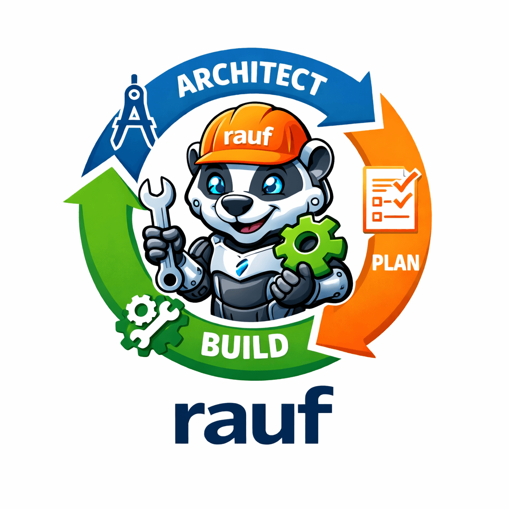
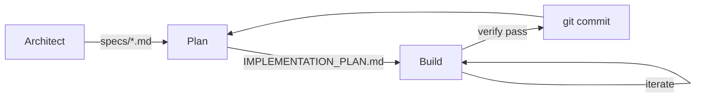

<div align="center">
  
</div>

# rauf

[](https://deepwiki.com/mhingston/rauf)

`rauf` is a spec-first, plan-driven execution loop for software projects.
It enforces explicit specifications, verification-backed planning, and
one-task-at-a-time implementation.

## Why rauf

rauf is designed for:
- Non-trivial systems
- Brownfield codebases
- Work that must remain auditable, reviewable, and reversible

rauf is NOT designed for:
- Quick one-off scripts
- Exploratory throwaway code
- "Just vibe and ship" workflows

## Installation

```bash
go install github.com/mhingston/rauf/cmd/rauf@latest
```

Or build from source:

```bash
git clone https://github.com/mhingston/rauf.git
cd rauf
go build -o rauf ./cmd/rauf
```

## Core loop



1. **Architect**: define WHAT must be built (`specs/`)
2. **Plan**: derive tasks from approved specs (`IMPLEMENTATION_PLAN.md`)
3. **Build**: implement one verified task per iteration

Each phase is isolated and enforced.

## Quick start

```bash
rauf init                    # Create rauf.yaml, AGENTS.md, and templates
# edit AGENTS.md to add your repo's commands

rauf architect               # Define WHAT (writes to specs/)
# review spec, set status: approved

rauf plan                    # Derive tasks from approved specs
rauf 5                       # Run 5 build iterations
```

## Modes

rauf operates in distinct modes, each with its own prompt file and behavior:

| Mode | Command | Prompt File | Purpose |
|------|---------|-------------|---------|
| `architect` | `rauf architect [N]` | `PROMPT_architect.md` | Define specifications in `specs/` |
| `plan` | `rauf plan [N]` | `PROMPT_plan.md` | Derive tasks from approved specs |
| `build` | `rauf [N]` | `PROMPT_build.md` | Implement one task per iteration |

The optional `[N]` argument limits iterations (e.g., `rauf plan 3` runs up to 3 plan iterations).

### Mode behaviors

| Behavior | Architect | Plan | Build |
|----------|-----------|------|-------|
| Generates repo map | Yes | Yes | No |
| Generates spec index | No | Yes | No |
| Runs verification | No | No | Yes |
| Enforces guardrails | No | No | Yes |
| Injects backpressure | No | Yes | Yes |

### Additional commands

| Command | Purpose |
|---------|---------|
| `rauf init [--force] [--dry-run]` | Create config and template files |
| `rauf plan-work "<name>"` | Create branch-scoped plan in `.rauf/IMPLEMENTATION_PLAN.md` |
| `rauf import --stage <stage> --slug <slug>` | Import SpecFirst artifact into `specs/` |
| `rauf help` | Show usage |
| `rauf version` | Show version |


## CLI Options

| Option | Description |
|--------|-------------|
| `--quiet` | Suppress logging output |
| `--json` | Output structured JSON summary (implies --quiet) |
| `--report <path>` | Write detailed run statistics to JSON file |
| `--timeout <duration>` | Overall timeout (e.g. 10m) |
| `--attempt-timeout <duration>` | Timeout for individual harness runs (e.g. 2m) |

## Strategy mode

When `strategy:` is defined in config and no explicit mode is given, rauf runs a sequence of steps:

```yaml
strategy:
  - mode: plan
    iterations: 1
  - mode: build
    iterations: 5
    until: verify_pass
```

### Strategy options

| Option | Description | Values |
|--------|-------------|--------|
| `mode` | Which mode to run | `architect`, `plan`, `build` |
| `iterations` | Max iterations for this step | Any positive integer |
| `until` | Continue iterating until condition met | `verify_pass`, `verify_fail` |
| `if` | Only run step if condition is true | `stalled`, `verify_pass`, `verify_fail` |

Example with conditional step:

```yaml
strategy:
  - mode: plan
    iterations: 1
  - mode: build
    iterations: 10
    until: verify_pass
  - mode: plan
    iterations: 1
    if: stalled  # Re-plan if build made no progress
```

## File formats

### Spec file (`specs/*.md`)

```markdown
---
id: user-auth
status: draft # draft | approved
version: 0.1.0
owner: optional
---

# User Authentication

## 1. Context & User Story
As a user, I want to log in with email/password, so that I can access my account.

## 2. Non-Goals
- Social login (out of scope for v1)

## 3. Contract (SpecFirst)
Contract format: TypeScript

interface LoginRequest {
  email: string;
  password: string;
}

## 4. Completion Contract
Success condition:
- User can log in and receive a valid session token

Verification commands:
- npm test -- --grep "auth"
- curl -X POST /api/login -d '{"email":"test@example.com","password":"test"}' | jq .token

Artifacts/flags:
- src/auth/login.ts exists
- Tests pass

## 5. Scenarios (Acceptance Criteria)
### Scenario: Valid login
Given a registered user
When they submit valid credentials
Then they receive a session token

Verification:
- npm test -- --grep "valid login"
```

Specs require `status: approved` before tasks can be planned from them.

### Plan file (`IMPLEMENTATION_PLAN.md`)

```markdown
# Implementation Plan

## Feature: User Auth (from specs/user-auth.md)
- [ ] T1: Create login endpoint
  - Spec: specs/user-auth.md#3-contract
  - Verify: npm test -- --grep "login endpoint"
  - Outcome: POST /api/login returns 200 with valid credentials
  - Notes: Use bcrypt for password comparison

- [x] T2: Add session token generation
  - Spec: specs/user-auth.md#4-completion-contract
  - Verify: npm test -- --grep "session token"
  - Outcome: Login response includes JWT token
```

Task lines must use `- [ ]` or `- [x]` for rauf to detect status.

### AGENTS.md

```markdown
# AGENTS

## Repo Layout
- specs/: specifications
- src/: application code
- IMPLEMENTATION_PLAN.md: task list

## Commands
- Tests (fast): npm test
- Tests (full): npm run test:all
- Lint: npm run lint
- Typecheck/build: npm run build

## Git
- Status: git status
- Diff: git diff
- Log: git log -5 --oneline

## Definition of Done
- Verify command passes
- Plan task checked
- Commit created
```

## Harnesses

A harness is any executable that reads a prompt from stdin and writes responses to stdout/stderr. By default, rauf uses `claude`.

Configure via `rauf.yaml`:

```yaml
harness: claude
harness_args: "-p --output-format=stream-json --model sonnet --verbose"
```

Or for other harnesses:

```yaml
harness: opencode
harness_args: "run"
```

Environment variables:
- `RAUF_HARNESS`: Harness command
- `RAUF_HARNESS_ARGS`: Additional arguments

## Backpressure system

When an iteration fails, rauf injects a **Backpressure Pack** into the next iteration's prompt:

| Trigger | Backpressure Action |
|---------|---------------------|
| Guardrail failure (forbidden path, max files) | Block until resolved; suggest alternatives |
| Verification failure | Prioritize fixing errors before new work |
| Consecutive verify failures (2+) | Require hypothesis: diagnose why previous fix failed |
| Plan drift | Warn about plan changes; require justification |
| Harness retries (rate limits, timeouts) | Advise reducing output/tool calls |
| No progress | Suggest scope reduction or alternative strategy |

The agent should respond with a `## Backpressure Response` section. Missing acknowledgment counts against progress.

### Hypothesis requirement

After 2+ consecutive verify failures, the agent must provide:

```
HYPOTHESIS: Why the previous fix failed
DIFFERENT_THIS_TIME: What will be done differently
```

These are captured and stored in `.rauf/state.json` for debugging.

### Architect questions

Agents can ask questions using `RAUF_QUESTION:`. Typed questions are supported:

```
RAUF_QUESTION:CLARIFY: Is this a breaking change?
RAUF_QUESTION:DECISION: Should we use option A or B?
RAUF_QUESTION:ASSUMPTION: I assume the API is versioned?
RAUF_QUESTION: Plain question without type
```

## Loop mechanics

Each iteration is a fresh harness run. State carries across iterations only via files and git history.

The loop stops when:
- Max iterations reached
- No unchecked tasks remain (build mode)
- No changes detected (no commit, clean worktree, unchanged plan)
- `RAUF_COMPLETE` sentinel emitted by agent

Ctrl+C interrupts immediately.

## Completion contracts

Every spec must define how "done" is objectively detected:
- The explicit success condition
- The exact `Verify:` command(s)
- Any artifacts that must exist

Build agents can emit `RAUF_COMPLETE` to signal early completion when all criteria are met.

## Files rauf cares about

| File | Purpose |
|------|---------|
| `specs/*.md` | Approved specifications |
| `IMPLEMENTATION_PLAN.md` | Executable task list |
| `.rauf/IMPLEMENTATION_PLAN.md` | Branch-scoped plan (from `plan-work`) |
| `AGENTS.md` | Operational contract with repo commands |
| `PROMPT_architect.md` | Prompt for architect mode |
| `PROMPT_plan.md` | Prompt for plan mode |
| `PROMPT_build.md` | Prompt for build mode |
| `.rauf/state.json` | Persistent loop state |
| `.rauf/context.md` | Optional context injected into prompts |
| `.rauf/state.md` | Human-readable state summary |
| `rauf.yaml` | Configuration |

## Safety and control

Guardrails to keep autonomous loops predictable:
- **Runtime isolation**: `host`, `docker`, or `docker-persist`
- **Circuit breakers**: `max_files_changed`, `max_commits_per_iteration`, `no_progress_iterations`
- **Hard limits**: Per-step `iterations` and `until` conditions in strategy mode

## Config reference

Config lives in `rauf.yaml`. Environment variables override config values.

```yaml
# Harness configuration
harness: claude                    # Executable to run
harness_args: ""                   # Arguments passed to harness

# Git behavior
no_push: false                     # Skip git push even with new commits

# Logging
log_dir: logs                      # Directory for JSONL logs

# Runtime isolation
runtime: host                      # host | docker | docker-persist
docker_image: ""                   # Image for docker runtimes
docker_args: ""                    # Extra docker run args
docker_container: ""               # Container name for docker-persist

# Guardrails (0 = disabled)
max_files_changed: 0               # Max files changed per iteration
max_commits_per_iteration: 0       # Max commits per iteration
forbidden_paths: ""                # Comma-separated paths to block
no_progress_iterations: 2          # Exit after N iterations without progress

# Verification policies
on_verify_fail: soft_reset         # soft_reset | keep_commit | hard_reset | no_push_only | wip_branch
verify_missing_policy: strict      # strict | agent_enforced | fallback
allow_verify_fallback: false       # Allow AGENTS.md Verify as fallback
require_verify_on_change: false    # Require Verify when worktree changes
require_verify_for_plan_update: false  # Require Verify before plan updates
plan_lint_policy: warn             # warn | fail | off

# Retry configuration
retry_on_failure: false            # Retry on harness errors
retry_max_attempts: 3              # Max retry attempts
retry_backoff_base: 2s             # Initial backoff duration
retry_backoff_max: 30s             # Maximum backoff duration
retry_jitter: true                 # Add randomness to backoff
retry_match: "rate limit,429,overloaded,timeout"  # Error patterns to retry

# Strategy (optional - overrides single-mode execution)
strategy:
  - mode: plan
    iterations: 1
  - mode: build
    iterations: 5
    until: verify_pass

# Model escalation (optional)
model_default: ""          # Default model (e.g., "sonnet")
model_strong: ""           # Stronger model for escalation (e.g., "opus")
model_flag: "--model"      # Flag to pass model to harness
model_escalation:
  enabled: false
  consecutive_verify_fails: 2  # Escalate after N verify failures
  no_progress_iters: 2         # Escalate after N no-progress iterations  
  guardrail_failures: 2        # Escalate after N guardrail failures
  cooldown_iters: 2            # Wait N iterations before de-escalating
  max_escalations: 2           # Maximum escalations per run
```

## Model escalation

When enabled, rauf can automatically escalate to a stronger model when backpressure signals persist:

| Trigger | Description |
|---------|-------------|
| `consecutive_verify_fails` | N consecutive verification failures |
| `no_progress_iters` | N iterations without progress |
| `guardrail_failures` | N consecutive guardrail blocks |

Escalation behavior:
- **Bounded**: Max escalations limit prevents infinite model switching
- **Cooldown**: After escalating, waits N iterations before de-escalating
- **Observable**: Logged in JSONL and shown in `.rauf/state.md`

Environment overrides:
- `RAUF_MODEL_DEFAULT` / `RAUF_MODEL_STRONG` / `RAUF_MODEL_FLAG`
- `RAUF_MODEL_ESCALATION_ENABLED=1`

### Policy explanations

| Policy | Options | Description |
|--------|---------|-------------|
| `on_verify_fail` | `soft_reset` | Keep changes staged, drop commit |
| | `keep_commit` | Keep the commit despite failure |
| | `hard_reset` | Discard all changes |
| | `no_push_only` | Keep commit locally, skip push |
| | `wip_branch` | Move commit to `wip/verify-fail-*` branch |
| `verify_missing_policy` | `strict` | Exit with error if Verify missing |
| | `agent_enforced` | Continue, agent must add Verify |
| | `fallback` | Use AGENTS.md Verify fallback |

## Environment variables

| Variable | Description | Default |
|----------|-------------|---------|
| `RAUF_HARNESS` | Harness command | `claude` |
| `RAUF_HARNESS_ARGS` | Extra harness args | - |
| `RAUF_NO_PUSH` | Skip git push | `false` |
| `RAUF_LOG_DIR` | Logs directory | `logs` |
| `RAUF_RUNTIME` | Runtime target | `host` |
| `RAUF_DOCKER_IMAGE` | Docker image | - |
| `RAUF_DOCKER_ARGS` | Docker run args | - |
| `RAUF_DOCKER_CONTAINER` | Container name | - |
| `RAUF_ON_VERIFY_FAIL` | Verify fail behavior | `soft_reset` |
| `RAUF_VERIFY_MISSING_POLICY` | Missing Verify policy | `strict` |
| `RAUF_ALLOW_VERIFY_FALLBACK` | Allow fallback | `false` |
| `RAUF_REQUIRE_VERIFY_ON_CHANGE` | Require Verify on change | `false` |
| `RAUF_REQUIRE_VERIFY_FOR_PLAN_UPDATE` | Require Verify for plan | `false` |
| `RAUF_RETRY` | Enable retry | `false` |
| `RAUF_RETRY_MAX` | Max retries | `3` |
| `RAUF_RETRY_BACKOFF_BASE` | Base backoff | `2s` |
| `RAUF_RETRY_BACKOFF_MAX` | Max backoff | `30s` |
| `RAUF_RETRY_NO_JITTER` | Disable jitter | `false` |
| `RAUF_RETRY_NO_JITTER` | Disable jitter | `false` |
| `RAUF_RETRY_MATCH` | Retry patterns | `rate limit,429,overloaded,timeout` |
| `RAUF_QUIET` | Quiet mode | `false` |
| `RAUF_TIMEOUT` | Overall timeout | - |
| `RAUF_ATTEMPT_TIMEOUT` | Attempt timeout | - |
| `RAUF_REPORT_PATH` | JSON report path | - |


| Symptom | Likely Cause | Fix |
|---------|--------------|-----|
| Planner creates tasks without Verify | Spec missing verification | Add Verify to spec |
| Builder makes no changes | Task already satisfied | Check plan/spec |
| Infinite loops | Verification never passes | Check verify commands |
| Repeated guardrail blocks | Hitting forbidden paths | Review `forbidden_paths` |
| "No unchecked tasks" immediately | All tasks marked `[x]` | Uncheck tasks or add new ones |

## SpecFirst import

Import completed [SpecFirst](https://github.com/mhingston/SpecFirst) artifacts:

```bash
rauf import --stage requirements --slug user-auth
```

Options:
- `--stage`: Stage to import (default: `requirements`)
- `--slug`: Artifact slug (required)
- `--dir`: SpecFirst directory (default: `.specfirst`)
- `--force`: Overwrite existing spec

## Logs

Each run writes to `logs/<mode>-<timestamp>.jsonl`. The `rauf init` command adds `logs/` to `.gitignore`.

## Development

```bash
make fmt      # Format code
make lint     # Run go vet
make test     # Run tests
```
