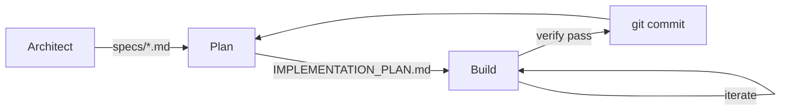

# rauf

[](https://deepwiki.com/mhingston/rauf)

`rauf` is a spec-first, plan-driven execution loop for software projects.
It enforces explicit specifications, verification-backed planning, and
one-task-at-a-time implementation.

## Why rauf

rauf is designed for:
- Non-trivial systems
- Brownfield codebases
- Work that must remain auditable, reviewable, and reversible

rauf is NOT designed for:
- Quick one-off scripts
- Exploratory throwaway code
- "Just vibe and ship" workflows

## Installation

```bash
go install github.com/mhingston/rauf/cmd/rauf@latest
```

Or build from source:

```bash
git clone https://github.com/mhingston/rauf.git
cd rauf
go build -o rauf ./cmd/rauf
```

## Core loop



1. **Architect**: define WHAT must be built (`specs/`)
2. **Plan**: derive tasks from approved specs (`IMPLEMENTATION_PLAN.md` or branch-scoped plan)
3. **Build**: implement one verified task per iteration

Each phase is isolated and enforced.

## Quick start

```bash
rauf init                    # Create rauf.yaml and AGENTS.md templates
# edit AGENTS.md to add repo commands

rauf plan-work "add oauth"   # Create branch-scoped plan for a feature
# or keep using repo-root IMPLEMENTATION_PLAN.md

rauf architect               # Define WHAT (writes to specs/)
# review spec, set status: approved

rauf plan                    # Derive tasks from approved specs
rauf 5                       # Run 5 build iterations
```

## Beyond the Traditional Ralph Loop

`rauf` is a formal, Go-based implementation of the "[Ralph](https://github.com/ghuntley/how-to-ralph-wiggum)" loop philosophy. While a traditional loop might be a simple bash script feeding a CLI, `rauf` provides an orchestration layer designed for production-grade software engineering:

- **Native Orchestration:** Move beyond simple `while true` loops with first-class `Architect -> Plan -> Build` strategies.
- **Enhanced Backpressure:** Persistent state tracking (via `state.json`) ensures that verification failures and loop errors are fed back into the next iteration's context for self-correction.
- **Automatic Context Management:** Native support for Repo Mapping and Spec Indexing ensures the agent always knows exactly where it is and what its source of truth is.
- **Strict Isolation:** Built-in support for Docker runtimes ensures agent commands are sandboxed, protecting your host machine while enabling autonomous execution.
- **Auditability:** Automatic commit-per-task logic creates a clean, verifiable git history of the agent's reasoning and implementation steps.
- **Completion Contracts:** Specs require explicit completion criteria with concrete verification commands, preventing ambiguous "done" states.

## Backpressure system

When an iteration fails (guardrail violation, verification failure, no progress, etc.), rauf injects a **Backpressure Pack** into the next iteration's prompt. This creates a feedback loop that helps the agent self-correct:

| Trigger | Backpressure Action |
|---------|---------------------|
| Guardrail failure (forbidden path, max files) | Block until resolved; suggest alternatives |
| Verification failure | Prioritize fixing errors before new work |
| Consecutive verify failures (2+) | Require hypothesis: diagnose why previous fix failed |
| Plan drift | Warn about plan changes; require justification |
| Harness retries (rate limits, timeouts) | Advise reducing output/tool calls |
| No progress | Suggest scope reduction or alternative strategy |

The agent is expected to respond with a `## Backpressure Response` section acknowledging the issue before proceeding. Missing acknowledgment counts against progress.

## Loop mechanics

Each iteration is a fresh harness run. The runner re-reads repo state from disk,
does one unit of work, then exits. The only state that carries across iterations
is via files (especially `IMPLEMENTATION_PLAN.md`) and git history, keeping
context and memory filesystem-centered.

Looping does not run forever by default. The runner stops when max iterations
is reached, when there are no unchecked tasks in build mode, or when an
iteration makes no changes (no new commit, clean working tree, no plan changes).
In strategy mode, the no-progress counter carries across steps until progress or exit.
Ctrl+C interrupts the current run and exits immediately.

Harness errors are not retried automatically unless you enable bounded retries
via config or env. If the harness exits non-zero (including rate limits), the
run stops and returns a failure by default.

## Completion contracts

Every spec must define how "done" is objectively detected. This keeps the loop
finite and makes agent output verifiable.

Completion contracts should include:
- The explicit success condition (what is true when the task is complete)
- The exact `Verify:` command(s) used to validate it
- Any completion flags or artifacts that must exist

## Files rauf cares about

| File | Purpose |
|------|---------|
| `specs/*.md` | Approved specifications |
| `IMPLEMENTATION_PLAN.md` | Executable task list (or `.rauf/IMPLEMENTATION_PLAN.md` for plan-work) |
| `AGENTS.md` | Operational contract |
| `PROMPT_*.md` | Agent instructions |
| `.rauf/state.json` | Persistent loop state |
| `.rauf/context.md` | Optional additional context injected into prompts |
| `.rauf/state.md` | Human-readable summary of latest state |

Task format note: unchecked tasks must use `- [ ]` or `- [x]` for rauf to detect them.

## Harnesses

By default, rauf uses `claude`, but any stdin/stdout-compatible harness
can be configured.

A "harness" is any executable that:
- Reads a prompt from stdin
- Writes responses to stdout/stderr
- Can operate non-interactively

See `rauf.yaml` for details.

## Common failure modes

| Symptom | Likely Cause | Fix |
|---------|--------------|-----|
| Planner creates tasks without Verify | Spec missing verification | Fix spec or plan |
| Builder makes no changes | Task already satisfied | Check plan/spec |
| Infinite loops | Verification never passes | Check verify commands or harness output |
| Repeated guardrail blocks | Agent keeps hitting forbidden paths | Review `forbidden_paths` config |

## Safety and control

`rauf` ships guardrails so autonomous loops stay predictable:
- Tiered autonomy via `yolo` and runtime isolation (host vs. docker)
- Circuit breakers via `max_files_changed`, `max_commits_per_iteration`, and `no_progress_iterations`
- Hard limits via per-step `iterations` and `until` conditions in strategy mode

## Config (rauf.yaml)

Config lives in `rauf.yaml` at repo root. Environment variables override config.

```yaml
harness: claude
harness_args: ""
no_push: false
yolo: false
log_dir: logs
runtime: host # host | docker | docker-persist
docker_image: ""
docker_args: ""
docker_container: ""
max_files_changed: 0
max_commits_per_iteration: 0
forbidden_paths: ""
no_progress_iterations: 2
on_verify_fail: soft_reset # soft_reset | keep_commit | hard_reset | no_push_only | wip_branch
verify_missing_policy: strict # strict | agent_enforced | fallback
plan_lint_policy: warn # warn | fail | off
allow_verify_fallback: false
require_verify_on_change: false
require_verify_for_plan_update: false
retry_on_failure: false
retry_max_attempts: 3
retry_backoff_base: 2s
retry_backoff_max: 30s
retry_jitter: true
retry_match: "rate limit,429,overloaded,timeout"
model:
  architect: opus
  plan: opus
  build: sonnet
strategy:
  - mode: plan
    model: opus
    iterations: 1
  - mode: build
    model: sonnet
    iterations: 5
    until: verify_pass
```

### Config notes

- `on_verify_fail` controls git hygiene when verification fails; default `soft_reset` keeps changes staged and drops the commit from `HEAD`.
- `verify_missing_policy` controls what happens if a task has no `Verify:` command; default `strict` exits with a clear error.
- `plan_lint_policy` controls whether non-atomic plan tasks are warned or fail the build; default `warn`.
- `runtime: docker-persist` reuses a long-lived container; stop/remove it with `docker stop <name>` / `docker rm <name>` if needed.
- Build agents can emit `RAUF_COMPLETE` to end an iteration early after finishing work.
- When `RAUF_COMPLETE` is accepted in build mode, logs record `exit_reason: completion_contract_satisfied` plus `completion_specs` and `completion_artifacts`.

## SpecFirst import

`rauf import` pulls a completed [SpecFirst](https://github.com/mhingston/SpecFirst) stage artifact into `specs/` once.

Defaults:
- Stage: `requirements`
- SpecFirst dir: `.specfirst`

Example:

```bash
rauf import --stage requirements --slug user-auth
```

## Development

```bash
make fmt      # Format code
make lint     # Run go vet
make test     # Run tests
```

## Logs

Each run writes to `logs/<mode>-<timestamp>.jsonl` in the working directory.
`rauf init` also adds `logs/` to `.gitignore` if it is not already present.

## Environment variables

| Variable | Description | Default |
|----------|-------------|---------|
| `RAUF_YOLO` | Enable `--dangerously-skip-permissions` (build only) | `false` |
| `RAUF_MODEL_OVERRIDE` | Override model selection for all modes | - |
| `RAUF_HARNESS` | Harness command | `claude` |
| `RAUF_HARNESS_ARGS` | Extra harness args (non-claude harnesses) | - |
| `RAUF_NO_PUSH` | Skip git push even if new commits exist | `false` |
| `RAUF_LOG_DIR` | Override logs directory | `logs` |
| `RAUF_RUNTIME` | Runtime execution target | `host` |
| `RAUF_DOCKER_IMAGE` | Docker image for docker runtimes | - |
| `RAUF_DOCKER_ARGS` | Extra args for docker run | - |
| `RAUF_DOCKER_CONTAINER` | Container name for docker-persist | - |
| `RAUF_ON_VERIFY_FAIL` | Git behavior on verify fail | `soft_reset` |
| `RAUF_VERIFY_MISSING_POLICY` | Policy when Verify missing | `strict` |
| `RAUF_ALLOW_VERIFY_FALLBACK` | Allow AGENTS.md Verify fallback | `false` |
| `RAUF_REQUIRE_VERIFY_ON_CHANGE` | Require Verify when worktree changes | `false` |
| `RAUF_REQUIRE_VERIFY_FOR_PLAN_UPDATE` | Require Verify before plan updates | `false` |
| `RAUF_RETRY` | Retry harness failures (matches only) | `false` |
| `RAUF_RETRY_MAX` | Max retry attempts | `3` |
| `RAUF_RETRY_BACKOFF_BASE` | Base backoff duration | `2s` |
| `RAUF_RETRY_BACKOFF_MAX` | Max backoff duration | `30s` |
| `RAUF_RETRY_NO_JITTER` | Disable backoff jitter | `false` |
| `RAUF_RETRY_MATCH` | Comma-separated match tokens | `rate limit,429,overloaded,timeout` |
