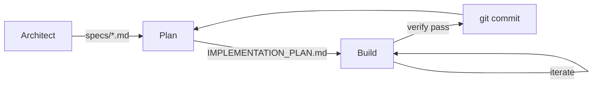

<div align="center">
  
</div>

# rauf

[](https://deepwiki.com/mhingston/rauf)

`rauf` is a spec-first, plan-driven execution loop for software projects.
It enforces explicit specifications, verification-backed planning, and
one-task-at-a-time implementation.

## Table of Contents

- [Why rauf](#why-rauf)
- [Installation](#installation)
- [Quick Start](#quick-start)
- [Core Loop](#core-loop)
- [Human-in-the-Loop Workflow](#human-in-the-loop-workflow)
- [Usage](#usage)
  - [Modes](#modes)
  - [Strategy Mode](#strategy-mode)
  - [Completion Contracts](#completion-contracts)
- [Architecture & Design](#architecture--design)
- [Reference Guide](#reference-guide)
  - [Files](#files-rauf-cares-about)
  - [CLI Options](#cli-options)
  - [Environment Variables](#environment-variables)
  - [Config Reference](#config-reference-raufyaml)
  - [File Formats](#file-formats)
- [Advanced Concepts](#advanced-concepts)
- [Support](#support)

---

## Why rauf

rauf is designed for:
- Non-trivial systems
- Brownfield codebases
- Work that must remain auditable, reviewable, and reversible

rauf is NOT designed for:
- Quick one-off scripts
- Exploratory throwaway code
- "Just vibe and ship" workflows

## Installation

```bash
go install github.com/mhingston/rauf/cmd/rauf@latest
```

Or build from source:

```bash
git clone https://github.com/mhingston/rauf.git
cd rauf
go build -o rauf ./cmd/rauf
```

## Quick Start

```bash
rauf init                           # Create rauf.yaml, AGENTS.md, and templates
# Edit AGENTS.md to add your repo's commands

rauf architect "improve test coverage to 85%"
# AI may ask: "Which modules should be prioritized?"
# Answer questions interactively
# Review specs/test-coverage.md

# MANUAL GATE: Edit specs/test-coverage.md, set status: approved

rauf plan                           # Derive tasks from approved specs
# Review IMPLEMENTATION_PLAN.md
# Edit tasks if needed

rauf 5                              # Run 5 build iterations
# Monitor verification results
```

## Core loop



1. **Architect**: define WHAT must be built (`specs/`)
2. **Plan**: derive tasks from approved specs (`IMPLEMENTATION_PLAN.md`)
3. **Build**: implement one verified task per iteration

Each phase is isolated and enforced.

## Human-in-the-Loop Workflow

rauf enforces **manual approval gates** between phases to ensure human oversight and control.

<details>
<summary><b>Phase 1: Architect (Define WHAT)</b></summary>

```bash
rauf architect "add user authentication"
```

**What it does:**
- Creates/updates specification files in `specs/`
- May ask up to 5 clarifying questions (e.g., "Which auth method?", "What's the API contract?")
- Questions are **dynamic and context-aware** (won't ask irrelevant questions)
- Emits `RAUF_COMPLETE` when spec is ready for review

**Questions asked:** ✅ Yes (only when goal is ambiguous)

**Your action required:**
1. Review the generated spec in `specs/*.md`
2. **Manually edit the frontmatter** to set `status: approved`
3. Do NOT proceed to plan until you approve the spec

**Example approval:**
```yaml
---
id: user-auth
status: approved  # Change from 'draft' to 'approved'
version: 0.1.0
---
```

</details>

<details>
<summary><b>Phase 2: Plan (Spec → Tasks)</b></summary>

```bash
rauf plan
```

**What it does:**
- Reads **only approved specs** (ignores drafts)
- Performs gap analysis to see what already exists in codebase
- Creates/updates `IMPLEMENTATION_PLAN.md` with executable tasks
- Each task includes: `Spec:` reference, `Verify:` command, `Outcome:` criteria

**Questions asked:** ❌ No (works from approved specs)

**Your action required:**
1. Review the generated `IMPLEMENTATION_PLAN.md`
2. Verify tasks are correct and properly ordered
3. Edit/remove/reorder tasks as needed
4. Proceed to build when ready

</details>

<details>
<summary><b>Phase 3: Build (Execute Tasks)</b></summary>

```bash
rauf 5  # Run 5 build iterations
```

**What it does:**
- Reads unchecked tasks from `IMPLEMENTATION_PLAN.md`
- Implements one task per iteration
- Runs verification after each task
- Commits on verification pass
- Stops on verification fail (with configurable policies)

**Questions asked:** ❌ No (executes from plan)

**Your action required:**
- Monitor progress and verification results
- Review commits before pushing (if needed)
- Fix any verification failures manually if needed

</details>

---

## Usage

### Modes

rauf operates in distinct modes, each with its own prompt file and behavior:

| Mode | Command | Prompt File | Purpose |
|------|---------|-------------|---------|
| `architect` | `rauf architect [N]` | `PROMPT_architect.md` | Define specifications in `specs/` |
| `plan` | `rauf plan [N]` | `PROMPT_plan.md` | Derive tasks from approved specs |
| `build` | `rauf [N]` | `PROMPT_build.md` | Implement one task per iteration |

The optional `[N]` argument limits iterations (e.g., `rauf plan 3` runs up to 3 plan iterations).

<details>
<summary><b>Mode behaviors comparison</b></summary>

| Behavior | Architect | Plan | Build |
|----------|-----------|------|-------|
| Generates repo map | Yes | Yes | No |
| Generates spec index | No | Yes | No |
| Runs verification | No | No | Yes |
| Enforces guardrails | No | No | Yes |
| Injects backpressure | No | Yes | Yes |
| **Asks interactive questions** | **Yes (up to 5)** | **No** | **No** |
| **Requires manual approval** | **Yes** | **Review recommended** | **No** |

</details>

### Strategy mode

When `strategy:` is defined in config and no explicit mode is given, rauf runs a sequence of steps:

```yaml
strategy:
  - mode: plan
    iterations: 1
  - mode: build
    iterations: 5
    until: verify_pass
```

Note: `rauf init` writes a default `strategy` to `rauf.yaml`, so running `rauf` will follow it (plan → build). To run build-only, use `rauf build` or remove/clear `strategy` in config.

| Strategy Option | Description | Values |
|-----------------|-------------|--------|
| `mode` | Which mode to run | `architect`, `plan`, `build` |
| `iterations` | Max iterations for this step | Any positive integer |
| `until` | Continue iterating until condition met | `verify_pass`, `verify_fail` |
| `if` | Only run step if condition is true | `stalled`, `verify_pass`, `verify_fail` |

### Completion contracts

Every spec must define how "done" is objectively detected:
- The explicit success condition
- The exact `Verify:` command(s)
- Any artifacts that must exist

Build agents can emit `RAUF_COMPLETE` to signal early completion when all criteria are met.

---

## Architecture & Design

### Grounded Context Builder

`rauf` uses a **deterministic, grounded context builder** for the Architect and Plan stages. It avoids the latency and "guesswork" of embeddings or vector databases.

Instead, it uses inspectable primitives:
- **Targeted search**: Fast discovery via `rg` and `git grep`.
- **Symbol discovery**: Heuristic-based, language-aware discovery.
- **Context packs**: Small, size-capped assemblies with rationale.
- **Repo maps**: High-level structure, regenerated automatically on change.

This ensuring **reproducible** output traceable to concrete files. If relevant code cannot be found, the system fails **explicitly** rather than guessing.

---

## Reference Guide

### Files rauf cares about

| File | Purpose |
|------|---------|
| `specs/*.md` | Approved specifications |
| `IMPLEMENTATION_PLAN.md` | Executable task list |
| `.rauf/IMPLEMENTATION_PLAN.md` | Branch-scoped plan (from `plan-work`) |
| `AGENTS.md` | Operational contract with repo commands |
| `PROMPT_architect.md` | Prompt for architect mode |
| `PROMPT_plan.md` | Prompt for plan mode |
| `PROMPT_build.md` | Prompt for build mode |
| `.rauf/state.json` | Persistent loop state |
| `.rauf/context.md` | Optional context injected into prompts |
| `.rauf/state.md` | Human-readable state summary |
| `rauf.yaml` | Configuration |

### CLI Options

| Option | Description |
|--------|-------------|
| `--quiet` | Suppress logging output |
| `--json` | Output structured JSON summary (implies --quiet) |
| `--report <path>` | Write detailed run statistics to JSON file |
| `--timeout <duration>` | Overall timeout (e.g. 10m) |
| `--attempt-timeout <duration>` | Timeout for individual harness runs (e.g. 2m) |

Note: `--report`, `--timeout`, and `--attempt-timeout` are CLI-only flags (no environment variable equivalents).

### Environment variables

<details>
<summary><b>View all environment variables</b></summary>

| Variable | Description | Default |
|----------|-------------|---------|
| `RAUF_HARNESS` | Harness command | `claude` |
| `RAUF_HARNESS_ARGS` | Extra harness args | - |
| `RAUF_NO_PUSH` | Skip git push | `false` |
| `RAUF_SKIP_PUSH` | Skip git push (alias of RAUF_NO_PUSH) | `false` |
| `RAUF_LOG_DIR` | Logs directory | `logs` |
| `RAUF_RUNTIME` | Runtime target | `host` |
| `RAUF_DOCKER_IMAGE` | Docker image | - |
| `RAUF_DOCKER_ARGS` | Docker run args | - |
| `RAUF_DOCKER_CONTAINER` | Container name | - |
| `RAUF_ON_VERIFY_FAIL` | Verify fail behavior | `soft_reset` |
| `RAUF_VERIFY_MISSING_POLICY` | Missing Verify policy | `strict` |
| `RAUF_ALLOW_VERIFY_FALLBACK` | Allow fallback | `false` |
| `RAUF_REQUIRE_VERIFY_ON_CHANGE` | Require Verify on change | `false` |
| `RAUF_REQUIRE_VERIFY_FOR_PLAN_UPDATE` | Require Verify for plan | `false` |
| `RAUF_RETRY` | Retry harness failures (matches only) | `false` |
| `RAUF_RETRY_MAX` | Max retries | `3` |
| `RAUF_RETRY_BACKOFF_BASE` | Base backoff | `2s` |
| `RAUF_RETRY_BACKOFF_MAX` | Max backoff | `30s` |
| `RAUF_RETRY_NO_JITTER` | Disable jitter | `false` |
| `RAUF_RETRY_MATCH` | Retry patterns | `rate limit,429,overloaded,timeout` |
| `RAUF_MODEL_DEFAULT` | Default model | - |
| `RAUF_MODEL_STRONG` | Escalation model | - |
| `RAUF_MODEL_FLAG` | Model flag | `--model` |
| `RAUF_MODEL_ESCALATION_ENABLED` | Enable model escalation | `false` |
| `RAUF_QUIET` | Quiet mode | `false` |

</details>

### Config reference (`rauf.yaml`)

<details>
<summary><b>View full config example</b></summary>

```yaml
harness: claude                    # Executable to run
harness_args: ""                   # Arguments passed to harness
no_push: false                     # Skip git push even with new commits
log_dir: logs                      # Directory for JSONL logs
runtime: host                      # host | docker | docker-persist
docker_image: ""                   # Image for docker runtimes
docker_args: ""                    # Extra docker run args
docker_container: ""               # Container name for docker-persist
max_files_changed: 0               # Max files changed per iteration
max_commits_per_iteration: 0       # Max commits per iteration
forbidden_paths: ""                # Comma-separated paths to block
no_progress_iterations: 2          # Exit after N iterations without progress
on_verify_fail: soft_reset         # soft_reset | keep_commit | hard_reset | no_push_only | wip_branch
verify_missing_policy: strict      # strict | agent_enforced | fallback
allow_verify_fallback: false       # Allow AGENTS.md Verify as fallback
require_verify_on_change: false    # Require Verify when worktree changes
require_verify_for_plan_update: false  # Require Verify before plan updates
plan_lint_policy: warn             # warn | fail | off
retry_on_failure: false            # Retry on harness errors
retry_max_attempts: 3              # Max retry attempts
retry_backoff_base: 2s             # Initial backoff duration
retry_backoff_max: 30s             # Maximum backoff duration
retry_jitter: true                 # Add randomness to backoff
retry_match: "rate limit,429,overloaded,timeout"
strategy:
  - mode: plan
    iterations: 1
  - mode: build
    iterations: 5
    until: verify_pass
model_default: ""                  # Default model
model_strong: ""                   # Model for escalation
model_flag: "--model"
model_override: false              # Override existing model flag in harness_args
model_escalation:
  enabled: false
  consecutive_verify_fails: 2
  no_progress_iters: 2
  guardrail_failures: 2
  cooldown_iters: 2
  min_strong_iterations: 2         # Legacy alias for cooldown_iters
  max_escalations: 2
recovery:
  consecutive_verify_fails: 2
  no_progress_iters: 2
  guardrail_failures: 2
```

</details>

### File formats

<details>
<summary><b>Spec file format (<code>specs/*.md</code>)</b></summary>

```markdown
---
id: user-auth
status: draft # draft | approved
version: 0.1.0
owner: optional
---

# User Authentication

## 1. Context & User Story
As a user, I want to log in with email/password, so that I can access my account.

## 2. Non-Goals
- Social login (out of scope for v1)

## 3. Contract
Contract format: TypeScript

interface LoginRequest {
  email: string;
  password: string;
}

## 4. Completion Contract
Success condition:
- User can log in and receive a valid session token

Verification commands:
- npm test -- --grep "auth"
- curl -X POST /api/login -d '{"email":"test@example.com","password":"test"}' | jq .token

Artifacts/flags:
- src/auth/login.ts exists
- Tests pass

## 5. Scenarios (Acceptance Criteria)
### Scenario: Valid login
Given a registered user
When they submit valid credentials
Then they receive a session token

Verification:
- npm test -- --grep "valid login"
```

</details>

<details>
<summary><b>Plan file format (<code>IMPLEMENTATION_PLAN.md</code>)</b></summary>

```markdown
# Implementation Plan

## Feature: User Auth (from specs/user-auth.md)
- [ ] T1: Create login endpoint
  - Spec: specs/user-auth.md#3-contract
  - Verify: npm test -- --grep "login endpoint"
  - Outcome: POST /api/login returns 200 with valid credentials
  - Notes: Use bcrypt for password comparison

- [x] T2: Add session token generation
  - Spec: specs/user-auth.md#4-completion-contract
  - Verify: npm test -- --grep "session token"
  - Outcome: Login response includes JWT token
```

</details>

---

## Advanced Concepts

<details>
<summary><b>Harnesses</b></summary>

A harness is any executable that reads a prompt from stdin and writes responses to stdout/stderr. Default: `claude`.

**Codex:**
```yaml
harness: codex
harness_args: "exec --full-auto"
```

**GitHub Copilot CLI:**
```yaml
harness: copilot
harness_args: "-p {prompt} --allow-all-tools --silent --no-color"
```

**OpenCode:**
```yaml
harness: script
harness_args: '-q /dev/null opencode run "{prompt}"'
```

</details>

<details>
<summary><b>Backpressure system</b></summary>

| Trigger | Action |
|---------|--------|
| Guardrail failure | Block until resolved; suggest alternatives |
| Verification failure | Prioritize fixing errors before new work |
| Consecutive verify failures (2+) | **Require Hypothesis**: diagnose why previous fix failed |
| Plan drift | Warn about plan changes; require justification |
| Harness retries | Advise reducing output/tool calls |
| No progress | Suggest scope reduction or alternative strategy |

**Hypothesis requirement:**
After 2+ consecutive verify failures, the agent must provide:
- `HYPOTHESIS`: Why the previous fix failed
- `DIFFERENT_THIS_TIME`: What will be done differently

</details>

<details>
<summary><b>Model escalation</b></summary>

Enabled rauf to automatically escalate to a stronger model when backpressure persists:

| Trigger | Description |
|---------|-------------|
| `consecutive_verify_fails` | N consecutive verification failures |
| `no_progress_iters` | N iterations without progress |
| `guardrail_failures` | N consecutive guardrail blocks |

</details>

<details>
<summary><b>Safety and control</b></summary>

- **Runtime isolation**: `host`, `docker`, or `docker-persist`
- **Circuit breakers**: `max_files_changed`, `max_commits_per_iteration`, `no_progress_iterations`
- **Hard limits**: Per-step `iterations` and `until` conditions in strategy mode

</details>

<details>
<summary><b>Build Loop Integrity (Phase 0d & Phase 2b Gates)</b></summary>

`rauf` enforces a "Plan → Do → Check" loop during the `build` mode to prevent drift and ensure quality:

- **Phase 0d (Architect Sanity Check)**: Before writing code, the agent must restate the task, declare scope (Will/Will NOT change), and validate that the spec and context are sufficient.
- **Phase 2b (Pre-Commit Review)**: Before committing, the agent must perform a diff-level review, ensure no side effects (anti-refactor), and provide a one-line summary of the change.

</details>

---

## Support

### Troubleshooting

| Symptom | Likely Cause | Fix |
|---------|--------------|-----|
| Planner creates tasks without Verify | Spec missing verification | Add Verify to spec |
| Builder makes no changes | Task already satisfied | Check plan/spec |
| Infinite loops | Verification never passes | Check verify commands |
| Repeated guardrail blocks | Hitting forbidden paths | Review `forbidden_paths` |
| "No unchecked tasks" immediately | All tasks marked `[x]` | Uncheck tasks or add new ones |

### Logs

Each run writes to `logs/<mode>-<timestamp>.jsonl`. The `rauf init` command adds `logs/` to `.gitignore`.

### Development

```bash
make fmt      # Format code
make lint     # Run go vet
make test     # Run tests
```
