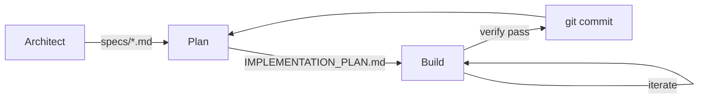

This file is a merged representation of a subset of the codebase, containing files not matching ignore patterns, combined into a single document by Repomix.

# Files

## File: cmd/rauf/architect_questions_test.go
`````go
package main

import (
	"context"
	"os"
	"strings"
	"testing"
)

func TestExtractQuestions(t *testing.T) {
	output := `
Some thoughts.
RAUF_QUESTION: What is the target directory?
RAUF_QUESTION: Should I overwrite existing files?
`
	questions := extractTypedQuestions(output)
	if len(questions) != 2 {
		t.Fatalf("expected 2 questions, got %d", len(questions))
	}
	if questions[0].Question != "What is the target directory?" {
		t.Errorf("got %q", questions[0].Question)
	}
}

func TestMaxArchitectQuestionsForState(t *testing.T) {
	state := raufState{}
	if maxArchitectQuestionsForState(state) != baseArchitectQuestions {
		t.Error("expected base limit")
	}

	state.PriorGuardrailStatus = "fail"
	if maxArchitectQuestionsForState(state) != baseArchitectQuestions+bonusQuestionsPerFailure {
		t.Error("expected bonus for guardrail failure")
	}

	state.LastVerificationStatus = "fail"
	if maxArchitectQuestionsForState(state) != baseArchitectQuestions+2*bonusQuestionsPerFailure {
		t.Error("expected bonus for both failures")
	}
}

func TestRunArchitectQuestions(t *testing.T) {
	ctx := context.Background()
	runner := runtimeExec{Runtime: "shell"}
	prompt := "Original prompt"
	output := "RAUF_QUESTION: How are you?\n"
	state := raufState{}

	// Mock input: "Fine\n"
	input := strings.NewReader("Fine\n")
	var outputWriter strings.Builder

	// We need a harness that won't fail or do real work.
	// Since runArchitectQuestions calls runHarness -> runHarnessOnce -> runner.runShell,
	// if we set harness to "true", it should exit 0.
	harness := "true"
	harnessArgs := ""

	// Create a temp log file
	logFile, _ := os.CreateTemp("", "rauf-test-log")
	defer os.Remove(logFile.Name())
	defer logFile.Close()

	updatedOutput, ok := runArchitectQuestions(ctx, runner, &prompt, output, state, harness, harnessArgs, logFile, retryConfig{}, input, &outputWriter)

	if !ok {
		t.Error("expected ok=true since a question was asked and answered")
	}
	if !strings.Contains(prompt, "Fine") {
		t.Error("prompt should have been updated with the answer")
	}
	if !strings.Contains(outputWriter.String(), "Architect question: How are you?") {
		t.Error("output should contain the question prompt")
	}
	_ = updatedOutput
}
`````

## File: cmd/rauf/common_test.go
`````go
package main

func contains(s, substr string) bool {
	return len(s) >= len(substr) && (s == substr || len(s) > 0 && containsHelper(s, substr))
}

func containsHelper(s, substr string) bool {
	for i := 0; i <= len(s)-len(substr); i++ {
		if s[i:i+len(substr)] == substr {
			return true
		}
	}
	return false
}
`````

## File: cmd/rauf/config_test.go
`````go
package main

import (
	"os"
	"path/filepath"
	"testing"
)

func TestParseConfigBytes_Basic(t *testing.T) {
	yaml := `
harness: npm test
no_push: true
log_dir: mylogs
runtime: docker
docker_image: node:latest
`
	var cfg runtimeConfig
	err := parseConfigBytes([]byte(yaml), &cfg)
	if err != nil {
		t.Fatalf("parseConfigBytes failed: %v", err)
	}
	if cfg.Harness != "npm test" || !cfg.NoPush || cfg.LogDir != "mylogs" || cfg.Runtime != "docker" || cfg.DockerImage != "node:latest" {
		t.Errorf("unexpected config: %+v", cfg)
	}
}

func TestParseConfigBytes_Escalation(t *testing.T) {
	yaml := `
model_escalation:
  enabled: true
  min_strong_iterations: 5
  max_escalations: 3
  trigger:
    consecutive_verify_fails: 1
`
	var cfg runtimeConfig
	cfg.ModelEscalation = defaultEscalationConfig()
	err := parseConfigBytes([]byte(yaml), &cfg)
	if err != nil {
		t.Fatalf("parseConfigBytes failed: %v", err)
	}
	if !cfg.ModelEscalation.Enabled || cfg.ModelEscalation.MinStrongIterations != 5 || cfg.ModelEscalation.MaxEscalations != 3 || cfg.ModelEscalation.ConsecutiveVerifyFails != 1 {
		t.Errorf("unexpected escalation config: %+v", cfg.ModelEscalation)
	}
}

func TestParseConfigBytes_Recovery(t *testing.T) {
	yaml := `
recovery:
  consecutive_verify_fails: 3
  no_progress_iters: 4
  guardrail_failures: 5
`
	var cfg runtimeConfig
	// Note: In real usage, loadConfig sets defaults first.
	// Here we test pure parsing to ensure YAML keys map to the struct.

	err := parseConfigBytes([]byte(yaml), &cfg)
	if err != nil {
		t.Fatalf("parseConfigBytes failed: %v", err)
	}

	if cfg.Recovery.ConsecutiveVerifyFails != 3 {
		t.Errorf("got %d, want 3", cfg.Recovery.ConsecutiveVerifyFails)
	}
	if cfg.Recovery.NoProgressIters != 4 {
		t.Errorf("got %d, want 4", cfg.Recovery.NoProgressIters)
	}
	if cfg.Recovery.GuardrailFailures != 5 {
		t.Errorf("got %d, want 5", cfg.Recovery.GuardrailFailures)
	}
}

func TestLoadConfig(t *testing.T) {
	dir := t.TempDir()
	path := filepath.Join(dir, "rauf.yaml")
	content := "harness: go test ./..."
	os.WriteFile(path, []byte(content), 0o644)

	cfg, ok, err := loadConfig(path)
	if err != nil || !ok {
		t.Fatalf("loadConfig failed: %v, %v", err, ok)
	}
	if cfg.Harness != "go test ./..." {
		t.Errorf("got %q, want 'go test ./...'", cfg.Harness)
	}

	// Missing file
	_, ok, err = loadConfig(filepath.Join(dir, "nonexistent.yaml"))
	if err != nil {
		t.Fatal(err)
	}
	if ok {
		t.Fatal("expected ok=false for missing file")
	}
}
`````

## File: cmd/rauf/escalation_test.go
`````go
package main

import (
	"testing"
)

func TestApplyModelChoice_AddsFlag(t *testing.T) {
	result := applyModelChoice("--verbose", "--model", "opus", false)
	expected := "--verbose --model opus"
	if result != expected {
		t.Errorf("applyModelChoice(...) = %q, want %q", result, expected)
	}
}

func TestApplyModelChoice_EmptyArgs(t *testing.T) {
	result := applyModelChoice("", "--model", "opus", false)
	expected := "--model opus"
	if result != expected {
		t.Errorf("applyModelChoice(...) = %q, want %q", result, expected)
	}
}

func TestApplyModelChoice_RespectsExisting(t *testing.T) {
	result := applyModelChoice("--model sonnet --verbose", "--model", "opus", false)
	// Should not add opus since --model already exists
	expected := "--model sonnet --verbose"
	if result != expected {
		t.Errorf("applyModelChoice(...) = %q, want %q", result, expected)
	}
}

func TestApplyModelChoice_OverrideExisting(t *testing.T) {
	result := applyModelChoice("--model sonnet --verbose", "--model", "opus", true)
	// Should replace sonnet with opus
	expected := "sonnet --verbose --model opus" // Note: fields order might change based on impl, filtering removes "sonnet" if it was "flag value"
	// Wait, my impl removes `flag` and `value`.
	// Parts: ["--model", "sonnet", "--verbose"]
	// Filtered: ["--verbose"]
	// Appended: ["--verbose", "--model", "opus"]
	expected = "--verbose --model opus"
	if result != expected {
		t.Errorf("applyModelChoice(...) = %q, want %q", result, expected)
	}
}

func TestApplyModelChoice_OverrideExisting_EqualsStyle(t *testing.T) {
	result := applyModelChoice("--model=sonnet --verbose", "--model", "opus", true)
	// Parts: ["--model=sonnet", "--verbose"]
	// Filtered: ["--verbose"]
	// Appended: ["--verbose", "--model", "opus"]
	expected := "--verbose --model opus"
	if result != expected {
		t.Errorf("applyModelChoice(...) = %q, want %q", result, expected)
	}
}

func TestApplyModelChoice_EmptyModel(t *testing.T) {
	result := applyModelChoice("--verbose", "--model", "", false)
	// Should not add anything when model is empty
	expected := "--verbose"
	if result != expected {
		t.Errorf("applyModelChoice(...) = %q, want %q", result, expected)
	}
}

func TestApplyModelChoice_EmptyFlag(t *testing.T) {
	result := applyModelChoice("--verbose", "", "opus", false)
	// Should not add anything when flag is empty
	expected := "--verbose"
	if result != expected {
		t.Errorf("applyModelChoice(...) = %q, want %q", result, expected)
	}
}

func TestContainsModelFlag(t *testing.T) {
	tests := []struct {
		args     string
		flag     string
		expected bool
	}{
		{"--model sonnet --verbose", "--model", true},
		{"--verbose", "--model", false},
		{"--model=sonnet --verbose", "--model", true},
		{"", "--model", false},
		{"--model-other foo", "--model", false}, // Different flag entirely
	}

	for _, tt := range tests {
		result := containsModelFlag(tt.args, tt.flag)
		if result != tt.expected {
			t.Errorf("containsModelFlag(%q, %q) = %v, want %v", tt.args, tt.flag, result, tt.expected)
		}
	}
}

func TestShouldEscalateModel_Disabled(t *testing.T) {
	state := raufState{ConsecutiveVerifyFails: 10}
	cfg := runtimeConfig{
		ModelEscalation: escalationConfig{Enabled: false},
		ModelStrong:     "opus",
	}

	shouldEscalate, _, _ := shouldEscalateModel(state, cfg)
	if shouldEscalate {
		t.Error("should not escalate when disabled")
	}
}

func TestShouldEscalateModel_NoStrongModel(t *testing.T) {
	state := raufState{ConsecutiveVerifyFails: 10}
	cfg := runtimeConfig{
		ModelEscalation: escalationConfig{
			Enabled:                true,
			ConsecutiveVerifyFails: 2,
		},
		ModelStrong: "", // No strong model configured
	}

	shouldEscalate, _, _ := shouldEscalateModel(state, cfg)
	if shouldEscalate {
		t.Error("should not escalate when no strong model configured")
	}
}

func TestShouldEscalateModel_ConsecutiveVerifyFails(t *testing.T) {
	cfg := runtimeConfig{
		ModelEscalation: escalationConfig{
			Enabled:                true,
			ConsecutiveVerifyFails: 2,
			MaxEscalations:         5,
		},
		ModelStrong: "opus",
	}

	// Below threshold - should not escalate
	state := raufState{ConsecutiveVerifyFails: 1}
	shouldEscalate, _, _ := shouldEscalateModel(state, cfg)
	if shouldEscalate {
		t.Error("should not escalate below threshold")
	}

	// At threshold - should escalate
	state.ConsecutiveVerifyFails = 2
	shouldEscalate, reason, _ := shouldEscalateModel(state, cfg)
	if !shouldEscalate {
		t.Error("should escalate at threshold")
	}
	if reason != "consecutive_verify_fails" {
		t.Errorf("reason = %q, want consecutive_verify_fails", reason)
	}
}

func TestShouldEscalateModel_NoProgressIters(t *testing.T) {
	cfg := runtimeConfig{
		ModelEscalation: escalationConfig{
			Enabled:         true,
			NoProgressIters: 3,
			MaxEscalations:  5,
		},
		ModelStrong: "opus",
	}

	state := raufState{NoProgressStreak: 3}
	shouldEscalate, reason, _ := shouldEscalateModel(state, cfg)
	if !shouldEscalate {
		t.Error("should escalate on no-progress streak")
	}
	if reason != "no_progress_iters" {
		t.Errorf("reason = %q, want no_progress_iters", reason)
	}
}

func TestShouldEscalateModel_GuardrailFailures(t *testing.T) {
	cfg := runtimeConfig{
		ModelEscalation: escalationConfig{
			Enabled:           true,
			GuardrailFailures: 2,
			MaxEscalations:    5,
		},
		ModelStrong: "opus",
	}

	state := raufState{ConsecutiveGuardrailFails: 2}
	shouldEscalate, reason, _ := shouldEscalateModel(state, cfg)
	if !shouldEscalate {
		t.Error("should escalate on guardrail failures")
	}
	if reason != "guardrail_failures" {
		t.Errorf("reason = %q, want guardrail_failures", reason)
	}
}

func TestShouldEscalateModel_MaxEscalationsRespected(t *testing.T) {
	cfg := runtimeConfig{
		ModelEscalation: escalationConfig{
			Enabled:                true,
			ConsecutiveVerifyFails: 2,
			MaxEscalations:         2,
		},
		ModelStrong: "opus",
	}

	state := raufState{
		ConsecutiveVerifyFails: 10,
		EscalationCount:        2, // Already at max
	}

	shouldEscalate, _, suppressed := shouldEscalateModel(state, cfg)
	if shouldEscalate {
		t.Error("should not escalate when at max escalations")
	}
	if suppressed != "max_escalations_reached" {
		t.Errorf("suppressed = %q, want max_escalations_reached", suppressed)
	}
}

func TestShouldEscalateModel_CooldownPreventsToggle(t *testing.T) {
	cfg := runtimeConfig{
		ModelEscalation: escalationConfig{
			Enabled:                true,
			ConsecutiveVerifyFails: 2,
			MinStrongIterations:    3,
			MaxEscalations:         5,
		},
		ModelStrong: "opus",
	}

	state := raufState{
		ConsecutiveVerifyFails:       0, // Trigger resolved
		CurrentModel:                 "opus",
		MinStrongIterationsRemaining: 2, // Still in cooldown
	}

	// De-escalation check
	shouldDeescalate := shouldDeescalateModel(state, cfg)
	if shouldDeescalate {
		t.Error("should not de-escalate while in cooldown")
	}

	// After cooldown expires
	state.MinStrongIterationsRemaining = 0
	shouldDeescalate = shouldDeescalateModel(state, cfg)
	if !shouldDeescalate {
		t.Error("should de-escalate when cooldown expired")
	}
}

func TestComputeEffectiveModel_DefaultWhenDisabled(t *testing.T) {
	cfg := runtimeConfig{
		ModelEscalation: escalationConfig{Enabled: false},
		ModelDefault:    "sonnet",
	}
	state := raufState{}

	model := computeEffectiveModel(state, cfg)
	if model != "sonnet" {
		t.Errorf("computeEffectiveModel() = %q, want 'sonnet'", model)
	}
}

func TestComputeEffectiveModel_ReturnsCurrentModel(t *testing.T) {
	cfg := runtimeConfig{
		ModelEscalation: escalationConfig{Enabled: true},
		ModelDefault:    "sonnet",
	}
	state := raufState{CurrentModel: "opus"}

	model := computeEffectiveModel(state, cfg)
	if model != "opus" {
		t.Errorf("computeEffectiveModel() = %q, want 'opus'", model)
	}
}

func TestDefaultEscalationConfig(t *testing.T) {
	cfg := defaultEscalationConfig()

	if cfg.Enabled {
		t.Error("default should have Enabled = false")
	}
	if cfg.ConsecutiveVerifyFails != 2 {
		t.Errorf("default ConsecutiveVerifyFails = %d, want 2", cfg.ConsecutiveVerifyFails)
	}
	if cfg.NoProgressIters != 2 {
		t.Errorf("default NoProgressIters = %d, want 2", cfg.NoProgressIters)
	}
	if cfg.GuardrailFailures != 2 {
		t.Errorf("default GuardrailFailures = %d, want 2", cfg.GuardrailFailures)
	}
	if cfg.MinStrongIterations != 2 {
		t.Errorf("default MinStrongIterations = %d, want 2", cfg.MinStrongIterations)
	}
	if cfg.MaxEscalations != 2 {
		t.Errorf("default MaxEscalations = %d, want 2", cfg.MaxEscalations)
	}
}
func TestUpdateEscalationState(t *testing.T) {
	cfg := runtimeConfig{
		ModelEscalation: escalationConfig{
			Enabled:                true,
			ConsecutiveVerifyFails: 2,
			NoProgressIters:        2,
			GuardrailFailures:      2,
			MinStrongIterations:    2,
			MaxEscalations:         2,
		},
		ModelStrong: "opus",
	}

	t.Run("verify failure counter", func(t *testing.T) {
		state := raufState{ConsecutiveVerifyFails: 0}
		state = updateBackpressureState(state, cfg.Recovery, true, false, false)
		if state.ConsecutiveVerifyFails != 1 {
			t.Errorf("got %d, want 1", state.ConsecutiveVerifyFails)
		}
		// Second failure triggers escalation
		state = updateBackpressureState(state, cfg.Recovery, true, false, false)
		state, _ = updateModelEscalationState(state, cfg)

		if state.CurrentModel != "opus" {
			t.Error("should have escalated to opus")
		}
		if state.EscalationCount != 1 {
			t.Errorf("EscalationCount = %d, want 1", state.EscalationCount)
		}
		if state.MinStrongIterationsRemaining != 2 {
			t.Errorf("Cooldown = %d, want 2", state.MinStrongIterationsRemaining)
		}
	})

	t.Run("success resets failure counters", func(t *testing.T) {
		state := raufState{
			ConsecutiveVerifyFails:    1,
			NoProgressStreak:          1,
			ConsecutiveGuardrailFails: 1,
			RecoveryMode:              "verify",
		}
		// Pass resets everything
		state = updateBackpressureState(state, cfg.Recovery, false, false, false)
		if state.ConsecutiveVerifyFails != 0 || state.NoProgressStreak != 0 || state.ConsecutiveGuardrailFails != 0 {
			t.Errorf("counters not reset: %+v", state)
		}
		if state.RecoveryMode != "" {
			t.Error("RecoveryMode should be cleared")
		}
	})

	t.Run("recovery mode trigger - verify", func(t *testing.T) {
		state := raufState{ConsecutiveVerifyFails: 1}
		state = updateBackpressureState(state, cfg.Recovery, true, false, false) // fails = 2
		if state.RecoveryMode != "verify" {
			t.Errorf("RecoveryMode = %q, want 'verify'", state.RecoveryMode)
		}
	})

	t.Run("recovery mode trigger - no_progress", func(t *testing.T) {
		state := raufState{NoProgressStreak: 1}
		state = updateBackpressureState(state, cfg.Recovery, false, false, true) // streak = 2
		if state.RecoveryMode != "no_progress" {
			t.Errorf("RecoveryMode = %q, want 'no_progress'", state.RecoveryMode)
		}
	})
}
`````

## File: cmd/rauf/escalation.go
`````go
package main

import (
	"strings"
)

// escalationConfig defines model escalation behavior.
type escalationConfig struct {
	Enabled                bool
	ConsecutiveVerifyFails int // Trigger: escalate after N consecutive verify failures
	NoProgressIters        int // Trigger: escalate after N no-progress iterations
	GuardrailFailures      int // Trigger: escalate after N consecutive guardrail failures
	MinStrongIterations    int // Minimum iterations to stay on strong model / wait before de-escalating
	MaxEscalations         int // Maximum number of escalations per run
}

// defaultEscalationConfig returns the default (disabled) escalation config.
func defaultEscalationConfig() escalationConfig {
	return escalationConfig{
		Enabled:                false,
		ConsecutiveVerifyFails: 2,
		NoProgressIters:        2,
		GuardrailFailures:      2,
		MinStrongIterations:    2,
		MaxEscalations:         2,
	}
}

// shouldEscalateModel determines if we should switch to the stronger model.
// Returns (shouldEscalate, reason, suppressionReason).
func shouldEscalateModel(state raufState, cfg runtimeConfig) (bool, string, string) {
	if !cfg.ModelEscalation.Enabled {
		return false, "", ""
	}
	if cfg.ModelStrong == "" {
		return false, "", ""
	}

	// Check triggers first to see if we WOULD escalate
	triggerReason := ""
	if cfg.ModelEscalation.ConsecutiveVerifyFails > 0 &&
		state.ConsecutiveVerifyFails >= cfg.ModelEscalation.ConsecutiveVerifyFails {
		triggerReason = "consecutive_verify_fails"
	} else if cfg.ModelEscalation.NoProgressIters > 0 &&
		state.NoProgressStreak >= cfg.ModelEscalation.NoProgressIters {
		triggerReason = "no_progress_iters"
	} else if cfg.ModelEscalation.GuardrailFailures > 0 &&
		state.ConsecutiveGuardrailFails >= cfg.ModelEscalation.GuardrailFailures {
		triggerReason = "guardrail_failures"
	}

	if triggerReason == "" {
		return false, "", ""
	}

	// Triggers met, check blockers
	if state.EscalationCount >= cfg.ModelEscalation.MaxEscalations {
		return false, "", "max_escalations_reached"
	}
	// Already escalated and still in minimum duration
	if state.CurrentModel == cfg.ModelStrong && state.MinStrongIterationsRemaining > 0 {
		return false, "", "min_strong_iterations_active"
	}

	return true, triggerReason, ""
}

// shouldDeescalateModel determines if we should return to the default model.
func shouldDeescalateModel(state raufState, cfg runtimeConfig) bool {
	if !cfg.ModelEscalation.Enabled {
		return false
	}
	if state.CurrentModel != cfg.ModelStrong {
		return false
	}
	// De-escalate if minimum duration has expired
	return state.MinStrongIterationsRemaining <= 0
}

// computeEffectiveModel returns the model to use for this iteration.
func computeEffectiveModel(state raufState, cfg runtimeConfig) string {
	if !cfg.ModelEscalation.Enabled {
		return cfg.ModelDefault
	}
	if state.CurrentModel != "" {
		return state.CurrentModel
	}
	return cfg.ModelDefault
}

// applyModelChoice injects the model flag into harness args.
// If override is true, replaces existing model flag value.
// If override is false, respects existing value if present.
func applyModelChoice(harnessArgs, modelFlag, modelName string, override bool) string {
	if modelFlag == "" || modelName == "" {
		return harnessArgs
	}

	// Check if model flag already exists in args
	if containsModelFlag(harnessArgs, modelFlag) {
		if !override {
			// Respect existing flag - don't override
			return harnessArgs
		}
		// Override existing flag
		// For simplicity, we can do a regex replacement or simpler string manipulation if we assume standard format.
		// A robust way without regex libraries overkill: split fields, filter out the flag, then append.
		// Or using regex to match `-flag value` or `-flag=value`
		// Given harnessArgs is command line string, regex is safer.
		// Pattern: `\s*--model[=\s]+[^\s]+`
		// Note: modelFlag might contain dashes.
		// Let's use a simpler field reconstruction.
		parts := strings.Fields(harnessArgs)
		newParts := make([]string, 0, len(parts)+2)
		skipNext := false
		for _, part := range parts {
			if skipNext {
				skipNext = false
				continue
			}
			if part == modelFlag {
				// flag ... value format, skip next if it's the value
				// But we are removing it, so we just don't add it.
				skipNext = true
				continue
			}
			if strings.HasPrefix(part, modelFlag+"=") {
				// flag=value format
				continue
			}
			newParts = append(newParts, part)
		}
		// Append new model
		newParts = append(newParts, modelFlag, modelName)
		return strings.Join(newParts, " ")
	}

	// Append model flag
	if harnessArgs == "" {
		return modelFlag + " " + modelName
	}
	return harnessArgs + " " + modelFlag + " " + modelName
}

// containsModelFlag checks if the harness args already contain the model flag.
func containsModelFlag(harnessArgs, modelFlag string) bool {
	if modelFlag == "" {
		return false
	}
	// Check for flag as a word boundary
	parts := strings.Fields(harnessArgs)
	for _, part := range parts {
		if part == modelFlag || strings.HasPrefix(part, modelFlag+"=") {
			return true
		}
	}
	return false
}

// updateBackpressureState updates proper failure counters and RecoveryMode.
// This runs regardless of model escalation being enabled.
func updateBackpressureState(state raufState, cfg recoveryConfig, verifyFailed bool, guardrailFailed bool, noProgress bool) raufState {
	// Track consecutive verify failures
	if verifyFailed {
		state.ConsecutiveVerifyFails++
	} else {
		state.ConsecutiveVerifyFails = 0
	}

	// Track consecutive guardrail failures
	if guardrailFailed {
		state.ConsecutiveGuardrailFails++
	} else {
		state.ConsecutiveGuardrailFails = 0
	}

	// Track no-progress streak
	if noProgress {
		state.NoProgressStreak++
	} else {
		state.NoProgressStreak = 0
	}

	// Recovery mode logic
	// Prioritize: Guardrail -> Verify -> NoProgress
	// Use configurable thresholds (defaulting to 2 if 0 for safety/compatibility, though default should handle it)
	limitGuardrail := cfg.GuardrailFailures
	if limitGuardrail <= 0 {
		limitGuardrail = 2
	}
	limitVerify := cfg.ConsecutiveVerifyFails
	if limitVerify <= 0 {
		limitVerify = 2
	}
	limitNoProgress := cfg.NoProgressIters
	if limitNoProgress <= 0 {
		limitNoProgress = 2
	}

	if state.ConsecutiveGuardrailFails >= limitGuardrail {
		state.RecoveryMode = "guardrail"
	} else if state.ConsecutiveVerifyFails >= limitVerify {
		state.RecoveryMode = "verify"
	} else if state.NoProgressStreak >= limitNoProgress {
		state.RecoveryMode = "no_progress"
	} else {
		state.RecoveryMode = ""
	}

	return state
}

type escalationEvent struct {
	Type      string // "escalated", "de_escalated", "suppressed", "none"
	FromModel string
	ToModel   string
	Reason    string
	Cooldown  int
}

// updateModelEscalationState handles model switching logic if enabled.
// It assumes failure counters in state have already been updated by updateBackpressureState.
func updateModelEscalationState(state raufState, cfg runtimeConfig) (raufState, escalationEvent) {
	event := escalationEvent{Type: "none"}
	if !cfg.ModelEscalation.Enabled {
		return state, event
	}

	// Manage minimum duration
	if state.MinStrongIterationsRemaining > 0 {
		state.MinStrongIterationsRemaining--
	}

	// Check for escalation
	shouldEscalate, reason, suppressed := shouldEscalateModel(state, cfg)
	if shouldEscalate {
		if state.CurrentModel != cfg.ModelStrong {
			event.Type = "escalated"
			event.FromModel = state.CurrentModel
			if event.FromModel == "" {
				event.FromModel = cfg.ModelDefault
			}
			event.ToModel = cfg.ModelStrong
			event.Reason = reason
			event.Cooldown = cfg.ModelEscalation.MinStrongIterations

			state.CurrentModel = cfg.ModelStrong
			state.EscalationCount++
			state.MinStrongIterationsRemaining = cfg.ModelEscalation.MinStrongIterations
			state.LastEscalationReason = reason
		}
	} else if suppressed != "" {
		event.Type = "suppressed"
		event.Reason = suppressed
		event.Cooldown = state.MinStrongIterationsRemaining
		event.FromModel = state.CurrentModel
		if event.FromModel == "" {
			event.FromModel = cfg.ModelDefault
		}
		// Suppressed means we wanted to go to Strong but couldn't
		event.ToModel = cfg.ModelStrong
	} else if shouldDeescalateModel(state, cfg) {
		event.Type = "de_escalated"
		event.FromModel = state.CurrentModel
		event.ToModel = cfg.ModelDefault
		event.Reason = "min_strong_iterations_expired"

		// De-escalate to default model
		state.CurrentModel = cfg.ModelDefault
		state.LastEscalationReason = ""
	}

	return state, event
}
`````

## File: cmd/rauf/fence_test.go
`````go
package main

import (
	"strings"
	"testing"
)

func TestFenceState(t *testing.T) {
	f := &fenceState{}

	// Outside fence
	if f.processLine("some text") {
		t.Error("should not be in fence")
	}

	// Opening fence
	if !f.processLine("```go") {
		t.Error("should start fence")
	}
	if !f.inFence {
		t.Error("inFence should be true")
	}

	// Inside fence
	if !f.processLine("  fmt.Println(1)") {
		t.Error("should be in fence")
	}

	// Closing fence (mismatch length)
	if !f.processLine("``") {
		t.Error("shorter backticks should stay in fence")
	}

	// Closing fence (extra content)
	if !f.processLine("``` suffix") {
		t.Error("fence with suffix should stay in fence")
	}

	// Valid closing fence
	if !f.processLine("```") {
		t.Error("should match closing fence")
	}
	if f.inFence {
		t.Error("should exit fence")
	}
}

func TestFenceState_Tilde(t *testing.T) {
	f := &fenceState{}
	if !f.processLine("~~~") {
		t.Error("should start tilde fence")
	}
	if !f.processLine("some content") {
		t.Error("should be in fence")
	}
	if !f.processLine("~~~") {
		t.Error("should close tilde fence")
	}
}

func TestScanLinesOutsideFence(t *testing.T) {
	output := `
Outside 1
` + "```" + `
Inside
` + "```" + `
Outside 2
`
	count := 0
	scanLinesOutsideFence(output, func(trimmed string) bool {
		if strings.HasPrefix(trimmed, "Outside") {
			count++
		}
		return false
	})
	if count != 2 {
		t.Errorf("expected 2 outside lines, got %d", count)
	}
}
`````

## File: cmd/rauf/hypothesis_test.go
`````go
package main

import (
	"testing"
)

func TestExtractHypothesis_Basic(t *testing.T) {
	output := `## Backpressure Response
HYPOTHESIS: The test fails because the mock wasn't set up correctly.
DIFFERENT_THIS_TIME: I will verify the mock configuration first.
`
	hyp, diff := extractHypothesis(output)
	if hyp != "The test fails because the mock wasn't set up correctly." {
		t.Errorf("hypothesis = %q, want mock message", hyp)
	}
	if diff != "I will verify the mock configuration first." {
		t.Errorf("different = %q, want verify message", diff)
	}
}

func TestExtractHypothesis_ShortAlias(t *testing.T) {
	output := `HYPOTHESIS: Database connection timeout.
DIFFERENT: Use retry logic.`
	hyp, diff := extractHypothesis(output)
	if hyp != "Database connection timeout." {
		t.Errorf("hypothesis = %q", hyp)
	}
	if diff != "Use retry logic." {
		t.Errorf("different = %q", diff)
	}
}

func TestExtractHypothesis_Empty(t *testing.T) {
	output := `Just some regular output without hypothesis markers.`
	hyp, diff := extractHypothesis(output)
	if hyp != "" || diff != "" {
		t.Errorf("expected empty, got hyp=%q diff=%q", hyp, diff)
	}
}

func TestExtractHypothesis_InsideCodeFence(t *testing.T) {
	output := "```\nHYPOTHESIS: should be ignored\nDIFFERENT: also ignored\n```"
	hyp, diff := extractHypothesis(output)
	if hyp != "" || diff != "" {
		t.Errorf("should ignore inside fence, got hyp=%q diff=%q", hyp, diff)
	}
}

func TestHasRequiredHypothesis(t *testing.T) {
	t.Run("complete", func(t *testing.T) {
		output := "HYPOTHESIS: reason\nDIFFERENT_THIS_TIME: action"
		if !hasRequiredHypothesis(output) {
			t.Error("expected true")
		}
	})

	t.Run("missing different", func(t *testing.T) {
		output := "HYPOTHESIS: reason"
		if hasRequiredHypothesis(output) {
			t.Error("expected false when DIFFERENT missing")
		}
	})

	t.Run("missing hypothesis", func(t *testing.T) {
		output := "DIFFERENT_THIS_TIME: action"
		if hasRequiredHypothesis(output) {
			t.Error("expected false when HYPOTHESIS missing")
		}
	})
}

func TestExtractTypedQuestions_Untyped(t *testing.T) {
	output := `RAUF_QUESTION: What is the expected format?`
	questions := extractTypedQuestions(output)
	if len(questions) != 1 {
		t.Fatalf("expected 1 question, got %d", len(questions))
	}
	if questions[0].Type != "" {
		t.Errorf("expected empty type, got %q", questions[0].Type)
	}
	if questions[0].Question != "What is the expected format?" {
		t.Errorf("question = %q", questions[0].Question)
	}
}

func TestExtractTypedQuestions_Typed(t *testing.T) {
	output := `RAUF_QUESTION:CLARIFY: Is this a breaking change?
RAUF_QUESTION:DECISION: Should we use option A or B?
RAUF_QUESTION:ASSUMPTION: I assume the API supports versioning?`

	questions := extractTypedQuestions(output)
	if len(questions) != 3 {
		t.Fatalf("expected 3 questions, got %d", len(questions))
	}

	expected := []struct {
		typ      string
		question string
	}{
		{"CLARIFY", "Is this a breaking change?"},
		{"DECISION", "Should we use option A or B?"},
		{"ASSUMPTION", "I assume the API supports versioning?"},
	}

	for i, exp := range expected {
		if questions[i].Type != exp.typ {
			t.Errorf("question %d type = %q, want %q", i, questions[i].Type, exp.typ)
		}
		if questions[i].Question != exp.question {
			t.Errorf("question %d = %q, want %q", i, questions[i].Question, exp.question)
		}
	}
}

func TestExtractTypedQuestions_InsideFence(t *testing.T) {
	output := "```\nRAUF_QUESTION: ignored\n```\nRAUF_QUESTION: This one counts"
	questions := extractTypedQuestions(output)
	if len(questions) != 1 {
		t.Fatalf("expected 1 question, got %d", len(questions))
	}
	if questions[0].Question != "This one counts" {
		t.Errorf("question = %q", questions[0].Question)
	}
}

func TestFormatTypedQuestionForDisplay(t *testing.T) {
	t.Run("with type", func(t *testing.T) {
		q := TypedQuestion{Type: "CLARIFY", Question: "Is this correct?"}
		result := formatTypedQuestionForDisplay(q)
		if result != "[CLARIFY] Is this correct?" {
			t.Errorf("result = %q", result)
		}
	})

	t.Run("without type", func(t *testing.T) {
		q := TypedQuestion{Type: "", Question: "Plain question"}
		result := formatTypedQuestionForDisplay(q)
		if result != "Plain question" {
			t.Errorf("result = %q", result)
		}
	})
}

func TestExtractTypedQuestions_Sticky(t *testing.T) {
	output := `
Some noise
RAUF_QUESTION:ASSUMPTION:STICKY: Is this production?
RAUF_QUESTION:ASSUMPTION:GLOBAL: Is network available?
RAUF_QUESTION:ASSUMPTION: Local assumption
`
	questions := extractTypedQuestions(output)
	if len(questions) != 3 {
		t.Fatalf("got %d questions, want 3", len(questions))
	}

	if !questions[0].IsSticky {
		t.Error("first question should be sticky")
	}
	if questions[0].Question != "Is this production?" {
		t.Errorf("got %q, want 'Is this production?'", questions[0].Question)
	}

	if !questions[1].IsSticky {
		t.Error("second question should be sticky (GLOBAL)")
	}
	if questions[1].Question != "Is network available?" {
		t.Errorf("got %q, want 'Is network available?'", questions[1].Question)
	}

	if questions[2].IsSticky {
		t.Error("third question should NOT be sticky")
	}
}

func TestFormatTypedQuestionForDisplay_Sticky(t *testing.T) {
	q := TypedQuestion{Type: "ASSUMPTION", Question: "Foo?", IsSticky: true}
	display := formatTypedQuestionForDisplay(q)
	expected := "[ASSUMPTION:GLOBAL] Foo?"
	if display != expected {
		t.Errorf("got %q, want %q", display, expected)
	}
}
`````

## File: cmd/rauf/hypothesis.go
`````go
package main

import (
	"strings"
	"time"
)

// Hypothesis represents a structured hypothesis entry from model output.
type Hypothesis struct {
	Timestamp       time.Time `json:"timestamp"`
	Iteration       int       `json:"iteration"`
	Hypothesis      string    `json:"hypothesis"`
	DifferentAction string    `json:"different_action"`
	VerifyCommand   string    `json:"verify_command,omitempty"`
}

// TypedQuestion represents a question with an optional type tag.
type TypedQuestion struct {
	Type     string // CLARIFY, DECISION, ASSUMPTION, or empty
	Question string
	IsSticky bool
}

// extractHypothesis parses model output for HYPOTHESIS: and DIFFERENT_THIS_TIME: or DIFFERENT: lines.
// Returns the hypothesis if found, with empty strings if not present.
func extractHypothesis(output string) (hypothesis, differentAction string) {
	var fence fenceState
	for _, line := range strings.Split(output, "\n") {
		trimmed := strings.TrimSpace(line)
		if fence.processLine(trimmed) {
			continue
		}
		if strings.HasPrefix(trimmed, "HYPOTHESIS:") {
			hypothesis = strings.TrimSpace(strings.TrimPrefix(trimmed, "HYPOTHESIS:"))
		}
		if strings.HasPrefix(trimmed, "DIFFERENT_THIS_TIME:") {
			differentAction = strings.TrimSpace(strings.TrimPrefix(trimmed, "DIFFERENT_THIS_TIME:"))
		}
		// Also accept the shorter alias
		if strings.HasPrefix(trimmed, "DIFFERENT:") && differentAction == "" {
			differentAction = strings.TrimSpace(strings.TrimPrefix(trimmed, "DIFFERENT:"))
		}
	}
	return hypothesis, differentAction
}

// hasRequiredHypothesis checks if the model output contains a valid hypothesis
// when one is required (e.g., after consecutive verify failures).
func hasRequiredHypothesis(output string) bool {
	hypothesis, differentAction := extractHypothesis(output)
	return hypothesis != "" && differentAction != ""
}

// extractTypedQuestions parses model output for RAUF_QUESTION lines with optional type tags.
// Supports formats:
//   - RAUF_QUESTION:CLARIFY: question text
//   - RAUF_QUESTION:DECISION: question text
//   - RAUF_QUESTION:ASSUMPTION: question text
//   - RAUF_QUESTION: question text (no type)
func extractTypedQuestions(output string) []TypedQuestion {
	questions := []TypedQuestion{}
	var fence fenceState
	for _, line := range strings.Split(output, "\n") {
		trimmed := strings.TrimSpace(line)
		if fence.processLine(trimmed) {
			continue
		}
		if strings.HasPrefix(trimmed, "RAUF_QUESTION:") {
			rest := strings.TrimPrefix(trimmed, "RAUF_QUESTION:")
			rest = strings.TrimSpace(rest)
			if rest == "" {
				continue
			}

			q := TypedQuestion{}

			// Check for type prefix
			for _, tag := range []string{"CLARIFY:", "DECISION:", "ASSUMPTION:"} {
				if strings.HasPrefix(rest, tag) {
					q.Type = strings.TrimSuffix(tag, ":")
					q.Question = strings.TrimSpace(strings.TrimPrefix(rest, tag))

					if q.Type == "ASSUMPTION" {
						upper := strings.ToUpper(q.Question)
						if strings.HasPrefix(upper, "STICKY:") || strings.HasPrefix(upper, "GLOBAL:") {
							q.IsSticky = true
							if idx := strings.Index(q.Question, ":"); idx != -1 {
								q.Question = strings.TrimSpace(q.Question[idx+1:])
							}
						}
					}
					break
				}
			}

			// No type tag found
			if q.Type == "" {
				q.Question = rest
			}

			if q.Question != "" {
				questions = append(questions, q)
			}
		}
	}
	return questions
}

// formatTypedQuestionForDisplay formats a typed question for console display.
func formatTypedQuestionForDisplay(q TypedQuestion) string {
	if q.Type != "" {
		prefix := "[" + q.Type
		if q.IsSticky {
			prefix += ":GLOBAL"
		}
		prefix += "] "
		return prefix + q.Question
	}
	return q.Question
}
`````

## File: cmd/rauf/logging_test.go
`````go
package main

import (
	"encoding/json"
	"os"
	"path/filepath"
	"testing"
)

func TestWriteLogEntry(t *testing.T) {
	dir := t.TempDir()
	path := filepath.Join(dir, "test.log")
	file, err := os.Create(path)
	if err != nil {
		t.Fatal(err)
	}

	entry := logEntry{
		Type:      "test",
		Iteration: 1,
		Mode:      "build",
	}

	writeLogEntry(file, entry)
	file.Close()

	data, err := os.ReadFile(path)
	if err != nil {
		t.Fatal(err)
	}

	var decoded logEntry
	if err := json.Unmarshal(data, &decoded); err != nil {
		t.Fatal(err)
	}

	if decoded.Type != "test" || decoded.Iteration != 1 || decoded.Mode != "build" {
		t.Errorf("unexpected decoded content: %+v", decoded)
	}
}

func TestWriteLogEntry_Nil(t *testing.T) {
	// Should not panic
	writeLogEntry(nil, logEntry{Type: "nil"})
}
`````

## File: cmd/rauf/main_buffer_test.go
`````go
package main

import (
	"testing"
)

func TestLimitedBuffer(t *testing.T) {
	t.Run("zero max", func(t *testing.T) {
		lb := &limitedBuffer{max: 0}
		n, err := lb.Write([]byte("hello"))
		if err != nil {
			t.Fatal(err)
		}
		if n != 5 {
			t.Errorf("got n=%d, want 5", n)
		}
		if lb.String() != "" {
			t.Errorf("got %q, want empty", lb.String())
		}
	})

	t.Run("less than max", func(t *testing.T) {
		lb := &limitedBuffer{max: 10}
		lb.Write([]byte("abc"))
		if lb.String() != "abc" {
			t.Errorf("got %q, want abc", lb.String())
		}
	})

	t.Run("exactly max", func(t *testing.T) {
		lb := &limitedBuffer{max: 5}
		lb.Write([]byte("12345"))
		if lb.String() != "12345" {
			t.Errorf("got %q, want 12345", lb.String())
		}
	})

	t.Run("larger than max at once", func(t *testing.T) {
		lb := &limitedBuffer{max: 3}
		lb.Write([]byte("abcdef"))
		if lb.String() != "def" {
			t.Errorf("got %q, want def", lb.String())
		}
	})

	t.Run("overflow over multiple writes", func(t *testing.T) {
		lb := &limitedBuffer{max: 5}
		lb.Write([]byte("abc"))
		lb.Write([]byte("def")) // total 6, should drop 'a'
		if lb.String() != "bcdef" {
			t.Errorf("got %q, want bcdef", lb.String())
		}
	})

	t.Run("large overflow", func(t *testing.T) {
		lb := &limitedBuffer{max: 2}
		lb.Write([]byte("a"))
		lb.Write([]byte("bcdef")) // total 6, should drop everything except 'ef'
		if lb.String() != "ef" {
			t.Errorf("got %q, want ef", lb.String())
		}
	})
}
`````

## File: cmd/rauf/main_config_test.go
`````go
package main

import (
	"testing"
	"time"
)

func TestParseConfigBytes_Comprehensive(t *testing.T) {
	yaml := `
harness: my-harness
harness_args: --args
retry_on_failure: true
retry_max_attempts: 5
retry_backoff_base: 1s
retry_backoff_max: 10s
retry_jitter: true
retry_match:
  - "error 1"
  - "error 2"
strategy:
  - mode: plan
    iterations: 1
    until: verify_pass
  - mode: build
    if: stalled
    until: completion
on_verify_fail: hard_reset
verify_missing_policy: fallback
allow_verify_fallback: true
plan_lint_policy: fail
model_default: gpt-4
model_strong: gpt-4-32k
model_flag: --model
model_escalation:
  enabled: true
  max_escalations: 2
  min_strong_iterations: 3
  guardrail_failures: 2
  no_progress_iters: 4
`
	cfg := &runtimeConfig{}
	err := parseConfigBytes([]byte(yaml), cfg)
	if err != nil {
		t.Fatalf("parseConfigBytes failed: %v", err)
	}

	if cfg.Harness != "my-harness" {
		t.Errorf("got harness %q, want my-harness", cfg.Harness)
	}
	if cfg.RetryMaxAttempts != 5 {
		t.Errorf("got max attempts %d, want 5", cfg.RetryMaxAttempts)
	}
	if cfg.RetryBackoffBase != time.Second {
		t.Errorf("got backoff base %v, want 1s", cfg.RetryBackoffBase)
	}
	if len(cfg.RetryMatch) != 2 {
		t.Errorf("got %d retry matches, want 2", len(cfg.RetryMatch))
	}
	if len(cfg.Strategy) != 2 {
		t.Errorf("got %d strategy steps, want 2", len(cfg.Strategy))
	}
	if cfg.Strategy[0].Mode != "plan" {
		t.Errorf("got step 0 mode %q, want plan", cfg.Strategy[0].Mode)
	}
	if cfg.Strategy[1].If != "stalled" {
		t.Errorf("got step 1 if %q, want stalled", cfg.Strategy[1].If)
	}
	if cfg.OnVerifyFail != "hard_reset" {
		t.Errorf("got on_verify_fail %q, want hard_reset", cfg.OnVerifyFail)
	}
	if cfg.PlanLintPolicy != "fail" {
		t.Errorf("got plan_lint_policy %q, want fail", cfg.PlanLintPolicy)
	}
	if cfg.ModelEscalation.Enabled != true {
		t.Error("expected model escalation to be enabled")
	}
	if cfg.ModelEscalation.GuardrailFailures != 2 {
		t.Errorf("got guardrail failures %d, want 2", cfg.ModelEscalation.GuardrailFailures)
	}
	if cfg.ModelEscalation.MinStrongIterations != 3 {
		t.Errorf("got cooldown iters %d, want 3", cfg.ModelEscalation.MinStrongIterations)
	}
	if cfg.ModelEscalation.NoProgressIters != 4 {
		t.Errorf("got no progress iters %d, want 4", cfg.ModelEscalation.NoProgressIters)
	}
}

func TestParseConfigBytes_EdgeCases(t *testing.T) {
	yaml := `
harness: something
# Comment
  # Indented comment
invalid_line
strategy:
  - mode: build
    iterations: invalid
    until: "quoted value" # comment
forbidden_paths:
  - path1
  - path2
model_escalation:
  enabled: maybe
  guardrail_failures: 5
`
	cfg := &runtimeConfig{}
	err := parseConfigBytes([]byte(yaml), cfg)
	if err != nil {
		t.Fatalf("should not fail for invalid values: %v", err)
	}
	if len(cfg.ForbiddenPaths) != 2 {
		t.Errorf("got %v, want 2 paths", cfg.ForbiddenPaths)
	}
	// iterations: invalid should be ignored, stay at 0
	if cfg.Strategy[0].Iterations != 0 {
		t.Errorf("got iters %d, want 0", cfg.Strategy[0].Iterations)
	}
}
`````

## File: cmd/rauf/main_fingerprint_test.go
`````go
package main

import (
	"os"
	"path/filepath"
	"testing"
)

func TestWorkspaceFingerprint(t *testing.T) {
	dir := t.TempDir()

	// Create some files
	os.MkdirAll(filepath.Join(dir, "subdir"), 0o755)
	os.MkdirAll(filepath.Join(dir, "ignored"), 0o755)
	os.WriteFile(filepath.Join(dir, "file1.txt"), []byte("content1"), 0o644)
	os.WriteFile(filepath.Join(dir, "file2.txt"), []byte("content2"), 0o644)
	os.WriteFile(filepath.Join(dir, "subdir", "file3.txt"), []byte("content3"), 0o644)
	os.WriteFile(filepath.Join(dir, "ignored", "file4.txt"), []byte("content4"), 0o644)

	t.Run("basic", func(t *testing.T) {
		f1 := workspaceFingerprint(dir, nil, nil)
		f2 := workspaceFingerprint(dir, nil, nil)
		if f1 != f2 {
			t.Error("expected consistent fingerprint")
		}
	})

	t.Run("exclude dir", func(t *testing.T) {
		f1 := workspaceFingerprint(dir, nil, nil)
		f2 := workspaceFingerprint(dir, []string{"ignored"}, nil)
		if f1 == f2 {
			t.Error("expected different fingerprint when excluding dir")
		}

		// Ensure excluding an empty string or non-existent dir doesn't crash
		workspaceFingerprint(dir, []string{"", "nonexistent"}, nil)
	})

	t.Run("exclude file", func(t *testing.T) {
		f1 := workspaceFingerprint(dir, nil, nil)
		f2 := workspaceFingerprint(dir, nil, []string{"file1.txt"})
		if f1 == f2 {
			t.Error("expected different fingerprint when excluding file")
		}
	})

	t.Run("content change", func(t *testing.T) {
		f1 := workspaceFingerprint(dir, nil, nil)
		os.WriteFile(filepath.Join(dir, "file1.txt"), []byte("changed"), 0o644)
		f2 := workspaceFingerprint(dir, nil, nil)
		if f1 == f2 {
			t.Error("expected different fingerprint after content change")
		}
	})
}
`````

## File: cmd/rauf/main_gitignore_test.go
`````go
package main

import (
	"os"
	"strings"
	"testing"
)

func TestEnsureGitignoreLogs(t *testing.T) {
	dir := t.TempDir()
	cwd, _ := os.Getwd()
	os.Chdir(dir)
	t.Cleanup(func() { os.Chdir(cwd) })

	t.Run("creates new file", func(t *testing.T) {
		changed, err := ensureGitignoreLogs(false)
		if err != nil {
			t.Fatal(err)
		}
		if !changed {
			t.Error("expected changed=true for new file")
		}
		data, _ := os.ReadFile(".gitignore")
		if !strings.Contains(string(data), "logs/") {
			t.Errorf("got %q, want logs/", string(data))
		}
	})

	t.Run("appends to existing", func(t *testing.T) {
		os.WriteFile(".gitignore", []byte("node_modules\n"), 0o644)
		changed, err := ensureGitignoreLogs(false)
		if err != nil {
			t.Fatal(err)
		}
		if !changed {
			t.Error("expected changed=true for missing entry")
		}
		data, _ := os.ReadFile(".gitignore")
		if !strings.Contains(string(data), "node_modules") || !strings.Contains(string(data), "logs/") {
			t.Errorf("unexpected content: %q", string(data))
		}
	})

	t.Run("does not duplicate", func(t *testing.T) {
		os.WriteFile(".gitignore", []byte("logs/\nother\n"), 0o644)
		changed, err := ensureGitignoreLogs(false)
		if err != nil {
			t.Fatal(err)
		}
		if changed {
			t.Error("expected changed=false for existing entry")
		}
		data, _ := os.ReadFile(".gitignore")
		if strings.Count(string(data), "logs/") != 1 {
			t.Errorf("expected 1 occurrence of logs/, got %d", strings.Count(string(data), "logs/"))
		}
	})

	t.Run("dry run", func(t *testing.T) {
		os.Remove(".gitignore")
		changed, err := ensureGitignoreLogs(true)
		if err != nil {
			t.Fatal(err)
		}
		if !changed {
			t.Error("expected changed=true for dry run on missing file")
		}
		if _, err := os.Stat(".gitignore"); !os.IsNotExist(err) {
			t.Error("expected file not to be created in dry run")
		}
	})

}
`````

## File: cmd/rauf/main_harness_test.go
`````go
package main

import (
	"context"
	"os/exec"
	"testing"
	"time"
)

func TestRunHarness_RetryLogic(t *testing.T) {
	orig := execCommand
	defer func() { execCommand = orig }()

	ctx := context.Background()
	runner := runtimeExec{Runtime: "shell"}

	retryCfg := retryConfig{
		Enabled:     true,
		MaxAttempts: 2,
		Match:       []string{"retry me"},
		BackoffBase: 1 * time.Millisecond,
		Jitter:      false,
	}

	t.Run("success on first try", func(t *testing.T) {
		execCommand = func(ctx context.Context, name string, args ...string) *exec.Cmd {
			return exec.Command("echo", "success")
		}
		res, err := runHarness(ctx, "prompt", "test-cmd", "", nil, retryCfg, runner)
		if err != nil {
			t.Fatal(err)
		}
		if res.RetryCount != 0 {
			t.Errorf("got %d retries, want 0", res.RetryCount)
		}
	})

	t.Run("retry then success", func(t *testing.T) {
		calls := 0
		execCommand = func(ctx context.Context, name string, args ...string) *exec.Cmd {
			calls++
			if calls == 1 {
				return exec.CommandContext(ctx, "sh", "-c", "echo 'retry me'; exit 1")
			}
			return exec.CommandContext(ctx, "echo", "success")
		}
		res, err := runHarness(ctx, "prompt", "test-cmd", "", nil, retryCfg, runner)
		if err != nil {
			t.Fatal(err)
		}
		if res.RetryCount != 1 {
			t.Errorf("got %d retries, want 1", res.RetryCount)
		}
		if res.RetryReason != "retry me" {
			t.Errorf("got reason %q, want 'retry me'", res.RetryReason)
		}
	})

	t.Run("max attempts reached", func(t *testing.T) {
		execCommand = func(ctx context.Context, name string, args ...string) *exec.Cmd {
			return exec.Command("sh", "-c", "echo 'retry me'; exit 1")
		}
		res, err := runHarness(ctx, "prompt", "test-cmd", "", nil, retryCfg, runner)
		if err == nil {
			t.Error("expected error after max retries")
		}
		if res.RetryCount != 2 {
			t.Errorf("got %d retries, want 2", res.RetryCount)
		}
	})
}

func TestRunHarnessOnce_Timeout(t *testing.T) {
	orig := execCommand
	defer func() { execCommand = orig }()

	runner := runtimeExec{Runtime: "shell"}
	ctx, cancel := context.WithCancel(context.Background())
	// Cancel immediately so the command should fail or return canceled
	cancel()

	execCommand = func(ctx context.Context, name string, args ...string) *exec.Cmd {
		return exec.CommandContext(ctx, "sleep", "1")
	}

	_, err := runHarnessOnce(ctx, "prompt", "test-cmd", "", nil, runner)
	if err == nil {
		t.Error("expected error for canceled context")
	}
}
`````

## File: cmd/rauf/main_import_test.go
`````go
package main

import (
	"os"
	"path/filepath"
	"strings"
	"testing"
)

func TestRunImportSpecfirst(t *testing.T) {
	// Setup temp workspace
	dir := t.TempDir()
	cwd, _ := os.Getwd()
	os.Chdir(dir)
	defer os.Chdir(cwd)

	// Create state.json
	stateContent := `{
		"stage_outputs": {
			"requirements": {
				"prompt_hash": "hash123",
				"files": ["reqs.md", "diagram.mermaid"]
			}
		}
	}`
	os.WriteFile("state.json", []byte(stateContent), 0o644)

	// Create artifacts directory structure
	// root/artifacts/<stage>/<hash>/<file>
	// Here root is importDir, which we will set to ".".
	artifactDir := filepath.Join("artifacts", "requirements", "hash123")
	os.MkdirAll(artifactDir, 0o755)

	os.WriteFile(filepath.Join(artifactDir, "reqs.md"), []byte("# Requirements\n\nContent here."), 0o644)
	os.WriteFile(filepath.Join(artifactDir, "diagram.mermaid"), []byte("graph TD; A-->B;"), 0o644)

	// Test success
	t.Run("success", func(t *testing.T) {
		cfg := modeConfig{
			importDir:   ".",
			importStage: "requirements",
			importSlug:  "my-slug",
		}
		if err := runImportSpecfirst(cfg); err != nil {
			t.Fatalf("runImportSpecfirst failed: %v", err)
		}

		specPath := "specs/my-slug.md"
		content, err := os.ReadFile(specPath)
		if err != nil {
			t.Fatalf("spec file not created: %v", err)
		}
		sContent := string(content)
		if !strings.Contains(sContent, "# Requirements") {
			t.Error("missing reqs content")
		}
		if !strings.Contains(sContent, "graph TD;") {
			t.Error("missing diagram content")
		}
	})

	// Test missing stage
	t.Run("missing stage", func(t *testing.T) {
		cfg := modeConfig{
			importDir:   ".",
			importStage: "missing-stage",
		}
		if err := runImportSpecfirst(cfg); err == nil {
			t.Error("expected error for missing stage")
		}
	})

	// Test file exists
	t.Run("file exists", func(t *testing.T) {
		// Create file first
		os.MkdirAll("specs", 0o755)
		os.WriteFile("specs/collision.md", []byte("exists"), 0o644)

		cfg := modeConfig{
			importDir:   ".",
			importStage: "requirements",
			importSlug:  "collision",
		}
		if err := runImportSpecfirst(cfg); err == nil {
			t.Error("expected error for existing file")
		}

		// Force overwrite
		cfg.importForce = true
		if err := runImportSpecfirst(cfg); err != nil {
			t.Fatalf("expected success with force, got %v", err)
		}
	})

	// Test traversal escape attempt
	t.Run("traversal escape", func(t *testing.T) {
		// Modify state to include traversal
		stateContent := `{
			"stage_outputs": {
				"bad": {
					"prompt_hash": "hash123",
					"files": ["../escaped.md"]
				}
			}
		}`
		os.WriteFile("state.json", []byte(stateContent), 0o644)

		cfg := modeConfig{
			importDir:   ".",
			importStage: "bad",
			importSlug:  "bad",
		}
		if err := runImportSpecfirst(cfg); err == nil {
			t.Error("expected error for traversal")
		}
	})
}

func TestParseImportArgs(t *testing.T) {
	t.Run("all flags", func(t *testing.T) {
		cfg := modeConfig{}
		args := []string{"--stage", "build", "--slug", "my-feature", "--specfirst-dir", "/custom/dir", "--force"}
		err := parseImportArgs(args, &cfg)
		if err != nil {
			t.Fatalf("unexpected error: %v", err)
		}
		if cfg.importStage != "build" {
			t.Errorf("importStage = %q, want 'build'", cfg.importStage)
		}
		if cfg.importSlug != "my-feature" {
			t.Errorf("importSlug = %q, want 'my-feature'", cfg.importSlug)
		}
		if cfg.importDir != "/custom/dir" {
			t.Errorf("importDir = %q, want '/custom/dir'", cfg.importDir)
		}
		if !cfg.importForce {
			t.Error("importForce should be true")
		}
	})

	t.Run("missing stage value", func(t *testing.T) {
		cfg := modeConfig{}
		err := parseImportArgs([]string{"--stage"}, &cfg)
		if err == nil || !strings.Contains(err.Error(), "missing value for --stage") {
			t.Errorf("expected 'missing value' error, got %v", err)
		}
	})

	t.Run("missing slug value", func(t *testing.T) {
		cfg := modeConfig{}
		err := parseImportArgs([]string{"--slug"}, &cfg)
		if err == nil || !strings.Contains(err.Error(), "missing value for --slug") {
			t.Errorf("expected 'missing value' error, got %v", err)
		}
	})

	t.Run("missing specfirst-dir value", func(t *testing.T) {
		cfg := modeConfig{}
		err := parseImportArgs([]string{"--specfirst-dir"}, &cfg)
		if err == nil || !strings.Contains(err.Error(), "missing value for --specfirst-dir") {
			t.Errorf("expected 'missing value' error, got %v", err)
		}
	})

	t.Run("unknown flag", func(t *testing.T) {
		cfg := modeConfig{}
		err := parseImportArgs([]string{"--unknown"}, &cfg)
		if err == nil || !strings.Contains(err.Error(), "unknown import flag") {
			t.Errorf("expected 'unknown flag' error, got %v", err)
		}
	})
}

func TestOpenLogFile(t *testing.T) {
	t.Run("default log dir", func(t *testing.T) {
		dir := t.TempDir()
		cwd, _ := os.Getwd()
		os.Chdir(dir)
		defer os.Chdir(cwd)

		file, path, err := openLogFile("run", "")
		if err != nil {
			t.Fatalf("unexpected error: %v", err)
		}
		defer file.Close()

		if !strings.HasPrefix(filepath.Base(path), "run-") {
			t.Errorf("log file should start with 'run-', got %q", path)
		}
		if !strings.HasSuffix(path, ".jsonl") {
			t.Errorf("log file should end with .jsonl, got %q", path)
		}
	})

	t.Run("custom log dir", func(t *testing.T) {
		dir := t.TempDir()
		logDir := filepath.Join(dir, "custom-logs")

		file, path, err := openLogFile("import", logDir)
		if err != nil {
			t.Fatalf("unexpected error: %v", err)
		}
		defer file.Close()

		if !strings.Contains(path, "custom-logs") {
			t.Errorf("expected custom log dir in path, got %q", path)
		}
	})
}
`````

## File: cmd/rauf/main_init_test.go
`````go
package main

import (
	"os"
	"strings"
	"testing"
)

func TestRunInit(t *testing.T) {
	// Helper to setup clean dir
	setup := func(t *testing.T) (string, func()) {
		dir := t.TempDir()
		cwd, _ := os.Getwd()
		os.Chdir(dir)
		return dir, func() { os.Chdir(cwd) }
	}

	t.Run("basic create", func(t *testing.T) {
		_, cleanup := setup(t)
		defer cleanup()

		if err := runInit(false, false); err != nil {
			t.Fatalf("runInit failed: %v", err)
		}

		if _, err := os.Stat("rauf.yaml"); err != nil {
			t.Error("rauf.yaml not created")
		}
		if _, err := os.Stat("specs/README.md"); err != nil {
			t.Error("specs/README.md not created")
		}

		// Check gitignore
		content, _ := os.ReadFile(".gitignore")
		if !strings.Contains(string(content), "logs/") {
			t.Error(".gitignore missing logs/")
		}
	})

	t.Run("skip existing without force", func(t *testing.T) {
		_, cleanup := setup(t)
		defer cleanup()

		os.WriteFile("rauf.yaml", []byte("existing"), 0o644)
		if err := runInit(false, false); err != nil {
			t.Fatalf("runInit failed: %v", err)
		}

		content, _ := os.ReadFile("rauf.yaml")
		if string(content) != "existing" {
			t.Error("expected skip existing file")
		}
	})

	t.Run("overwrite with force", func(t *testing.T) {
		_, cleanup := setup(t)
		defer cleanup()

		os.WriteFile("rauf.yaml", []byte("existing"), 0o644)
		if err := runInit(true, false); err != nil {
			t.Fatalf("runInit failed: %v", err)
		}

		content, _ := os.ReadFile("rauf.yaml")
		if string(content) == "existing" {
			t.Error("expected overwrite existing file")
		}
	})

	t.Run("gitignore update", func(t *testing.T) {
		_, cleanup := setup(t)
		defer cleanup()

		os.WriteFile(".gitignore", []byte("existing\n"), 0o644)
		if err := runInit(false, false); err != nil {
			t.Fatal(err)
		}

		content, _ := os.ReadFile(".gitignore")
		if !strings.Contains(string(content), "existing\nlogs/") {
			t.Errorf("expected append to gitignore, got %q", string(content))
		}
	})
}
`````

## File: cmd/rauf/main_runMain_test.go
`````go
package main

import (
	"context"
	"errors"
	"os"
	"os/exec"
	"testing"
)

func TestRunMain_Subcommands(t *testing.T) {
	dir := t.TempDir()
	cwd, _ := os.Getwd()
	os.Chdir(dir)
	defer os.Chdir(cwd)

	os.WriteFile("rauf.yaml", []byte("harness: claude\n"), 0o644)

	tests := []struct {
		name     string
		args     []string
		expected int
	}{
		{"version", []string{"version"}, 0},
		{"help", []string{"help"}, 0},
		{"invalid", []string{"invalid_mode"}, 1},
	}

	for _, tt := range tests {
		t.Run(tt.name, func(t *testing.T) {
			got := runMain(tt.args)
			if got != tt.expected {
				t.Errorf("runMain(%v) = %d, want %d", tt.args, got, tt.expected)
			}
		})
	}
}

func TestRunMain_Init(t *testing.T) {
	dir := t.TempDir()
	cwd, _ := os.Getwd()
	os.Chdir(dir)
	defer os.Chdir(cwd)

	args := []string{"init", "--dry-run"}
	got := runMain(args)
	if got != 0 {
		t.Errorf("runMain(%v) = %d, want 0", args, got)
	}
}

func TestRunMain_EnvOverrides(t *testing.T) {
	dir := t.TempDir()
	cwd, _ := os.Getwd()
	os.Chdir(dir)
	defer os.Chdir(cwd)

	os.WriteFile("rauf.yaml", []byte("harness: old\n"), 0o644)
	os.WriteFile("PROMPT_build.md", []byte("prompt"), 0o644)
	os.WriteFile("IMPLEMENTATION_PLAN.md", []byte("plan"), 0o644)

	envVars := map[string]string{
		"RAUF_NO_PUSH":                        "1",
		"RAUF_HARNESS":                        "new-harness",
		"RAUF_HARNESS_ARGS":                   "--args",
		"RAUF_LOG_DIR":                        "custom-logs",
		"RAUF_RUNTIME":                        "host",
		"RAUF_DOCKER_IMAGE":                   "alpine",
		"RAUF_DOCKER_ARGS":                    "-v /tmp:/tmp",
		"RAUF_DOCKER_CONTAINER":               "rauf-test",
		"RAUF_ON_VERIFY_FAIL":                 "hard_reset",
		"RAUF_VERIFY_MISSING_POLICY":          "agent_enforced",
		"RAUF_ALLOW_VERIFY_FALLBACK":          "1",
		"RAUF_REQUIRE_VERIFY_ON_CHANGE":       "1",
		"RAUF_REQUIRE_VERIFY_FOR_PLAN_UPDATE": "1",
		"RAUF_RETRY":                          "1",
		"RAUF_RETRY_MAX":                      "5",
		"RAUF_RETRY_BACKOFF_BASE":             "100ms",
		"RAUF_RETRY_BACKOFF_MAX":              "1s",
		"RAUF_RETRY_NO_JITTER":                "1",
		"RAUF_RETRY_MATCH":                    "error,fatal",
		"RAUF_MODEL_DEFAULT":                  "gpt-4",
		"RAUF_MODEL_STRONG":                   "gpt-4-32k",
		"RAUF_MODEL_FLAG":                     "--model",
		"RAUF_MODEL_ESCALATION_ENABLED":       "1",
	}

	for k, v := range envVars {
		os.Setenv(k, v)
		defer os.Unsetenv(k)
	}

	// Mock git so gitOutput doesn't fail
	origGitExec := gitExec
	defer func() { gitExec = origGitExec }()
	gitExec = func(args ...string) (string, error) {
		if len(args) > 0 && args[0] == "config" {
			return "", os.ErrNotExist
		}
		return "master", nil
	}

	// Mock execCommand to avoid actually running anything
	origExecCommand := execCommand
	defer func() { execCommand = origExecCommand }()
	execCommand = func(ctx context.Context, name string, args ...string) *exec.Cmd {
		return exec.Command("true")
	}

	// 1 iteration should parse everything and perform setup, then exit
	got := runMain([]string{"1"})
	if got != 0 {
		t.Errorf("runMain(1) = %d, want 0", got)
	}
}

func TestRunMain_PlanWork(t *testing.T) {
	dir := t.TempDir()
	cwd, _ := os.Getwd()
	os.Chdir(dir)
	defer os.Chdir(cwd)

	origGitExec := gitExec
	defer func() { gitExec = origGitExec }()

	// Mocking for:
	// 1. gitOutput("branch", "--show-current") -> "main"
	// 2. gitBranchExists("rauf/add-feature") -> false (show-ref --verify)
	// 3. gitCheckoutCreate("rauf/add-feature") -> (checkout -b)
	// 4. gitConfigSet -> (config)

	gitExec = func(args ...string) (string, error) {
		if len(args) > 1 && args[0] == "branch" && args[1] == "--show-current" {
			return "main\n", nil
		}
		if len(args) > 1 && args[0] == "show-ref" {
			return "", errors.New("not found")
		}
		return "ok", nil
	}

	got := runMain([]string{"plan-work", "add feature"})
	if got != 0 {
		t.Errorf("runMain(plan-work) = %d, want 0", got)
	}
}
func TestRunMain_Import(t *testing.T) {
	dir := t.TempDir()
	cwd, _ := os.Getwd()
	os.Chdir(dir)
	defer os.Chdir(cwd)

	// Mock git
	origGitExec := gitExec
	defer func() { gitExec = origGitExec }()
	gitExec = func(args ...string) (string, error) {
		return "ok", nil
	}

	// 1. Valid import call
	args := []string{"import", "--stage", "requirements", "--slug", "test-slug", "--force"}
	got := runMain(args)
	// It will likely fail with 1 because there's no specfirst dir to read from,
	// but it will hit the parsing logic.
	_ = got

	// 2. Invalid flag
	argsInvalid := []string{"import", "--unknown"}
	gotInvalid := runMain(argsInvalid)
	if gotInvalid != 1 {
		t.Errorf("expected failure for unknown flag, got %d", gotInvalid)
	}

	// 3. Missing value
	argsMissing := []string{"import", "--stage"}
	gotMissing := runMain(argsMissing)
	if gotMissing != 1 {
		t.Errorf("expected failure for missing value, got %d", gotMissing)
	}
}
`````

## File: cmd/rauf/plan_work_test.go
`````go
package main

import (
	"errors"
	"os"
	"os/exec"
	"path/filepath"
	"strings"
	"testing"
)

func TestGitBranchExists(t *testing.T) {
	origGitExec := gitExec
	defer func() { gitExec = origGitExec }()

	t.Run("exists", func(t *testing.T) {
		gitExec = func(args ...string) (string, error) {
			return "hash", nil
		}
		exists, err := gitBranchExists("main")
		if err != nil {
			t.Fatal(err)
		}
		if !exists {
			t.Error("expected branch to exist")
		}
	})

	t.Run("not found by error message", func(t *testing.T) {
		gitExec = func(args ...string) (string, error) {
			return "", errors.New("not found")
		}
		exists, err := gitBranchExists("missing")
		if err != nil {
			t.Fatal(err)
		}
		if exists {
			t.Error("expected branch not to exist")
		}
	})

	t.Run("not found by exit code 1", func(t *testing.T) {
		// Create a real ExitError by running a command that fails
		cmd := exec.Command("false")
		err := cmd.Run()
		var exitErr *exec.ExitError
		if !errors.As(err, &exitErr) {
			t.Fatal("failed to create real ExitError")
		}

		gitExec = func(args ...string) (string, error) {
			return "", exitErr
		}

		exists, err := gitBranchExists("missing")
		if err != nil {
			t.Fatal(err)
		}
		if exists {
			t.Error("expected branch not to exist")
		}
	})

	t.Run("other error", func(t *testing.T) {
		gitExec = func(args ...string) (string, error) {
			return "", errors.New("permission denied")
		}
		_, err := gitBranchExists("main")
		if err == nil {
			t.Error("expected error")
		}
	})
}

func TestResolvePlanPath_Config(t *testing.T) {
	origGitExec := gitExec
	defer func() { gitExec = origGitExec }()

	t.Run("returns config path", func(t *testing.T) {
		gitExec = func(args ...string) (string, error) {
			return "custom/plan.md", nil
		}
		path := resolvePlanPath("main", true, "fallback.md")
		if path != "custom/plan.md" {
			t.Errorf("got %q, want custom/plan.md", path)
		}
	})

	t.Run("git unavailable", func(t *testing.T) {
		path := resolvePlanPath("main", false, "fallback.md")
		if path != "fallback.md" {
			t.Errorf("got %q, want fallback.md", path)
		}
	})

	t.Run("empty branch", func(t *testing.T) {
		path := resolvePlanPath("", true, "fallback.md")
		if path != "fallback.md" {
			t.Errorf("got %q, want fallback.md", path)
		}
	})

	t.Run("config not found", func(t *testing.T) {
		// Create a real ExitError
		cmd := exec.Command("false")
		err := cmd.Run()
		var exitErr *exec.ExitError
		if !errors.As(err, &exitErr) {
			t.Fatal("failed to create real ExitError")
		}

		gitExec = func(args ...string) (string, error) {
			return "", exitErr
		}
		path := resolvePlanPath("main", true, "fallback.md")
		if path != "fallback.md" {
			t.Errorf("got %q, want fallback.md", path)
		}
	})

	t.Run("config returns empty", func(t *testing.T) {
		gitExec = func(args ...string) (string, error) {
			return "", nil
		}
		path := resolvePlanPath("main", true, "fallback.md")
		if path != "fallback.md" {
			t.Errorf("got %q, want fallback.md", path)
		}
	})
}

func TestGitCheckout(t *testing.T) {
	origGitExec := gitExec
	defer func() { gitExec = origGitExec }()

	t.Run("success", func(t *testing.T) {
		gitExec = func(args ...string) (string, error) {
			if len(args) >= 2 && args[0] == "checkout" {
				return "", nil
			}
			return "", nil
		}
		err := gitCheckout("main")
		if err != nil {
			t.Errorf("unexpected error: %v", err)
		}
	})

	t.Run("error", func(t *testing.T) {
		gitExec = func(args ...string) (string, error) {
			return "", errors.New("checkout failed")
		}
		err := gitCheckout("nonexistent")
		if err == nil {
			t.Error("expected error")
		}
	})
}

func TestGitConfigUnset(t *testing.T) {
	origGitExec := gitExec
	defer func() { gitExec = origGitExec }()

	t.Run("success", func(t *testing.T) {
		gitExec = func(args ...string) (string, error) {
			if len(args) >= 2 && args[0] == "config" && args[1] == "--unset" {
				return "", nil
			}
			return "", nil
		}
		err := gitConfigUnset("branch.test.raufScoped")
		if err != nil {
			t.Errorf("unexpected error: %v", err)
		}
	})

	t.Run("error", func(t *testing.T) {
		gitExec = func(args ...string) (string, error) {
			return "", errors.New("config unset failed")
		}
		err := gitConfigUnset("nonexistent.key")
		if err == nil {
			t.Error("expected error")
		}
	})
}

func TestRunPlanWork(t *testing.T) {
	origGitExec := gitExec
	defer func() { gitExec = origGitExec }()

	t.Run("empty name", func(t *testing.T) {
		err := runPlanWork("")
		if err == nil || !strings.Contains(err.Error(), "requires a name") {
			t.Errorf("expected 'requires a name' error, got: %v", err)
		}
	})

	t.Run("whitespace only name", func(t *testing.T) {
		err := runPlanWork("   ")
		if err == nil || !strings.Contains(err.Error(), "requires a name") {
			t.Errorf("expected 'requires a name' error, got: %v", err)
		}
	})

	t.Run("git unavailable", func(t *testing.T) {
		gitExec = func(args ...string) (string, error) {
			if len(args) >= 1 && args[0] == "branch" {
				return "", errors.New("git not found")
			}
			return "", nil
		}
		err := runPlanWork("test-feature")
		if err == nil || !strings.Contains(err.Error(), "git is required") {
			t.Errorf("expected 'git is required' error, got: %v", err)
		}
	})

	t.Run("git returns empty branch", func(t *testing.T) {
		gitExec = func(args ...string) (string, error) {
			if len(args) >= 1 && args[0] == "branch" {
				return "", nil
			}
			return "", nil
		}
		err := runPlanWork("test-feature")
		if err == nil || !strings.Contains(err.Error(), "git is required") {
			t.Errorf("expected 'git is required' error, got: %v", err)
		}
	})

	t.Run("slug derivation failure", func(t *testing.T) {
		gitExec = func(args ...string) (string, error) {
			if len(args) >= 1 && args[0] == "branch" {
				return "main", nil
			}
			return "", nil
		}
		err := runPlanWork("!@#$%^&*()")
		if err == nil || !strings.Contains(err.Error(), "unable to derive branch") {
			t.Errorf("expected 'unable to derive branch' error, got: %v", err)
		}
	})

	t.Run("existing branch checkout success", func(t *testing.T) {
		tmpDir := t.TempDir()
		oldWd, _ := os.Getwd()
		os.Chdir(tmpDir)
		defer os.Chdir(oldWd)

		gitExec = func(args ...string) (string, error) {
			if len(args) >= 1 && args[0] == "branch" && args[1] == "--show-current" {
				return "main", nil
			}
			if len(args) >= 1 && args[0] == "show-ref" {
				return "abc123", nil // branch exists
			}
			if len(args) >= 1 && args[0] == "checkout" {
				return "", nil
			}
			if len(args) >= 1 && args[0] == "config" {
				return "", nil
			}
			return "", nil
		}
		err := runPlanWork("test-feature")
		if err != nil {
			t.Errorf("unexpected error: %v", err)
		}
		// Check that plan file exists
		if _, err := os.Stat(filepath.Join(tmpDir, ".rauf", "IMPLEMENTATION_PLAN.md")); os.IsNotExist(err) {
			t.Error("expected plan file to be created")
		}
	})

	t.Run("new branch creation", func(t *testing.T) {
		tmpDir := t.TempDir()
		oldWd, _ := os.Getwd()
		os.Chdir(tmpDir)
		defer os.Chdir(oldWd)

		gitExec = func(args ...string) (string, error) {
			if len(args) >= 1 && args[0] == "branch" && args[1] == "--show-current" {
				return "main", nil
			}
			if len(args) >= 1 && args[0] == "show-ref" {
				return "", errors.New("not found") // branch doesn't exist
			}
			if len(args) >= 2 && args[0] == "checkout" && args[1] == "-b" {
				return "", nil
			}
			if len(args) >= 1 && args[0] == "config" {
				return "", nil
			}
			return "", nil
		}
		err := runPlanWork("new-feature")
		if err != nil {
			t.Errorf("unexpected error: %v", err)
		}
	})

	t.Run("branch exists check error", func(t *testing.T) {
		gitExec = func(args ...string) (string, error) {
			if len(args) >= 1 && args[0] == "branch" && args[1] == "--show-current" {
				return "main", nil
			}
			if len(args) >= 1 && args[0] == "show-ref" {
				return "", errors.New("git internal error")
			}
			return "", nil
		}
		err := runPlanWork("test-feature")
		if err == nil {
			t.Error("expected error from gitBranchExists")
		}
	})

	t.Run("checkout error triggers no rollback", func(t *testing.T) {
		gitExec = func(args ...string) (string, error) {
			if len(args) >= 1 && args[0] == "branch" && args[1] == "--show-current" {
				return "main", nil
			}
			if len(args) >= 1 && args[0] == "show-ref" {
				return "abc", nil
			}
			if len(args) >= 1 && args[0] == "checkout" {
				return "", errors.New("checkout failed")
			}
			return "", nil
		}
		err := runPlanWork("test-feature")
		if err == nil || !strings.Contains(err.Error(), "checkout failed") {
			t.Errorf("expected checkout error, got: %v", err)
		}
	})

	t.Run("config set failure with rollback", func(t *testing.T) {
		tmpDir := t.TempDir()
		oldWd, _ := os.Getwd()
		os.Chdir(tmpDir)
		defer os.Chdir(oldWd)

		checkoutCalls := 0
		gitExec = func(args ...string) (string, error) {
			if len(args) >= 1 && args[0] == "branch" && args[1] == "--show-current" {
				return "main", nil
			}
			if len(args) >= 1 && args[0] == "show-ref" {
				return "abc", nil
			}
			if len(args) >= 1 && args[0] == "checkout" {
				checkoutCalls++
				return "", nil
			}
			if len(args) >= 1 && args[0] == "config" {
				return "", errors.New("config failed")
			}
			return "", nil
		}
		err := runPlanWork("test-feature")
		if err == nil || !strings.Contains(err.Error(), "failed to set branch config") {
			t.Errorf("expected config error, got: %v", err)
		}
		// Should have called checkout at least twice (initial + rollback)
		if checkoutCalls < 2 {
			t.Errorf("expected rollback checkout, got %d calls", checkoutCalls)
		}
	})
}
`````

## File: cmd/rauf/prompt_render_extra_test.go
`````go
package main

import (
	"testing"
)

func TestResolveRepoPathWithRoot(t *testing.T) {
	root := "/tmp/rauf"
	tests := []struct {
		path     string
		expected string
		err      bool
	}{
		{"foo.go", "/tmp/rauf/foo.go", false},
		{"subdir/bar.go", "/tmp/rauf/subdir/bar.go", false},
		{"../outside.go", "", true},
		{"/etc/passwd", "", true},
		{"/tmp/rauf/inside.go", "/tmp/rauf/inside.go", false}, // absolute path inside root
	}

	for _, tt := range tests {
		got, ok := resolveRepoPathWithRoot(tt.path, root)
		if ok == tt.err { // tt.err means "expect failure", so ok should be false
			t.Errorf("resolveRepoPathWithRoot(%q) ok = %v, want %v", tt.path, ok, !tt.err)
		}
		if !tt.err && got != tt.expected {
			t.Errorf("resolveRepoPathWithRoot(%q) = %q, want %q", tt.path, got, tt.expected)
		}
	}
}

func TestRepoRelativePathWithRoot(t *testing.T) {
	root := "/tmp/rauf"
	tests := []struct {
		absPath  string
		expected string
	}{
		{"/tmp/rauf/foo.go", "foo.go"},
		{"/tmp/rauf/subdir/bar.go", "subdir/bar.go"},
		{"/tmp/other/foo.go", "../other/foo.go"}, // Rel returns relative path
		{"/tmp/rauf", "."},
	}

	for _, tt := range tests {
		got := repoRelativePathWithRoot(tt.absPath, root)
		if got != tt.expected {
			t.Errorf("repoRelativePathWithRoot(%q) = %q, want %q", tt.absPath, got, tt.expected)
		}
	}
}
`````

## File: cmd/rauf/prompt_render_search_test.go
`````go
package main

import (
	"context"
	"errors"
	"testing"
)

func TestSearchRelevantFiles(t *testing.T) {
	origRgSearch := rgSearch
	defer func() { rgSearch = origRgSearch }()

	task := planTask{
		TitleLine:      "Task Title",
		FilesMentioned: []string{"main.go"},
	}

	t.Run("no search terms", func(t *testing.T) {
		taskEmpty := planTask{}
		results := searchRelevantFiles(taskEmpty)
		if len(results) != 0 {
			t.Errorf("expected 0 results, got %v", results)
		}
	})

	t.Run("with results", func(t *testing.T) {
		rgSearch = func(ctx context.Context, term string) ([]string, error) {
			if term == "title" {
				return []string{"file1.go", "file2.go"}, nil
			}
			return nil, nil
		}

		results := searchRelevantFiles(task)
		if len(results) != 2 {
			t.Fatalf("expected 2 results, got %v", results)
		}
		if results[0] != "file1.go" {
			t.Errorf("got %q, want file1.go", results[0])
		}
	})

	t.Run("search error", func(t *testing.T) {
		rgSearch = func(ctx context.Context, term string) ([]string, error) {
			return nil, errors.New("rg failed")
		}
		results := searchRelevantFiles(task)
		if len(results) != 0 {
			t.Errorf("expected 0 results, got %v", results)
		}
	})

	t.Run("max results limit", func(t *testing.T) {
		rgSearch = func(ctx context.Context, term string) ([]string, error) {
			return []string{"1", "2", "3", "4", "5", "6", "7", "8", "9", "10"}, nil
		}
		results := searchRelevantFiles(task)
		if len(results) != 8 {
			t.Errorf("expected 8 results (limit), got %d", len(results))
		}
	})
}

func TestExtractSearchTerms(t *testing.T) {
	task := planTask{
		TitleLine:      "Refactor the login logic in auth.go",
		FilesMentioned: []string{"auth_test.go"},
	}
	terms := extractSearchTerms(task)
	// Title words: Refactor, login, logic, auth.go
	// FilesMentioned words: auth_test.go
	// Filtered: Refactor (maybe?), login, logic, auth.go, auth_test.go
	// Small words like "the", "in" should be filtered out.

	foundLogic := false
	foundLogin := false
	for _, term := range terms {
		if term == "logic" {
			foundLogic = true
		}
		if term == "login" {
			foundLogin = true
		}
	}
	if !foundLogic || !foundLogin {
		t.Errorf("missing expected search terms in %v", terms)
	}
}
`````

## File: cmd/rauf/prompt_render_test.go
`````go
package main

import (
	"os"
	"path/filepath"
	"strings"
	"testing"
)

func TestBuildPromptContent(t *testing.T) {
	dir := t.TempDir()
	promptFile := dir + "/prompt.md"
	os.WriteFile(promptFile, []byte("Mode: {{.Mode}}, Task: {{.ActiveTask}}"), 0o644)

	data := promptData{
		Mode:       "plan",
		ActiveTask: "My Task {{injection}}",
	}

	rendered, hash, err := buildPromptContent(promptFile, data)
	if err != nil {
		t.Fatalf("buildPromptContent failed: %v", err)
	}

	if !strings.Contains(rendered, "Mode: plan") {
		t.Errorf("expected Mode: plan, got %q", rendered)
	}
	// Verify escaping occurred
	if !strings.Contains(rendered, "Task: My Task { {injection} }") {
		t.Errorf("expected escaped task, got %q", rendered)
	}
	if hash == "" {
		t.Error("expected non-empty hash")
	}
}

func TestBuildContextPack(t *testing.T) {
	task := planTask{
		TitleLine:      "## Task 1",
		SpecRefs:       []string{"spec1.md"},
		FilesMentioned: []string{"file1.go"},
	}
	state := raufState{
		LastVerificationOutput:  "error at line 10",
		LastVerificationCommand: "make test",
	}

	dir := t.TempDir()
	cwd, _ := os.Getwd()
	os.Chdir(dir)
	defer os.Chdir(cwd)

	os.WriteFile("spec1.md", []byte("spec content"), 0o644)
	os.WriteFile("file1.go", []byte("code content"), 0o644)

	got := buildContextPack("PLAN.md", task, []string{"true"}, state, false, "Fix verification!")

	if !strings.Contains(got, "Plan Path: PLAN.md") {
		t.Error("missing plan path")
	}
	if !strings.Contains(got, "Active Task: ## Task 1") {
		t.Error("missing active task title")
	}
	if !strings.Contains(got, "SYSTEM: Fix verification!") {
		t.Error("missing system instruction")
	}
	if !strings.Contains(got, "error at line 10") {
		t.Error("missing verification output")
	}
	// Note: readSpecContexts and readRelevantFiles are called inside
	if !strings.Contains(got, "code content") {
		t.Error("missing file content")
	}
}

func TestReadAgentsCapabilityMap(t *testing.T) {
	dir := t.TempDir()
	path := filepath.Join(dir, "AGENTS.md")
	content := `## Commands
- ls
- cat
## Git
- git add
- git commit
## Other
- hidden
`
	os.WriteFile(path, []byte(content), 0o644)

	got := readAgentsCapabilityMap(path, 100)
	if !strings.Contains(got, "- ls") {
		t.Error("missing Commands section content")
	}
	if !strings.Contains(got, "- git commit") {
		t.Error("missing Git section content")
	}
	if strings.Contains(got, "- hidden") {
		t.Error("included non-whitelisted section")
	}
}

func TestBuildRepoMap(t *testing.T) {
	// Mock gitOutput
	origGitOutput := gitOutput
	defer func() { gitOutput = origGitOutput }()

	t.Run("git unavailable", func(t *testing.T) {
		if buildRepoMap(false) != "" {
			t.Error("expected empty repo map when git unavailable")
		}
	})

	t.Run("git available", func(t *testing.T) {
		gitOutput = func(args ...string) (string, error) {
			return "file1.txt\nfile2.txt", nil
		}
		got := buildRepoMap(true)
		if !strings.Contains(got, "file1.txt") || !strings.Contains(got, "file2.txt") {
			t.Errorf("unexpected repo map: %q", got)
		}
	})
}

func TestBuildSpecIndex(t *testing.T) {
	dir := t.TempDir()
	cwd, _ := os.Getwd()
	os.Chdir(dir)
	defer os.Chdir(cwd)

	os.MkdirAll("specs", 0o755)
	os.WriteFile("specs/one.md", []byte("---\nstatus: stable\n---\n"), 0o644)

	got := buildSpecIndex()
	if !strings.Contains(got, "specs/one.md (status: stable)") {
		t.Errorf("unexpected spec index: %q", got)
	}
}

func TestTruncate(t *testing.T) {
	s := "Hello World"
	if truncateHead(s, 5) != "Hello" {
		t.Errorf("expected Hello, got %q", truncateHead(s, 5))
	}
	if truncateTail(s, 5) != "World" {
		t.Errorf("expected World, got %q", truncateTail(s, 5))
	}

	// UTF-8 boundary test
	s2 := "こんにちは"                // "Hello" in Japanese, 5 characters, 15 bytes
	trunc := truncateHead(s2, 4) // 4 bytes is middle of first character
	if len(trunc) > 4 {
		t.Errorf("expected length <= 4, got %d", len(trunc))
	}
}

func TestIsWithinRoot(t *testing.T) {
	root := "/tmp/rauf"
	tests := []struct {
		target   string
		expected bool
	}{
		{"/tmp/rauf/foo.go", true},
		{"/tmp/rauf/subdir/bar.go", true},
		{"/tmp/rauf/../outside.go", false},
		{"/etc/passwd", false},
	}

	for _, tt := range tests {
		got := isWithinRoot(root, tt.target)
		if got != tt.expected {
			t.Errorf("isWithinRoot(%q, %q) = %v, want %v", root, tt.target, got, tt.expected)
		}
	}
}
`````

## File: cmd/rauf/recovery.go
`````go
package main

// defaultRecoveryConfig returns the default recovery thresholds (backward compatible).
func defaultRecoveryConfig() recoveryConfig {
	return recoveryConfig{
		ConsecutiveVerifyFails: 2,
		NoProgressIters:        2,
		GuardrailFailures:      2,
	}
}
`````

## File: cmd/rauf/run_loop_extra_test.go
`````go
package main

import (
	"bytes"
	"context"
	"os"
	"os/exec"
	"strings"
	"testing"
)

func TestRunMode_Architect(t *testing.T) {
	dir := t.TempDir()
	cwd, _ := os.Getwd()
	os.Chdir(dir)
	defer os.Chdir(cwd)

	// Mock execCommand
	callCount := 0
	origExec := execCommand
	defer func() { execCommand = origExec }()
	execCommand = func(ctx context.Context, name string, args ...string) *exec.Cmd {
		callCount++
		if callCount == 1 {
			// First run: return question
			return exec.Command("printf", "Cycle 1\nRAUF_QUESTION: string\n")
		}
		// Second run: return completion or just output
		return exec.Command("printf", "Cycle 2\n")
	}

	// Mock gitExec
	origGit := gitExec
	defer func() { gitExec = origGit }()
	gitExec = func(args ...string) (string, error) {
		return "ok", nil
	}

	// Setup inputs
	input := bytes.NewBufferString("My Answer\n")
	var output bytes.Buffer

	cfg := modeConfig{
		mode:          "architect",
		promptFile:    "PROMPT_architect.md",
		maxIterations: 1,
	}
	// Need PROMPT_architect.md
	os.WriteFile("PROMPT_architect.md", []byte("Arch Prompt"), 0o644)

	fileCfg := runtimeConfig{}
	runner := runtimeExec{Runtime: "shell"}

	result, err := runMode(cfg, fileCfg, runner, raufState{}, false, "main", "", "harness", "", false, "logs", false, 0, 0, 100*0, false, nil, 0, input, &output)
	if err != nil {
		t.Fatalf("runMode failed: %v", err)
	}

	// Verify interaction
	outStr := output.String()
	if !strings.Contains(outStr, "Architect question: string") {
		t.Error("expected question in output")
	}

	// Check loop ran twice (initial + follow-up)
	// But runMode loop is outer loop.
	// runArchitectQuestions loops internally?
	// yes, runArchitectQuestions loops until no questions.
	// So execCommand should be called:
	// 1. runHarness (initial) -> returns question
	// 2. runArchitectQuestions -> sees question -> prompts -> reads input -> runHarness (follow-up)
	// 3. follow-up returns "Cycle 2" (no question)
	// 4. runArchitectQuestions breaks.
	// 5. runMode loop finishes iteration 1.

	if callCount < 2 {
		t.Errorf("expected at least 2 harness runs, got %d", callCount)
	}

	if result.ExitReason != "" {
		// Should finish iteration normally
	}
}
`````

## File: cmd/rauf/runtime_exec_test.go
`````go
package main

import (
	"context"
	"os"
	"os/exec"
	"testing"
)

func TestRuntimeExecHelpers(t *testing.T) {
	r := runtimeExec{
		WorkDir:         "/test/dir",
		DockerContainer: "my-container",
	}

	t.Run("docker container name override", func(t *testing.T) {
		name := r.dockerContainerName("/other/dir")
		if name != "my-container" {
			t.Errorf("got %q, want 'my-container'", name)
		}
	})

	t.Run("docker container name compute", func(t *testing.T) {
		r2 := runtimeExec{WorkDir: "/projects/rauf"}
		name := r2.dockerContainerName("/projects/rauf")
		if name == "" {
			t.Error("expected non-empty container name")
		}
		// Should start with rauf-slugified-base
		if !contains(name, "rauf-rauf-") {
			t.Errorf("got %q, expected prefix rauf-rauf-", name)
		}
	})

	t.Run("validate docker args", func(t *testing.T) {
		err := validateDockerArgs([]string{"--rm", "-v", "/a:/b"})
		if err != nil {
			t.Errorf("valid args should pass: %v", err)
		}

		err = validateDockerArgs([]string{"--privileged"})
		if err == nil {
			t.Error("dangerous arg --privileged should fail")
		}

		err = validateDockerArgs([]string{"--cap-add=SYS_ADMIN"})
		if err == nil {
			t.Error("dangerous arg --cap-add should fail")
		}
	})

	t.Run("format docker volume", func(t *testing.T) {
		v := formatDockerVolume("/host/path", "/container/path")
		if v != "/host/path:/container/path" {
			t.Errorf("got %q, want '/host/path:/container/path'", v)
		}
	})
}

func TestIsDocker(t *testing.T) {
	if (runtimeExec{Runtime: "docker"}).isDocker() != true {
		t.Error("docker should be true")
	}
	if (runtimeExec{Runtime: "DOCKER"}).isDocker() != true {
		t.Error("DOCKER should be true")
	}
	if (runtimeExec{Runtime: "shell"}).isDocker() != false {
		t.Error("shell should be false")
	}
}

func TestIsDockerPersist(t *testing.T) {
	if (runtimeExec{Runtime: "docker-persist"}).isDockerPersist() != true {
		t.Error("docker-persist should be true")
	}
	if (runtimeExec{Runtime: "docker_persist"}).isDockerPersist() != true {
		t.Error("docker_persist should be true")
	}
}

func TestRuntimeExec_Execution(t *testing.T) {
	orig := execCommand
	defer func() { execCommand = orig }()

	ctx := context.Background()

	t.Run("simple command", func(t *testing.T) {
		r := runtimeExec{Runtime: "shell"}
		execCommand = func(ctx context.Context, name string, args ...string) *exec.Cmd {
			return exec.Command("echo", "test")
		}
		cmd, err := r.command(ctx, "ls")
		if err != nil {
			t.Fatal(err)
		}
		if cmd.Args[0] != "echo" {
			t.Errorf("expected echo, got %s", cmd.Args[0])
		}
	})

	t.Run("docker-run command", func(t *testing.T) {
		r := runtimeExec{Runtime: "docker", DockerImage: "alpine"}
		execCommand = func(ctx context.Context, name string, args ...string) *exec.Cmd {
			if name == "docker" && args[0] == "run" {
				return exec.Command("true")
			}
			return exec.Command("false")
		}
		cmd, err := r.command(ctx, "ls")
		if err != nil {
			t.Fatal(err)
		}
		if cmd.Args[0] != "true" {
			t.Error("expected docker run command")
		}
	})

	t.Run("ensureDockerContainer - running", func(t *testing.T) {
		r := runtimeExec{Runtime: "docker-persist", DockerImage: "alpine", DockerContainer: "test-c"}
		execCommand = func(ctx context.Context, name string, args ...string) *exec.Cmd {
			// Mock docker inspect status
			return exec.Command("sh", "-c", "echo running")
		}
		err := r.ensureDockerContainer(ctx, "test-c", "/tmp")
		if err != nil {
			t.Error(err)
		}
	})

	t.Run("dockerContainerState - not found", func(t *testing.T) {
		r := runtimeExec{}
		execCommand = func(ctx context.Context, name string, args ...string) *exec.Cmd {
			// Return error that looks like "not found"
			return exec.Command("sh", "-c", "echo 'Error: No such object' >&2; exit 1")
		}
		status, err := r.dockerContainerState(ctx, "missing")
		if err != nil {
			t.Fatal(err)
		}
		if status != "none" {
			t.Errorf("expected none, got %q", status)
		}
	})

	t.Run("resolveWorkDir", func(t *testing.T) {
		r := runtimeExec{WorkDir: "/tmp/foo"}
		wd, err := r.resolveWorkDir()
		if err != nil {
			t.Fatal(err)
		}
		if !contains(wd, "foo") {
			t.Errorf("got %q, want it to contain 'foo'", wd)
		}

		r2 := runtimeExec{WorkDir: ""}
		wd2, err := r2.resolveWorkDir()
		if err != nil {
			t.Fatal(err)
		}
		if wd2 == "" {
			t.Error("expected non-empty default workdir")
		}
	})

	t.Run("runShell", func(t *testing.T) {
		r := runtimeExec{Runtime: "shell"}
		execCommand = func(ctx context.Context, name string, args ...string) *exec.Cmd {
			return exec.Command("echo", "shell-output")
		}
		output, err := r.runShell(ctx, "echo 1", os.Stdout, os.Stderr)
		if err != nil {
			t.Fatal(err)
		}
		if !contains(output, "shell-output") {
			t.Errorf("got %q, want 'shell-output'", output)
		}
	})

	t.Run("commandDockerPersist", func(t *testing.T) {
		r := runtimeExec{
			Runtime:         "docker-persist",
			DockerImage:     "alpine",
			DockerContainer: "test-cont",
		}
		execCommand = func(ctx context.Context, name string, args ...string) *exec.Cmd {
			if name == "docker" && args[0] == "inspect" {
				return exec.Command("sh", "-c", "echo running")
			}
			return exec.Command("echo", "execed")
		}
		cmd, err := r.command(ctx, "ls")
		if err != nil {
			t.Fatal(err)
		}
		if cmd.Args[0] != "echo" {
			t.Error("expected mock execed command")
		}
	})
}

func TestEnsureDockerContainer(t *testing.T) {
	origExec := execCommand
	defer func() { execCommand = origExec }()

	ctx := context.Background()
	runner := runtimeExec{
		Runtime:         "docker-persist",
		DockerImage:     "alpine",
		DockerContainer: "test-cont",
	}

	t.Run("already running", func(t *testing.T) {
		execCommand = func(ctx context.Context, name string, args ...string) *exec.Cmd {
			if name == "docker" && args[0] == "inspect" {
				return exec.Command("echo", "running")
			}
			return exec.Command("true")
		}
		err := runner.ensureDockerContainer(ctx, "test-cont", "/tmp")
		if err != nil {
			t.Fatal(err)
		}
	})

	t.Run("exited - should restart", func(t *testing.T) {
		restarted := false
		execCommand = func(ctx context.Context, name string, args ...string) *exec.Cmd {
			if name == "docker" && args[0] == "inspect" {
				return exec.Command("echo", "exited")
			}
			if name == "docker" && args[0] == "start" && args[1] == "test-cont" {
				restarted = true
				return exec.Command("true")
			}
			return exec.Command("true")
		}
		err := runner.ensureDockerContainer(ctx, "test-cont", "/tmp")
		if err != nil {
			t.Fatal(err)
		}
		if !restarted {
			t.Error("expected container to be restarted")
		}
	})

	t.Run("missing - should create", func(t *testing.T) {
		created := false
		execCommand = func(ctx context.Context, name string, args ...string) *exec.Cmd {
			if name == "docker" && args[0] == "inspect" {
				return exec.Command("sh", "-c", "echo 'not found' >&2; exit 1")
			}

			if name == "docker" && (args[0] == "run" || args[0] == "start") {
				created = true
				return exec.Command("echo", "cont-id")
			}
			return exec.Command("true")
		}

		err := runner.ensureDockerContainer(ctx, "test-cont", "/tmp")
		if err != nil {
			t.Fatal(err)
		}
		if !created {
			t.Error("expected container to be created")
		}
	})

}

func TestFormatDockerVolume(t *testing.T) {
	t.Run("simple path", func(t *testing.T) {
		got := formatDockerVolume("/tmp/foo", "/bar")
		if got != "/tmp/foo:/bar" {
			t.Errorf("got %q, want /tmp/foo:/bar", got)
		}
	})

	t.Run("path with spaces", func(t *testing.T) {
		got := formatDockerVolume("/tmp/my project", "/app")
		if got != "/tmp/my project:/app" {
			t.Errorf("got %q, want '/tmp/my project:/app'", got)
		}
	})

	// Note: Testing colon warning would require capturing stderr
	// which is complex. The basic functionality is covered above.
}

func TestShellArgs(t *testing.T) {
	t.Run("shell runtime", func(t *testing.T) {
		r := runtimeExec{Runtime: "shell"}
		name, args := r.shellArgs("echo hello")
		if name != "sh" {
			t.Errorf("expected sh, got %s", name)
		}
		if len(args) != 2 || args[0] != "-c" || args[1] != "echo hello" {
			t.Errorf("unexpected args: %v", args)
		}
	})

	t.Run("docker runtime", func(t *testing.T) {
		r := runtimeExec{Runtime: "docker"}
		name, args := r.shellArgs("ls -la")
		if name != "sh" {
			t.Errorf("expected sh for docker, got %s", name)
		}
		if len(args) != 2 || args[0] != "-c" {
			t.Errorf("unexpected args: %v", args)
		}
	})

	t.Run("docker-persist runtime", func(t *testing.T) {
		r := runtimeExec{Runtime: "docker-persist"}
		name, args := r.shellArgs("cat /etc/hosts")
		if name != "sh" {
			t.Errorf("expected sh for docker-persist, got %s", name)
		}
		if len(args) != 2 || args[0] != "-c" {
			t.Errorf("unexpected args: %v", args)
		}
	})
}
`````

## File: cmd/rauf/spec_index_test.go
`````go
package main

import (
	"os"
	"testing"
)

func TestListSpecs(t *testing.T) {
	dir := t.TempDir()
	cwd, _ := os.Getwd()
	os.Chdir(dir)
	defer os.Chdir(cwd)

	os.MkdirAll("specs", 0o755)

	t.Run("various specs", func(t *testing.T) {
		os.WriteFile("specs/stable.md", []byte("---\nstatus: stable\n---\n"), 0o644)
		os.WriteFile("specs/draft.md", []byte("---\nstatus: draft\n---\n"), 0o644)
		os.WriteFile("specs/nostatus.md", []byte("---\nfoo: bar\n---\n"), 0o644)
		os.WriteFile("specs/notfrontmatter.md", []byte("hello\n"), 0o644)

		entries, err := listSpecs()
		if err != nil {
			t.Fatalf("listSpecs failed: %v", err)
		}

		foundStable := false
		foundDraft := false
		foundNoStatus := false
		foundNotFrontmatter := false

		for _, entry := range entries {
			if entry == "specs/stable.md (status: stable)" {
				foundStable = true
			}
			if entry == "specs/draft.md (status: draft)" {
				foundDraft = true
			}
			if entry == "specs/nostatus.md (status: unknown)" {
				foundNoStatus = true
			}
			if entry == "specs/notfrontmatter.md (status: unknown)" {
				foundNotFrontmatter = true
			}
		}

		if !foundStable {
			t.Error("missing stable spec")
		}
		if !foundDraft {
			t.Error("missing draft spec")
		}
		if !foundNoStatus {
			t.Error("missing nostatus spec")
		}
		if !foundNotFrontmatter {
			t.Error("missing notfrontmatter spec")
		}
	})
}
`````

## File: cmd/rauf/state_test.go
`````go
package main

import (
	"encoding/json"
	"os"
	"path/filepath"
	"testing"
)

func TestStatePath(t *testing.T) {
	expected := filepath.Join(".rauf", "state.json")
	if statePath() != expected {
		t.Errorf("statePath() = %q, want %q", statePath(), expected)
	}
}

func TestStateSummaryPath(t *testing.T) {
	expected := filepath.Join(".rauf", "state.md")
	if stateSummaryPath() != expected {
		t.Errorf("stateSummaryPath() = %q, want %q", stateSummaryPath(), expected)
	}
}

func TestTruncateStateSummary(t *testing.T) {
	t.Run("short string unchanged", func(t *testing.T) {
		result := truncateStateSummary("hello")
		if result != "hello" {
			t.Errorf("expected unchanged, got %q", result)
		}
	})

	t.Run("long string truncated", func(t *testing.T) {
		// Create a string longer than 4KB
		long := make([]byte, 5*1024)
		for i := range long {
			long[i] = 'a'
		}
		result := truncateStateSummary(string(long))
		if len(result) > 4*1024 {
			t.Errorf("expected max 4KB, got %d bytes", len(result))
		}
	})
}

func TestLoadState_FileNotFound(t *testing.T) {
	// Change to temp dir with no state file
	originalDir, _ := os.Getwd()
	defer os.Chdir(originalDir)

	tmpDir := t.TempDir()
	os.Chdir(tmpDir)

	state := loadState()
	if state.LastVerificationStatus != "" {
		t.Error("expected empty state when file not found")
	}
}

func TestLoadState_InvalidJSON(t *testing.T) {
	originalDir, _ := os.Getwd()
	defer os.Chdir(originalDir)

	tmpDir := t.TempDir()
	os.Chdir(tmpDir)

	// Create .rauf directory and invalid state file
	os.MkdirAll(".rauf", 0o755)
	os.WriteFile(filepath.Join(".rauf", "state.json"), []byte("not valid json"), 0o644)

	state := loadState()
	// Should return empty state on parse error
	if state.LastVerificationStatus != "" {
		t.Error("expected empty state on invalid JSON")
	}
}

func TestLoadState_ValidJSON(t *testing.T) {
	originalDir, _ := os.Getwd()
	defer os.Chdir(originalDir)

	tmpDir := t.TempDir()
	os.Chdir(tmpDir)

	state := raufState{
		LastVerificationStatus: "pass",
		ConsecutiveVerifyFails: 2,
		CurrentModel:           "opus",
	}
	data, _ := json.Marshal(state)
	os.MkdirAll(".rauf", 0o755)
	os.WriteFile(filepath.Join(".rauf", "state.json"), data, 0o644)

	loaded := loadState()
	if loaded.LastVerificationStatus != "pass" {
		t.Errorf("expected 'pass', got %q", loaded.LastVerificationStatus)
	}
	if loaded.ConsecutiveVerifyFails != 2 {
		t.Errorf("expected 2, got %d", loaded.ConsecutiveVerifyFails)
	}
	if loaded.CurrentModel != "opus" {
		t.Errorf("expected 'opus', got %q", loaded.CurrentModel)
	}
}

func TestSaveState(t *testing.T) {
	originalDir, _ := os.Getwd()
	defer os.Chdir(originalDir)

	tmpDir := t.TempDir()
	os.Chdir(tmpDir)

	state := raufState{
		LastVerificationStatus:  "fail",
		LastVerificationCommand: "npm test",
		ConsecutiveVerifyFails:  1,
		CurrentModel:            "sonnet",
		EscalationCount:         1,
		RecoveryMode:            "verify",
	}

	err := saveState(state)
	if err != nil {
		t.Fatalf("saveState failed: %v", err)
	}

	// Check state.json was created
	data, err := os.ReadFile(filepath.Join(".rauf", "state.json"))
	if err != nil {
		t.Fatalf("failed to read state.json: %v", err)
	}

	var loaded raufState
	if err := json.Unmarshal(data, &loaded); err != nil {
		t.Fatalf("failed to parse state.json: %v", err)
	}

	if loaded.LastVerificationStatus != "fail" {
		t.Error("state not saved correctly")
	}

	// Check state.md was created
	if _, err := os.Stat(filepath.Join(".rauf", "state.md")); os.IsNotExist(err) {
		t.Error("expected state.md to be created")
	}

	t.Run("write failure", func(t *testing.T) {
		// Make .rauf read-only to force write failure
		os.Chmod(".rauf", 0o400)
		defer os.Chmod(".rauf", 0o755)

		if err := saveState(state); err == nil {
			t.Error("expected error on read-only directory")
		}
	})
}

func TestWriteStateSummary_AllFields(t *testing.T) {
	originalDir, _ := os.Getwd()
	defer os.Chdir(originalDir)

	tmpDir := t.TempDir()
	os.Chdir(tmpDir)
	os.MkdirAll(".rauf", 0o755)

	state := raufState{
		LastVerificationStatus:       "fail",
		LastVerificationCommand:      "npm test",
		LastVerificationOutput:       "Error: test failed",
		CurrentModel:                 "opus",
		EscalationCount:              2,
		MinStrongIterationsRemaining: 1,
		LastEscalationReason:         "consecutive_verify_fails",
		RecoveryMode:                 "verify",
	}

	err := writeStateSummary(state)
	if err != nil {
		t.Fatalf("writeStateSummary failed: %v", err)
	}

	data, _ := os.ReadFile(filepath.Join(".rauf", "state.md"))
	content := string(data)

	checks := []string{
		"Last verification status: fail",
		"Last verification command: npm test",
		"Current model: opus",
		"Escalations: 2",
		"Min strong iterations remaining: 1",
		"Last escalation reason: consecutive_verify_fails",
		"Mode: verify",
	}

	for _, check := range checks {
		if !contains(content, check) {
			t.Errorf("expected %q in state summary", check)
		}
	}
}

func TestWriteStateSummary_DefaultModel(t *testing.T) {
	originalDir, _ := os.Getwd()
	defer os.Chdir(originalDir)

	tmpDir := t.TempDir()
	os.Chdir(tmpDir)
	os.MkdirAll(".rauf", 0o755)

	state := raufState{
		CurrentModel:    "", // Empty = default
		EscalationCount: 1,  // Triggers model section
	}

	writeStateSummary(state)
	data, _ := os.ReadFile(filepath.Join(".rauf", "state.md"))
	if !contains(string(data), "Current model: default") {
		t.Error("expected 'Current model: default' for empty model")
	}
}
`````

## File: .github/workflows/release.yml
`````yaml
name: Release

on:
  push:
    tags:
      - 'v*'
  workflow_dispatch:

permissions:
  contents: write

jobs:
  release:
    name: Create Release
    runs-on: ubuntu-latest
    steps:
      - uses: actions/checkout@v4

      - name: Set up Go
        uses: actions/setup-go@v5
        with:
          go-version: '1.21'
          check-latest: true

      - name: Lint
        run: make lint

      - name: Test
        run: make test

      - name: Build Binaries
        run: make dist
        env:
          VERSION: ${{ github.ref_name }}

      - name: Release
        uses: softprops/action-gh-release@v2
        with:
          files: dist/*
          generate_release_notes: true
`````

## File: cmd/rauf/backpressure_test.go
`````go
package main

import (
	"os/exec"
	"strings"
	"testing"
)

func TestFormatGuardrailBackpressure(t *testing.T) {
	tests := []struct {
		reason   string
		expected string
	}{
		{"", ""},
		{"forbidden_path:/etc", "You attempted to modify forbidden directory: /etc. Choose an alternative file/approach."},
		{"max_files_changed", "Reduce scope: modify fewer files. Prefer smaller, focused patches."},
		{"max_commits_exceeded", "Squash work into fewer commits. Complete one task at a time."},
		{"verify_required_for_change", "You must run Verify successfully before changing files. Define or fix verification first."},
		{"plan_update_without_verify", "Plan changed but verification didn't pass. Fix verification before modifying the plan."},
		{"missing_verify_plan_not_updated", "Verification is missing. Update the plan to add a valid Verify command."},
		{"missing_verify_non_plan_change", "Verification is missing. You may only update the plan until Verify is defined."},
		{"unknown", "Guardrail violation: unknown"},
	}

	for _, tt := range tests {
		got := formatGuardrailBackpressure(tt.reason)
		if got != tt.expected {
			t.Errorf("formatGuardrailBackpressure(%q) = %q, want %q", tt.reason, got, tt.expected)
		}
	}
}

func TestHasBackpressureResponse(t *testing.T) {
	tests := []struct {
		output   string
		expected bool
	}{
		{"## Backpressure Response\nI understand.", true},
		{"Hello\n## Backpressure Response\nOK", true},
		{"```\n## Backpressure Response\n```", false},
		{"Just text", false},
	}

	for _, tt := range tests {
		got := hasBackpressureResponse(tt.output)
		if got != tt.expected {
			t.Errorf("hasBackpressureResponse(%q) = %v, want %v", tt.output, got, tt.expected)
		}
	}
}

func TestSummarizeVerifyOutput(t *testing.T) {
	output := `=== RUN   TestFoo
--- FAIL: TestFoo (0.00s)
    foo_test.go:42: expected 1 got 2
PASS
`
	got := summarizeVerifyOutput(output, 3)
	if len(got) != 3 {
		t.Fatalf("expected 3 lines, got %d", len(got))
	}
	if !strings.Contains(got[0], "RUN") {
		t.Errorf("unexpected line 0: %q", got[0])
	}
	if !strings.Contains(got[1], "FAIL") {
		t.Errorf("unexpected line 1: %q", got[1])
	}
	if !strings.Contains(got[2], "expected") {
		t.Errorf("unexpected line 2: %q", got[2])
	}
}

func TestBuildBackpressurePack(t *testing.T) {
	t.Run("empty state", func(t *testing.T) {
		got := buildBackpressurePack(raufState{}, false)
		if got != "" {
			t.Errorf("expected empty string, got %q", got)
		}
	})

	t.Run("with guardrail fail", func(t *testing.T) {
		state := raufState{
			PriorGuardrailStatus: "fail",
			PriorGuardrailReason: "max_files_changed",
		}
		got := buildBackpressurePack(state, false)
		if !strings.Contains(got, "Guardrail Failure") {
			t.Error("missing Guardrail Failure section")
		}
		if !strings.Contains(got, "Reduce scope") {
			t.Error("missing guardrail action")
		}
	})

	t.Run("with verify fail", func(t *testing.T) {
		state := raufState{
			LastVerificationStatus:  "fail",
			LastVerificationOutput:  "ERROR: something broke",
			LastVerificationCommand: "make test",
		}
		got := buildBackpressurePack(state, false)
		if !strings.Contains(got, "Verification Failure") {
			t.Error("missing Verification Failure section")
		}
		if !strings.Contains(got, "ERROR: something broke") {
			t.Error("missing error summary")
		}
	})

	t.Run("recovery mode guardrail", func(t *testing.T) {
		state := raufState{
			RecoveryMode:         "guardrail",
			PriorGuardrailStatus: "fail",
			PriorGuardrailReason: "forbidden_path:/etc",
		}
		got := buildBackpressurePack(state, false)
		if !strings.Contains(got, "GUARDRAIL RECOVERY") {
			t.Error("missing GUARDRAIL RECOVERY header")
		}
	})

	t.Run("recovery mode verify", func(t *testing.T) {
		state := raufState{
			RecoveryMode:            "verify",
			LastVerificationStatus:  "fail",
			LastVerificationOutput:  "test failed",
			LastVerificationCommand: "make test",
		}
		got := buildBackpressurePack(state, false)
		if !strings.Contains(got, "VERIFY RECOVERY") {
			t.Error("missing VERIFY RECOVERY header")
		}
	})

	t.Run("recovery mode no_progress", func(t *testing.T) {
		state := raufState{
			RecoveryMode:    "no_progress",
			PriorExitReason: "no_progress",
		}
		got := buildBackpressurePack(state, false)
		if !strings.Contains(got, "NO-PROGRESS RECOVERY") {
			t.Error("missing NO-PROGRESS RECOVERY header")
		}
	})

	t.Run("with plan drift", func(t *testing.T) {
		state := raufState{
			PlanHashBefore:  "abc123",
			PlanHashAfter:   "def456",
			PlanDiffSummary: "+ added task\n- removed task",
		}
		got := buildBackpressurePack(state, false)
		if !strings.Contains(got, "Plan Changes Detected") {
			t.Error("missing Plan Changes section")
		}
		if !strings.Contains(got, "+ added task") {
			t.Error("missing diff excerpt")
		}
	})

	t.Run("with exit reason no_progress", func(t *testing.T) {
		state := raufState{
			PriorExitReason: "no_progress",
		}
		got := buildBackpressurePack(state, false)
		if !strings.Contains(got, "Prior Exit Reason") {
			t.Error("missing Prior Exit Reason section")
		}
		if !strings.Contains(got, "Reducing scope") {
			t.Error("missing no_progress guidance")
		}
	})

	t.Run("with exit reason no_unchecked_tasks", func(t *testing.T) {
		state := raufState{
			PriorExitReason: "no_unchecked_tasks",
		}
		got := buildBackpressurePack(state, false)
		if !strings.Contains(got, "no_unchecked_tasks") {
			t.Error("missing exit reason")
		}
		if !strings.Contains(got, "RAUF_COMPLETE") {
			t.Error("missing completion guidance")
		}
	})

	t.Run("with retry backpressure", func(t *testing.T) {
		state := raufState{
			PriorRetryCount:  3,
			PriorRetryReason: "rate_limit",
		}
		got := buildBackpressurePack(state, false)
		if !strings.Contains(got, "Harness Retries") {
			t.Error("missing Harness Retries section")
		}
		if !strings.Contains(got, "rate_limit") {
			t.Error("missing retry reason")
		}
	})

	t.Run("consecutive verify fails requiring hypothesis", func(t *testing.T) {
		state := raufState{
			LastVerificationStatus:  "fail",
			LastVerificationOutput:  "test failed",
			LastVerificationCommand: "make test",
			ConsecutiveVerifyFails:  2,
		}
		got := buildBackpressurePack(state, false)
		if !strings.Contains(got, "HYPOTHESIS REQUIRED") {
			t.Error("missing HYPOTHESIS REQUIRED message")
		}
		if !strings.Contains(got, "Consecutive Failures: 2") {
			t.Error("missing consecutive failure count")
		}
	})
}

func TestGeneratePlanDiff(t *testing.T) {
	origGitExec := gitExec
	defer func() { gitExec = origGitExec }()

	t.Run("git unavailable", func(t *testing.T) {
		got := generatePlanDiff("PLAN.md", false, 10)
		if !strings.Contains(got, "git diff unavailable") {
			t.Errorf("unexpected output: %q", got)
		}
	})

	t.Run("working tree diff", func(t *testing.T) {
		gitExec = func(args ...string) (string, error) {
			if len(args) >= 1 && args[0] == "diff" && args[1] == "--" {
				return "+ change", nil
			}
			return "", nil
		}
		got := generatePlanDiff("PLAN.md", true, 10)
		if !strings.Contains(got, "[source: working-tree]") {
			t.Errorf("expected working-tree source, got: %q", got)
		}
		if !strings.Contains(got, "+ change") {
			t.Errorf("missing diff content: %q", got)
		}
	})

	t.Run("staged diff fallback", func(t *testing.T) {
		gitExec = func(args ...string) (string, error) {
			if len(args) >= 1 && args[0] == "diff" && args[1] == "--" {
				return "", nil // empty working tree diff
			}
			if len(args) >= 1 && args[0] == "diff" && args[1] == "--cached" {
				return "+ staged change", nil
			}
			return "", nil
		}
		got := generatePlanDiff("PLAN.md", true, 10)
		if !strings.Contains(got, "[source: staged]") {
			t.Errorf("expected staged source, got: %q", got)
		}
		if !strings.Contains(got, "+ staged change") {
			t.Errorf("missing diff content: %q", got)
		}
	})

	t.Run("diff empty", func(t *testing.T) {
		gitExec = func(args ...string) (string, error) {
			return "", nil
		}
		got := generatePlanDiff("PLAN.md", true, 10)
		if !strings.Contains(got, "diff empty") {
			t.Errorf("expected diff empty message, got: %q", got)
		}
	})

	t.Run("diff failed", func(t *testing.T) {
		gitExec = func(args ...string) (string, error) {
			if len(args) >= 1 && args[0] == "diff" && args[1] == "--" {
				return "", exec.ErrNotFound
			}
			if len(args) >= 1 && args[0] == "diff" && args[1] == "--cached" {
				return "", exec.ErrNotFound
			}
			return "", nil
		}
		got := generatePlanDiff("PLAN.md", true, 10)
		if !strings.Contains(got, "git diff failed") {
			t.Errorf("expected diff failed message, got: %q", got)
		}
	})
}
`````

## File: cmd/rauf/fence.go
`````go
package main

import "strings"

// fenceState tracks code fence parsing state.
type fenceState struct {
	inFence   bool
	fenceChar byte
	fenceLen  int
}

// processLine updates fence state based on the current line.
// Returns true if the line is inside a code fence (should be skipped for content matching).
func (f *fenceState) processLine(trimmed string) bool {
	if len(trimmed) < 3 {
		return f.inFence
	}

	if !f.inFence {
		// Check for opening fence
		if trimmed[0] == '`' || trimmed[0] == '~' {
			fenceChar := trimmed[0]
			fenceLen := countLeadingChars(trimmed, fenceChar)
			if fenceLen >= 3 {
				// Valid opening fence: at least 3 chars, rest is optional language identifier
				f.inFence = true
				f.fenceChar = fenceChar
				f.fenceLen = fenceLen
				return true
			}
		}
		return false
	}

	// Check for closing fence
	if trimmed[0] == f.fenceChar {
		count := countLeadingChars(trimmed, f.fenceChar)
		// Closing fence must have at least as many chars as opening
		// and must consist ONLY of fence characters (no trailing content)
		if count >= f.fenceLen && count == len(trimmed) {
			f.inFence = false
			f.fenceChar = 0
			f.fenceLen = 0
			return true
		}
	}
	return true
}

// countLeadingChars counts consecutive occurrences of char at the start of s.
func countLeadingChars(s string, char byte) int {
	count := 0
	for count < len(s) && s[count] == char {
		count++
	}
	return count
}

// scanLinesOutsideFence iterates over lines and calls the match function
// for each line that is outside of code fences.
// Returns true if match returns true for any line.
func scanLinesOutsideFence(output string, match func(trimmed string) bool) bool {
	var fence fenceState
	for _, line := range strings.Split(output, "\n") {
		trimmed := strings.TrimSpace(line)
		if fence.processLine(trimmed) {
			continue
		}
		if match(trimmed) {
			return true
		}
	}
	return false
}
`````

## File: cmd/rauf/hash.go
`````go
package main

import (
	"crypto/sha256"
	"fmt"
)

func fileHashFromString(value string) string {
	sum := sha256.Sum256([]byte(value))
	return fmt.Sprintf("%x", sum)
}
`````

## File: cmd/rauf/import_test.go
`````go
package main

import (
	"os"
	"path/filepath"
	"strings"
	"testing"
)

func TestRunImportSpecfirstSingleFileSlug(t *testing.T) {
	root := t.TempDir()
	chdirTemp(t, root)

	specfirst := filepath.Join(root, ".specfirst")
	state := `{"stage_outputs":{"requirements":{"prompt_hash":"abc","files":["user-auth.md"]}}}`
	if err := os.MkdirAll(filepath.Join(specfirst, "artifacts", "requirements", "abc"), 0o755); err != nil {
		t.Fatalf("mkdir failed: %v", err)
	}
	if err := os.WriteFile(filepath.Join(specfirst, "state.json"), []byte(state), 0o644); err != nil {
		t.Fatalf("write state failed: %v", err)
	}
	artifactPath := filepath.Join(specfirst, "artifacts", "requirements", "abc", "user-auth.md")
	if err := os.WriteFile(artifactPath, []byte("# User Auth\n\nBody\n"), 0o644); err != nil {
		t.Fatalf("write artifact failed: %v", err)
	}

	cfg := modeConfig{
		importStage: "requirements",
		importDir:   specfirst,
	}
	if err := runImportSpecfirst(cfg); err != nil {
		t.Fatalf("import failed: %v", err)
	}

	specPath := filepath.Join(root, "specs", "user-auth.md")
	data, err := os.ReadFile(specPath)
	if err != nil {
		t.Fatalf("read spec failed: %v", err)
	}
	text := string(data)
	if !strings.Contains(text, "artifact: abc") {
		t.Fatalf("expected artifact hash in spec")
	}
}

func TestRunImportSpecfirstMultipleFilesFallbackSlug(t *testing.T) {
	root := t.TempDir()
	chdirTemp(t, root)

	specfirst := filepath.Join(root, ".specfirst")
	state := `{"stage_outputs":{"requirements":{"prompt_hash":"def","files":["one.md","two.md"]}}}`
	if err := os.MkdirAll(filepath.Join(specfirst, "artifacts", "requirements", "def"), 0o755); err != nil {
		t.Fatalf("mkdir failed: %v", err)
	}
	if err := os.WriteFile(filepath.Join(specfirst, "state.json"), []byte(state), 0o644); err != nil {
		t.Fatalf("write state failed: %v", err)
	}
	if err := os.WriteFile(filepath.Join(specfirst, "artifacts", "requirements", "def", "one.md"), []byte("# One\n"), 0o644); err != nil {
		t.Fatalf("write artifact failed: %v", err)
	}
	if err := os.WriteFile(filepath.Join(specfirst, "artifacts", "requirements", "def", "two.md"), []byte("# Two\n"), 0o644); err != nil {
		t.Fatalf("write artifact failed: %v", err)
	}

	cfg := modeConfig{
		importStage: "requirements",
		importDir:   specfirst,
	}
	if err := runImportSpecfirst(cfg); err != nil {
		t.Fatalf("import failed: %v", err)
	}

	specPath := filepath.Join(root, "specs", "requirements.md")
	if _, err := os.Stat(specPath); err != nil {
		t.Fatalf("expected spec at %s", specPath)
	}
}
`````

## File: cmd/rauf/plan_parse_test.go
`````go
package main

import (
	"os"
	"path/filepath"
	"testing"
)

func TestCountOutcomeLines(t *testing.T) {
	lines := []string{
		"- Outcome: first result",
		"  - Outcome: second result",
		"- Notes: something else",
	}
	if got := countOutcomeLines(lines); got != 2 {
		t.Fatalf("expected 2 outcomes, got %d", got)
	}
}

func TestLintPlanTask(t *testing.T) {
	task := planTask{
		VerifyCmds: []string{"go test ./...", "go vet ./..."},
		TaskBlock:  []string{"- Outcome: one", "- Outcome: two"},
	}
	issues := lintPlanTask(task)
	if !issues.MultipleVerify {
		t.Fatalf("expected multiple verify warning")
	}
	if !issues.MultipleOutcome {
		t.Fatalf("expected multiple outcome warning")
	}
}

func TestReadActiveTask(t *testing.T) {
	dir := t.TempDir()
	cwd, _ := os.Getwd()
	os.Chdir(dir)
	t.Cleanup(func() { os.Chdir(cwd) })

	// Create dummy files for extraction
	os.MkdirAll("cmd/rauf", 0o755)
	os.WriteFile("cmd/rauf/main.go", []byte("package main"), 0o644)

	planPath := filepath.Join(dir, "PLAN.md")
	content := `
# Implementation Plan

- [x] Done task
- [ ] Active task (cmd/rauf/main.go)
  - Verify: npm test
  - Spec: spec-A#L10
- [ ] Future task
`

	if err := os.WriteFile(planPath, []byte(content), 0o644); err != nil {
		t.Fatal(err)
	}

	task, ok, err := readActiveTask(planPath)
	if err != nil {
		t.Fatalf("readActiveTask failed: %v", err)
	}
	if !ok {
		t.Fatal("expected to find active task")
	}
	if task.TitleLine != "Active task (cmd/rauf/main.go)" {
		t.Errorf("got title %q, want 'Active task (cmd/rauf/main.go)'", task.TitleLine)
	}
	if len(task.VerifyCmds) != 1 || task.VerifyCmds[0] != "npm test" {
		t.Errorf("unexpected verify cmds: %v", task.VerifyCmds)
	}

	if len(task.SpecRefs) != 1 || task.SpecRefs[0] != "spec-A" {
		t.Errorf("unexpected spec refs: %v", task.SpecRefs)
	}
	if len(task.FilesMentioned) != 1 || task.FilesMentioned[0] != "cmd/rauf/main.go" {
		t.Errorf("unexpected files mentioned: %v", task.FilesMentioned)
	}
}

func TestExtractFileMentions(t *testing.T) {
	dir := t.TempDir()
	cwd, _ := os.Getwd()
	os.Chdir(dir)
	t.Cleanup(func() { os.Chdir(cwd) })

	// Create dummy files
	os.MkdirAll("cmd/rauf", 0o755)
	os.WriteFile("cmd/rauf/main.go", []byte("package main"), 0o644)
	os.WriteFile("plan.md", []byte("plan"), 0o644)
	os.WriteFile("main.go", []byte("main"), 0o644)

	tests := []struct {
		input    []string
		expected []string
	}{
		{[]string{"look at cmd/rauf/main.go"}, []string{"cmd/rauf/main.go"}},
		{[]string{"modify plan.md and main.go"}, []string{"plan.md", "main.go"}},
		{[]string{"nothing here"}, []string{}},
	}

	for _, tt := range tests {
		got := extractFileMentions(tt.input)
		if len(got) != len(tt.expected) {
			t.Errorf("%q: got %v, want %v", tt.input, got, tt.expected)
			continue
		}
		for i := range got {
			if got[i] != tt.expected[i] {
				t.Errorf("%q: got[%d]=%q, want %q", tt.input, i, got[i], tt.expected[i])
			}
		}
	}
}

func TestReadActiveTask_CodeBlockVerify(t *testing.T) {
	dir := t.TempDir()
	planPath := filepath.Join(dir, "PLAN.md")
	content := `
- [ ] Active task
  - Verify:
    ` + "```" + `
    npm test
    npm run lint
    ` + "```" + `
`
	if err := os.WriteFile(planPath, []byte(content), 0o644); err != nil {
		t.Fatal(err)
	}

	task, ok, err := readActiveTask(planPath)
	if err != nil || !ok {
		t.Fatalf("failed to read task: %v, %v", err, ok)
	}
	if len(task.VerifyCmds) != 2 {
		t.Errorf("expected 2 verify cmds, got %d", len(task.VerifyCmds))
	}
}

func TestReadAgentsVerifyFallback(t *testing.T) {
	dir := t.TempDir()
	path := filepath.Join(dir, "AGENTS.md")
	content := `
## Capabilities
Tests (fast): go test ./...
`
	if err := os.WriteFile(path, []byte(content), 0o644); err != nil {
		t.Fatal(err)
	}

	cmds := readAgentsVerifyFallback(path)
	if len(cmds) != 1 || cmds[0] != "go test ./..." {
		t.Errorf("unexpected fallback: %v", cmds)
	}
}

func TestSplitSpecPath(t *testing.T) {
	tests := []struct {
		input    string
		expected string
		ok       bool
	}{
		{"spec-A", "spec-A", true},
		{"spec-A#L10", "spec-A", true},
		{"", "", false},
		{"#fragment", "", false},
	}
	for _, tt := range tests {
		path, ok := splitSpecPath(tt.input)
		if ok != tt.ok || path != tt.expected {
			t.Errorf("splitSpecPath(%q) = (%q, %v), want (%q, %v)", tt.input, path, ok, tt.expected, tt.ok)
		}
	}
}
`````

## File: cmd/rauf/spec_index.go
`````go
package main

import (
	"bufio"
	"os"
	"path/filepath"
	"strings"
)

func listSpecs() ([]string, error) {
	entries := []string{}
	dir := "specs"
	items, err := os.ReadDir(dir)
	if err != nil {
		return nil, err
	}
	for _, item := range items {
		if item.IsDir() || !strings.HasSuffix(item.Name(), ".md") {
			continue
		}
		path := filepath.Join(dir, item.Name())
		status := readSpecStatus(path)
		if status == "" {
			status = "unknown"
		}
		entries = append(entries, path+" (status: "+status+")")
	}
	return entries, nil
}

func readSpecStatus(path string) string {
	file, err := os.Open(path)
	if err != nil {
		return ""
	}
	defer file.Close()

	scanner := bufio.NewScanner(file)
	inFrontmatter := false
	for scanner.Scan() {
		line := strings.TrimSpace(scanner.Text())
		if line == "---" {
			if !inFrontmatter {
				inFrontmatter = true
				continue
			}
			break
		}
		if !inFrontmatter {
			continue
		}
		if strings.HasPrefix(line, "status:") {
			return strings.TrimSpace(strings.TrimPrefix(line, "status:"))
		}
	}
	return ""
}
`````

## File: cmd/rauf/spec_lint_test.go
`````go
package main

import (
	"os"
	"strings"
	"testing"
)

func TestLintSpecs(t *testing.T) {
	dir := t.TempDir()
	cwd, _ := os.Getwd()
	os.Chdir(dir)
	defer os.Chdir(cwd)

	t.Run("no specs dir", func(t *testing.T) {
		err := lintSpecs()
		if err != nil {
			t.Errorf("expected nil error when specs dir missing, got %v", err)
		}
	})

	os.MkdirAll("specs", 0o755)

	t.Run("empty specs dir", func(t *testing.T) {
		err := lintSpecs()
		if err != nil {
			t.Errorf("expected nil error for empty specs dir, got %v", err)
		}
	})

	t.Run("valid spec", func(t *testing.T) {
		content := `---
status: stable
---
## Completion Contract
Verification Commands:
- go test ./...
`
		os.WriteFile("specs/valid.md", []byte(content), 0o644)
		err := lintSpecs()
		if err != nil {
			t.Errorf("expected nil error for valid spec, got %v", err)
		}
	})

	t.Run("invalid spec - missing contract", func(t *testing.T) {
		content := `---
status: stable
---
## Other Section
`
		os.WriteFile("specs/invalid.md", []byte(content), 0o644)
		err := lintSpecs()
		if err == nil {
			t.Error("expected error for missing completion contract")
		}
		if !strings.Contains(err.Error(), "missing Completion Contract section") {
			t.Errorf("unexpected error message: %v", err)
		}
		os.Remove("specs/invalid.md")
	})

	t.Run("invalid spec - TBD in command", func(t *testing.T) {
		content := `---
status: stable
---
## Completion Contract
Verification Commands:
- TBD
`
		os.WriteFile("specs/tbd.md", []byte(content), 0o644)
		err := lintSpecs()
		if err == nil {
			t.Error("expected error for TBD in command")
		}
		if !strings.Contains(err.Error(), "verification command contains TBD") {
			t.Errorf("unexpected error message: %v", err)
		}
	})
}

func TestCheckCompletionArtifacts(t *testing.T) {
	dir := t.TempDir()
	cwd, _ := os.Getwd()
	os.Chdir(dir)
	defer os.Chdir(cwd)

	content := `---
status: stable
---
## Completion Contract
Artifacts/Flags:
- out.bin
`
	os.WriteFile("spec.md", []byte(content), 0o644)

	t.Run("missing artifact", func(t *testing.T) {
		ok, reason, satisfied, verified := checkCompletionArtifacts([]string{"spec.md"})
		if ok {
			t.Error("expected failure for missing artifact")
		}
		if !strings.Contains(reason, "missing artifacts: out.bin") {
			t.Errorf("unexpected reason: %q", reason)
		}
		if len(satisfied) != 0 {
			t.Errorf("expected 0 satisfied, got %d", len(satisfied))
		}
		if len(verified) != 0 {
			t.Errorf("expected 0 verified, got %d", len(verified))
		}
	})

	t.Run("satisfied artifact", func(t *testing.T) {
		os.WriteFile("out.bin", []byte("data"), 0o644)
		ok, reason, satisfied, verified := checkCompletionArtifacts([]string{"spec.md"})
		if !ok {
			t.Errorf("expected success, got error: %v", reason)
		}
		if len(satisfied) != 1 || satisfied[0] != "spec.md" {
			t.Errorf("unexpected satisfied: %v", satisfied)
		}
		if len(verified) != 1 || verified[0] != "out.bin" {
			t.Errorf("unexpected verified: %v", verified)
		}
	})
}
`````

## File: cmd/rauf/uid_gid_unix.go
`````go
//go:build !windows

package main

import "os"

func hostUIDGID() (int, int) {
	return os.Getuid(), os.Getgid()
}
`````

## File: cmd/rauf/uid_gid_windows.go
`````go
//go:build windows

package main

func hostUIDGID() (int, int) {
	return -1, -1
}
`````

## File: AGENTS.md
`````markdown
# AGENTS

## Repo Layout
- specs/: specifications
- src/: application code
- IMPLEMENTATION_PLAN.md: task list

## Commands
- Tests (fast): [test command]
- Tests (full): [full test command]
- Lint: [lint command]
- Typecheck/build: [typecheck/build command]

## Git
- Status: git status
- Diff: git diff
- Log: git log -5 --oneline

## Definition of Done
- Verify command passes
- Plan task checked
- Commit created
`````

## File: go.mod
`````
module rauf

go 1.21
`````

## File: cmd/rauf/backpressure.go
`````go
package main

import (
	"fmt"
	"regexp"
	"strings"
)

// highSignalPatterns are pre-compiled patterns for extracting important error lines.
// Compiled at package init time for performance.
var highSignalPatterns = []*regexp.Regexp{
	regexp.MustCompile(`(?i)\bFAIL\b`),
	regexp.MustCompile(`(?i)\bFAILED\b`),
	regexp.MustCompile(`(?i)\bERROR\b`),
	regexp.MustCompile(`(?i)\bpanic\b`),
	regexp.MustCompile(`(?i)\bundefined\b`),
	regexp.MustCompile(`(?i)no such file`),
	regexp.MustCompile(`\w+\.\w+:\d+`), // file:line pattern (e.g., foo.go:42)
	regexp.MustCompile(`^---\s*(FAIL|PASS):`),
	regexp.MustCompile(`(?i)^=== (RUN|FAIL)`),
	regexp.MustCompile(`(?i)expected.*got`),
	regexp.MustCompile(`(?i)assertion failed`),
}

// formatGuardrailBackpressure converts a guardrail reason code into an actionable instruction.
func formatGuardrailBackpressure(reason string) string {
	if reason == "" {
		return ""
	}

	switch {
	case strings.HasPrefix(reason, "forbidden_path:"):
		path := strings.TrimPrefix(reason, "forbidden_path:")
		return "You attempted to modify forbidden directory: " + path + ". Choose an alternative file/approach."
	case reason == "max_files_changed":
		return "Reduce scope: modify fewer files. Prefer smaller, focused patches."
	case reason == "max_commits_exceeded":
		return "Squash work into fewer commits. Complete one task at a time."
	case reason == "verify_required_for_change":
		return "You must run Verify successfully before changing files. Define or fix verification first."
	case reason == "plan_update_without_verify":
		return "Plan changed but verification didn't pass. Fix verification before modifying the plan."
	case reason == "missing_verify_plan_not_updated":
		return "Verification is missing. Update the plan to add a valid Verify command."
	case reason == "missing_verify_non_plan_change":
		return "Verification is missing. You may only update the plan until Verify is defined."
	default:
		return "Guardrail violation: " + reason
	}
}

// hasBackpressureResponse checks if the model output contains the required response header.
// Returns true if the output contains "## Backpressure Response" outside of code fences.
func hasBackpressureResponse(output string) bool {
	return scanLinesOutsideFence(output, func(trimmed string) bool {
		return strings.HasPrefix(trimmed, "## Backpressure Response")
	})
}

// summarizeVerifyOutput extracts high-signal error lines from verification output.
func summarizeVerifyOutput(output string, maxLines int) []string {
	if output == "" || maxLines <= 0 {
		return nil
	}

	lines := strings.Split(output, "\n")
	result := []string{}

	for _, line := range lines {
		if len(result) >= maxLines {
			break
		}
		trimmed := strings.TrimSpace(line)
		if trimmed == "" {
			continue
		}
		for _, pattern := range highSignalPatterns {
			if pattern.MatchString(line) {
				result = append(result, trimmed)
				break
			}
		}
	}

	return result
}

// generatePlanDiff creates a truncated diff excerpt when plan hash changes.
// Returns the diff content and a source indicator ("working-tree" or "staged").
// generatePlanDiff creates a truncated diff excerpt when plan hash changes.
// Returns the diff content and a source indicator ("working-tree" or "staged").
func generatePlanDiff(planPath string, gitAvailable bool, maxLines int) string {
	if !gitAvailable || planPath == "" {
		return "Plan file was modified (git diff unavailable)."
	}

	source := "working-tree"
	// Use gitOutputRaw to get the raw diff content (including exit codes if any)
	// gitOutputRaw uses the mockable gitExec underlying function
	output, err := gitOutputRaw("diff", "--", planPath)
	if err != nil || output == "" {
		// Try staged diff
		output, err = gitOutputRaw("diff", "--cached", "--", planPath)
		if err != nil {
			return "Plan file was modified (git diff failed)."
		}
		source = "staged"
	}

	if output == "" {
		return "Plan file was modified (diff empty)."
	}

	lines := strings.Split(output, "\n")
	if len(lines) > maxLines {
		lines = lines[:maxLines]
		lines = append(lines, "... (truncated)")
	}

	return fmt.Sprintf("[source: %s]\n%s", source, strings.Join(lines, "\n"))
}

// buildBackpressurePack assembles the complete Backpressure Pack section for injection.
func buildBackpressurePack(state raufState, gitAvailable bool) string {
	var b strings.Builder

	// Check if there's any backpressure to report
	hasGuardrail := state.PriorGuardrailStatus == "fail" && state.PriorGuardrailReason != ""
	hasVerifyFail := state.LastVerificationStatus == "fail" && state.LastVerificationOutput != ""
	hasExitReason := state.PriorExitReason != "" && state.PriorExitReason != "completion_contract_satisfied"
	hasPlanDrift := state.PlanHashBefore != "" && state.PlanHashAfter != "" && state.PlanHashBefore != state.PlanHashAfter
	hasRetry := state.PriorRetryCount > 0
	hasRecoveryMode := state.RecoveryMode != ""

	if !hasGuardrail && !hasVerifyFail && !hasExitReason && !hasPlanDrift && !hasRetry && !hasRecoveryMode {
		return ""
	}

	b.WriteString("## Backpressure Pack (from previous iteration)\n\n")
	b.WriteString("**IMPORTANT: Address these issues FIRST before any new work.**\n\n")

	// Recovery mode - strict instructions based on failure type
	if hasRecoveryMode {
		b.WriteString("### ⚠️ Recovery Mode Active\n\n")
		switch state.RecoveryMode {
		case "verify":
			b.WriteString("**Mode: VERIFY RECOVERY**\n")
			b.WriteString("- Only fix the verification failure.\n")
			b.WriteString("- Do NOT start new work or make unrelated changes.\n")
			b.WriteString("- Focus exclusively on making the test pass.\n\n")
		case "guardrail":
			b.WriteString("**Mode: GUARDRAIL RECOVERY**\n")
			b.WriteString("- Only adjust your approach to unblock the guardrail.\n")
			b.WriteString("- Do NOT retry the forbidden change.\n")
			b.WriteString("- Choose an alternative file or strategy.\n\n")
		case "no_progress":
			b.WriteString("**Mode: NO-PROGRESS RECOVERY**\n")
			b.WriteString("- You must either:\n")
			b.WriteString("  1. Reduce scope to a smaller, achievable change, OR\n")
			b.WriteString("  2. Ask a clarifying question via RAUF_QUESTION, OR\n")
			b.WriteString("  3. Explicitly abandon this approach and try a different strategy\n")
			b.WriteString("- Doing the same thing again will NOT work.\n\n")
		}
	}

	// Priority ordering
	b.WriteString("**Priority:**\n")
	b.WriteString("1. Resolve Guardrail Failures\n")
	b.WriteString("2. Fix Verification Failures\n")
	b.WriteString("3. Address Plan Changes\n")
	b.WriteString("4. Address stalling/retry issues if present (often caused by excessive output or repeated tool usage)\n\n")

	// Guardrail failure
	if hasGuardrail {
		b.WriteString("### Guardrail Failure\n\n")
		b.WriteString("- Status: **BLOCKED**\n")
		b.WriteString("- Reason: `")
		b.WriteString(state.PriorGuardrailReason)
		b.WriteString("`\n")
		b.WriteString("- Action Required: ")
		b.WriteString(formatGuardrailBackpressure(state.PriorGuardrailReason))
		b.WriteString("\n\n")
	}

	// Verification failure
	if hasVerifyFail {
		b.WriteString("### Verification Failure\n\n")
		b.WriteString("- Verify Command: `")
		b.WriteString(state.LastVerificationCommand)
		b.WriteString("`\n")
		b.WriteString("- Status: **FAIL**\n")
		if state.ConsecutiveVerifyFails >= 2 {
			b.WriteString("- Consecutive Failures: ")
			b.WriteString(fmt.Sprintf("%d\n", state.ConsecutiveVerifyFails))
			b.WriteString("- **HYPOTHESIS REQUIRED**: Before attempting another fix, you MUST:\n")
			b.WriteString("  1. State your diagnosis of why the previous fix failed\n")
			b.WriteString("  2. Explain what you will do differently this time\n")
			b.WriteString("  3. Only then proceed with the fix\n\n")
		} else {
			b.WriteString("- Action Required: Fix these errors before any new work.\n\n")
		}

		keyErrors := summarizeVerifyOutput(state.LastVerificationOutput, 30)
		if len(keyErrors) > 0 {
			b.WriteString("**Key Errors:**\n\n```\n")
			for _, line := range keyErrors {
				b.WriteString(line)
				b.WriteString("\n")
			}
			b.WriteString("```\n\n")
		}
	}

	// Exit reason from previous iteration
	if hasExitReason {
		b.WriteString("### Prior Exit Reason\n\n")
		b.WriteString("- Reason: `")
		b.WriteString(state.PriorExitReason)
		b.WriteString("`\n")
		switch state.PriorExitReason {
		case "no_progress":
			b.WriteString("- Action Required: Make meaningful progress. Consider:\n")
			b.WriteString("  - Reducing scope to a smaller change\n")
			b.WriteString("  - Re-running verification with additional diagnostics\n")
			b.WriteString("  - Asking a clarifying question via RAUF_QUESTION\n")
			b.WriteString("  - Abandoning the current approach and trying a different strategy\n\n")
		case "no_unchecked_tasks":
			b.WriteString("- Note: All tasks complete. Emit RAUF_COMPLETE if done.\n\n")
		default:
			b.WriteString("\n")
		}
	}

	// Plan drift
	if hasPlanDrift {
		b.WriteString("### Plan Changes Detected\n\n")
		b.WriteString("- Plan was modified in the previous iteration.\n")
		b.WriteString("- Action Required: Keep plan edits minimal and justify them explicitly.\n")
		if state.PlanDiffSummary != "" {
			b.WriteString("\n**Diff excerpt:**\n\n```diff\n")
			b.WriteString(state.PlanDiffSummary)
			b.WriteString("\n```\n")
		}
		b.WriteString("\n")
	}

	// Harness retries
	if hasRetry {
		b.WriteString("### Harness Retries\n\n")
		b.WriteString(fmt.Sprintf("- Retries: %d\n", state.PriorRetryCount))
		if state.PriorRetryReason != "" {
			b.WriteString("- Matched: `" + state.PriorRetryReason + "`\n")
		}
		b.WriteString("- Note: The harness experienced transient failures (e.g., rate limits).\n")
		b.WriteString("- Action: Keep responses concise, avoid large file dumps, reduce tool calls per iteration.\n\n")
	}

	b.WriteString("---\n\n")
	return b.String()
}
`````

## File: specs/_TEMPLATE.md
`````markdown
---
id: <slug>
status: draft # draft | approved
version: 0.1.0
owner: <optional>
---

# <Feature/Topic Name>

## 1. Context & User Story
As a <role>, I want <action>, so that <benefit>.

## 2. Non-Goals
- ...

## 3. Contract (SpecFirst)
Contract format: <TypeScript | JSON Schema | OpenAPI | SQL | UI State | CLI | Other>

<contract content here>

## 4. Completion Contract
Success condition:
- <state or output that must be true>

Verification commands:
- <exact command(s) to prove completion>

Artifacts/flags:
- <files, markers, or outputs that must exist>

## 5. Scenarios (Acceptance Criteria)
### Scenario: <name>
Given ...
When ...
Then ...

Verification:
- <exact command(s) to prove this scenario> (or "TBD: add harness")

## 6. Constraints / NFRs
- Performance:
- Security:
- Compatibility:
- Observability:

## 7. Open Questions / Assumptions
- Assumption:
- Open question:
`````

## File: specs/README.md
`````markdown
# Specs

This folder contains one spec per topic of concern.

## Template

All specs must follow `specs/_TEMPLATE.md` and include frontmatter.
Completion contracts and verification commands are mandatory to define "done."

## Approval Gate

- Approval is a human decision recorded in spec frontmatter.
- Planning may be automated, but approval is not.
- Approval is recorded when the human reviewer explicitly instructs the agent to mark the spec as approved.
- Changing an approved spec requires explicit human instruction to flip `status` back to `draft` or to update `status: approved`.
`````

## File: .gitignore
`````
dist/
bin/
*.exe
*.dll
*.so
*.dylib
*.test
*.out
coverage*.out
coverage.html
.DS_Store

# Built binaries
/rauf
/cmd/rauf/rauf
`````

## File: PROMPT_architect.md
`````markdown
# ROLE: System Architect (Spec-First)

You are acting as a System Architect, not an implementer.

Your sole responsibility is to produce or refine a rigorous specification artifact
that clearly defines WHAT must be built, not HOW it is built.

You MUST NOT:
- Write application code
- Modify implementation files
- Generate an implementation plan
- Attempt to determine whether the spec is already implemented
- Read large portions of the codebase; focus on defining the contract

You MUST:
- Produce or update exactly one spec file under `specs/`
- Follow the template in `specs/_TEMPLATE.md`
- Define contracts before behavior
- Ensure all acceptance criteria are testable

---

## Repo Context (auto-generated)

Repo map (truncated):

{{.RepoMap}}

{{- if .CapabilityMap }}
## What You Can Do (from AGENTS.md)

{{.CapabilityMap}}
{{- end }}

{{- if .ContextFile }}
## Additional Context (.rauf/context.md)

{{.ContextFile}}
{{- end }}

---

## Phase 0a — Orientation

1. Study `specs/_TEMPLATE.md` carefully. This defines the required structure.
2. Review existing files under `specs/` to avoid overlap or duplication.
3. If present, skim `AGENTS.md` to understand repo conventions (do not act on them).

---

## Phase 0b — Clarification (Interview)

If the user's request is vague or underspecified, ask up to 3 clarifying questions
focused on:
- The interface/contract (inputs, outputs, data shapes, APIs, UI states, etc.)
- The happy path
- The most important edge cases

IMPORTANT:
- Do NOT block indefinitely waiting for answers.
- If answers are missing, proceed using explicit assumptions and record them
  in the spec under "Open Questions / Assumptions".
- Ask questions by emitting lines prefixed with `RAUF_QUESTION:` so the runner can pause.

---

## Phase 1 — Specification Drafting

1. Create or update a file at:
   `specs/<topic-slug>.md`

2. Strictly follow the structure in `specs/_TEMPLATE.md`.

3. Contract First Rule (MANDATORY):
   - Section "Contract" MUST be written before scenarios.
   - The contract must define the source-of-truth data shape, API, schema, or UI state.
   - If multiple contract options exist, document them and clearly choose one.

4. Scenario Rule (MANDATORY):
   - Each scenario must be written as Given / When / Then.
   - Each scenario MUST include a `Verification:` subsection.
   - If verification is not yet possible, write:
     `Verification: TBD: add harness`
     (This will become a first-class planning task.)

5. Testability Rule:
   - Every scenario must be objectively verifiable.
   - Avoid subjective outcomes like "works correctly" or "behaves as expected".

6. Set frontmatter:
   - `status: draft` unless the user explicitly approves the spec.

---

## Phase 2 — Review Gate

After writing or updating the spec:

1. Ask the user to review the spec.
2. Clearly state:
   - What assumptions were made
   - What decisions were taken in the contract
3. If the user approves:
   - Update the spec frontmatter to `status: approved`
4. If the user requests changes:
   - Revise the spec ONLY (do not plan or build)

---

## Definition of Done (Architect)

Your task is complete when:
- A single spec exists under `specs/`
- It follows the template
- Contracts are defined
- Scenarios are testable
- Status is either `draft` or `approved`

STOP once this condition is met.
`````

## File: cmd/rauf/guardrails_test.go
`````go
package main

import (
	"os"
	"os/exec"
	"path/filepath"
	"strings"
	"testing"
)

func TestEnforceGuardrailsForbiddenPathsBoundary(t *testing.T) {
	t.Run("allows similar prefix", func(t *testing.T) {
		repoDir := t.TempDir()
		head := initGitRepo(t, repoDir)
		chdirTemp(t, repoDir)

		if err := os.MkdirAll(filepath.Join(repoDir, "specs-other"), 0o755); err != nil {
			t.Fatalf("mkdir failed: %v", err)
		}
		if err := os.WriteFile(filepath.Join(repoDir, "specs-other", "ok.txt"), []byte("ok"), 0o644); err != nil {
			t.Fatalf("write failed: %v", err)
		}

		ok, reason := enforceGuardrails(runtimeConfig{ForbiddenPaths: []string{"specs"}}, head, head)
		if !ok {
			t.Fatalf("expected allowed change, got %s", reason)
		}
	})

	t.Run("blocks exact prefix", func(t *testing.T) {
		repoDir := t.TempDir()
		head := initGitRepo(t, repoDir)
		chdirTemp(t, repoDir)

		if err := os.MkdirAll(filepath.Join(repoDir, "specs"), 0o755); err != nil {
			t.Fatalf("mkdir failed: %v", err)
		}
		if err := os.WriteFile(filepath.Join(repoDir, "specs", "blocked.txt"), []byte("nope"), 0o644); err != nil {
			t.Fatalf("write failed: %v", err)
		}

		ok, reason := enforceGuardrails(runtimeConfig{ForbiddenPaths: []string{"specs"}}, head, head)
		if ok || !strings.HasPrefix(reason, "forbidden_path:") {
			t.Fatalf("expected forbidden path guardrail, got ok=%t reason=%s", ok, reason)
		}
	})
}

func TestEnforceMissingVerifyGuardrailPlanPathRelative(t *testing.T) {
	repoDir := t.TempDir()
	head := initGitRepo(t, repoDir)
	chdirTemp(t, repoDir)

	planPath := "IMPLEMENTATION_PLAN.md"
	if err := os.WriteFile(filepath.Join(repoDir, planPath), []byte("# plan\n"), 0o644); err != nil {
		t.Fatalf("write failed: %v", err)
	}
	if err := os.WriteFile(filepath.Join(repoDir, "other.txt"), []byte("base\n"), 0o644); err != nil {
		t.Fatalf("write failed: %v", err)
	}
	runGit(t, repoDir, "add", ".")
	runGit(t, repoDir, "commit", "-m", "add plan")
	head = runGit(t, repoDir, "rev-parse", "HEAD")

	if err := os.WriteFile(filepath.Join(repoDir, planPath), []byte("# plan updated\n"), 0o644); err != nil {
		t.Fatalf("write failed: %v", err)
	}
	files, gitErr := listChangedFiles(head, head)
	if gitErr {
		t.Fatalf("listChangedFiles returned git error")
	}
	if len(files) != 1 || files[0] != planPath {
		status, _ := gitOutput("status", "--porcelain")
		t.Fatalf("unexpected changed files: %v (status=%q)", files, status)
	}
	ok, reason := enforceMissingVerifyGuardrail(planPath, head, head, true)
	if !ok {
		t.Fatalf("expected plan-only change allowed, got %s", reason)
	}

	if err := os.WriteFile(filepath.Join(repoDir, "other.txt"), []byte("changed\n"), 0o644); err != nil {
		t.Fatalf("write failed: %v", err)
	}
	ok, reason = enforceMissingVerifyGuardrail(planPath, head, head, true)
	if ok {
		t.Fatalf("expected non-plan change blocked, got ok=%t reason=%s", ok, reason)
	}
}

func TestGitOutputRawPreservesStatusSpaces(t *testing.T) {
	repoDir := t.TempDir()
	initGitRepo(t, repoDir)
	chdirTemp(t, repoDir)

	if err := os.WriteFile(filepath.Join(repoDir, "README.md"), []byte("changed\n"), 0o644); err != nil {
		t.Fatalf("write failed: %v", err)
	}

	out, err := gitOutputRaw("status", "--porcelain")
	if err != nil {
		t.Fatalf("git status failed: %v", err)
	}
	lines := splitStatusLines(out)
	if len(lines) != 1 {
		t.Fatalf("expected 1 status line, got %d", len(lines))
	}
	if !strings.HasPrefix(lines[0], " M ") {
		t.Fatalf("expected porcelain line to preserve leading space, got %q", lines[0])
	}
}

func TestEnforceGuardrailsForbiddenPathsRename(t *testing.T) {
	repoDir := t.TempDir()
	head := initGitRepo(t, repoDir)
	chdirTemp(t, repoDir)

	runGit(t, repoDir, "config", "status.renameLimit", "0")

	if err := os.MkdirAll(filepath.Join(repoDir, "allowed"), 0o755); err != nil {
		t.Fatalf("mkdir failed: %v", err)
	}
	if err := os.MkdirAll(filepath.Join(repoDir, "specs"), 0o755); err != nil {
		t.Fatalf("mkdir failed: %v", err)
	}
	if err := os.WriteFile(filepath.Join(repoDir, "allowed", "old.txt"), []byte("ok"), 0o644); err != nil {
		t.Fatalf("write failed: %v", err)
	}
	runGit(t, repoDir, "add", ".")
	runGit(t, repoDir, "commit", "-m", "add allowed")
	head = runGit(t, repoDir, "rev-parse", "HEAD")

	if err := os.Rename(filepath.Join(repoDir, "allowed", "old.txt"), filepath.Join(repoDir, "specs", "renamed.txt")); err != nil {
		t.Fatalf("rename failed: %v", err)
	}

	ok, reason := enforceGuardrails(runtimeConfig{ForbiddenPaths: []string{"specs"}}, head, head)
	if ok || !strings.HasPrefix(reason, "forbidden_path:") {
		t.Fatalf("expected forbidden path guardrail on rename, got ok=%t reason=%s", ok, reason)
	}
}

func initGitRepo(t *testing.T, dir string) string {
	t.Helper()
	runGit(t, dir, "init")
	runGit(t, dir, "config", "user.email", "test@example.com")
	runGit(t, dir, "config", "user.name", "Test")
	if err := os.WriteFile(filepath.Join(dir, "README.md"), []byte("test\n"), 0o644); err != nil {
		t.Fatalf("write failed: %v", err)
	}
	runGit(t, dir, "add", ".")
	runGit(t, dir, "commit", "-m", "init")
	return runGit(t, dir, "rev-parse", "HEAD")
}

func runGit(t *testing.T, dir string, args ...string) string {
	t.Helper()
	cmd := exec.Command("git", args...)
	cmd.Dir = dir
	out, err := cmd.CombinedOutput()
	if err != nil {
		t.Fatalf("git %s failed: %v: %s", strings.Join(args, " "), err, string(out))
	}
	return strings.TrimSpace(string(out))
}

func chdirTemp(t *testing.T, dir string) {
	t.Helper()
	cwd, err := os.Getwd()
	if err != nil {
		t.Fatalf("getwd failed: %v", err)
	}
	if err := os.Chdir(dir); err != nil {
		t.Fatalf("chdir failed: %v", err)
	}
	t.Cleanup(func() {
		_ = os.Chdir(cwd)
	})
}

func TestUnquoteGitPath(t *testing.T) {
	tests := []struct {
		name     string
		input    string
		expected string
	}{
		{"unquoted path", "simple/path.txt", "simple/path.txt"},
		{"quoted path with spaces", `"path with spaces/file.txt"`, "path with spaces/file.txt"},
		{"quoted path with escape", `"path\\with\\backslash"`, `path\with\backslash`},
		{"quoted path with quotes", `"say \"hello\""`, `say "hello"`},
		{"quoted path with newline", `"line1\nline2"`, "line1\nline2"},
		{"quoted path with tab", `"col1\tcol2"`, "col1\tcol2"},
		{"quoted path with octal", `"\302\240"`, "\302\240"},
		{"empty string", "", ""},
		{"just quotes", `""`, ""},
		{"single quote not handled", "'single'", "'single'"},
	}
	for _, tc := range tests {
		t.Run(tc.name, func(t *testing.T) {
			result := unquoteGitPath(tc.input)
			if result != tc.expected {
				t.Errorf("unquoteGitPath(%q) = %q, want %q", tc.input, result, tc.expected)
			}
		})
	}
}

func TestParseStatusPathWithQuotes(t *testing.T) {
	tests := []struct {
		name     string
		input    string
		expected string
	}{
		{"simple path", "simple.txt", "simple.txt"},
		{"quoted path", `"path with spaces.txt"`, "path with spaces.txt"},
		{"rename with quoted dest", `old.txt -> "new file.txt"`, "new file.txt"},
		{"rename both quoted", `"old file.txt" -> "new file.txt"`, "new file.txt"},
	}
	for _, tc := range tests {
		t.Run(tc.name, func(t *testing.T) {
			result := parseStatusPath(tc.input)
			if result != tc.expected {
				t.Errorf("parseStatusPath(%q) = %q, want %q", tc.input, result, tc.expected)
			}
		})
	}
}
func TestEnforceVerificationGuardrails(t *testing.T) {
	cfg := runtimeConfig{
		RequireVerifyForPlanUpdate: true,
		RequireVerifyOnChange:      true,
	}

	tests := []struct {
		name            string
		verifyStatus    string
		planChanged     bool
		worktreeChanged bool
		expectedOk      bool
		expectedReason  string
	}{
		{"plan update with verify pass", "pass", true, false, true, ""},
		{"plan update without verify pass", "fail", true, false, false, "plan_update_without_verify"},
		{"change with verify pass", "pass", false, true, true, ""},
		{"change with verify skipped", "skipped", false, true, false, "verify_required_for_change"},
		{"nothing changed", "skipped", false, false, true, ""},
	}

	for _, tt := range tests {
		t.Run(tt.name, func(t *testing.T) {
			ok, reason := enforceVerificationGuardrails(cfg, tt.verifyStatus, tt.planChanged, tt.worktreeChanged)
			if ok != tt.expectedOk || reason != tt.expectedReason {
				t.Errorf("enforceVerificationGuardrails() = (%v, %q), want (%v, %q)", ok, reason, tt.expectedOk, tt.expectedReason)
			}
		})
	}
}

func TestEnforceMissingVerifyNoGit(t *testing.T) {
	tests := []struct {
		name              string
		planChanged       bool
		fingerprintBefore string
		fingerprintAfter  string
		expectedOk        bool
		expectedReason    string
	}{
		{"plan not updated", false, "a", "b", false, "missing_verify_plan_not_updated"},
		{"plan updated only", true, "a", "a", true, ""},
		{"plan and other changed", true, "a", "b", false, "missing_verify_non_plan_change"},
	}

	for _, tt := range tests {
		t.Run(tt.name, func(t *testing.T) {
			ok, reason := enforceMissingVerifyNoGit(tt.planChanged, tt.fingerprintBefore, tt.fingerprintAfter)
			if ok != tt.expectedOk || reason != tt.expectedReason {
				t.Errorf("enforceMissingVerifyNoGit() = (%v, %q), want (%v, %q)", ok, reason, tt.expectedOk, tt.expectedReason)
			}
		})
	}
}

func TestSplitLines(t *testing.T) {
	result := splitLines("a\nb\nc")
	if len(result) != 3 {
		t.Errorf("expected 3 lines, got %d", len(result))
	}
	if result[0] != "a" || result[1] != "b" || result[2] != "c" {
		t.Errorf("unexpected content: %v", result)
	}
}

func TestEnforceGuardrailsCommitCount(t *testing.T) {
	origGitExec := gitExec
	defer func() { gitExec = origGitExec }()

	t.Run("within limit", func(t *testing.T) {
		gitExec = func(args ...string) (string, error) {
			if len(args) >= 2 && args[0] == "rev-list" {
				return "2", nil
			}
			return "", nil
		}
		ok, reason := enforceGuardrails(runtimeConfig{MaxCommits: 5}, "HEAD~5", "HEAD")
		if !ok {
			t.Errorf("expected pass, got reason=%s", reason)
		}
	})

	t.Run("exceeds limit", func(t *testing.T) {
		gitExec = func(args ...string) (string, error) {
			if len(args) >= 2 && args[0] == "rev-list" {
				return "10", nil
			}
			return "", nil
		}
		ok, reason := enforceGuardrails(runtimeConfig{MaxCommits: 5}, "HEAD~10", "HEAD")
		if ok || reason != "max_commits_exceeded" {
			t.Errorf("expected max_commits_exceeded, got ok=%t reason=%s", ok, reason)
		}
	})

	t.Run("git error on commit count", func(t *testing.T) {
		gitExec = func(args ...string) (string, error) {
			if len(args) >= 2 && args[0] == "rev-list" {
				return "", exec.ErrNotFound
			}
			return "", nil
		}
		ok, reason := enforceGuardrails(runtimeConfig{MaxCommits: 5}, "HEAD~5", "HEAD")
		if ok || reason != "git_error_commit_count" {
			t.Errorf("expected git_error_commit_count, got ok=%t reason=%s", ok, reason)
		}
	})
}

func TestEnforceGuardrailsGitErrorFilelist(t *testing.T) {
	// Test git error on diff path (different heads)
	origGitExec := gitExec
	defer func() { gitExec = origGitExec }()

	t.Run("git error on diff with max files guardrail", func(t *testing.T) {
		gitExec = func(args ...string) (string, error) {
			// Allow rev-list to pass, but fail on diff
			if len(args) >= 1 && args[0] == "diff" {
				return "", exec.ErrNotFound
			}
			return "", nil
		}
		// Different heads trigger diff path
		ok, reason := enforceGuardrails(runtimeConfig{MaxFilesChanged: 5}, "abc", "def")
		if ok || reason != "git_error_file_list" {
			t.Errorf("expected git_error_file_list, got ok=%t reason=%s", ok, reason)
		}
	})

	t.Run("git error on diff with forbidden paths guardrail", func(t *testing.T) {
		gitExec = func(args ...string) (string, error) {
			if len(args) >= 1 && args[0] == "diff" {
				return "", exec.ErrNotFound
			}
			return "", nil
		}
		ok, reason := enforceGuardrails(runtimeConfig{ForbiddenPaths: []string{"secret"}}, "abc", "def")
		if ok || reason != "git_error_file_list" {
			t.Errorf("expected git_error_file_list, got ok=%t reason=%s", ok, reason)
		}
	})
}

func TestListChangedFiles(t *testing.T) {
	origGitExec := gitExec
	defer func() { gitExec = origGitExec }()

	t.Run("diff mode with changes", func(t *testing.T) {
		gitExec = func(args ...string) (string, error) {
			if len(args) >= 2 && args[0] == "diff" && args[1] == "--name-only" {
				return "file1.go\nfile2.go", nil
			}
			return "", nil
		}
		files, gitErr := listChangedFiles("HEAD~1", "HEAD")
		if gitErr {
			t.Error("unexpected git error")
		}
		if len(files) != 2 {
			t.Errorf("expected 2 files, got %d", len(files))
		}
	})

	t.Run("diff mode git error", func(t *testing.T) {
		gitExec = func(args ...string) (string, error) {
			return "", exec.ErrNotFound
		}
		_, gitErr := listChangedFiles("HEAD~1", "HEAD")
		if !gitErr {
			t.Error("expected git error")
		}
	})

	t.Run("status mode integration", func(t *testing.T) {
		// Restore real gitExec for integration test
		gitExec = origGitExec

		// Use real git repo for status mode testing
		repoDir := t.TempDir()
		head := initGitRepo(t, repoDir)
		chdirTemp(t, repoDir)

		// Create a modified file
		if err := os.WriteFile(filepath.Join(repoDir, "newfile.txt"), []byte("test"), 0o644); err != nil {
			t.Fatalf("write failed: %v", err)
		}

		// Same head means status mode
		files, gitErr := listChangedFiles(head, head)
		if gitErr {
			t.Error("unexpected git error")
		}
		if len(files) != 1 {
			t.Errorf("expected 1 file, got %d: %v", len(files), files)
		}
	})
}
`````

## File: cmd/rauf/plan_work.go
`````go
package main

import (
	"fmt"
	"os"
	"os/exec"
	"path/filepath"
	"strings"
)

func runPlanWork(name string) error {
	if strings.TrimSpace(name) == "" {
		return fmt.Errorf("plan-work requires a name")
	}
	originalBranch, err := gitOutput("branch", "--show-current")
	if err != nil || originalBranch == "" {
		return fmt.Errorf("git is required for plan-work")
	}

	slug := slugify(name)
	if slug == "" {
		return fmt.Errorf("unable to derive branch name")
	}

	newBranch := fmt.Sprintf("rauf/%s", slug)
	branchSwitched := false
	if originalBranch != newBranch {
		exists, err := gitBranchExists(newBranch)
		if err != nil {
			return err
		}
		if exists {
			if err := gitCheckout(newBranch); err != nil {
				return err
			}
		} else {
			if err := gitCheckoutCreate(newBranch); err != nil {
				return err
			}
		}
		branchSwitched = true
	}

	// Helper to rollback branch switch on failure
	rollback := func() {
		if branchSwitched {
			_ = gitCheckout(originalBranch)
		}
	}

	planDir := ".rauf"
	planPath := filepath.Join(planDir, "IMPLEMENTATION_PLAN.md")
	if err := os.MkdirAll(planDir, 0o755); err != nil {
		rollback()
		return err
	}
	if _, err := os.Stat(planPath); os.IsNotExist(err) {
		if err := os.WriteFile(planPath, []byte(planTemplate), 0o644); err != nil {
			rollback()
			return err
		}
	}

	if err := gitConfigSet(fmt.Sprintf("branch.%s.raufScoped", newBranch), "true"); err != nil {
		rollback()
		return fmt.Errorf("failed to set branch config: %w", err)
	}
	if err := gitConfigSet(fmt.Sprintf("branch.%s.raufPlanPath", newBranch), planPath); err != nil {
		// Clean up the first config setting before rollback
		if unsetErr := gitConfigUnset(fmt.Sprintf("branch.%s.raufScoped", newBranch)); unsetErr != nil {
			fmt.Fprintf(os.Stderr, "Warning: failed to clean up git config: %v\n", unsetErr)
		}
		rollback()
		return fmt.Errorf("failed to set branch config: %w", err)
	}

	fmt.Printf("Switched to %s and prepared %s\n", newBranch, planPath)
	return nil
}

func gitBranchExists(name string) (bool, error) {
	_, err := gitOutput("show-ref", "--verify", "--quiet", "refs/heads/"+name)
	if err == nil {
		return true, nil
	}
	// show-ref exits with code 1 when ref doesn't exist, which is expected.
	// We also check for "not found" to support easier mocking in tests.
	if strings.Contains(err.Error(), "not found") {
		return false, nil
	}
	if exitErr, ok := err.(*exec.ExitError); ok {
		if exitErr.ExitCode() == 1 {
			return false, nil
		}
	}
	return false, err
}

func gitCheckout(branch string) error {
	_, err := gitOutput("checkout", branch)
	return err
}

func gitCheckoutCreate(branch string) error {
	_, err := gitOutput("checkout", "-b", branch)
	return err
}

func gitConfigSet(key, value string) error {
	_, err := gitOutput("config", key, value)
	return err
}

func gitConfigUnset(key string) error {
	_, err := gitOutput("config", "--unset", key)
	return err
}

func resolvePlanPath(branch string, gitAvailable bool, fallback string) string {
	if !gitAvailable || branch == "" {
		return fallback
	}
	path, err := gitOutput("config", "--get", fmt.Sprintf("branch.%s.raufPlanPath", branch))
	if err != nil {
		// git config --get exits with code 1 when key doesn't exist (expected)
		// For other errors (corrupted config, permission issues), warn user
		if exitErr, ok := err.(*exec.ExitError); ok && exitErr.ExitCode() != 1 {
			fmt.Fprintf(os.Stderr, "Warning: failed to read branch config for %s: %v\n", branch, err)
		}
		return fallback
	}
	if path != "" {
		return path
	}
	return fallback
}
`````

## File: cmd/rauf/spec_lint.go
`````go
package main

import (
	"bufio"
	"fmt"
	"os"
	"path/filepath"
	"strings"
)

type completionContract struct {
	Found        bool
	VerifyCmds   []string
	Artifacts    []string
	SectionTitle string
}

func lintSpecs() error {
	dir := "specs"
	items, err := os.ReadDir(dir)
	if err != nil {
		if os.IsNotExist(err) {
			return nil
		}
		return fmt.Errorf("spec lint: unable to read specs/: %w", err)
	}
	var issues []string
	for _, item := range items {
		if item.IsDir() || !strings.HasSuffix(item.Name(), ".md") {
			continue
		}
		if item.Name() == "_TEMPLATE.md" || item.Name() == "README.md" {
			continue
		}
		path := filepath.Join(dir, item.Name())
		status := readSpecStatus(path)
		if strings.EqualFold(status, "draft") {
			continue
		}
		contract, lintIssues, err := lintSpecCompletionContract(path)
		if err != nil {
			issues = append(issues, fmt.Sprintf("%s: %v", path, err))
			continue
		}
		if !contract.Found {
			issues = append(issues, fmt.Sprintf("%s: missing Completion Contract section", path))
			continue
		}
		if len(lintIssues) > 0 {
			issues = append(issues, fmt.Sprintf("%s: %s", path, strings.Join(lintIssues, "; ")))
		}
	}
	if len(issues) > 0 {
		return fmt.Errorf("spec lint failed:\n- %s", strings.Join(issues, "\n- "))
	}
	return nil
}

func lintSpecCompletionContract(path string) (completionContract, []string, error) {
	contract, err := parseCompletionContract(path)
	if err != nil {
		return completionContract{}, nil, err
	}
	var issues []string
	if !contract.Found {
		return contract, issues, nil
	}
	if len(contract.VerifyCmds) == 0 {
		issues = append(issues, "no verification commands in Completion Contract")
	}
	for _, cmd := range contract.VerifyCmds {
		if containsTBD(cmd) {
			issues = append(issues, "verification command contains TBD")
			break
		}
	}
	return contract, issues, nil
}

func parseCompletionContract(path string) (completionContract, error) {
	file, err := os.Open(path)
	if err != nil {
		return completionContract{}, err
	}
	defer file.Close()

	contract := completionContract{}
	scanner := bufio.NewScanner(file)
	inSection := false
	currentList := ""
	var fence fenceState // Use the shared fence state from fence.go
	for scanner.Scan() {
		line := scanner.Text()
		trimmed := strings.TrimSpace(line)

		// Process fence state first - this handles opening/closing fences consistently
		inFence := fence.processLine(trimmed)

		if strings.HasPrefix(trimmed, "## ") && !inFence {
			title := strings.TrimSpace(strings.TrimPrefix(trimmed, "## "))
			if inSection {
				break
			}
			// Match "Completion Contract" as the section title (case-insensitive)
			// Handle numbered sections like "## 4. Completion Contract"
			titleLower := strings.ToLower(title)
			// Strip leading number and punctuation (e.g., "4. " or "4) ")
			for i, r := range titleLower {
				if r >= '0' && r <= '9' || r == '.' || r == ')' || r == ' ' || r == '\t' {
					continue
				}
				titleLower = titleLower[i:]
				break
			}
			if titleLower == "completion contract" ||
				strings.HasPrefix(titleLower, "completion contract ") ||
				strings.HasPrefix(titleLower, "completion contract:") ||
				strings.HasPrefix(titleLower, "completion contract(") {
				inSection = true
				contract.Found = true
				contract.SectionTitle = title
				continue
			}
		}

		if !inSection {
			continue
		}

		if trimmed == "" {
			currentList = ""
			continue
		}

		// Skip content inside code fences
		if inFence {
			continue
		}

		label := strings.ToLower(strings.TrimSuffix(trimmed, ":"))
		switch label {
		case "verification commands":
			currentList = "verify"
			continue
		case "artifacts/flags":
			currentList = "artifacts"
			continue
		case "success condition":
			currentList = ""
			continue
		}

		if strings.HasPrefix(trimmed, "-") || strings.HasPrefix(trimmed, "*") {
			entry := strings.TrimSpace(strings.TrimLeft(trimmed, "-*"))
			entry = strings.Trim(entry, "`")
			if entry == "" || currentList == "" {
				continue
			}
			switch currentList {
			case "verify":
				contract.VerifyCmds = append(contract.VerifyCmds, entry)
			case "artifacts":
				contract.Artifacts = append(contract.Artifacts, entry)
			}
		}
	}
	if err := scanner.Err(); err != nil {
		return completionContract{}, err
	}
	return contract, nil
}

func containsTBD(value string) bool {
	return strings.Contains(strings.ToLower(value), "tbd")
}

func checkCompletionArtifacts(specRefs []string) (bool, string, []string, []string) {
	if len(specRefs) == 0 {
		return true, "", nil, nil
	}
	var failures []string
	var satisfied []string
	var verified []string
	for _, spec := range specRefs {
		specPath := spec
		if abs, ok := resolveRepoPath(spec); ok {
			specPath = abs
		} else {
			failures = append(failures, fmt.Sprintf("%s: invalid spec path", spec))
			continue
		}
		contract, err := parseCompletionContract(specPath)
		if err != nil {
			failures = append(failures, fmt.Sprintf("%s: %v", spec, err))
			continue
		}
		if !contract.Found {
			continue
		}
		specLabel := repoRelativePath(specPath)
		if len(contract.Artifacts) == 0 {
			satisfied = append(satisfied, specLabel)
			continue
		}
		var candidates []string
		for _, artifact := range contract.Artifacts {
			artifact = strings.TrimSpace(artifact)
			if artifact == "" {
				continue
			}
			if abs, ok := resolveRepoPath(artifact); ok {
				candidates = append(candidates, abs)
			}
		}
		if len(candidates) == 0 {
			satisfied = append(satisfied, specLabel)
			continue
		}
		missing := []string{}
		for _, abs := range candidates {
			info, err := os.Stat(abs)
			if err == nil && info != nil {
				verified = append(verified, repoRelativePath(abs))
				continue
			}
			if os.IsNotExist(err) {
				missing = append(missing, repoRelativePath(abs))
			} else {
				// Other error (permission denied, etc.)
				failures = append(failures, fmt.Sprintf("%s: cannot access artifact %s: %v", spec, repoRelativePath(abs), err))
			}
		}
		if len(missing) == 0 {
			satisfied = append(satisfied, specLabel)
		} else {
			failures = append(failures, fmt.Sprintf("%s missing artifacts: %s", spec, strings.Join(missing, ", ")))
		}
	}
	if len(failures) > 0 {
		return false, strings.Join(failures, "; "), satisfied, verified
	}
	return true, "", satisfied, verified
}
`````

## File: cmd/rauf/strategy.go
`````go
package main

import (
	"fmt"
	"os"
	"strings"
)

type strategyStep struct {
	Mode       string
	Iterations int
	Until      string
	If         string
}

func shouldRunStep(step strategyStep, lastResult iterationResult) bool {
	if step.If == "" {
		return true
	}
	switch strings.ToLower(step.If) {
	case "stalled":
		return lastResult.Stalled
	case "verify_fail":
		return lastResult.VerifyStatus == "fail"
	case "verify_pass":
		return lastResult.VerifyStatus == "pass"
	default:
		fmt.Fprintf(os.Stderr, "Warning: unknown strategy 'if' condition %q, defaulting to true\n", step.If)
		return true
	}
}

func shouldContinueUntil(step strategyStep, result iterationResult) bool {
	if step.Until == "" {
		// No "until" condition means continue up to max iterations
		return true
	}
	switch strings.ToLower(step.Until) {
	case "verify_pass":
		// Continue until verification passes
		return result.VerifyStatus != "pass"
	case "verify_fail":
		// Continue until verification fails
		return result.VerifyStatus != "fail"
	default:
		// Unknown condition: warn and continue up to max iterations
		fmt.Fprintf(os.Stderr, "Warning: unknown strategy 'until' condition %q, continuing to max iterations\n", step.Until)
		return true
	}
}
`````

## File: PROMPT_plan.md
`````markdown
# ROLE: Planner (Spec → Plan)

You are acting as a Planner.

Your responsibility is to translate approved specifications
into a concrete, ordered implementation plan.

You MUST NOT:
- Write application code
- Modify spec content
- Invent requirements not present in approved specs

You MUST:
- Derive all tasks from approved specs only
- Maintain traceability from plan → spec → verification
- Produce or update `{{.PlanPath}}`

---

## Plan Context (auto-generated)

Approved spec index:

{{.SpecIndex}}

Repo map (truncated):

{{.RepoMap}}

{{- if .CapabilityMap }}
## What You Can Do (from AGENTS.md)

{{.CapabilityMap}}
{{- end }}

{{- if .ContextFile }}
## Additional Context (.rauf/context.md)

{{.ContextFile}}
{{- end }}

---

## Phase 0a — Orientation

1. Study `AGENTS.md` to understand repo commands and workflow.
2. Study all files under `specs/`.

---

## Phase 0b — Spec Selection

1. Identify specs with frontmatter:
   `status: approved`

2. Ignore all specs marked `draft`.

If no approved specs exist:
- Create a single plan item:
  "Run architect to produce approved specs"
- STOP.

---

## Phase 1 — Gap Analysis (MANDATORY)

For EACH approved spec:

1. Search the existing codebase to determine:
   - Which parts of the Contract already exist
   - Which Scenarios are already satisfied
   - Which verification mechanisms already exist
2. DO NOT assume anything is missing.
3. Cite specific files/functions/tests that already satisfy parts of the spec.

Only create plan tasks for:
- Gaps between spec and code
- Missing or failing verification
- Incomplete or incorrect behavior

Optionally, include a short "Satisfied by existing code" section in the plan
that lists scenarios already covered and where they live.

---

## Phase 2 — Spec-to-Plan Extraction

For EACH approved spec:

### 1. Contract Tasks
- If the spec defines a Contract:
  - Create tasks to introduce or modify the contract
    (types, schema, API definitions, UI state, etc.)
  - These tasks come BEFORE behavioral tasks.

### 2. Scenario Tasks
For EACH scenario in the spec:
- Create tasks that include:
  a) Creating or updating the verification mechanism (tests, harness, scripts)
  b) Implementing logic to satisfy the scenario

Derive tasks ONLY for gaps identified in Phase 1.

---

## Phase 3 — Plan Authoring

Create or update `{{.PlanPath}}`.

Each task MUST include:
- A checkbox `[ ]`
- `Spec:` reference (file + section anchor)
- `Verify:` exact command(s) to run (multiple `Verify:` lines or a fenced block are allowed)
- `Outcome:` clear observable success condition

Example:

- [ ] T3: Enforce unique user email
  - Spec: specs/user-profile.md#Scenario-duplicate-email
  - Verify: npm test -- user-profile
  - Outcome: duplicate email creation fails with 409

---

## Phase 4 — Plan Hygiene

- Preserve completed tasks (`[x]`)
- Do NOT reorder completed tasks
- Group tasks by feature/spec where possible
- Keep tasks small and atomic

---

## Verification Backpressure Rule

- Plan tasks MUST NOT contain "Verify: TBD".
- If a spec scenario has "Verification: TBD", create an explicit task whose
  outcome is to define and implement verification.
- If prior iteration shows verify failures in the Backpressure Pack,
  prefer tasks that repair verification first.

---

## Definition of Done (Planner)

Your task is complete when:
- `{{.PlanPath}}` exists
- Every task traces to an approved spec
- Every task has a verification command
- No code has been written

STOP once the plan is updated.
`````

## File: cmd/rauf/architect_questions.go
`````go
package main

import (
	"bufio"
	"context"
	"fmt"
	"io"
	"os"
	"strings"
	"time"
)

const (
	baseArchitectQuestions   = 3
	bonusQuestionsPerFailure = 1
)

// maxArchitectQuestionsForState returns the dynamic limit based on backpressure state.
// Allows extra questions when the model is dealing with prior failures.
func maxArchitectQuestionsForState(state raufState) int {
	max := baseArchitectQuestions
	if state.PriorGuardrailStatus == "fail" {
		max += bonusQuestionsPerFailure
	}
	if state.LastVerificationStatus == "fail" {
		max += bonusQuestionsPerFailure
	}
	return max
}

// runArchitectQuestions handles interactive Q&A during architect mode.
// It extracts RAUF_QUESTION: lines from output and prompts the user for answers.
func runArchitectQuestions(ctx context.Context, runner runtimeExec, promptContent *string, output string, state raufState, harness, harnessArgs string, logFile *os.File, retryCfg retryConfig, reader io.Reader, writer io.Writer) (string, bool) {
	bufReader := bufio.NewReader(reader)
	totalAsked := 0
	updatedOutput := output
	maxQuestions := maxArchitectQuestionsForState(state)
	for {
		// Check for context cancellation at the start of each loop iteration
		select {
		case <-ctx.Done():
			return updatedOutput, totalAsked > 0
		default:
		}

		questions := extractTypedQuestions(updatedOutput)
		if len(questions) == 0 || totalAsked >= maxQuestions {
			break
		}
		answers := []string{}
		for _, q := range questions {
			if totalAsked >= maxQuestions {
				break
			}
			totalAsked++
			fmt.Fprintf(writer, "Architect question: %s\n> ", formatTypedQuestionForDisplay(q))

			// Use a goroutine to read input so we can also check for context cancellation.
			inputChan := make(chan string, 1)
			go func() {
				text, _ := bufReader.ReadString('\n')
				select {
				case inputChan <- strings.TrimSpace(text):
				default:
				}
			}()

			var text string
			select {
			case <-ctx.Done():
				return updatedOutput, totalAsked > 0
			case text = <-inputChan:
				// Got input from user
			case <-time.After(5 * time.Minute):
				text = "(no answer provided - timeout)"
			}

			if text == "" {
				text = "(no answer provided)"
			}
			answers = append(answers, fmt.Sprintf("Q: %s\nA: %s", formatTypedQuestionForDisplay(q), text))
		}
		if len(answers) == 0 {
			break
		}
		*promptContent = *promptContent + "\n\n# Architect Answers\n\n" + strings.Join(answers, "\n\n")
		nextResult, err := runHarness(ctx, *promptContent, harness, harnessArgs, logFile, retryCfg, runner)
		if err != nil {
			fmt.Fprintln(os.Stderr, "Architect follow-up failed:", err)
			return output, false
		}
		updatedOutput = nextResult.Output
	}
	return updatedOutput, totalAsked > 0
}

func extractQuestions(output string) []string {
	questions := []string{}
	var fence fenceState
	for _, line := range strings.Split(output, "\n") {
		trimmed := strings.TrimSpace(line)
		if fence.processLine(trimmed) {
			continue
		}
		if strings.HasPrefix(trimmed, "RAUF_QUESTION:") {
			question := strings.TrimSpace(strings.TrimPrefix(trimmed, "RAUF_QUESTION:"))
			if question != "" {
				questions = append(questions, question)
			}
		}
	}
	return questions
}
`````

## File: cmd/rauf/logging.go
`````go
package main

import (
	"encoding/json"
	"os"
)

type logEntry struct {
	Type                string   `json:"type"`
	Mode                string   `json:"mode,omitempty"`
	Iteration           int      `json:"iteration,omitempty"`
	VerifyCmd           string   `json:"verify_cmd,omitempty"`
	VerifyStatus        string   `json:"verify_status,omitempty"`
	VerifyOutput        string   `json:"verify_output,omitempty"`
	PlanHash            string   `json:"plan_hash,omitempty"`
	PromptHash          string   `json:"prompt_hash,omitempty"`
	Branch              string   `json:"branch,omitempty"`
	HeadBefore          string   `json:"head_before,omitempty"`
	HeadAfter           string   `json:"head_after,omitempty"`
	Guardrail           string   `json:"guardrail,omitempty"`
	ExitReason          string   `json:"exit_reason,omitempty"`
	CompletionSignal    string   `json:"completion_signal,omitempty"`
	CompletionSpecs     []string `json:"completion_specs,omitempty"`
	CompletionArtifacts []string `json:"completion_artifacts,omitempty"`
	// Model escalation
	Model            string `json:"model,omitempty"`
	Escalated        bool   `json:"escalated,omitempty"`
	EscalationReason string `json:"escalation_reason,omitempty"`
	FromModel        string `json:"from,omitempty"`
	ToModel          string `json:"to,omitempty"`
	Cooldown         int    `json:"cooldown,omitempty"`
	EscalationCount  int    `json:"escalation_count,omitempty"`
}

func writeLogEntry(file *os.File, entry logEntry) {
	if file == nil {
		return
	}
	data, err := json.Marshal(entry)
	if err != nil {
		return
	}
	_, _ = file.Write(append(data, '\n'))
}
`````

## File: cmd/rauf/main_test.go
`````go
package main

import (
	"context"
	"fmt"
	"os"
	"path/filepath"
	"testing"
	"time"
)

func TestParseArgsModes(t *testing.T) {
	cfg, err := parseArgs([]string{"--help"})
	if err != nil {
		t.Fatalf("help parse failed: %v", err)
	}
	if cfg.mode != "help" {
		t.Fatalf("expected help mode, got %s", cfg.mode)
	}

	cfg, err = parseArgs([]string{"--version"})
	if err != nil {
		t.Fatalf("version parse failed: %v", err)
	}
	if cfg.mode != "version" {
		t.Fatalf("expected version mode, got %s", cfg.mode)
	}

	cfg, err = parseArgs([]string{"init", "--force", "--dry-run"})
	if err != nil {
		t.Fatalf("init parse failed: %v", err)
	}
	if cfg.mode != "init" || !cfg.forceInit || !cfg.dryRunInit {
		t.Fatalf("expected init flags to be set")
	}

	cfg, err = parseArgs([]string{"plan", "3"})
	if err != nil {
		t.Fatalf("plan parse failed: %v", err)
	}
	if cfg.mode != "plan" || cfg.maxIterations != 3 {
		t.Fatalf("expected plan mode with max 3")
	}

	cfg, err = parseArgs([]string{"5"})
	if err != nil {
		t.Fatalf("numeric parse failed: %v", err)
	}
	if cfg.mode != "build" || cfg.maxIterations != 5 {
		t.Fatalf("expected build mode with max 5")
	}

	cfg, err = parseArgs([]string{"import", "--stage", "requirements", "--slug", "user-auth"})
	if err != nil {
		t.Fatalf("import parse failed: %v", err)
	}
	if cfg.mode != "import" || cfg.importStage != "requirements" || cfg.importSlug != "user-auth" {
		t.Fatalf("expected import with stage and slug")
	}
}

func TestSplitArgs(t *testing.T) {
	tests := []struct {
		input    string
		expected []string
	}{
		{`arg1 arg2`, []string{"arg1", "arg2"}},
		{`"arg with space" arg2`, []string{"arg with space", "arg2"}},
		{`'single quotes' "double"`, []string{"single quotes", "double"}},
		{`escaped\ space`, []string{"escaped space"}},
		{`--flag="value with space"`, []string{`--flag=value with space`}},
		{`--foo bar --name="hello world" --path='a b'`, []string{"--foo", "bar", "--name=hello world", "--path=a b"}},
		{``, nil},
	}

	for _, tt := range tests {
		result, err := splitArgs(tt.input)
		if err != nil {
			t.Errorf("splitArgs(%q) error: %v", tt.input, err)
			continue
		}
		if len(result) != len(tt.expected) {
			t.Errorf("splitArgs(%q) len = %d, want %d, got %v", tt.input, len(result), len(tt.expected), result)
			continue
		}
		for i := range result {
			if result[i] != tt.expected[i] {
				t.Errorf("splitArgs(%q)[%d] = %q, want %q", tt.input, i, result[i], tt.expected[i])
			}
		}
	}
}

func TestHasUncheckedTasks(t *testing.T) {
	dir := t.TempDir()
	path := filepath.Join(dir, "IMPLEMENTATION_PLAN.md")
	content := "# Plan\n- [ ] T1: Do it\n- [x] T2: Done\n"
	if err := os.WriteFile(path, []byte(content), 0o644); err != nil {
		t.Fatalf("write failed: %v", err)
	}
	if !hasUncheckedTasks(path) {
		t.Fatalf("expected unchecked tasks")
	}
}

func TestRunInitDryRun(t *testing.T) {
	dir := t.TempDir()
	cwd, err := os.Getwd()
	if err != nil {
		t.Fatalf("getwd failed: %v", err)
	}
	if err := os.Chdir(dir); err != nil {
		t.Fatalf("chdir failed: %v", err)
	}
	t.Cleanup(func() {
		_ = os.Chdir(cwd)
	})

	if err := runInit(false, true); err != nil {
		t.Fatalf("init dry run failed: %v", err)
	}

	if _, err := os.Stat("PROMPT_build.md"); err == nil {
		t.Fatalf("expected no files created during dry run")
	}
}

func TestHasAgentsPlaceholders(t *testing.T) {
	dir := t.TempDir()
	path := filepath.Join(dir, "AGENTS.md")
	content := "# AGENTS\n\n- Tests: [test command]\n"
	if err := os.WriteFile(path, []byte(content), 0o644); err != nil {
		t.Fatalf("write failed: %v", err)
	}
	if !hasAgentsPlaceholders(path) {
		t.Fatalf("expected placeholder detection")
	}
}

func TestSlugify(t *testing.T) {
	value := slugify("User Auth v2")
	if value != "user-auth-v2" {
		t.Fatalf("unexpected slug: %q", value)
	}
}

func TestParseConfigBytes(t *testing.T) {
	cfg := runtimeConfig{}
	data := []byte(`
harness: opencode
harness_args: "--foo bar"
no_push: true
log_dir: logs-out
retry_on_failure: true
retry_max_attempts: 4
retry_backoff_base: 1s
retry_backoff_max: 10s
retry_jitter: false
retry_match: "rate limit,429"
`)
	if err := parseConfigBytes(data, &cfg); err != nil {
		t.Fatalf("parse config failed: %v", err)
	}
	if cfg.Harness != "opencode" || cfg.HarnessArgs != "--foo bar" {
		t.Fatalf("unexpected harness config")
	}
	if cfg.LogDir != "logs-out" {
		t.Fatalf("unexpected log dir: %q", cfg.LogDir)
	}
	if !cfg.NoPush {
		t.Fatalf("unexpected bool config")
	}
	if !cfg.RetryOnFailure || cfg.RetryMaxAttempts != 4 {
		t.Fatalf("unexpected retry config")
	}
	if cfg.RetryBackoffBase != time.Second || cfg.RetryBackoffMax != 10*time.Second {
		t.Fatalf("unexpected retry backoff config")
	}
	if cfg.RetryJitter {
		t.Fatalf("unexpected retry jitter config")
	}
	if len(cfg.RetryMatch) != 2 || cfg.RetryMatch[0] != "rate limit" || cfg.RetryMatch[1] != "429" {
		t.Fatalf("unexpected retry match config")
	}
}

func TestParseArgsExplicitMode(t *testing.T) {
	// Numeric-only args should NOT set explicitMode (strategy can still apply)
	cfg, err := parseArgs([]string{"5"})
	if err != nil {
		t.Fatalf("parse failed: %v", err)
	}
	if cfg.explicitMode {
		t.Errorf("numeric arg should not set explicitMode")
	}

	// Empty args should NOT set explicitMode
	cfg, err = parseArgs([]string{})
	if err != nil {
		t.Fatalf("parse failed: %v", err)
	}
	if cfg.explicitMode {
		t.Errorf("empty args should not set explicitMode")
	}

	// Explicit mode names SHOULD set explicitMode
	cfg, err = parseArgs([]string{"architect"})
	if err != nil {
		t.Fatalf("parse failed: %v", err)
	}
	if !cfg.explicitMode {
		t.Errorf("architect should set explicitMode")
	}

	cfg, err = parseArgs([]string{"plan"})
	if err != nil {
		t.Fatalf("parse failed: %v", err)
	}
	if !cfg.explicitMode {
		t.Errorf("plan should set explicitMode")
	}

	// plan with iterations should also set explicitMode
	cfg, err = parseArgs([]string{"plan", "3"})
	if err != nil {
		t.Fatalf("parse failed: %v", err)
	}
	if !cfg.explicitMode {
		t.Errorf("plan with iterations should set explicitMode")
	}
}

func TestIsWindowsAbsPath(t *testing.T) {
	tests := []struct {
		path     string
		expected bool
	}{
		{"C:\\foo\\bar", true},
		{"D:/path/to/file", true},
		{"c:\\lowercase", true},
		{"/unix/path", false},
		{"relative/path", false},
		{"C:", false},       // Missing slash after colon
		{"CC:\\foo", false}, // Invalid drive letter format
		{"", false},
		{"ab", false},
	}
	for _, tc := range tests {
		t.Run(tc.path, func(t *testing.T) {
			result := isWindowsAbsPath(tc.path)
			if result != tc.expected {
				t.Errorf("isWindowsAbsPath(%q) = %v, want %v", tc.path, result, tc.expected)
			}
		})
	}
}

func TestExtractQuestionsIgnoresCodeFences(t *testing.T) {
	tests := []struct {
		name     string
		input    string
		expected []string
	}{
		{
			name:     "simple question",
			input:    "RAUF_QUESTION: What is your name?",
			expected: []string{"What is your name?"},
		},
		{
			name:     "question inside code fence ignored",
			input:    "```\nRAUF_QUESTION: Should be ignored\n```",
			expected: []string{},
		},
		{
			name:     "question inside tilde fence ignored",
			input:    "~~~\nRAUF_QUESTION: Should be ignored\n~~~",
			expected: []string{},
		},
		{
			name:     "question after code fence detected",
			input:    "```\ncode block\n```\nRAUF_QUESTION: Real question",
			expected: []string{"Real question"},
		},
		{
			name:     "multiple questions",
			input:    "RAUF_QUESTION: First\nSome text\nRAUF_QUESTION: Second",
			expected: []string{"First", "Second"},
		},
		{
			name:     "question in nested fence ignored",
			input:    "````\nRAUF_QUESTION: Outer\n```\nRAUF_QUESTION: Inner\n```\n````\nRAUF_QUESTION: Outside",
			expected: []string{"Outside"},
		},
	}
	for _, tc := range tests {
		t.Run(tc.name, func(t *testing.T) {
			result := extractQuestions(tc.input)
			if len(result) != len(tc.expected) {
				t.Errorf("extractQuestions() = %v, want %v", result, tc.expected)
				return
			}
			for i, q := range result {
				if q != tc.expected[i] {
					t.Errorf("extractQuestions()[%d] = %q, want %q", i, q, tc.expected[i])
				}
			}
		})
	}
}

func TestStripQuotes(t *testing.T) {
	tests := []struct {
		input    string
		expected string
	}{
		{`"hello"`, "hello"},
		{`'hello'`, "hello"},
		{`hello`, "hello"},
		{`"hello`, `"hello`},
		{`hello"`, `hello"`},
		{`""`, ""},
		{`''`, ""},
	}

	for _, tt := range tests {
		result := stripQuotes(tt.input)
		if result != tt.expected {
			t.Errorf("stripQuotes(%q) = %q, want %q", tt.input, result, tt.expected)
		}
	}
}

func TestEnvFirst(t *testing.T) {
	os.Setenv("TEST_ENV_FIRST_A", "value_a")
	os.Setenv("TEST_ENV_FIRST_B", "value_b")
	defer os.Unsetenv("TEST_ENV_FIRST_A")
	defer os.Unsetenv("TEST_ENV_FIRST_B")

	result := envFirst("TEST_ENV_FIRST_A", "TEST_ENV_FIRST_B")
	if result != "value_a" {
		t.Errorf("envFirst should return first match, got %q", result)
	}

	os.Unsetenv("TEST_ENV_FIRST_A")
	result = envFirst("TEST_ENV_FIRST_A", "TEST_ENV_FIRST_B")
	if result != "value_b" {
		t.Errorf("envFirst should return second if first missing, got %q", result)
	}

	result = envFirst("NONEXISTENT_VAR_XYZ")
	if result != "" {
		t.Errorf("envFirst should return empty for missing, got %q", result)
	}
}

func TestEnvBool(t *testing.T) {
	tests := []struct {
		name     string
		keys     []string
		env      map[string]string
		expected bool
		ok       bool
	}{
		{"single valid true", []string{"K1"}, map[string]string{"K1": "1"}, true, true},
		{"single valid false", []string{"K1"}, map[string]string{"K1": "false"}, false, true},
		{"fallback to second", []string{"K1", "K2"}, map[string]string{"K2": "true"}, true, true},
		{"first takes precedence", []string{"K1", "K2"}, map[string]string{"K1": "false", "K2": "true"}, false, true},
		{"invalid value ignored", []string{"K1"}, map[string]string{"K1": "notbool"}, false, false},
		{"missing", []string{"K1"}, nil, false, false},
	}

	for _, tt := range tests {
		t.Run(tt.name, func(t *testing.T) {
			for k, v := range tt.env {
				os.Setenv(k, v)
				defer os.Unsetenv(k)
			}
			result, ok := envBool(tt.keys...)
			if ok != tt.ok {
				t.Errorf("envBool ok = %v, want %v", ok, tt.ok)
			}
			if ok && result != tt.expected {
				t.Errorf("envBool = %v, want %v", result, tt.expected)
			}
		})
	}
}

func TestBackoffDuration(t *testing.T) {
	base := 100 * time.Millisecond
	max := 1 * time.Second

	d1 := backoffDuration(base, max, 1, false)
	d2 := backoffDuration(base, max, 2, false)

	if d1 < base {
		t.Errorf("attempt 1 should be >= base, got %v", d1)
	}
	if d2 <= d1 {
		t.Errorf("attempt 2 should be > attempt 1")
	}

	// Test max capping
	d := backoffDuration(base, max, 100, false)
	if d > max {
		t.Errorf("should be capped at max, got %v", d)
	}
}

func TestFileHashFromString(t *testing.T) {
	hash1 := fileHashFromString("hello world")
	hash2 := fileHashFromString("hello world")
	if hash1 != hash2 {
		t.Error("same input should produce same hash")
	}

	hash3 := fileHashFromString("hello world!")
	if hash1 == hash3 {
		t.Error("different input should produce different hash")
	}
}

func TestContainsTBD(t *testing.T) {
	tests := []struct {
		input    string
		expected bool
	}{
		{"This is TBD", true},
		{"Normal text", false},
		{"tbd lowercase", true},
		{"", false},
	}

	for _, tt := range tests {
		result := containsTBD(tt.input)
		if result != tt.expected {
			t.Errorf("containsTBD(%q) = %v, want %v", tt.input, result, tt.expected)
		}
	}
}

func TestReadSpecStatus(t *testing.T) {
	dir := t.TempDir()
	specContent := `---
status: approved
---
# Spec Title
`
	specPath := filepath.Join(dir, "spec.md")
	os.WriteFile(specPath, []byte(specContent), 0o644)

	status := readSpecStatus(specPath)
	if status != "approved" {
		t.Errorf("readSpecStatus = %q, want 'approved'", status)
	}
}

func TestAssignStrategyField(t *testing.T) {
	step := &strategyStep{}
	assignStrategyField(step, "mode", "architect")
	if step.Mode != "architect" {
		t.Errorf("got mode %q, want 'architect'", step.Mode)
	}

	assignStrategyField(step, "iterations", "5")
	if step.Iterations != 5 {
		t.Errorf("got iterations %d, want 5", step.Iterations)
	}

	assignStrategyField(step, "until", "pass")
	if step.Until != "pass" {
		t.Errorf("got until %q, want 'pass'", step.Until)
	}

	assignStrategyField(step, "if", "stalled")
	if step.If != "stalled" {
		t.Errorf("got if %q, want 'stalled'", step.If)
	}
}

func TestReadRecentFiles(t *testing.T) {
	orig := gitExec
	defer func() { gitExec = orig }()

	gitExec = func(args ...string) (string, error) {
		if args[0] == "status" {
			return " M file1.go\n A file2.go", nil
		}
		return "", nil
	}

	results := readRecentFiles()
	if len(results) != 2 {
		t.Fatalf("expected 2 files, got %d", len(results))
	}
}

func TestWorkspaceFingerprint_Excludes(t *testing.T) {
	dir := t.TempDir()
	os.WriteFile(filepath.Join(dir, "f1.txt"), []byte("v1"), 0o644)
	os.Mkdir(filepath.Join(dir, "excluded_dir"), 0o755)
	os.WriteFile(filepath.Join(dir, "excluded_dir/f2.txt"), []byte("v2"), 0o644)
	os.WriteFile(filepath.Join(dir, "excluded_file.txt"), []byte("v3"), 0o644)

	fp1 := workspaceFingerprint(dir, []string{"excluded_dir"}, []string{"excluded_file.txt"})

	// Create another same dir but with changes in excluded parts
	dir2 := t.TempDir()
	os.WriteFile(filepath.Join(dir2, "f1.txt"), []byte("v1"), 0o644)
	os.Mkdir(filepath.Join(dir2, "excluded_dir"), 0o755)
	os.WriteFile(filepath.Join(dir2, "excluded_dir/f2.txt"), []byte("CHANGED"), 0o644)
	os.WriteFile(filepath.Join(dir2, "excluded_file.txt"), []byte("CHANGED"), 0o644)

	fp2 := workspaceFingerprint(dir2, []string{"excluded_dir"}, []string{"excluded_file.txt"})

	if fp1 != fp2 {
		t.Error("fingerprints should match despite changes in excluded files/dirs")
	}

	// Change included file
	os.WriteFile(filepath.Join(dir2, "f1.txt"), []byte("CHANGED"), 0o644)
	fp3 := workspaceFingerprint(dir2, []string{"excluded_dir"}, []string{"excluded_file.txt"})
	if fp1 == fp3 {
		t.Error("fingerprints should differ after changing included file")
	}
}

func TestIsVerifyPlaceholder(t *testing.T) {
	tests := []struct {
		input    string
		expected bool
	}{
		{"tbd: run tests", true},
		{"TBD", true},
		{"tbd-check this", true},
		{"npm test", false},
		{"", false},
		{"[TBD]", false}, // isVerifyPlaceholder requires prefix tbd
	}

	for _, tt := range tests {
		result := isVerifyPlaceholder(tt.input)
		if result != tt.expected {
			t.Errorf("isVerifyPlaceholder(%q) = %v, want %v", tt.input, result, tt.expected)
		}
	}
}

func TestJitterDuration(t *testing.T) {
	delay := 100 * time.Millisecond
	for i := 0; i < 100; i++ {
		got := jitterDuration(delay)
		if got < 50*time.Millisecond || got > 150*time.Millisecond {
			t.Errorf("jitterDuration(%v) = %v, want [50ms, 150ms]", delay, got)
		}
	}

	if jitterDuration(0) != 0 {
		t.Error("jitterDuration(0) should range 0")
	}
}

func TestIsCleanWorkingTree(t *testing.T) {
	origGitExec := gitExec
	defer func() { gitExec = origGitExec }()

	t.Run("dirty working tree", func(t *testing.T) {
		gitExec = func(args ...string) (string, error) {
			if args[0] == "diff" && args[1] == "--quiet" {
				return "", fmt.Errorf("exit status 1")
			}
			return "", nil
		}
		if isCleanWorkingTree() {
			t.Error("expected dirty")
		}
	})

	t.Run("dirty index", func(t *testing.T) {
		gitExec = func(args ...string) (string, error) {
			if len(args) == 2 && args[1] == "--quiet" {
				return "", nil // working tree clean
			}
			if len(args) == 3 && args[1] == "--cached" {
				return "", fmt.Errorf("exit status 1") // index dirty
			}
			return "", nil
		}
		if isCleanWorkingTree() {
			t.Error("expected dirty")
		}
	})

	t.Run("clean", func(t *testing.T) {
		gitExec = func(args ...string) (string, error) {
			return "", nil
		}
		if !isCleanWorkingTree() {
			t.Error("expected clean")
		}
	})
}

func TestRetryMatchToken(t *testing.T) {
	tests := []struct {
		output   string
		match    []string
		expected string
		retry    bool
	}{
		{"Rate limit exceeded", []string{"rate limit"}, "rate limit", true},
		{"Error 429: Too Many Requests", []string{"429"}, "429", true},
		{"Normal error", []string{"rate limit"}, "", false},
		{"Mixed case RATE LIMIT", []string{"rate limit"}, "rate limit", true},
		{"", []string{"fail"}, "", false},
	}

	for _, tt := range tests {
		token, retry := retryMatchToken(tt.output, tt.match)
		if retry != tt.retry {
			t.Errorf("retryMatchToken(%q) retry = %v, want %v", tt.output, retry, tt.retry)
		}
		if token != tt.expected {
			t.Errorf("retryMatchToken(%q) token = %q, want %q", tt.output, token, tt.expected)
		}
	}
}

func TestRunHarness_Retry(t *testing.T) {
	origRunHarnessOnce := runHarnessOnce
	defer func() { runHarnessOnce = origRunHarnessOnce }()

	ctx := context.Background()
	retryCfg := retryConfig{
		Enabled:     true,
		MaxAttempts: 3,
		BackoffBase: 1 * time.Millisecond,
		BackoffMax:  10 * time.Millisecond,
		Jitter:      false,
		Match:       []string{"retry me"},
	}

	t.Run("success on first try", func(t *testing.T) {
		runHarnessOnce = func(ctx context.Context, prompt string, harness, harnessArgs string, logFile *os.File, runner runtimeExec) (string, error) {
			return "success", nil
		}
		res, err := runHarness(ctx, "prompt", "harness", "", nil, retryCfg, runtimeExec{})
		if err != nil {
			t.Fatalf("unexpected error: %v", err)
		}
		if res.RetryCount != 0 {
			t.Errorf("expected 0 retries, got %d", res.RetryCount)
		}
		if res.Output != "success" {
			t.Errorf("got output %q, want success", res.Output)
		}
	})

	t.Run("success after retry", func(t *testing.T) {
		calls := 0
		runHarnessOnce = func(ctx context.Context, prompt string, harness, harnessArgs string, logFile *os.File, runner runtimeExec) (string, error) {
			calls++
			if calls < 3 {
				return "error: retry me please", fmt.Errorf("failed")
			}
			return "success", nil
		}
		res, err := runHarness(ctx, "prompt", "harness", "", nil, retryCfg, runtimeExec{})
		if err != nil {
			t.Fatalf("unexpected error: %v", err)
		}
		if res.RetryCount != 2 {
			t.Errorf("expected 2 retries, got %d", res.RetryCount)
		}
		if res.Output != "success" {
			t.Errorf("got output %q, want success", res.Output)
		}
	})

	t.Run("max retries exceeded", func(t *testing.T) {
		runHarnessOnce = func(ctx context.Context, prompt string, harness, harnessArgs string, logFile *os.File, runner runtimeExec) (string, error) {
			return "error: retry me forever", fmt.Errorf("failed")
		}
		res, err := runHarness(ctx, "prompt", "harness", "", nil, retryCfg, runtimeExec{})
		if err == nil {
			t.Fatal("expected error")
		}
		if res.RetryCount != 3 {
			t.Errorf("expected 3 retries, got %d", res.RetryCount)
		}
	})

	t.Run("non-retriable error", func(t *testing.T) {
		runHarnessOnce = func(ctx context.Context, prompt string, harness, harnessArgs string, logFile *os.File, runner runtimeExec) (string, error) {
			return "fatal error", fmt.Errorf("failed")
		}
		res, err := runHarness(ctx, "prompt", "harness", "", nil, retryCfg, runtimeExec{})
		if err == nil {
			t.Fatal("expected error")
		}
		if res.RetryCount != 0 {
			t.Errorf("expected 0 retries, got %d", res.RetryCount)
		}
	})
}
`````

## File: cmd/rauf/plan_parse.go
`````go
package main

import (
	"bufio"
	"os"
	"regexp"
	"strings"
)

type planTask struct {
	TitleLine         string
	VerifyCmds        []string
	VerifyPlaceholder bool
	SpecRefs          []string
	TaskBlock         []string
	FilesMentioned    []string
}

type planLintResult struct {
	MultipleVerify  bool
	MultipleOutcome bool
}

func readActiveTask(planPath string) (planTask, bool, error) {
	file, err := os.Open(planPath)
	if err != nil {
		return planTask{}, false, err
	}
	defer file.Close()

	taskLine := regexp.MustCompile(`^\s*[-*]\s+\[\s\]\s+(.+)$`)
	verifyLine := regexp.MustCompile(`^\s*[-*]\s+Verify:\s*(.*)$`)
	specLine := regexp.MustCompile(`^\s*[-*]\s+Spec:\s*(.+)$`)

	var task planTask
	found := false
	collecting := false
	inVerifyBlock := false

	skipFirstCodeBlock := false
	scanner := bufio.NewScanner(file)
	for scanner.Scan() {
		line := scanner.Text()
		// Skip task line matching while inside a code block to avoid
		// incorrectly matching task-like content in code examples
		if !inVerifyBlock {
			if match := taskLine.FindStringSubmatch(line); match != nil {
				if found {
					break
				}
				found = true
				collecting = true
				task.TitleLine = strings.TrimSpace(match[1])
				task.TaskBlock = append(task.TaskBlock, line)
				continue
			}
		}
		if !collecting {
			continue
		}
		task.TaskBlock = append(task.TaskBlock, line)
		if inVerifyBlock {
			trimmed := strings.TrimSpace(line)
			if strings.HasPrefix(trimmed, "```") {
				if skipFirstCodeBlock {
					skipFirstCodeBlock = false
					continue
				}
				inVerifyBlock = false
				continue
			}
			cmd := strings.TrimSpace(strings.Trim(trimmed, "`"))
			if cmd == "" {
				continue
			}
			if isVerifyPlaceholder(cmd) {
				task.VerifyPlaceholder = true
				continue
			}
			task.VerifyCmds = append(task.VerifyCmds, cmd)
			continue
		}
		if match := verifyLine.FindStringSubmatch(line); match != nil {
			raw := strings.TrimSpace(match[1])
			// Check for code block BEFORE stripping backticks
			if raw == "" || strings.HasPrefix(raw, "```") {
				inVerifyBlock = true
				if raw == "" {
					skipFirstCodeBlock = true
				}
				continue
			}

			// Now strip inline backticks for single-line verify commands
			raw = strings.Trim(raw, "`")
			if raw == "" {
				inVerifyBlock = true
				continue
			}
			if isVerifyPlaceholder(raw) {
				task.VerifyPlaceholder = true
				continue
			}
			task.VerifyCmds = append(task.VerifyCmds, raw)
		}
		if match := specLine.FindStringSubmatch(line); match != nil {
			ref := strings.TrimSpace(match[1])
			if ref != "" {
				if path, ok := splitSpecPath(ref); ok {
					task.SpecRefs = append(task.SpecRefs, path)
				}
			}
		}
	}

	if err := scanner.Err(); err != nil {
		return planTask{}, false, err
	}
	if !found {
		return planTask{}, false, nil
	}

	task.FilesMentioned = extractFileMentions(task.TaskBlock)
	return task, true, nil
}

func lintPlanTask(task planTask) planLintResult {
	return planLintResult{
		MultipleVerify:  len(task.VerifyCmds) > 1,
		MultipleOutcome: countOutcomeLines(task.TaskBlock) > 1,
	}
}

func countOutcomeLines(lines []string) int {
	outcomeLine := regexp.MustCompile(`^\s*[-*]?\s*Outcome:\s*\S+`)
	count := 0
	for _, line := range lines {
		if outcomeLine.MatchString(line) {
			count++
		}
	}
	return count
}

func isVerifyPlaceholder(value string) bool {
	value = strings.ToLower(strings.TrimSpace(value))
	if !strings.HasPrefix(value, "tbd") {
		return false
	}
	if len(value) == 3 {
		return true
	}
	switch value[3] {
	case ' ', ':', '-':
		return true
	default:
		return false
	}
}

func splitSpecPath(value string) (string, bool) {
	parts := strings.SplitN(value, "#", 2)
	path := strings.TrimSpace(parts[0])
	if path == "" {
		return "", false
	}
	return path, true
}

func extractFileMentions(lines []string) []string {
	seen := make(map[string]struct{})
	paths := []string{}
	candidate := regexp.MustCompile(`[A-Za-z0-9_./-]+\.[A-Za-z0-9]+`)
	for _, line := range lines {
		for _, match := range candidate.FindAllString(line, -1) {
			path := strings.Trim(match, "`"+"\""+"'")
			if path == "" {
				continue
			}
			if _, ok := seen[path]; ok {
				continue
			}
			absPath, ok := resolveRepoPath(path)
			if !ok {
				continue
			}
			if _, err := os.Stat(absPath); err == nil {
				seen[path] = struct{}{}
				paths = append(paths, repoRelativePath(absPath))
			}
		}
	}
	return paths
}

func readAgentsVerifyFallback(path string) []string {
	data, err := os.ReadFile(path)
	if err != nil {
		return nil
	}
	text := string(data)
	lines := strings.Split(text, "\n")
	candidates := []string{
		"Tests (fast):",
		"Tests (full):",
		"Typecheck/build:",
	}
	for _, prefix := range candidates {
		for _, line := range lines {
			line = strings.TrimSpace(line)
			if !strings.HasPrefix(line, prefix) {
				continue
			}
			cmd := strings.TrimSpace(strings.TrimPrefix(line, prefix))
			if cmd == "" || strings.Contains(cmd, "[") {
				continue
			}
			return []string{cmd}
		}
	}
	return nil
}
`````

## File: cmd/rauf/runtime_exec.go
`````go
package main

import (
	"bytes"
	"context"
	"crypto/sha256"
	"errors"
	"fmt"
	"io"
	"os"
	"os/exec"
	"path/filepath"
	"runtime"
	"strings"
)

var execCommand = func(ctx context.Context, name string, args ...string) *exec.Cmd {
	return exec.CommandContext(ctx, name, args...)
}

type runtimeExec struct {
	Runtime         string
	DockerImage     string
	DockerArgs      []string
	DockerContainer string
	WorkDir         string
}

func (r runtimeExec) isDocker() bool {
	return strings.ToLower(r.Runtime) == "docker"
}

func (r runtimeExec) isDockerPersist() bool {
	value := strings.ToLower(r.Runtime)
	return value == "docker-persist" || value == "docker_persist"
}

func (r runtimeExec) command(ctx context.Context, name string, args ...string) (*exec.Cmd, error) {
	if !r.isDocker() && !r.isDockerPersist() {
		return execCommand(ctx, name, args...), nil
	}
	if r.DockerImage == "" {
		return nil, errors.New("docker runtime requires docker_image")
	}
	workdir, err := r.resolveWorkDir()
	if err != nil {
		return nil, err
	}
	if r.isDockerPersist() {
		return r.commandDockerPersist(ctx, workdir, name, args...)
	}
	return r.commandDockerRun(ctx, workdir, name, args...)
}

func (r runtimeExec) runShell(ctx context.Context, command string, stdout, stderr io.Writer) (string, error) {
	buffer := &limitedBuffer{max: 16 * 1024}
	name, args := r.shellArgs(command)
	cmd, err := r.command(ctx, name, args...)
	if err != nil {
		return "", err
	}
	cmd.Stdout = io.MultiWriter(stdout, buffer)
	cmd.Stderr = io.MultiWriter(stderr, buffer)
	cmd.Env = os.Environ()
	err = cmd.Run()
	return buffer.String(), err
}

func (r runtimeExec) shellArgs(command string) (string, []string) {
	if r.isDocker() || r.isDockerPersist() {
		return "sh", []string{"-c", command}
	}
	if runtime.GOOS == "windows" {
		return "cmd", []string{"/C", command}
	}
	return "sh", []string{"-c", command}
}

func (r runtimeExec) resolveWorkDir() (string, error) {
	workdir := r.WorkDir
	if workdir == "" {
		cwd, err := os.Getwd()
		if err != nil {
			return "", err
		}
		workdir = cwd
	}
	return filepath.Clean(workdir), nil
}

func (r runtimeExec) commandDockerRun(ctx context.Context, workdir string, name string, args ...string) (*exec.Cmd, error) {
	dockerArgs := []string{"run", "--rm", "-i"}
	if uid, gid := hostUIDGID(); uid >= 0 && gid >= 0 {
		dockerArgs = append(dockerArgs, "-u", fmt.Sprintf("%d:%d", uid, gid))
	}
	// Format volume mount path appropriately for the platform
	volumeMount := formatDockerVolume(workdir, "/workspace")
	dockerArgs = append(dockerArgs, "-v", volumeMount, "-w", "/workspace")
	if len(r.DockerArgs) > 0 {
		if err := validateDockerArgs(r.DockerArgs); err != nil {
			fmt.Fprintf(os.Stderr, "Warning: %v\n", err)
		}
		dockerArgs = append(dockerArgs, r.DockerArgs...)
	}
	dockerArgs = append(dockerArgs, r.DockerImage, name)
	dockerArgs = append(dockerArgs, args...)
	return execCommand(ctx, "docker", dockerArgs...), nil
}

func (r runtimeExec) commandDockerPersist(ctx context.Context, workdir string, name string, args ...string) (*exec.Cmd, error) {
	container := r.dockerContainerName(workdir)
	if err := r.ensureDockerContainer(ctx, container, workdir); err != nil {
		return nil, err
	}
	dockerArgs := []string{"exec", "-i"}
	if uid, gid := hostUIDGID(); uid >= 0 && gid >= 0 {
		dockerArgs = append(dockerArgs, "-u", fmt.Sprintf("%d:%d", uid, gid))
	}
	dockerArgs = append(dockerArgs, container, name)
	dockerArgs = append(dockerArgs, args...)
	return execCommand(ctx, "docker", dockerArgs...), nil
}

func (r runtimeExec) dockerContainerName(workdir string) string {
	if strings.TrimSpace(r.DockerContainer) != "" {
		return r.DockerContainer
	}
	base := filepath.Base(workdir)
	if base == "" || base == "." || base == string(filepath.Separator) {
		base = "workspace"
	}
	// Include a short hash of the full path to avoid collisions when
	// different projects have the same directory name
	hash := sha256.Sum256([]byte(workdir))
	shortHash := fmt.Sprintf("%x", hash[:4])
	return "rauf-" + slugify(base) + "-" + shortHash
}

func (r runtimeExec) ensureDockerContainer(ctx context.Context, name, workdir string) error {
	name = r.DockerContainer
	if name == "" {
		return errors.New("docker_persist runtime requires docker_container")
	}

	state, err := r.dockerContainerState(ctx, name)
	if err != nil {
		return err
	}
	if state == "running" {
		return nil
	}
	if state == "exited" {
		// Restart it
		cmd := execCommand(ctx, "docker", "start", name)
		if err := cmd.Run(); err != nil {
			return fmt.Errorf("failed to restart container %s: %w", name, err)
		}
		return nil
	}

	// Create it
	dockerArgs := []string{"run", "-d", "--name", name}
	if uid, gid := hostUIDGID(); uid >= 0 && gid >= 0 {
		dockerArgs = append(dockerArgs, "-u", fmt.Sprintf("%d:%d", uid, gid))
	}
	volumeMount := formatDockerVolume(workdir, "/workspace")
	dockerArgs = append(dockerArgs, "-v", volumeMount, "-w", "/workspace")
	if len(r.DockerArgs) > 0 {
		dockerArgs = append(dockerArgs, r.DockerArgs...)
	}
	dockerArgs = append(dockerArgs, r.DockerImage, "sleep", "infinity")
	cmd := execCommand(ctx, "docker", dockerArgs...)
	if err := cmd.Run(); err != nil {
		return fmt.Errorf("failed to start container %s: %w", name, err)
	}
	return nil
}

func (r runtimeExec) dockerContainerState(ctx context.Context, name string) (string, error) {
	cmd := execCommand(ctx, "docker", "inspect", "-f", "{{.State.Status}}", name)
	var stderrBuf bytes.Buffer
	cmd.Stderr = &stderrBuf
	output, err := cmd.Output()
	if err != nil {
		stderr := stderrBuf.String()
		if strings.Contains(stderr, "No such object") || strings.Contains(stderr, "not found") {
			return "none", nil
		}
		return "", fmt.Errorf("docker inspect failed: %w", err)
	}
	return strings.TrimSpace(string(output)), nil
}

// validateDockerArgs checks for potentially dangerous Docker arguments
func validateDockerArgs(args []string) error {
	// List of flags that could override security-sensitive settings
	dangerousFlags := map[string]string{
		"--privileged":   "grants full host access",
		"--cap-add":      "adds container capabilities",
		"--security-opt": "modifies security settings",
		"--pid":          "shares host PID namespace",
		"--network=host": "shares host network namespace",
		"--ipc":          "shares IPC namespace",
	}
	for _, arg := range args {
		for flag, desc := range dangerousFlags {
			if arg == flag || strings.HasPrefix(arg, flag+"=") {
				return fmt.Errorf("docker_args contains %s which %s", flag, desc)
			}
		}
	}
	return nil
}

// formatDockerVolume formats a volume mount string appropriately for the platform.
// On Windows, Docker Desktop expects paths in a specific format.
// On Unix, warns if the path contains colons which could be misinterpreted.
func formatDockerVolume(hostPath, containerPath string) string {
	if runtime.GOOS == "windows" {
		// Docker Desktop on Windows accepts Windows paths directly in most cases,
		// but for WSL2 backend, paths may need conversion. Docker Desktop handles
		// this automatically for standard paths like C:\path.
		// Just warn about unusual paths that might cause issues.
		if !isWindowsAbsPath(hostPath) && strings.Contains(hostPath, ":") {
			fmt.Fprintf(os.Stderr, "Warning: workdir %q has unusual format for Windows Docker volume mount\n", hostPath)
		}
	} else {
		// On Unix, colons in paths are problematic as Docker uses colons as delimiters
		if strings.Contains(hostPath, ":") {
			fmt.Fprintf(os.Stderr, "Warning: workdir %q contains colons which may be misinterpreted by Docker volume mount\n", hostPath)
		}
	}
	return hostPath + ":" + containerPath
}

// isWindowsAbsPath checks if a path looks like a Windows absolute path (e.g., C:\foo)
func isWindowsAbsPath(path string) bool {
	if len(path) < 3 {
		return false
	}
	// Check for drive letter pattern: single letter followed by colon and backslash or slash
	drive := path[0]
	if (drive >= 'A' && drive <= 'Z') || (drive >= 'a' && drive <= 'z') {
		if path[1] == ':' && (path[2] == '\\' || path[2] == '/') {
			return true
		}
	}
	return false
}
`````

## File: Makefile
`````
BINARY_NAME ?= rauf
VERSION ?= 1.1.1
BUILD_DIR ?= dist

GOOS_LIST ?= darwin linux windows
GOARCH_LIST ?= amd64 arm64

.PHONY: build test lint fmt clean dist

build:
	go build -ldflags "-X main.version=$(VERSION)" -o $(BINARY_NAME) ./cmd/rauf

test:
	go test ./...

lint:
	go vet ./...

fmt:
	gofmt -w ./cmd/rauf/*.go

clean:
	rm -rf $(BUILD_DIR)

# Build cross-platform binaries into dist/
dist:
	@mkdir -p $(BUILD_DIR)
	@for os in $(GOOS_LIST); do \
		for arch in $(GOARCH_LIST); do \
			out=$(BUILD_DIR)/$(BINARY_NAME)-$$os-$$arch; \
			if [ "$$os" = "windows" ]; then out=$$out.exe; fi; \
			echo "Building $$out"; \
			GOOS=$$os GOARCH=$$arch go build -ldflags "-X main.version=$(VERSION)" -o $$out ./cmd/rauf; \
		done; \
	done
`````

## File: PROMPT_build.md
`````markdown
# ROLE: Builder (Plan Execution)

You are acting as a Builder.

Your responsibility is to execute the implementation plan
ONE TASK AT A TIME with strict verification backpressure.

You MUST NOT:
- Skip verification
- Work on multiple tasks in one iteration
- Modify specs or plan structure (except ticking a task)
- Implement functionality without first searching for existing implementations
- Create parallel or duplicate logic
- Run multiple build/test strategies in parallel

You MUST:
- Complete exactly ONE unchecked plan task per iteration
- Run verification commands
- Commit verified changes
- If you are fully done and want the loop to stop, emit the line `RAUF_COMPLETE`.

---

## Backpressure Handling (MANDATORY)

If the prompt contains a `## Backpressure Pack` section, you MUST handle it FIRST:

1. **Guardrail Failure**: Stop and make the smallest change that resolves the guardrail.
   Do NOT repeat the blocked action.
2. **Verify Failure**: Do NOT start new features. Fix the errors until verify passes.
3. **Verify Required**: Ensure the current task has valid Verify commands that run successfully.
4. **Plan Drift**: Keep plan edits minimal and justify them explicitly in your response.

### Required Output Convention

When responding to backpressure, begin your response with:

```
## Backpressure Response

- [ ] Acknowledged: [brief summary of what failed]
- [ ] Action: [what you are doing to fix it]
```

Then proceed with your work.

---

## Build Context (auto-generated)

Plan: {{.PlanPath}}

{{.PlanSummary}}

{{- if .CapabilityMap }}
## What You Can Do (from AGENTS.md)

{{.CapabilityMap}}
{{- end }}

{{- if .ContextFile }}
## Additional Context (.rauf/context.md)

{{.ContextFile}}
{{- end }}

---

## Phase 0a — Orientation

1. Study `AGENTS.md` and follow its commands exactly.
2. Study `{{.PlanPath}}`.

---

## Phase 0b — Task Selection

1. Identify the FIRST unchecked task `[ ]`.
2. Read the referenced spec section carefully.
3. Understand the required outcome and verification command.
4. If the task has no `Verify:` command or it is clearly invalid, STOP and ask for a plan fix.

---

## Phase 0c — Codebase Reconnaissance (MANDATORY)

Before writing or modifying code:

1. Search the codebase for existing implementations related to this task.
2. Identify relevant files, functions, tests, or utilities.
3. Do NOT assume the functionality does not exist.

---

## Phase 1 — Implementation

1. Make the MINIMAL code changes required to satisfy the task.
2. Follow existing repo conventions.
3. Do NOT refactor unrelated code.

---

## Phase 2 — Verification (MANDATORY)

1. Run the task’s `Verify:` command(s).
2. If verification FAILS:
   - Fix the issue
   - Re-run verification
   - Repeat until it PASSES
3. Do NOT move on until verification passes.

Use exactly one verification approach per task, as defined in the plan.

---

## Phase 3 — Commit & Update Plan

1. Mark the task as complete `[x]` in `{{.PlanPath}}`.
2. Commit changes with a message referencing the task ID:
   e.g. `T3: enforce unique user email`
3. Push if this repo expects pushes (see `AGENTS.md`).

---

## Definition of Done (Builder)

Your iteration is complete when:
- Verification passes
- One task is checked
- One commit is created

STOP after completing ONE task.
`````

## File: cmd/rauf/guardrails.go
`````go
package main

import (
	"os"
	"path/filepath"
	"strconv"
	"strings"
)

func enforceGuardrails(cfg runtimeConfig, headBefore, headAfter string) (bool, string) {
	if cfg.MaxCommits > 0 {
		count, err := gitOutput("rev-list", "--count", headBefore+".."+headAfter)
		if err != nil {
			// Fail-closed: if we can't check commit count, reject to be safe
			return false, "git_error_commit_count"
		}
		if v := strings.TrimSpace(count); v != "" {
			if n, err := strconv.Atoi(v); err == nil && n > cfg.MaxCommits {
				return false, "max_commits_exceeded"
			}
		}
	}

	files := []string{}
	gitFilesErr := false
	if headAfter != headBefore {
		names, err := gitOutput("diff", "--name-only", headBefore+".."+headAfter)
		if err != nil {
			gitFilesErr = true
		} else {
			files = append(files, splitLines(names)...)
		}
	} else {
		status, err := gitOutputRaw("status", "--porcelain")
		if err != nil {
			gitFilesErr = true
		} else {
			for _, line := range splitStatusLines(status) {
				// Git porcelain v1 format: "XY PATH" where XY are 2 status chars followed by space
				// Minimum valid: 2 status + 1 space + 1 char path = 4 chars
				if len(line) < 4 {
					continue
				}
				path := parseStatusPath(line[3:])
				if path == "" {
					continue
				}
				files = append(files, path)
			}
		}
	}

	// Fail-closed: if we can't get the file list and there are guardrails that depend on it
	if gitFilesErr && (cfg.MaxFilesChanged > 0 || len(cfg.ForbiddenPaths) > 0) {
		return false, "git_error_file_list"
	}

	if cfg.MaxFilesChanged > 0 && len(files) > cfg.MaxFilesChanged {
		return false, "max_files_changed"
	}

	if len(cfg.ForbiddenPaths) > 0 {
		root, rootErr := os.Getwd()
		for _, file := range files {
			fileClean := filepath.Clean(file)
			fileAbs := fileClean
			if rootErr == nil && !filepath.IsAbs(fileClean) {
				fileAbs = filepath.Join(root, fileClean)
			}
			for _, forbidden := range cfg.ForbiddenPaths {
				forbidden = filepath.Clean(strings.TrimSpace(forbidden))
				if forbidden == "" {
					continue
				}
				if rootErr == nil {
					forbiddenAbs := forbidden
					if !filepath.IsAbs(forbidden) {
						forbiddenAbs = filepath.Join(root, forbidden)
					}
					if fileAbs == forbiddenAbs || strings.HasPrefix(fileAbs, forbiddenAbs+string(filepath.Separator)) {
						return false, "forbidden_path:" + forbidden
					}
				} else if fileClean == forbidden || strings.HasPrefix(fileClean, forbidden+string(filepath.Separator)) {
					return false, "forbidden_path:" + forbidden
				}
			}
		}
	}

	return true, ""
}

func enforceVerificationGuardrails(cfg runtimeConfig, verifyStatus string, planChanged bool, worktreeChanged bool) (bool, string) {
	if cfg.RequireVerifyForPlanUpdate && planChanged && verifyStatus != "pass" {
		return false, "plan_update_without_verify"
	}
	if cfg.RequireVerifyOnChange && worktreeChanged && verifyStatus == "skipped" {
		return false, "verify_required_for_change"
	}
	return true, ""
}

func enforceMissingVerifyGuardrail(planPath, headBefore, headAfter string, planChanged bool) (bool, string) {
	if !planChanged {
		return false, "missing_verify_plan_not_updated"
	}
	root, rootErr := os.Getwd()
	planPath = filepath.Clean(planPath)
	if rootErr == nil && !filepath.IsAbs(planPath) {
		planPath = filepath.Join(root, planPath)
	}
	files, gitErr := listChangedFiles(headBefore, headAfter)
	if gitErr {
		// Fail-closed: if we can't determine changed files, reject to be safe
		return false, "git_error_file_list"
	}
	for _, file := range files {
		path := filepath.Clean(file)
		if rootErr == nil && !filepath.IsAbs(path) {
			path = filepath.Join(root, path)
		}
		if path != planPath {
			return false, "missing_verify_non_plan_change"
		}
	}
	return true, ""
}

func enforceMissingVerifyNoGit(planChanged bool, fingerprintBefore, fingerprintAfter string) (bool, string) {
	if !planChanged {
		return false, "missing_verify_plan_not_updated"
	}
	if fingerprintBefore != "" && fingerprintAfter != "" && fingerprintBefore != fingerprintAfter {
		return false, "missing_verify_non_plan_change"
	}
	return true, ""
}

// listChangedFiles returns a list of changed files and whether there was a git error.
// When gitErr is true, callers should fail-closed to avoid bypassing guardrails.
func listChangedFiles(headBefore, headAfter string) (files []string, gitErr bool) {
	files = []string{}
	if headAfter != headBefore {
		names, err := gitOutput("diff", "--name-only", headBefore+".."+headAfter)
		if err != nil {
			return nil, true
		}
		files = append(files, splitLines(names)...)
	} else {
		status, err := gitOutputRaw("status", "--porcelain")
		if err != nil {
			return nil, true
		}
		for _, line := range splitStatusLines(status) {
			// Git porcelain v1 format: "XY PATH" where XY are 2 status chars followed by space
			// Minimum valid: 2 status + 1 space + 1 char path = 4 chars
			if len(line) < 4 {
				continue
			}
			path := parseStatusPath(line[3:])
			if path == "" {
				continue
			}
			files = append(files, path)
		}
	}
	return files, false
}

func parseStatusPath(value string) string {
	value = strings.TrimSpace(value)
	if value == "" {
		return ""
	}
	// Check for rename indicator. Git format: "old path" -> "new path" or old -> new
	// Only split on " -> " if it's outside quotes to avoid false positives
	// for filenames containing " -> "
	arrowIdx := findUnquotedArrow(value)
	if arrowIdx >= 0 {
		return unquoteGitPath(strings.TrimSpace(value[arrowIdx+4:]))
	}
	// Git uses C-style quoting for paths with special characters
	return unquoteGitPath(value)
}

// findUnquotedArrow finds " -> " outside of quoted strings.
// Returns the index of the space before "->", or -1 if not found.
func findUnquotedArrow(s string) int {
	inQuote := false
	for i := 0; i < len(s); i++ {
		if s[i] == '"' {
			// Toggle quote state, handling escaped quotes.
			// A quote is escaped if preceded by an odd number of backslashes.
			if !inQuote {
				inQuote = true
			} else {
				// Count preceding backslashes
				numBackslashes := 0
				for j := i - 1; j >= 0 && s[j] == '\\'; j-- {
					numBackslashes++
				}
				// Odd number of backslashes means the quote is escaped
				if numBackslashes%2 == 1 {
					// Escaped quote, stay in quote
				} else {
					inQuote = false
				}
			}
			continue
		}
		if !inQuote && i+4 <= len(s) && s[i:i+4] == " -> " {
			return i
		}
	}
	return -1
}

// unquoteGitPath handles git's C-style quoting for paths with special characters.
// Git quotes paths that contain special characters (spaces, non-ASCII, etc.)
// using C-style escaping with surrounding double quotes.
func unquoteGitPath(path string) string {
	path = strings.TrimSpace(path)
	if len(path) < 2 || path[0] != '"' || path[len(path)-1] != '"' {
		return path
	}
	// Remove surrounding quotes
	inner := path[1 : len(path)-1]
	// Handle common C-style escape sequences
	var result strings.Builder
	result.Grow(len(inner))
	i := 0
	for i < len(inner) {
		if inner[i] == '\\' && i+1 < len(inner) {
			switch inner[i+1] {
			case '\\':
				result.WriteByte('\\')
				i += 2
			case '"':
				result.WriteByte('"')
				i += 2
			case 'n':
				result.WriteByte('\n')
				i += 2
			case 't':
				result.WriteByte('\t')
				i += 2
			case 'r':
				result.WriteByte('\r')
				i += 2
			default:
				// For octal sequences like \302\240, decode them
				if i+3 < len(inner) && isOctalDigit(inner[i+1]) && isOctalDigit(inner[i+2]) && isOctalDigit(inner[i+3]) {
					val := int(inner[i+1]-'0')*64 + int(inner[i+2]-'0')*8 + int(inner[i+3]-'0')
					// Validate octal value is within byte range (0-255)
					if val > 255 {
						// Invalid octal sequence, preserve as-is
						result.WriteByte(inner[i])
						i++
					} else {
						result.WriteByte(byte(val))
						i += 4
					}
				} else {
					result.WriteByte(inner[i])
					i++
				}
			}
		} else {
			result.WriteByte(inner[i])
			i++
		}
	}
	return result.String()
}

func isOctalDigit(b byte) bool {
	return b >= '0' && b <= '7'
}

func splitLines(value string) []string {
	if value == "" {
		return nil
	}
	lines := strings.Split(value, "\n")
	out := []string{}
	for _, line := range lines {
		line = strings.TrimSpace(line)
		if line == "" {
			continue
		}
		out = append(out, line)
	}
	return out
}

func splitStatusLines(value string) []string {
	if value == "" {
		return nil
	}
	lines := strings.Split(value, "\n")
	out := []string{}
	for _, line := range lines {
		line = strings.TrimRight(line, "\r")
		if strings.TrimSpace(line) == "" {
			continue
		}
		out = append(out, line)
	}
	return out
}
`````

## File: cmd/rauf/run_loop_test.go
`````go
package main

import (
	"context"
	"errors"
	"fmt"
	"io"
	"os"
	"os/exec"
	"path/filepath"
	"strings"
	"testing"
)

func TestHasCompletionSentinel(t *testing.T) {
	if hasCompletionSentinel("all done") {
		t.Fatalf("expected no completion sentinel")
	}
	if hasCompletionSentinel("status: ok RAUF_COMPLETE maybe") {
		t.Fatalf("expected no completion sentinel for inline token")
	}
	if hasCompletionSentinel("```text\nRAUF_COMPLETE\n```") {
		t.Fatalf("expected no completion sentinel inside code block")
	}
	if hasCompletionSentinel("~~~\nRAUF_COMPLETE\n~~~") {
		t.Fatalf("expected no completion sentinel inside tilde fence")
	}
	if hasCompletionSentinel("```\nRAUF_COMPLETE\n``") {
		t.Fatalf("expected no completion sentinel with mismatched fence length")
	}
	if hasCompletionSentinel("~~~\nRAUF_COMPLETE\n```") {
		t.Fatalf("expected no completion sentinel with mismatched fence character")
	}
	if !hasCompletionSentinel("status: ok\nRAUF_COMPLETE\n") {
		t.Fatalf("expected completion sentinel to be detected")
	}
}

func TestNormalizeVerifyMissingPolicyFallbackRequiresAllow(t *testing.T) {
	cfg := runtimeConfig{
		VerifyMissingPolicy: "fallback",
		AllowVerifyFallback: false,
	}
	if got := normalizeVerifyMissingPolicy(cfg); got == "fallback" {
		t.Fatalf("expected fallback to be disabled without allow flag, got %q", got)
	}
	cfg.AllowVerifyFallback = true
	if got := normalizeVerifyMissingPolicy(cfg); got != "fallback" {
		t.Fatalf("expected fallback when allow flag set, got %q", got)
	}
}

func TestHarnessHelperProcess(t *testing.T) {
	if os.Getenv("RAUF_HARNESS_HELPER") != "1" {
		return
	}
	_, _ = io.Copy(io.Discard, os.Stdin)
	counterPath := os.Getenv("RAUF_HARNESS_COUNTER")
	if counterPath != "" {
		file, err := os.OpenFile(counterPath, os.O_CREATE|os.O_APPEND|os.O_WRONLY, 0o644)
		if err == nil {
			_, _ = file.WriteString("run\n")
			_ = file.Close()
		}
	}
	os.Exit(0)
}

func TestRunStrategyNoProgressStops(t *testing.T) {
	repoDir := t.TempDir()
	counterDir := t.TempDir()
	counterPath := filepath.Join(counterDir, "count.txt")

	cwd, err := os.Getwd()
	if err != nil {
		t.Fatalf("getwd failed: %v", err)
	}
	if err := os.Chdir(repoDir); err != nil {
		t.Fatalf("chdir failed: %v", err)
	}
	t.Cleanup(func() {
		_ = os.Chdir(cwd)
	})

	prompt := "Mode: {{.Mode}}\n"
	if err := os.WriteFile("PROMPT_plan.md", []byte(prompt), 0o644); err != nil {
		t.Fatalf("write prompt failed: %v", err)
	}

	t.Setenv("RAUF_HARNESS_HELPER", "1")
	t.Setenv("RAUF_HARNESS_COUNTER", counterPath)

	cfg := modeConfig{
		mode:          "plan",
		promptFile:    "PROMPT_plan.md",
		maxIterations: 1,
		explicitMode:  false,
	}
	fileCfg := runtimeConfig{
		NoProgressIters: 2,
		Strategy: []strategyStep{
			{Mode: "plan", Iterations: 5, Until: "verify_pass"},
		},
	}

	runStrategy(
		cfg,
		fileCfg,
		runtimeExec{},
		raufState{},
		false,
		"",
		"IMPLEMENTATION_PLAN.md",
		os.Args[0],
		"-test.run=TestHarnessHelperProcess",
		true,
		"logs",
		false,
		0,
		0,
		0,
		false,
		nil,
		nil,
		nil,
	)

	data, err := os.ReadFile(counterPath)
	if err != nil && !os.IsNotExist(err) {
		t.Fatalf("read counter failed: %v", err)
	}
	count := 0
	if len(data) > 0 {
		count = len(strings.Split(strings.TrimSpace(string(data)), "\n"))
	}
	if count != 2 {
		t.Fatalf("expected 2 harness runs, got %d", count)
	}
}

func TestShouldContinueUntil(t *testing.T) {
	tests := []struct {
		name     string
		step     strategyStep
		result   iterationResult
		expected bool
	}{
		{
			name:     "empty until continues",
			step:     strategyStep{Mode: "build", Iterations: 5, Until: ""},
			result:   iterationResult{VerifyStatus: "skipped"},
			expected: true,
		},
		{
			name:     "verify_pass continues when not passed",
			step:     strategyStep{Mode: "build", Iterations: 5, Until: "verify_pass"},
			result:   iterationResult{VerifyStatus: "fail"},
			expected: true,
		},
		{
			name:     "verify_pass stops when passed",
			step:     strategyStep{Mode: "build", Iterations: 5, Until: "verify_pass"},
			result:   iterationResult{VerifyStatus: "pass"},
			expected: false,
		},
		{
			name:     "verify_fail continues when not failed",
			step:     strategyStep{Mode: "build", Iterations: 5, Until: "verify_fail"},
			result:   iterationResult{VerifyStatus: "pass"},
			expected: true,
		},
		{
			name:     "verify_fail stops when failed",
			step:     strategyStep{Mode: "build", Iterations: 5, Until: "verify_fail"},
			result:   iterationResult{VerifyStatus: "fail"},
			expected: false,
		},
		{
			name:     "unknown until condition continues",
			step:     strategyStep{Mode: "build", Iterations: 5, Until: "unknown_condition"},
			result:   iterationResult{VerifyStatus: "pass"},
			expected: true,
		},
	}

	for _, tc := range tests {
		t.Run(tc.name, func(t *testing.T) {
			got := shouldContinueUntil(tc.step, tc.result)
			if got != tc.expected {
				t.Errorf("shouldContinueUntil() = %v, want %v", got, tc.expected)
			}
		})
	}
}

func TestFormatVerifyCommands(t *testing.T) {
	tests := []struct {
		cmds     []string
		expected string
	}{
		{nil, ""},
		{[]string{}, ""},
		{[]string{"npm test"}, "npm test"},
		{[]string{"npm test", "npm run lint"}, "npm test && npm run lint"},
		{[]string{"go test ./...", "go vet ./..."}, "go test ./... && go vet ./..."},
	}

	for _, tt := range tests {
		result := formatVerifyCommands(tt.cmds)
		if result != tt.expected {
			t.Errorf("formatVerifyCommands(%v) = %q, want %q", tt.cmds, result, tt.expected)
		}
	}
}

func TestNormalizePlanLintPolicy(t *testing.T) {
	tests := []struct {
		policy   string
		expected string
	}{
		{"warn", "warn"},
		{"fail", "fail"},
		{"off", "off"},
		{"WARN", "warn"},
		{"Fail", "fail"},
		{"invalid", "warn"},
		{"", "warn"},
	}

	for _, tt := range tests {
		cfg := runtimeConfig{PlanLintPolicy: tt.policy}
		result := normalizePlanLintPolicy(cfg)
		if result != tt.expected {
			t.Errorf("normalizePlanLintPolicy({%q}) = %q, want %q", tt.policy, result, tt.expected)
		}
	}
}

func TestPromptForMode(t *testing.T) {
	tests := []struct {
		mode     string
		expected string
	}{
		{"build", "PROMPT_build.md"},
		{"plan", "PROMPT_plan.md"},
		{"architect", "PROMPT_architect.md"},
		{"custom", "PROMPT_build.md"}, // Unknown modes default to build
		{"", "PROMPT_build.md"},       // Empty defaults to build
	}

	for _, tt := range tests {
		result := promptForMode(tt.mode)
		if result != tt.expected {
			t.Errorf("promptForMode(%q) = %q, want %q", tt.mode, result, tt.expected)
		}
	}
}

func TestShouldRunStep(t *testing.T) {
	t.Run("no if condition", func(t *testing.T) {
		step := strategyStep{Mode: "build"}
		result := shouldRunStep(step, iterationResult{})
		if !result {
			t.Error("expected true when no if condition")
		}
	})

	t.Run("if stalled true", func(t *testing.T) {
		step := strategyStep{Mode: "build", If: "stalled"}
		result := shouldRunStep(step, iterationResult{Stalled: true})
		if !result {
			t.Error("expected true when stalled matches")
		}
	})

	t.Run("if stalled false", func(t *testing.T) {
		step := strategyStep{Mode: "build", If: "stalled"}
		result := shouldRunStep(step, iterationResult{Stalled: false})
		if result {
			t.Error("expected false when not stalled")
		}
	})

	t.Run("if verify_fail matches", func(t *testing.T) {
		step := strategyStep{Mode: "build", If: "verify_fail"}
		result := shouldRunStep(step, iterationResult{VerifyStatus: "fail"})
		if !result {
			t.Error("expected true when verify failed")
		}
	})
}

func TestRunVerification(t *testing.T) {
	orig := execCommand
	defer func() { execCommand = orig }()

	dir := t.TempDir()
	logPath := filepath.Join(dir, "verify.log")
	logFile, _ := os.Create(logPath)
	defer logFile.Close()

	runner := runtimeExec{Runtime: "shell"}
	ctx := context.Background()

	t.Run("success", func(t *testing.T) {
		execCommand = func(ctx context.Context, name string, args ...string) *exec.Cmd {
			// echo adds a newline
			return exec.Command("echo", "all ok")
		}
		output, err := runVerification(ctx, runner, []string{"test-cmd"}, logFile)
		if err != nil {
			t.Fatal(err)
		}
		if !strings.Contains(output, "all ok") {
			t.Errorf("got %q, want it to contain 'all ok'", output)
		}
	})

	t.Run("failure stops loop", func(t *testing.T) {
		execCommand = func(ctx context.Context, name string, args ...string) *exec.Cmd {
			// shellArgs returns "sh", ["-c", cmd]
			if name == "sh" && strings.Contains(args[1], "fail-cmd") {
				return exec.Command("false")
			}
			return exec.Command("echo", "should not run")
		}
		output, err := runVerification(ctx, runner, []string{"fail-cmd", "next-cmd"}, logFile)
		if err == nil {
			t.Error("expected error for fail-cmd")
		}
		if strings.Contains(output, "should not run") {
			t.Error("should not have run second command")
		}
	})
}

func TestApplyVerifyFailPolicy(t *testing.T) {
	orig := gitExec
	defer func() { gitExec = orig }()

	gitExec = func(args ...string) (string, error) {
		if args[0] == "show-ref" {
			// Simulate branch doesn't exist by returning error
			// We can't easily return a real exec.ExitError with code 1,
			// but we can return any error and make sure gitBranchExists handles it.
			// Wait, if it's not an ExitError, it might return true error.
			return "", errors.New("not found")
		}
		return "", nil
	}

	tests := []struct {
		policy     string
		headBefore string
		headAfter  string
		expected   string
	}{
		{"soft_reset", "base", "tip", "base"},
		{"hard_reset", "base", "tip", "base"},
		{"keep_commit", "base", "tip", "tip"},
		{"wip_branch", "base", "tip", "base"},
		{"invalid", "base", "tip", "tip"},
		{"soft_reset", "base", "base", "base"},
		{"", "base", "tip", "base"},
	}

	for _, tt := range tests {
		cfg := runtimeConfig{OnVerifyFail: tt.policy}
		got := applyVerifyFailPolicy(cfg, tt.headBefore, tt.headAfter)
		if got != tt.expected {
			t.Errorf("applyVerifyFailPolicy(%q, %q, %q) = %q, want %q", tt.policy, tt.headBefore, tt.headAfter, got, tt.expected)
		}
	}

	t.Run("wip_branch success", func(t *testing.T) {
		gitExec = func(args ...string) (string, error) {
			if args[0] == "show-ref" {
				return "", errors.New("not found")
			}
			return "", nil
		}
		cfg := runtimeConfig{OnVerifyFail: "wip_branch"}
		got := applyVerifyFailPolicy(cfg, "base", "tip")
		if got != "base" {
			t.Errorf("expected base, got %q", got)
		}
	})
}

func TestRunMode_Scenarios(t *testing.T) {
	dir := t.TempDir()
	cwd, _ := os.Getwd()
	os.Chdir(dir)
	defer os.Chdir(cwd)

	// Mock execCommand to avoid actually running anything
	origExecCommand := execCommand
	defer func() { execCommand = origExecCommand }()
	execCommand = func(ctx context.Context, name string, args ...string) *exec.Cmd {
		return exec.CommandContext(ctx, "printf", "shell-output")
	}

	// Mock gitExec
	origGitExec := gitExec
	defer func() { gitExec = origGitExec }()
	gitExec = func(args ...string) (string, error) {
		return "ok", nil
	}

	cfg := modeConfig{
		mode:          "build",
		promptFile:    "PROMPT_build.md",
		maxIterations: 1,
		planPath:      "PLAN.md",
	}
	fileCfg := runtimeConfig{Harness: "test-harness"}
	runner := runtimeExec{Runtime: "shell"}

	// Create PLAN.md and PROMPT_build.md to satisfy readActiveTask and prompt logic
	os.WriteFile("PROMPT_build.md", []byte("prompt"), 0o644)

	t.Run("no unchecked tasks exits", func(t *testing.T) {
		os.WriteFile("PLAN.md", []byte("# Plan\n- [x] Task 1\n - Verify: true\n"), 0o644)
		_, err := runMode(cfg, fileCfg, runner, raufState{}, false, "main", "PLAN.md", "harness", "", false, "logs", false, 0, 0, 0, false, nil, 0, nil, nil)
		if err != nil {
			t.Errorf("unexpected error: %v", err)
		}
	})

	t.Run("max iterations hit", func(t *testing.T) {
		os.WriteFile("PLAN.md", []byte("# Plan\n- [ ] Task 1\n - Verify: true\n"), 0o644)
		// Iterations = 1
		res, err := runMode(cfg, fileCfg, runner, raufState{}, false, "main", "PLAN.md", "harness", "", false, "logs", false, 0, 0, 0, false, nil, 0, nil, nil)
		if err != nil {
			t.Errorf("unexpected error: %v", err)
		}
		if res.ExitReason != "" {
			// Actually max iterations break doesn't set an exit reason in iterationResult, it just breaks.
			// But it shouldn't be an error.
		}
	})

	t.Run("interrupted", func(t *testing.T) {
		os.WriteFile("PLAN.md", []byte("# Plan\n- [ ] Task 1\n - Verify: true\n"), 0o644)
		// Create .rauf/interrupt to trigger interruption
		os.MkdirAll(".rauf", 0o755)
		os.WriteFile(".rauf/interrupt", []byte("STOP"), 0o644)
		defer os.Remove(".rauf/interrupt")

		_, err := runMode(cfg, fileCfg, runner, raufState{}, false, "main", "PLAN.md", "harness", "", false, "logs", false, 0, 0, 0, false, nil, 0, nil, nil)
		if err != nil && !strings.Contains(err.Error(), "interrupted") {
			t.Errorf("expected interrupted error, got %v", err)
		}
	})

	t.Run("agent_enforced missing verify", func(t *testing.T) {
		os.WriteFile("PLAN.md", []byte("# Plan\n- [ ] Task 1\n"), 0o644)
		// Set verify_missing_policy to agent_enforced via fileCfg
		cfgEnforced := cfg
		cfgEnforced.maxIterations = 1
		fileCfgEnforced := fileCfg
		fileCfgEnforced.VerifyMissingPolicy = "agent_enforced"

		_, err := runMode(cfgEnforced, fileCfgEnforced, runner, raufState{}, false, "main", "PLAN.md", "harness", "", false, "logs", false, 0, 0, 0, false, nil, 0, nil, nil)
		if err != nil {
			t.Errorf("unexpected error: %v", err)
		}
	})

	t.Run("strict missing verify fails", func(t *testing.T) {
		os.WriteFile("PLAN.md", []byte("# Plan\n- [ ] Task 1\n"), 0o644)
		cfgStrict := cfg
		fileCfgStrict := fileCfg
		fileCfgStrict.VerifyMissingPolicy = "strict"

		_, err := runMode(cfgStrict, fileCfgStrict, runner, raufState{}, false, "main", "PLAN.md", "harness", "", false, "logs", false, 0, 0, 0, false, nil, 0, nil, nil)
		if err == nil {
			t.Error("expected missing verify error in strict mode")
		}
	})
	t.Run("no_progress exit", func(t *testing.T) {
		os.WriteFile("PLAN.md", []byte("# Plan\n- [ ] Task 1\n - Verify: true\n"), 0o644)
		fileCfgStall := fileCfg
		fileCfgStall.NoProgressIters = 1

		state := raufState{
			LastVerificationStatus: "pass",
			LastVerificationHash:   fileHashFromString("## Command: true\nshell-output"), // Normalized
		}

		// To trigger no_progress, we need noProgress >= maxNoProgress.
		res, err := runMode(cfg, fileCfgStall, runner, state, false, "main", "PLAN.md", "harness", "", false, "logs", false, 0, 0, 0, false, nil, 1, nil, nil)
		if err != nil {
			t.Errorf("unexpected error: %v", err)
		}
		if res.ExitReason != "no_progress" {
			t.Errorf("expected exitReason no_progress, got %q", res.ExitReason)
		}
	})

	t.Run("model escalation", func(t *testing.T) {
		os.WriteFile("PLAN.md", []byte("# Plan\n- [ ] Task 1\n - Verify: true\n"), 0o644)
		fileCfgEsc := fileCfg
		fileCfgEsc.ModelEscalation.Enabled = true
		fileCfgEsc.ModelDefault = "base-model"
		fileCfgEsc.ModelStrong = "strong-model"
		fileCfgEsc.ModelFlag = "--model"

		state := raufState{
			ConsecutiveVerifyFails: 3, // Trigger escalation
		}

		res, err := runMode(cfg, fileCfgEsc, runner, state, false, "main", "PLAN.md", "harness", "", false, "logs", false, 0, 0, 0, false, nil, 0, nil, nil)
		if err != nil {
			t.Errorf("unexpected error: %v", err)
		}
		// We can't easily check if the model was applied to harness args without more mocks,
		// but we can check if the iteration finished successfully.
		if res.VerifyStatus != "pass" {
			t.Error("expected pass")
		}
	})

	t.Run("plan mode success", func(t *testing.T) {
		os.WriteFile("PLAN.md", []byte("# Plan\n- [ ] Task 1\n"), 0o644)
		cfgPlan := cfg
		cfgPlan.mode = "plan"
		cfgPlan.maxIterations = 1

		res, err := runMode(cfgPlan, fileCfg, runner, raufState{}, false, "main", "PLAN.md", "harness", "", false, "logs", false, 0, 0, 0, false, nil, 0, nil, nil)
		if err != nil {
			t.Errorf("unexpected error: %v", err)
		}
		if res.VerifyStatus != "skipped" {
			t.Errorf("expected skipped verification in plan mode, got %q", res.VerifyStatus)
		}
	})

	t.Run("git push failure", func(t *testing.T) {
		os.WriteFile("PLAN.md", []byte("# Plan\n- [ ] Task 1\n - Verify: true\n"), 0o644)

		// Mock gitExec to fail on push
		origGitExec := gitExec
		defer func() { gitExec = origGitExec }()

		// We need headAfter != headBefore to trigger push.
		// Since rev-parse is mocked to return "hash", they'll be equal.
		// Let's make them different.
		revParseCount := 0
		gitExec = func(args ...string) (string, error) {
			if args[0] == "push" {
				return "", errors.New("push failed")
			}
			if args[0] == "rev-parse" && args[1] == "HEAD" {
				revParseCount++
				return fmt.Sprintf("hash%d", revParseCount), nil
			}
			return "ok", nil
		}

		_, err := runMode(cfg, fileCfg, runner, raufState{}, true, "main", "PLAN.md", "harness", "", false, "logs", false, 0, 0, 0, false, nil, 0, nil, nil)
		if err == nil {
			t.Error("expected push error")
		}
	})
}
`````

## File: cmd/rauf/state.go
`````go
package main

import (
	"encoding/json"
	"fmt"
	"os"
	"path/filepath"
	"strings"
	"time"
	"unicode/utf8"
)

type raufState struct {
	LastVerificationOutput  string `json:"last_verification_output"`
	LastVerificationCommand string `json:"last_verification_command"`
	LastVerificationStatus  string `json:"last_verification_status"`
	LastVerificationHash    string `json:"last_verification_hash"`
	PriorGuardrailStatus    string `json:"prior_guardrail_status"`
	PriorGuardrailReason    string `json:"prior_guardrail_reason"`
	PriorExitReason         string `json:"prior_exit_reason"`
	PlanHashBefore          string `json:"plan_hash_before"`
	PlanHashAfter           string `json:"plan_hash_after"`
	PlanDiffSummary         string `json:"plan_diff_summary"`
	PriorRetryCount         int    `json:"prior_retry_count"`
	PriorRetryReason        string `json:"prior_retry_reason"`
	ConsecutiveVerifyFails  int    `json:"consecutive_verify_fails"`
	BackpressureInjected    bool   `json:"backpressure_injected"`
	// Model escalation state
	CurrentModel                 string `json:"current_model,omitempty"`
	EscalationCount              int    `json:"escalation_count,omitempty"`
	MinStrongIterationsRemaining int    `json:"min_strong_iterations_remaining,omitempty"`
	ConsecutiveGuardrailFails    int    `json:"consecutive_guardrail_fails,omitempty"`
	NoProgressStreak             int    `json:"no_progress_streak,omitempty"`
	LastEscalationReason         string `json:"last_escalation_reason,omitempty"`
	RecoveryMode                 string `json:"recovery_mode,omitempty"`
	// Hypothesis tracking
	Hypotheses []Hypothesis `json:"hypotheses,omitempty"`
	// Assumption tracking
	Assumptions         []Assumption         `json:"assumptions,omitempty"`
	ArchivedAssumptions []ArchivedAssumption `json:"archived_assumptions,omitempty"`
}

type Assumption struct {
	Question            string `json:"question"`
	Type                string `json:"type"` // e.g. "ASSUMPTION"
	CreatedIteration    int    `json:"created_iteration"`
	CreatedRecoveryMode string `json:"created_recovery_mode"`
	IsSticky            bool   `json:"is_sticky"`
}

type ArchivedAssumption struct {
	Assumption
	ClearedReason       string    `json:"cleared_reason"`
	ClearedIteration    int       `json:"cleared_iteration"`
	ClearedRecoveryMode string    `json:"cleared_recovery_mode"`
	RelatedVerifyHash   string    `json:"related_verify_hash,omitempty"`
	ArchivedAt          time.Time `json:"archived_at"`
}

func loadState() raufState {
	path := statePath()
	data, err := os.ReadFile(path)
	if err != nil {
		if !os.IsNotExist(err) {
			fmt.Fprintf(os.Stderr, "Warning: failed to read state file %s: %v\n", path, err)
		}
		return raufState{}
	}
	var state raufState
	if err := json.Unmarshal(data, &state); err != nil {
		fmt.Fprintf(os.Stderr, "Warning: failed to parse state file %s: %v (using empty state)\n", path, err)
		return raufState{}
	}
	return state
}

func saveState(state raufState) error {
	path := statePath()
	dir := filepath.Dir(path)
	if err := os.MkdirAll(dir, 0o755); err != nil {
		return err
	}
	data, err := json.MarshalIndent(state, "", "  ")
	if err != nil {
		return err
	}

	// Use atomic write: write to temp file then rename
	// This prevents corruption if two processes write simultaneously
	tempFile, err := os.CreateTemp(dir, ".state-*.json.tmp")
	if err != nil {
		return err
	}
	tempPath := tempFile.Name()

	// Ensure cleanup on any error
	success := false
	defer func() {
		if !success {
			tempFile.Close()
			os.Remove(tempPath)
		}
	}()

	if _, err := tempFile.Write(data); err != nil {
		return err
	}
	if err := tempFile.Sync(); err != nil {
		return err
	}
	if err := tempFile.Close(); err != nil {
		return err
	}

	// Atomic rename
	if err := os.Rename(tempPath, path); err != nil {
		return err
	}
	success = true

	// Write summary file - errors here are non-fatal since primary state was saved
	if err := writeStateSummary(state); err != nil {
		fmt.Fprintf(os.Stderr, "Warning: failed to write state summary: %v\n", err)
	}
	return nil
}

func statePath() string {
	return filepath.Join(".rauf", "state.json")
}

func stateSummaryPath() string {
	return filepath.Join(".rauf", "state.md")
}

func writeStateSummary(state raufState) error {
	var b strings.Builder
	b.WriteString("# rauf state\n\n")
	b.WriteString("Updated: ")
	b.WriteString(time.Now().UTC().Format(time.RFC3339))
	b.WriteString("\n\n")
	b.WriteString("Last verification status: ")
	if state.LastVerificationStatus == "" {
		b.WriteString("unknown")
	} else {
		b.WriteString(state.LastVerificationStatus)
	}
	b.WriteString("\n")
	b.WriteString("Last verification command: ")
	if strings.TrimSpace(state.LastVerificationCommand) == "" {
		b.WriteString("none")
	} else {
		b.WriteString(state.LastVerificationCommand)
	}
	b.WriteString("\n")

	if strings.TrimSpace(state.LastVerificationOutput) != "" {
		b.WriteString("\nLast verification output (truncated):\n\n```text\n")
		b.WriteString(truncateStateSummary(state.LastVerificationOutput))
		b.WriteString("\n```\n")
	}

	// Model escalation status
	if state.CurrentModel != "" || state.EscalationCount > 0 {
		b.WriteString("\n## Model Escalation\n\n")
		b.WriteString("Current model: ")
		if state.CurrentModel == "" {
			b.WriteString("default")
		} else {
			b.WriteString(state.CurrentModel)
		}
		b.WriteString("\n")
		if state.EscalationCount > 0 {
			b.WriteString(fmt.Sprintf("Escalations: %d\n", state.EscalationCount))
		}
		if state.MinStrongIterationsRemaining > 0 {
			b.WriteString(fmt.Sprintf("Min strong iterations remaining: %d\n", state.MinStrongIterationsRemaining))
		}
		if state.LastEscalationReason != "" {
			b.WriteString("Last escalation reason: ")
			b.WriteString(state.LastEscalationReason)
			b.WriteString("\n")
		}
	}

	// Recovery mode status
	if state.RecoveryMode != "" {
		b.WriteString("\n## Recovery Mode\n\n")
		b.WriteString("Mode: ")
		b.WriteString(state.RecoveryMode)
		b.WriteString("\n")
	}

	// Use atomic write pattern for consistency
	path := stateSummaryPath()
	dir := filepath.Dir(path)
	tempFile, err := os.CreateTemp(dir, ".state-summary-*.md.tmp")
	if err != nil {
		return err
	}
	tempPath := tempFile.Name()

	writeSuccess := false
	defer func() {
		if !writeSuccess {
			tempFile.Close()
			os.Remove(tempPath)
		}
	}()

	if _, err := tempFile.WriteString(b.String()); err != nil {
		return err
	}
	if err := tempFile.Close(); err != nil {
		return err
	}
	if err := os.Rename(tempPath, path); err != nil {
		return err
	}
	writeSuccess = true
	return nil
}

func truncateStateSummary(value string) string {
	const maxSummaryBytes = 4 * 1024
	if len(value) <= maxSummaryBytes {
		return value
	}
	// Truncate by bytes, then back up to valid UTF-8 boundary
	truncated := value[:maxSummaryBytes]
	for len(truncated) > 0 && !utf8.ValidString(truncated) {
		truncated = truncated[:len(truncated)-1]
	}
	return truncated
}

// addAssumption adds a new assumption to the state.
func addAssumption(state raufState, q string, isSticky bool, iteration int, recoveryMode string) raufState {
	// Check for duplicates
	for _, a := range state.Assumptions {
		if a.Question == q {
			// Update stickiness if re-assumed as sticky?
			// If duplicate, and new one is sticky while old isn't, maybe upgrade?
			// For now, simple duplicate check.
			return state
		}
	}
	state.Assumptions = append(state.Assumptions, Assumption{
		Question:            q,
		Type:                "ASSUMPTION",
		CreatedIteration:    iteration,
		CreatedRecoveryMode: recoveryMode,
		IsSticky:            isSticky,
	})
	return state
}

// archiveAssumptions moves non-sticky assumptions matching the mode to the archive.
func archiveAssumptions(state raufState, modeToClear string, reason string, iteration int, verifyHash string) raufState {
	active := []Assumption{}
	for _, a := range state.Assumptions {
		shouldArchive := !a.IsSticky && a.CreatedRecoveryMode == modeToClear

		if shouldArchive {
			state.ArchivedAssumptions = append(state.ArchivedAssumptions, ArchivedAssumption{
				Assumption:          a,
				ClearedReason:       reason,
				ClearedIteration:    iteration,
				ClearedRecoveryMode: modeToClear,
				RelatedVerifyHash:   verifyHash,
				ArchivedAt:          time.Now(),
			})
		} else {
			active = append(active, a)
		}
	}
	state.Assumptions = active
	return state
}
`````

## File: cmd/rauf/prompt_render.go
`````go
package main

import (
	"bytes"
	"context"
	"crypto/sha256"
	"fmt"
	"os"
	"os/exec"
	"path/filepath"
	"regexp"
	"strings"
	"text/template"
	"time"
	"unicode/utf8"
)

type promptData struct {
	Mode                    string
	PlanPath                string
	ActiveTask              string
	VerifyCommand           string
	CapabilityMap           string
	ContextFile             string
	SpecContext             string
	RelevantFiles           string
	RepoMap                 string
	SpecIndex               string
	PlanSummary             string
	PriorVerification       string
	PriorVerificationCmd    string
	PriorVerificationStatus string
}

const (
	maxSpecBytes       = 40 * 1024
	maxRelevantBytes   = 60 * 1024
	maxFileBytes       = 12 * 1024
	maxRepoMapLines    = 200
	maxVerifyOutput    = 12 * 1024
	maxCapabilityBytes = 4 * 1024
	maxContextBytes    = 8 * 1024
)

func buildPromptContent(promptFile string, data promptData) (string, string, error) {
	content, err := os.ReadFile(promptFile)
	if err != nil {
		return "", "", err
	}

	// Escape template delimiters in user-controlled fields to prevent injection
	data.ActiveTask = escapeTemplateDelimiters(data.ActiveTask)
	data.VerifyCommand = escapeTemplateDelimiters(data.VerifyCommand)
	data.PlanSummary = escapeTemplateDelimiters(data.PlanSummary)
	data.PriorVerification = escapeTemplateDelimiters(data.PriorVerification)
	data.PriorVerificationCmd = escapeTemplateDelimiters(data.PriorVerificationCmd)

	tmpl, err := template.New(filepath.Base(promptFile)).Option("missingkey=zero").Parse(string(content))
	if err != nil {
		return "", "", err
	}

	var buf bytes.Buffer
	if err := tmpl.Execute(&buf, data); err != nil {
		return "", "", err
	}
	rendered := buf.String()
	hash := sha256.Sum256([]byte(rendered))
	return rendered, fmt.Sprintf("%x", hash), nil
}

// escapeTemplateDelimiters escapes Go template delimiters to prevent template injection
// from user-controlled content like task names or verification output.
func escapeTemplateDelimiters(s string) string {
	// Replace {{ with a literal representation that won't be interpreted as template
	s = strings.ReplaceAll(s, "{{", "{ {")
	s = strings.ReplaceAll(s, "}}", "} }")
	return s
}

func buildContextPack(planPath string, task planTask, verifyCmds []string, state raufState, gitAvailable bool, verifyInstruction string) string {
	var b strings.Builder
	b.WriteString("## Context Pack (auto-generated)\n\n")
	if planPath != "" {
		b.WriteString("Plan Path: ")
		b.WriteString(planPath)
		b.WriteString("\n")
	}
	if task.TitleLine != "" {
		b.WriteString("Active Task: ")
		b.WriteString(task.TitleLine)
		b.WriteString("\n")
	}
	if len(verifyCmds) == 1 {
		b.WriteString("Verify: ")
		b.WriteString(verifyCmds[0])
		b.WriteString("\n")
	} else if len(verifyCmds) > 1 {
		b.WriteString("Verify:\n")
		for _, cmd := range verifyCmds {
			cmd = strings.TrimSpace(cmd)
			if cmd == "" {
				continue
			}
			b.WriteString("- ")
			b.WriteString(cmd)
			b.WriteString("\n")
		}
	}
	b.WriteString("\n")

	// Recovery Mode Hint
	if state.RecoveryMode != "" {
		msg := "previous attempts failed."
		if state.RecoveryMode == "verify" {
			msg = "previous attempts failed verification."
		} else if state.RecoveryMode == "guardrail" {
			msg = "previous attempts blocked by guardrails."
		} else if state.RecoveryMode == "no_progress" {
			msg = "previous attempts made no progress."
		}
		b.WriteString(fmt.Sprintf("SYSTEM: Recovery mode: %s — %s A hypothesis and different action are required.\n\n", state.RecoveryMode, msg))
	}

	if verifyInstruction != "" {
		b.WriteString("SYSTEM: ")
		b.WriteString(verifyInstruction)
		b.WriteString("\n\n")
	}

	if state.LastVerificationOutput != "" {
		b.WriteString("SYSTEM: Previous verification failed.\n")
		if state.LastVerificationCommand != "" {
			b.WriteString("Command: ")
			b.WriteString(state.LastVerificationCommand)
			b.WriteString("\n")
		}
		b.WriteString("Output (truncated):\n\n```")
		b.WriteString(state.LastVerificationOutput)
		b.WriteString("\n```\n\n")
	}

	// Active Assumptions
	if len(state.Assumptions) > 0 {
		b.WriteString("### Active Assumptions\n\n")
		for _, a := range state.Assumptions {
			prefix := ""
			if a.IsSticky {
				prefix = "[GLOBAL] "
			}
			b.WriteString(fmt.Sprintf("- %s%s\n", prefix, a.Question))
		}
		b.WriteString("\n")
	}

	// Resurfaced Assumptions (only if in relevant recovery mode)
	if state.RecoveryMode != "" {
		var relevant []ArchivedAssumption
		for _, a := range state.ArchivedAssumptions {
			if a.ClearedRecoveryMode == state.RecoveryMode {
				relevant = append(relevant, a)
			}
		}
		if len(relevant) > 0 {
			b.WriteString("### Previously Resolved Assumptions (Resurfaced)\n\n")
			for _, a := range relevant {
				b.WriteString(fmt.Sprintf("- %s (Resolved: %s)\n", a.Question, a.ClearedReason))
			}
			b.WriteString("\n")
		}
	}

	specs := readSpecContexts(task.SpecRefs, maxSpecBytes)
	if specs != "" {
		b.WriteString("### Spec Context\n\n")
		b.WriteString(specs)
		b.WriteString("\n")
	}

	files := readRelevantFiles(task, gitAvailable, maxRelevantBytes)
	if files != "" {
		b.WriteString("### Relevant Files\n\n")
		b.WriteString(files)
		b.WriteString("\n")
	}

	return b.String()
}

func readSpecContexts(paths []string, maxBytes int) string {
	seen := make(map[string]struct{})
	var b strings.Builder
	budget := maxBytes
	// Cache the root directory for consistent path resolution
	root, err := os.Getwd()
	if err != nil {
		return ""
	}
	for _, path := range paths {
		path = filepath.Clean(path)
		if _, ok := seen[path]; ok {
			continue
		}
		absPath, ok := resolveRepoPathWithRoot(path, root)
		if !ok {
			continue
		}
		data, err := os.ReadFile(absPath)
		if err != nil {
			continue
		}
		seen[path] = struct{}{}
		chunk := string(data)
		chunk = truncateHead(chunk, minInt(maxBytes, budget))
		if chunk == "" {
			continue
		}
		b.WriteString("#### ")
		b.WriteString(repoRelativePathWithRoot(absPath, root))
		b.WriteString("\n\n```")
		b.WriteString(chunk)
		b.WriteString("\n```\n\n")
		budget -= len(chunk)
		if budget <= 0 {
			break
		}
	}
	return strings.TrimSpace(b.String())
}

func readRelevantFiles(task planTask, gitAvailable bool, maxBytes int) string {
	paths := append([]string{}, task.FilesMentioned...)
	if gitAvailable {
		paths = append(paths, searchRelevantFiles(task)...)
	}
	seen := make(map[string]struct{})
	var b strings.Builder
	budget := maxBytes
	// Cache the root directory for consistent path resolution
	root, err := os.Getwd()
	if err != nil {
		return ""
	}
	for _, path := range paths {
		path = filepath.Clean(path)
		if _, ok := seen[path]; ok {
			continue
		}
		absPath, ok := resolveRepoPathWithRoot(path, root)
		if !ok {
			continue
		}
		data, err := os.ReadFile(absPath)
		if err != nil {
			continue
		}
		seen[path] = struct{}{}
		chunk := truncateHead(string(data), minInt(maxFileBytes, budget))
		if chunk == "" {
			continue
		}
		b.WriteString("#### ")
		b.WriteString(repoRelativePathWithRoot(absPath, root))
		b.WriteString("\n\n```")
		b.WriteString(chunk)
		b.WriteString("\n```\n\n")
		budget -= len(chunk)
		if budget <= 0 {
			break
		}
	}
	return strings.TrimSpace(b.String())
}

func readAgentsCapabilityMap(path string, maxBytes int) string {
	data, err := os.ReadFile(path)
	if err != nil {
		return ""
	}
	lines := strings.Split(string(data), "\n")
	section := ""
	var b strings.Builder
	for _, line := range lines {
		trimmed := strings.TrimSpace(line)
		if strings.HasPrefix(trimmed, "## ") {
			section = strings.TrimSpace(strings.TrimPrefix(trimmed, "## "))
			continue
		}
		if section != "Commands" && section != "Git" {
			continue
		}
		if strings.HasPrefix(trimmed, "- ") {
			if b.Len() > 0 {
				b.WriteString("\n")
			}
			b.WriteString(trimmed)
		}
	}
	return truncateHead(strings.TrimSpace(b.String()), maxBytes)
}

func readContextFile(path string, maxBytes int) string {
	data, err := os.ReadFile(path)
	if err != nil {
		return ""
	}
	return truncateHead(strings.TrimSpace(string(data)), maxBytes)
}

var rgSearch = func(ctx context.Context, term string) ([]string, error) {
	if _, err := exec.LookPath("rg"); err != nil {
		return nil, err
	}
	args := []string{"-l", "-F", "-i", "--max-count", "1", term}
	cmd := exec.CommandContext(ctx, "rg", args...)
	output, err := cmd.Output()
	if err != nil {
		return nil, err
	}
	var results []string
	for _, line := range strings.Split(string(output), "\n") {
		line = strings.TrimSpace(line)
		if line != "" {
			results = append(results, line)
		}
	}
	return results, nil
}

func searchRelevantFiles(task planTask) []string {
	terms := extractSearchTerms(task)
	if len(terms) == 0 {
		return nil
	}

	seen := make(map[string]struct{})
	results := []string{}
	for _, term := range terms {
		if len(results) >= 8 {
			break
		}
		// Use a timeout to prevent hanging on large repos or pathological inputs
		ctx, cancel := context.WithTimeout(context.Background(), 5*time.Second)
		output, err := rgSearch(ctx, term)
		cancel()
		if err != nil {
			continue
		}
		for _, line := range output {
			if _, ok := seen[line]; ok {
				continue
			}
			seen[line] = struct{}{}
			results = append(results, line)
			if len(results) >= 8 {
				break
			}
		}
	}
	return results
}

func extractSearchTerms(task planTask) []string {
	stop := map[string]struct{}{
		"this": {}, "that": {}, "with": {}, "from": {}, "will": {}, "should": {}, "would": {}, "could": {},
		"when": {}, "then": {}, "them": {}, "they": {}, "into": {}, "your": {}, "task": {}, "plan": {},
		"verify": {}, "spec": {}, "notes": {}, "outcome": {}, "build": {}, "mode": {},
	}
	wordPattern := regexp.MustCompile(`[A-Za-z][A-Za-z0-9_-]{3,}`)
	lines := append([]string{task.TitleLine}, task.TaskBlock...)
	seen := make(map[string]struct{})
	terms := []string{}
	for _, line := range lines {
		lower := strings.ToLower(line)
		if strings.Contains(lower, "verify:") || strings.Contains(lower, "spec:") {
			continue
		}
		for _, match := range wordPattern.FindAllString(line, -1) {
			word := strings.ToLower(match)
			if _, ok := stop[word]; ok {
				continue
			}
			if _, ok := seen[word]; ok {
				continue
			}
			seen[word] = struct{}{}
			terms = append(terms, word)
			if len(terms) >= 6 {
				return terms
			}
		}
	}
	return terms
}

func truncateHead(value string, max int) string {
	if max <= 0 {
		return ""
	}
	if len(value) <= max {
		return value
	}
	// Truncate by bytes, then back up to valid UTF-8 boundary
	truncated := value[:max]
	for len(truncated) > 0 && !utf8.ValidString(truncated) {
		truncated = truncated[:len(truncated)-1]
	}
	return truncated
}

func truncateTail(value string, max int) string {
	if max <= 0 {
		return ""
	}
	if len(value) <= max {
		return value
	}
	// Truncate by bytes from end, then advance to valid UTF-8 boundary
	start := len(value) - max
	for start < len(value) && !utf8.RuneStart(value[start]) {
		start++
	}
	return value[start:]
}

func minInt(a, b int) int {
	if a < b {
		return a
	}
	return b
}

func buildRepoMap(gitAvailable bool) string {
	if !gitAvailable {
		return ""
	}
	files, err := gitOutput("ls-files")
	if err != nil || files == "" {
		return ""
	}
	lines := strings.Split(files, "\n")
	if len(lines) > maxRepoMapLines {
		lines = lines[:maxRepoMapLines]
	}
	return strings.Join(lines, "\n")
}

func buildSpecIndex() string {
	entries, err := listSpecs()
	if err != nil || len(entries) == 0 {
		return ""
	}
	var b strings.Builder
	for _, entry := range entries {
		b.WriteString(entry)
		b.WriteString("\n")
	}
	return strings.TrimSpace(b.String())
}

func readRecentFiles() []string {
	status, err := gitOutputRaw("status", "--porcelain")
	if err != nil || status == "" {
		return nil
	}
	lines := strings.Split(status, "\n")
	paths := []string{}
	for _, line := range lines {
		// Git porcelain v1 format: "XY PATH" where XY are 2 status chars followed by space
		// Minimum valid: 2 status + 1 space + 1 char path = 4 chars
		line = strings.TrimRight(line, "\r")
		if len(line) < 4 {
			continue
		}
		path := parseStatusPath(line[3:])
		if path == "" {
			continue
		}
		paths = append(paths, path)
	}
	return paths
}

func buildPlanSummary(planPath string, task planTask) string {
	if task.TitleLine == "" {
		return ""
	}
	var b strings.Builder
	b.WriteString("Active task from ")
	b.WriteString(planPath)
	b.WriteString(":\n")
	for _, line := range task.TaskBlock {
		b.WriteString(line)
		b.WriteString("\n")
	}
	return strings.TrimSpace(b.String())
}

func normalizeVerifyOutput(output string) string {
	output = strings.TrimSpace(output)
	if output == "" {
		return ""
	}
	return truncateTail(output, maxVerifyOutput)
}

func resolveRepoPath(path string) (string, bool) {
	return resolveRepoPathWithRoot(path, "")
}

func resolveRepoPathWithRoot(path string, root string) (string, bool) {
	if root == "" {
		var err error
		root, err = os.Getwd()
		if err != nil {
			return "", false
		}
	}
	clean := filepath.Clean(path)
	if filepath.IsAbs(clean) {
		if !isWithinRoot(root, clean) {
			return "", false
		}
		return clean, true
	}
	abs := filepath.Join(root, clean)
	if !isWithinRoot(root, abs) {
		return "", false
	}
	return abs, true
}

func repoRelativePath(absPath string) string {
	return repoRelativePathWithRoot(absPath, "")
}

func repoRelativePathWithRoot(absPath string, root string) string {
	if root == "" {
		var err error
		root, err = os.Getwd()
		if err != nil {
			return absPath
		}
	}
	rel, err := filepath.Rel(root, absPath)
	if err != nil {
		return absPath
	}
	return filepath.Clean(rel)
}

func isWithinRoot(root, target string) bool {
	// Resolve symlinks in root to get canonical path
	resolvedRoot, err := filepath.EvalSymlinks(root)
	if err != nil {
		// If root can't be resolved, use the original
		resolvedRoot = root
	}

	// Resolve symlinks in target to detect path traversal via symlinks
	resolvedTarget, err := filepath.EvalSymlinks(target)
	if err != nil {
		// If target doesn't exist or can't be resolved, check the unresolved path
		// This is safe because the file read will fail anyway if it doesn't exist
		resolvedTarget = target
	}

	rel, err := filepath.Rel(resolvedRoot, resolvedTarget)
	if err != nil {
		return false
	}
	rel = filepath.Clean(rel)
	if rel == "." {
		return true
	}
	if rel == ".." || strings.HasPrefix(rel, ".."+string(filepath.Separator)) {
		return false
	}
	return true
}
`````

## File: IMPLEMENTATION_PLAN.md
`````markdown
# Implementation Plan

## Feature: <name> (from specs/<slug>.md)
- [ ] T1: <task title>
  - Spec: specs/<slug>.md#<section>
  - Verify: <command>
  - Outcome: <what success looks like>
  - Notes: <optional>
`````

## File: cmd/rauf/main.go
`````go
package main

import (
	"bufio"
	"bytes"
	"context"
	"crypto/sha256"
	"encoding/json"
	"fmt"
	"io"
	"math/rand"
	"os"
	"os/exec"
	"path/filepath"
	"regexp"
	"strconv"
	"strings"
	"sync"
	"time"
)

const (
	defaultArchitectIterations = 10
	defaultPlanIterations      = 1
)

var version = "dev"

var defaultRetryMatch = []string{"rate limit", "429", "overloaded", "timeout"}

// jitterRng is used by jitterDuration to add randomness to retry delays.
// Initialized once at startup to avoid repeated seeding on each call.
// Protected by jitterMu for thread safety.
var (
	jitterRng = rand.New(rand.NewSource(time.Now().UnixNano()))
	jitterMu  sync.Mutex
)

type modeConfig struct {
	mode          string
	promptFile    string
	maxIterations int
	forceInit     bool
	dryRunInit    bool
	importStage   string
	importSlug    string
	importDir     string
	importForce   bool
	planPath      string
	planWorkName  string
	explicitMode  bool
}

type runtimeConfig struct {
	Harness                    string
	HarnessArgs                string
	NoPush                     bool
	LogDir                     string
	Runtime                    string
	DockerImage                string
	DockerArgs                 string
	DockerContainer            string
	Strategy                   []strategyStep
	MaxFilesChanged            int
	ForbiddenPaths             []string
	MaxCommits                 int
	NoProgressIters            int
	OnVerifyFail               string
	VerifyMissingPolicy        string
	AllowVerifyFallback        bool
	RequireVerifyOnChange      bool
	RequireVerifyForPlanUpdate bool
	RetryOnFailure             bool
	RetryMaxAttempts           int
	RetryBackoffBase           time.Duration
	RetryBackoffMax            time.Duration
	RetryJitter                bool
	RetryMatch                 []string
	RetryJitterSet             bool
	PlanLintPolicy             string
	// Model escalation
	ModelDefault    string
	ModelStrong     string
	ModelFlag       string
	ModelOverride   bool
	ModelEscalation escalationConfig
	Recovery        recoveryConfig
}

type recoveryConfig struct {
	ConsecutiveVerifyFails int
	NoProgressIters        int
	GuardrailFailures      int
}

type retryConfig struct {
	Enabled     bool
	MaxAttempts int
	BackoffBase time.Duration
	BackoffMax  time.Duration
	Jitter      bool
	Match       []string
}

type harnessResult struct {
	Output      string
	RetryCount  int
	RetryReason string
}

func main() {
	os.Exit(runMain(os.Args[1:]))
}

func runMain(args []string) int {
	cfg, err := parseArgs(args)
	if err != nil {
		fmt.Fprintln(os.Stderr, err)
		return 1
	}

	if cfg.mode == "init" {
		if err := runInit(cfg.forceInit, cfg.dryRunInit); err != nil {
			fmt.Fprintln(os.Stderr, err)
			return 1
		}
		return 0
	}
	if cfg.mode == "plan-work" {
		if err := runPlanWork(cfg.planWorkName); err != nil {
			fmt.Fprintln(os.Stderr, err)
			return 1
		}
		return 0
	}
	if cfg.mode == "import" {
		if err := runImportSpecfirst(cfg); err != nil {
			fmt.Fprintln(os.Stderr, err)
			return 1
		}
		return 0
	}
	if cfg.mode == "version" {
		fmt.Printf("rauf %s\n", version)
		return 0
	}
	if cfg.mode == "help" {
		printUsage()
		return 0
	}

	fileCfg, _, err := loadConfig("rauf.yaml")
	if err != nil {
		fmt.Fprintln(os.Stderr, err)
		return 1
	}

	branch, err := gitOutput("branch", "--show-current")
	gitAvailable := err == nil && branch != ""
	planPath := resolvePlanPath(branch, gitAvailable, "IMPLEMENTATION_PLAN.md")
	cfg.planPath = planPath

	noPush := fileCfg.NoPush
	if value, ok := envBool("RAUF_NO_PUSH"); ok {
		noPush = value
	}

	harness := fileCfg.Harness
	if harness == "" {
		harness = "claude"
	}
	if override := envFirst("RAUF_HARNESS"); override != "" {
		harness = override
	}

	harnessArgs := fileCfg.HarnessArgs
	if override := envFirst("RAUF_HARNESS_ARGS"); override != "" {
		harnessArgs = override
	}

	logDir := fileCfg.LogDir
	if override := envFirst("RAUF_LOG_DIR"); override != "" {
		logDir = override
	}

	runtime := fileCfg.Runtime
	if override := envFirst("RAUF_RUNTIME"); override != "" {
		runtime = override
	}
	dockerImage := fileCfg.DockerImage
	if override := envFirst("RAUF_DOCKER_IMAGE"); override != "" {
		dockerImage = override
	}
	dockerArgs := fileCfg.DockerArgs
	if override := envFirst("RAUF_DOCKER_ARGS"); override != "" {
		dockerArgs = override
	}
	dockerContainer := fileCfg.DockerContainer
	if override := envFirst("RAUF_DOCKER_CONTAINER"); override != "" {
		dockerContainer = override
	}

	onVerifyFail := fileCfg.OnVerifyFail
	if override := envFirst("RAUF_ON_VERIFY_FAIL"); override != "" {
		onVerifyFail = override
	}
	verifyMissingPolicy := fileCfg.VerifyMissingPolicy
	if override := envFirst("RAUF_VERIFY_MISSING_POLICY"); override != "" {
		verifyMissingPolicy = override
	}
	allowVerifyFallback := fileCfg.AllowVerifyFallback
	if value, ok := envBool("RAUF_ALLOW_VERIFY_FALLBACK"); ok {
		allowVerifyFallback = value
	}
	requireVerifyOnChange := fileCfg.RequireVerifyOnChange
	if value, ok := envBool("RAUF_REQUIRE_VERIFY_ON_CHANGE"); ok {
		requireVerifyOnChange = value
	}
	requireVerifyForPlanUpdate := fileCfg.RequireVerifyForPlanUpdate
	if value, ok := envBool("RAUF_REQUIRE_VERIFY_FOR_PLAN_UPDATE"); ok {
		requireVerifyForPlanUpdate = value
	}

	retryEnabled := fileCfg.RetryOnFailure
	if value, ok := envBool("RAUF_RETRY"); ok {
		retryEnabled = value
	}

	retryMaxAttempts := fileCfg.RetryMaxAttempts
	if override := envFirst("RAUF_RETRY_MAX"); override != "" {
		if v, err := strconv.Atoi(override); err == nil && v >= 0 {
			retryMaxAttempts = v
		}
	}

	retryBackoffBase := fileCfg.RetryBackoffBase
	if override := envFirst("RAUF_RETRY_BACKOFF_BASE"); override != "" {
		if v, err := time.ParseDuration(override); err == nil {
			retryBackoffBase = v
		}
	}

	retryBackoffMax := fileCfg.RetryBackoffMax
	if override := envFirst("RAUF_RETRY_BACKOFF_MAX"); override != "" {
		if v, err := time.ParseDuration(override); err == nil {
			retryBackoffMax = v
		}
	}

	retryJitter := fileCfg.RetryJitter
	retryJitterSet := fileCfg.RetryJitterSet
	if value, ok := envBool("RAUF_RETRY_NO_JITTER"); ok {
		retryJitter = !value
		retryJitterSet = true
	}

	retryMatch := append([]string(nil), fileCfg.RetryMatch...)
	if override := envFirst("RAUF_RETRY_MATCH"); override != "" {
		retryMatch = splitCommaList(override)
	}

	fileCfg.DockerContainer = dockerContainer
	fileCfg.OnVerifyFail = onVerifyFail
	fileCfg.VerifyMissingPolicy = verifyMissingPolicy
	fileCfg.AllowVerifyFallback = allowVerifyFallback
	fileCfg.RequireVerifyOnChange = requireVerifyOnChange
	fileCfg.RequireVerifyForPlanUpdate = requireVerifyForPlanUpdate

	// Model escalation env overrides
	if override := envFirst("RAUF_MODEL_DEFAULT"); override != "" {
		fileCfg.ModelDefault = override
	}
	if override := envFirst("RAUF_MODEL_STRONG"); override != "" {
		fileCfg.ModelStrong = override
	}
	if override := envFirst("RAUF_MODEL_FLAG"); override != "" {
		fileCfg.ModelFlag = override
	}
	if value, ok := envBool("RAUF_MODEL_ESCALATION_ENABLED"); ok {
		fileCfg.ModelEscalation.Enabled = value
	}

	if retryEnabled {
		if !retryJitterSet {
			retryJitter = true
		}
		if len(retryMatch) == 0 {
			retryMatch = append([]string(nil), defaultRetryMatch...)
		}
	}

	fmt.Println("━━━━━━━━━━━━━━━━━━━━━━━━━━━━━━━━━━━━━━━━")
	fmt.Printf("Mode:   %s\n", cfg.mode)
	fmt.Printf("Prompt: %s\n", cfg.promptFile)
	if gitAvailable {
		fmt.Printf("Branch: %s\n", branch)
	} else {
		fmt.Println("Git:    disabled (workspace fingerprint mode)")
	}
	if cfg.maxIterations > 0 {
		fmt.Printf("Max:    %d iterations\n", cfg.maxIterations)
	}
	fmt.Printf("Harness: %s\n", harness)
	if runtime != "" && runtime != "host" {
		fmt.Printf("Runtime: %s\n", runtime)
		if dockerImage != "" {
			fmt.Printf("Docker:  %s\n", dockerImage)
		}
		if dockerContainer != "" {
			fmt.Printf("Container: %s\n", dockerContainer)
		}
	}
	fmt.Printf("OnVerifyFail: %s\n", onVerifyFail)
	fmt.Printf("VerifyMissing: %s\n", normalizeVerifyMissingPolicy(fileCfg))
	fmt.Printf("RequireVerifyOnChange: %t\n", fileCfg.RequireVerifyOnChange)
	fmt.Printf("RequireVerifyForPlanUpdate: %t\n", fileCfg.RequireVerifyForPlanUpdate)
	strategyActive := len(fileCfg.Strategy) > 0 && !cfg.explicitMode
	fmt.Printf("Strategy: %t\n", strategyActive)
	if retryEnabled {
		fmt.Printf("Retry:  enabled (max %d, base %s, max %s)\n", retryMaxAttempts, retryBackoffBase, retryBackoffMax)
	}
	fmt.Println("━━━━━━━━━━━━━━━━━━━━━━━━━━━━━━━━━━━━━━━━")

	if _, err := os.Stat(cfg.promptFile); err != nil {
		fmt.Fprintf(os.Stderr, "Error: %s not found\n", cfg.promptFile)
		os.Exit(1)
	}
	if hasAgentsPlaceholders("AGENTS.md") {
		fmt.Println("Warning: AGENTS.md still has placeholder commands. Update it before running build.")
	}

	state := loadState()
	dockerArgsList, err := splitArgs(dockerArgs)
	if err != nil {
		fmt.Fprintln(os.Stderr, err)
		return 1
	}
	runner := runtimeExec{
		Runtime:         runtime,
		DockerImage:     dockerImage,
		DockerArgs:      dockerArgsList,
		DockerContainer: dockerContainer,
	}

	if len(fileCfg.Strategy) > 0 && !cfg.explicitMode {
		if err := runStrategy(cfg, fileCfg, runner, state, gitAvailable, branch, planPath, harness, harnessArgs, noPush, logDir, retryEnabled, retryMaxAttempts, retryBackoffBase, retryBackoffMax, retryJitter, retryMatch, os.Stdin, os.Stdout); err != nil {
			fmt.Fprintln(os.Stderr, err)
			return 1
		}
		return 0
	}

	if _, err := runMode(cfg, fileCfg, runner, state, gitAvailable, branch, planPath, harness, harnessArgs, noPush, logDir, retryEnabled, retryMaxAttempts, retryBackoffBase, retryBackoffMax, retryJitter, retryMatch, 0, os.Stdin, os.Stdout); err != nil {
		fmt.Fprintln(os.Stderr, err)
		return 1
	}
	return 0
}

func parseArgs(args []string) (modeConfig, error) {
	cfg := modeConfig{
		mode:          "build",
		promptFile:    "PROMPT_build.md",
		maxIterations: 0,
		forceInit:     false,
		dryRunInit:    false,
		importStage:   "requirements",
		importSlug:    "",
		importDir:     ".specfirst",
		importForce:   false,
		planPath:      "IMPLEMENTATION_PLAN.md",
		explicitMode:  false,
	}

	if len(args) == 0 {
		return cfg, nil
	}

	switch args[0] {
	case "--help", "-h", "help":
		cfg.mode = "help"
		return cfg, nil
	case "--version", "version":
		cfg.mode = "version"
		return cfg, nil
	case "import":
		cfg.mode = "import"
		if err := parseImportArgs(args[1:], &cfg); err != nil {
			return cfg, err
		}
		return cfg, nil
	case "init":
		cfg.mode = "init"
		if len(args) > 1 {
			for _, flag := range args[1:] {
				switch flag {
				case "--force":
					cfg.forceInit = true
				case "--dry-run":
					cfg.dryRunInit = true
				default:
					return cfg, fmt.Errorf("unknown init flag: %q", flag)
				}
			}
		}
		return cfg, nil
	case "plan-work":
		cfg.mode = "plan-work"
		if len(args) < 2 {
			return cfg, fmt.Errorf("plan-work requires a name")
		}
		cfg.planWorkName = strings.Join(args[1:], " ")
		return cfg, nil
	case "architect":
		cfg.mode = "architect"
		cfg.promptFile = "PROMPT_architect.md"
		cfg.maxIterations = defaultArchitectIterations
		cfg.explicitMode = true // Explicit mode name disables strategy
		if len(args) > 1 {
			max, err := parsePositiveInt(args[1])
			if err != nil {
				return cfg, err
			}
			cfg.maxIterations = max
		}
	case "plan":
		cfg.mode = "plan"
		cfg.promptFile = "PROMPT_plan.md"
		cfg.maxIterations = defaultPlanIterations
		cfg.explicitMode = true // Explicit mode name disables strategy
		if len(args) > 1 {
			max, err := parsePositiveInt(args[1])
			if err != nil {
				return cfg, err
			}
			cfg.maxIterations = max
		}
	default:
		max, err := parsePositiveInt(args[0])
		if err != nil {
			return cfg, fmt.Errorf("invalid mode or max iterations: %q", args[0])
		}
		cfg.mode = "build"
		cfg.promptFile = "PROMPT_build.md"
		cfg.maxIterations = max
		// Note: explicitMode stays false for numeric-only args like "rauf 5"
		// so strategy mode can still apply if configured
	}

	return cfg, nil
}

func parsePositiveInt(input string) (int, error) {
	value, err := strconv.Atoi(input)
	if err != nil || value < 0 {
		return 0, fmt.Errorf("invalid numeric value: %q", input)
	}
	return value, nil
}

func parseImportArgs(args []string, cfg *modeConfig) error {
	for i := 0; i < len(args); i++ {
		arg := args[i]
		switch arg {
		case "--stage":
			i++
			if i >= len(args) {
				return fmt.Errorf("missing value for --stage")
			}
			cfg.importStage = args[i]
		case "--slug":
			i++
			if i >= len(args) {
				return fmt.Errorf("missing value for --slug")
			}
			cfg.importSlug = args[i]
		case "--specfirst-dir":
			i++
			if i >= len(args) {
				return fmt.Errorf("missing value for --specfirst-dir")
			}
			cfg.importDir = args[i]
		case "--force":
			cfg.importForce = true
		default:
			return fmt.Errorf("unknown import flag: %q", arg)
		}
	}
	return nil
}

func loadConfig(path string) (runtimeConfig, bool, error) {
	cfg := runtimeConfig{
		RetryMaxAttempts:    3,
		RetryBackoffBase:    2 * time.Second,
		RetryBackoffMax:     30 * time.Second,
		RetryJitter:         true,
		RetryMatch:          append([]string(nil), defaultRetryMatch...),
		NoProgressIters:     2,
		OnVerifyFail:        "soft_reset",
		VerifyMissingPolicy: "strict",
		PlanLintPolicy:      "warn",
		ModelFlag:           "--model",
		ModelEscalation:     defaultEscalationConfig(),
		Recovery:            defaultRecoveryConfig(),
	}
	data, err := os.ReadFile(path)
	if err != nil {
		if os.IsNotExist(err) {
			return cfg, false, nil
		}
		return cfg, false, fmt.Errorf("failed to read %s: %w", path, err)
	}

	if err := parseConfigBytes(data, &cfg); err != nil {
		return cfg, true, fmt.Errorf("failed to parse %s: %w", path, err)
	}
	return cfg, true, nil
}

func parseConfigBytes(data []byte, cfg *runtimeConfig) error {
	scanner := bufio.NewScanner(strings.NewReader(string(data)))
	section := ""
	strategyCurrentIdx := -1    // Index into cfg.Strategy, -1 means none
	var skipMultilineKey string // Track if we're skipping multi-line content
	var multilineIndent int     // Track the base indent of the multi-line key
	for scanner.Scan() {
		line := scanner.Text()
		trimmed := strings.TrimSpace(line)
		if trimmed == "" || strings.HasPrefix(trimmed, "#") {
			continue
		}
		indent := len(line) - len(strings.TrimLeft(line, " \t"))

		// If we're in a multi-line skip mode, check if we should exit
		if skipMultilineKey != "" {
			// Multi-line content ends when we see a line with equal or less indent than the key
			if indent <= multilineIndent && trimmed != "" {
				skipMultilineKey = ""
				multilineIndent = 0
				// Fall through to process this line normally
			} else {
				// Still in multi-line content, skip this line
				continue
			}
		}

		key, value, ok := splitYAMLKeyValue(trimmed)
		if ok {
			// Check for multi-line YAML syntax which is not supported
			if value == "|" || value == ">" || value == "|-" || value == ">-" || value == "|+" || value == ">+" {
				fmt.Fprintf(os.Stderr, "Warning: rauf.yaml key %q uses multi-line YAML syntax which is not supported; use a single-line value or quoted string instead\n", key)
				skipMultilineKey = key
				multilineIndent = indent
				continue
			}
			value = stripQuotesAndComments(value)
		}

		if indent == 0 {
			section = ""
			strategyCurrentIdx = -1
			if ok && value == "" {
				section = key
				continue
			}
			switch key {
			case "harness":
				cfg.Harness = value
			case "harness_args":
				cfg.HarnessArgs = value
			case "no_push":
				if v, ok := parseBool(value); ok {
					cfg.NoPush = v
				}
			case "log_dir":
				cfg.LogDir = value
			case "runtime":
				cfg.Runtime = value
			case "docker_image":
				cfg.DockerImage = value
			case "docker_args":
				cfg.DockerArgs = value
			case "docker_container":
				cfg.DockerContainer = value
			case "max_files_changed":
				if v, err := strconv.Atoi(value); err == nil && v >= 0 {
					cfg.MaxFilesChanged = v
				}
			case "max_commits_per_iteration":
				if v, err := strconv.Atoi(value); err == nil && v >= 0 {
					cfg.MaxCommits = v
				}
			case "forbidden_paths":
				if value == "" {
					section = "forbidden_paths"
				} else {
					cfg.ForbiddenPaths = splitCommaList(value)
				}
			case "no_progress_iterations":
				if v, err := strconv.Atoi(value); err == nil && v >= 0 {
					cfg.NoProgressIters = v
				}
			case "on_verify_fail":
				cfg.OnVerifyFail = value
			case "verify_missing_policy":
				cfg.VerifyMissingPolicy = value
			case "allow_verify_fallback":
				if v, ok := parseBool(value); ok {
					cfg.AllowVerifyFallback = v
				}
			case "require_verify_on_change":
				if v, ok := parseBool(value); ok {
					cfg.RequireVerifyOnChange = v
				}
			case "require_verify_for_plan_update":
				if v, ok := parseBool(value); ok {
					cfg.RequireVerifyForPlanUpdate = v
				}
			case "retry_on_failure":
				if v, ok := parseBool(value); ok {
					cfg.RetryOnFailure = v
				}
			case "retry_max_attempts":
				if v, err := strconv.Atoi(value); err == nil && v >= 0 {
					cfg.RetryMaxAttempts = v
				}
			case "retry_backoff_base":
				if v, err := time.ParseDuration(value); err == nil {
					cfg.RetryBackoffBase = v
				}
			case "retry_backoff_max":
				if v, err := time.ParseDuration(value); err == nil {
					cfg.RetryBackoffMax = v
				}
			case "retry_jitter":
				if v, ok := parseBool(value); ok {
					cfg.RetryJitter = v
					cfg.RetryJitterSet = true
				}
			case "retry_match":
				if value == "" {
					section = "retry_match"
				} else {
					cfg.RetryMatch = splitCommaList(value)
				}
			case "plan_lint_policy":
				cfg.PlanLintPolicy = value
			case "model_default":
				cfg.ModelDefault = value
			case "model_strong":
				cfg.ModelStrong = value
			case "model_flag":
				cfg.ModelFlag = value
			case "model_override":
				if v, ok := parseBool(value); ok {
					cfg.ModelOverride = v
				}
			case "model_escalation":
				section = "model_escalation"
			case "recovery":
				section = "recovery"
			case "strategy":
				section = "strategy"
			}
			continue
		}

		if section == "recovery" {
			switch key {
			case "consecutive_verify_fails":
				if v, err := strconv.Atoi(value); err == nil && v >= 0 {
					cfg.Recovery.ConsecutiveVerifyFails = v
				}
			case "no_progress_iters":
				if v, err := strconv.Atoi(value); err == nil && v >= 0 {
					cfg.Recovery.NoProgressIters = v
				}
			case "guardrail_failures":
				if v, err := strconv.Atoi(value); err == nil && v >= 0 {
					cfg.Recovery.GuardrailFailures = v
				}
			}
			continue
		}

		if section == "model_escalation" {
			switch key {
			case "enabled":
				if v, ok := parseBool(value); ok {
					cfg.ModelEscalation.Enabled = v
				}
			case "min_strong_iterations":
				if v, err := strconv.Atoi(value); err == nil && v >= 0 {
					cfg.ModelEscalation.MinStrongIterations = v
				}
			case "cooldown_iters":
				if v, err := strconv.Atoi(value); err == nil && v >= 0 {
					cfg.ModelEscalation.MinStrongIterations = v
				}
			case "max_escalations":
				if v, err := strconv.Atoi(value); err == nil && v >= 0 {
					cfg.ModelEscalation.MaxEscalations = v
				}
			case "trigger":
				// Nested trigger section - handled below
			case "consecutive_verify_fails":
				if v, err := strconv.Atoi(value); err == nil && v >= 0 {
					cfg.ModelEscalation.ConsecutiveVerifyFails = v
				}
			case "no_progress_iters":
				if v, err := strconv.Atoi(value); err == nil && v >= 0 {
					cfg.ModelEscalation.NoProgressIters = v
				}
			case "guardrail_failures":
				if v, err := strconv.Atoi(value); err == nil && v >= 0 {
					cfg.ModelEscalation.GuardrailFailures = v
				}
			}
			continue
		}

		if section == "forbidden_paths" {
			if strings.HasPrefix(trimmed, "-") {
				item := strings.TrimSpace(strings.TrimPrefix(trimmed, "-"))
				item = stripQuotes(item)
				if item != "" {
					cfg.ForbiddenPaths = append(cfg.ForbiddenPaths, item)
				}
			}
			continue
		}

		if section == "retry_match" {
			if strings.HasPrefix(trimmed, "-") {
				item := strings.TrimSpace(strings.TrimPrefix(trimmed, "-"))
				item = stripQuotes(item)
				if item != "" {
					cfg.RetryMatch = append(cfg.RetryMatch, item)
				}
			}
			continue
		}

		if section == "strategy" {
			if strings.HasPrefix(trimmed, "-") {
				step := strategyStep{}
				rest := strings.TrimSpace(strings.TrimPrefix(trimmed, "-"))
				if rest != "" {
					if k, v, ok := splitYAMLKeyValue(rest); ok {
						assignStrategyField(&step, k, stripQuotes(v))
					}
				}
				cfg.Strategy = append(cfg.Strategy, step)
				strategyCurrentIdx = len(cfg.Strategy) - 1
				continue
			}
			if strategyCurrentIdx >= 0 && ok {
				assignStrategyField(&cfg.Strategy[strategyCurrentIdx], key, value)
			}
		}
	}

	return scanner.Err()
}

func assignStrategyField(step *strategyStep, key, value string) {
	switch key {
	case "mode":
		step.Mode = value
	case "iterations":
		if v, err := strconv.Atoi(value); err == nil && v >= 0 {
			step.Iterations = v
		}
	case "until":
		step.Until = value
	case "if":
		step.If = value
	}
}

func splitYAMLKeyValue(line string) (string, string, bool) {
	parts := strings.SplitN(line, ":", 2)
	if len(parts) != 2 {
		return "", "", false
	}
	key := strings.TrimSpace(parts[0])
	value := strings.TrimSpace(parts[1])
	return key, value, true
}

// stripQuotesAndComments removes surrounding quotes and trailing inline comments.
// Inline comments start with # when not inside quotes.
func stripQuotesAndComments(value string) string {
	if len(value) == 0 {
		return value
	}

	// If quoted, extract the quoted content (handles embedded #)
	if len(value) >= 2 {
		if (value[0] == '"' && value[len(value)-1] == '"') ||
			(value[0] == '\'' && value[len(value)-1] == '\'') {
			return value[1 : len(value)-1]
		}
		// Check for quote at start with comment after closing quote
		// Handle escaped quotes within the string
		if value[0] == '"' || value[0] == '\'' {
			quote := value[0]
			escaped := false
			for i := 1; i < len(value); i++ {
				if escaped {
					escaped = false
					continue
				}
				if value[i] == '\\' {
					escaped = true
					continue
				}
				if value[i] == quote {
					return value[1:i]
				}
			}
		}
	}

	// Unquoted value: strip inline comment
	if idx := strings.Index(value, " #"); idx >= 0 {
		value = strings.TrimSpace(value[:idx])
	}

	return value
}

func stripQuotes(value string) string {
	if len(value) < 2 {
		return value
	}
	if (value[0] == '"' && value[len(value)-1] == '"') || (value[0] == '\'' && value[len(value)-1] == '\'') {
		return value[1 : len(value)-1]
	}
	return value
}

func parseBool(value string) (bool, bool) {
	switch strings.ToLower(strings.TrimSpace(value)) {
	case "1", "true", "yes", "y", "on":
		return true, true
	case "0", "false", "no", "n", "off":
		return false, true
	default:
		return false, false
	}
}

func runHarness(ctx context.Context, prompt string, harness, harnessArgs string, logFile *os.File, retry retryConfig, runner runtimeExec) (harnessResult, error) {
	attempts := 0
	matchedToken := ""
	for {
		output, err := runHarnessOnce(ctx, prompt, harness, harnessArgs, logFile, runner)
		if err == nil {
			return harnessResult{Output: output, RetryCount: attempts, RetryReason: matchedToken}, nil
		}
		if ctx.Err() != nil {
			return harnessResult{Output: output, RetryCount: attempts, RetryReason: matchedToken}, err
		}
		if !retry.Enabled || retry.MaxAttempts == 0 {
			return harnessResult{Output: output, RetryCount: attempts, RetryReason: matchedToken}, err
		}
		token, shouldRetry := retryMatchToken(output, retry.Match)
		if !shouldRetry {
			return harnessResult{Output: output, RetryCount: attempts, RetryReason: matchedToken}, err
		}
		matchedToken = token
		if attempts >= retry.MaxAttempts {
			return harnessResult{Output: output, RetryCount: attempts, RetryReason: matchedToken}, err
		}
		attempts++
		delay := backoffDuration(retry.BackoffBase, retry.BackoffMax, attempts, retry.Jitter)
		fmt.Fprintf(os.Stderr, "Harness error matched retry rule (%s); sleeping %s before retry %d/%d\n", token, delay, attempts, retry.MaxAttempts)
		timer := time.NewTimer(delay)
		select {
		case <-ctx.Done():
			timer.Stop()
			return harnessResult{Output: output, RetryCount: attempts, RetryReason: matchedToken}, ctx.Err()
		case <-timer.C:
		}
	}
}

var runHarnessOnce = func(ctx context.Context, prompt string, harness, harnessArgs string, logFile *os.File, runner runtimeExec) (string, error) {
	args := []string{}
	if harnessArgs != "" {
		extraArgs, err := splitArgs(harnessArgs)
		if err != nil {
			return "", err
		}
		args = append(args, extraArgs...)
	}

	buffer := &limitedBuffer{max: 16 * 1024}

	cmd, err := runner.command(ctx, harness, args...)
	if err != nil {
		return "", err
	}
	cmd.Stdin = strings.NewReader(prompt)

	var logWriter io.Writer = io.Discard
	if logFile != nil {
		logWriter = logFile
	}

	cmd.Stdout = io.MultiWriter(os.Stdout, logWriter, buffer)
	cmd.Stderr = io.MultiWriter(os.Stderr, logWriter, buffer)
	cmd.Env = os.Environ()

	err = cmd.Run()
	return buffer.String(), err
}

func openLogFile(mode string, logDir string) (*os.File, string, error) {
	if logDir == "" {
		logDir = "logs"
	}
	if err := os.MkdirAll(logDir, 0o755); err != nil {
		return nil, "", err
	}

	now := time.Now()
	stamp := now.Format("20060102-150405.000000000")
	path := filepath.Join(logDir, fmt.Sprintf("%s-%s.jsonl", mode, stamp))
	file, err := os.Create(path)
	if err != nil {
		return nil, "", err
	}

	return file, path, nil
}

var gitOutput = func(args ...string) (string, error) {
	output, err := gitOutputRaw(args...)
	if err != nil {
		return "", err
	}
	return strings.TrimSpace(output), nil
}

var gitExec = func(args ...string) (string, error) {
	cmd := exec.Command("git", args...)
	cmd.Env = os.Environ()
	var out bytes.Buffer
	cmd.Stdout = &out
	cmd.Stderr = &out
	if err := cmd.Run(); err != nil {
		return "", err
	}
	return out.String(), nil
}

func gitOutputRaw(args ...string) (string, error) {
	return gitExec(args...)
}

func gitPush(branch string) error {
	cmd := exec.Command("git", "push", "origin", branch)
	cmd.Stdout = os.Stdout
	cmd.Stderr = os.Stderr
	cmd.Env = os.Environ()
	if err := cmd.Run(); err == nil {
		return nil
	}

	// First push failed, try with -u flag to set upstream
	fmt.Println("Initial push failed, retrying with upstream tracking...")
	fallback := exec.Command("git", "push", "-u", "origin", branch)
	fallback.Stdout = os.Stdout
	fallback.Stderr = os.Stderr
	fallback.Env = os.Environ()
	if err := fallback.Run(); err != nil {
		return fmt.Errorf("git push failed: %w", err)
	}
	return nil
}

func isCleanWorkingTree() bool {
	if err := gitQuiet("diff", "--quiet"); err != nil {
		return false
	}
	if err := gitQuiet("diff", "--cached", "--quiet"); err != nil {
		return false
	}
	return true
}

func gitQuiet(args ...string) error {
	_, err := gitExec(args...)
	return err
}

func hasPlanFile(path string) bool {
	_, err := os.Stat(path)
	return err == nil
}

func hasUncheckedTasks(path string) bool {
	file, err := os.Open(path)
	if err != nil {
		return false
	}
	defer file.Close()

	taskLine := regexp.MustCompile(`^\s*[-*]\s+\[\s\]\s+`)
	scanner := bufio.NewScanner(file)
	for scanner.Scan() {
		if taskLine.MatchString(scanner.Text()) {
			return true
		}
	}
	return false
}

func fileHash(path string) string {
	data, err := os.ReadFile(path)
	if err != nil {
		return ""
	}
	sum := sha256.Sum256(data)
	return fmt.Sprintf("%x", sum)
}

func workspaceFingerprint(root string, excludeDirs []string, excludeFiles []string) string {
	hasher := sha256.New()
	excludeDirAbs := make([]string, 0, len(excludeDirs))
	for _, dir := range excludeDirs {
		dir = strings.TrimSpace(dir)
		if dir == "" {
			continue
		}
		if !filepath.IsAbs(dir) {
			dir = filepath.Join(root, dir)
		}
		excludeDirAbs = append(excludeDirAbs, filepath.Clean(dir))
	}
	excludeFileAbs := make(map[string]struct{}, len(excludeFiles))
	for _, file := range excludeFiles {
		file = strings.TrimSpace(file)
		if file == "" {
			continue
		}
		if !filepath.IsAbs(file) {
			file = filepath.Join(root, file)
		}
		excludeFileAbs[filepath.Clean(file)] = struct{}{}
	}

	_ = filepath.WalkDir(root, func(path string, d os.DirEntry, err error) error {
		if err != nil {
			return nil
		}
		cleanPath := filepath.Clean(path)
		if _, ok := excludeFileAbs[cleanPath]; ok {
			return nil
		}
		for _, dir := range excludeDirAbs {
			if cleanPath == dir || strings.HasPrefix(cleanPath, dir+string(filepath.Separator)) {
				if d.IsDir() {
					return filepath.SkipDir
				}
				return nil
			}
		}
		if d.IsDir() {
			return nil
		}
		data, err := os.ReadFile(path)
		if err != nil {
			return nil
		}
		rel, err := filepath.Rel(root, path)
		if err == nil {
			_, _ = hasher.Write([]byte(rel))
		}
		_, _ = hasher.Write(data)
		return nil
	})

	return fmt.Sprintf("%x", hasher.Sum(nil))
}

func printUsage() {
	fmt.Println("Usage:")
	fmt.Println("  rauf init [--force] [--dry-run]")
	fmt.Println("  rauf import [--stage <id>] [--slug <slug>] [--specfirst-dir <path>] [--force]")
	fmt.Println("  rauf plan-work \"<name>\"")
	fmt.Println("  rauf [architect|plan|<max_iterations>]")
	fmt.Println("")
	fmt.Println("Examples:")
	fmt.Println("  rauf")
	fmt.Println("  rauf 20")
	fmt.Println("  rauf plan")
	fmt.Println("  rauf plan 3")
	fmt.Println("  rauf architect")
	fmt.Println("  rauf architect 5")
	fmt.Println("  rauf import --stage requirements --slug user-auth")
	fmt.Println("  rauf plan-work \"add oauth\"")
	fmt.Println("")
	fmt.Println("Env:")
	fmt.Println("  RAUF_HARNESS=claude     Harness command (default: claude)")
	fmt.Println("  RAUF_HARNESS_ARGS=...   Extra harness args")
	fmt.Println("  RAUF_NO_PUSH=1          Skip git push even if new commits exist")
	fmt.Println("  RAUF_LOG_DIR=path       Override logs directory")
	fmt.Println("  RAUF_RUNTIME=host|docker|docker-persist Runtime execution target")
	fmt.Println("  RAUF_DOCKER_IMAGE=image  Docker image for docker runtimes")
	fmt.Println("  RAUF_DOCKER_ARGS=...     Extra args for docker run")
	fmt.Println("  RAUF_DOCKER_CONTAINER=name  Container name for docker-persist")
	fmt.Println("  RAUF_ON_VERIFY_FAIL=mode  soft_reset|keep_commit|hard_reset|no_push_only|wip_branch")
	fmt.Println("  RAUF_VERIFY_MISSING_POLICY=mode  strict|agent_enforced|fallback")
	fmt.Println("  RAUF_ALLOW_VERIFY_FALLBACK=1  Allow AGENTS.md Verify fallback")
	fmt.Println("  RAUF_REQUIRE_VERIFY_ON_CHANGE=1  Require Verify when worktree changes")
	fmt.Println("  RAUF_REQUIRE_VERIFY_FOR_PLAN_UPDATE=1  Require Verify before plan updates")
	fmt.Println("  RAUF_RETRY=1            Retry harness failures (matches only)")
	fmt.Println("  RAUF_RETRY_MAX=3        Max retry attempts")
	fmt.Println("  RAUF_RETRY_BACKOFF_BASE=2s  Base backoff duration")
	fmt.Println("  RAUF_RETRY_BACKOFF_MAX=30s  Max backoff duration")
	fmt.Println("  RAUF_RETRY_NO_JITTER=1  Disable backoff jitter")
	fmt.Println("  RAUF_RETRY_MATCH=...    Comma-separated match tokens")
}

func envFirst(keys ...string) string {
	for _, key := range keys {
		if value := os.Getenv(key); value != "" {
			return value
		}
	}
	return ""
}

func envBool(keys ...string) (bool, bool) {
	for _, key := range keys {
		if value, ok := os.LookupEnv(key); ok {
			result, valid := parseBool(value)
			if !valid {
				fmt.Fprintf(os.Stderr, "Warning: invalid boolean value %q for %s, ignoring\n", value, key)
			}
			return result, valid
		}
	}
	return false, false
}

func splitCommaList(value string) []string {
	if value == "" {
		return nil
	}
	parts := strings.Split(value, ",")
	items := make([]string, 0, len(parts))
	for _, part := range parts {
		part = strings.TrimSpace(part)
		if part == "" {
			continue
		}
		items = append(items, part)
	}
	return items
}

func splitArgs(value string) ([]string, error) {
	if strings.TrimSpace(value) == "" {
		return nil, nil
	}
	fields := []string{}
	current := strings.Builder{}
	inQuote := rune(0)
	escaped := false
	for _, r := range value {
		switch {
		case escaped:
			current.WriteRune(r)
			escaped = false
		case r == '\\':
			escaped = true
		case inQuote != 0:
			if r == inQuote {
				inQuote = 0
			} else {
				current.WriteRune(r)
			}
		case r == '"' || r == '\'':
			inQuote = r
		case r == ' ' || r == '\t':
			if current.Len() > 0 {
				fields = append(fields, current.String())
				current.Reset()
			}
		default:
			current.WriteRune(r)
		}
	}
	if escaped {
		return nil, fmt.Errorf("invalid args: unfinished escape")
	}
	if inQuote != 0 {
		return nil, fmt.Errorf("invalid args: unterminated quote")
	}
	if current.Len() > 0 {
		fields = append(fields, current.String())
	}
	return fields, nil
}

type limitedBuffer struct {
	buf []byte
	max int
}

func (b *limitedBuffer) Write(p []byte) (int, error) {
	if b.max <= 0 {
		return len(p), nil
	}
	if len(p) >= b.max {
		b.buf = make([]byte, b.max)
		copy(b.buf, p[len(p)-b.max:])
		return len(p), nil
	}
	if len(b.buf)+len(p) > b.max {
		drop := len(b.buf) + len(p) - b.max
		// Defensive check: ensure drop doesn't exceed buffer length
		if drop > len(b.buf) {
			drop = len(b.buf)
		}
		if drop < 0 {
			drop = 0
		}
		remaining := len(b.buf) - drop
		if remaining < 0 {
			remaining = 0
		}
		// Create a new slice to avoid retaining old backing array memory
		newBuf := make([]byte, remaining, b.max)
		if remaining > 0 {
			copy(newBuf, b.buf[drop:])
		}
		b.buf = newBuf
	}
	b.buf = append(b.buf, p...)
	return len(p), nil
}

func (b *limitedBuffer) String() string {
	return string(b.buf)
}

func retryMatchToken(output string, match []string) (string, bool) {
	if len(match) == 0 {
		return "", false
	}
	lower := strings.ToLower(output)
	for _, token := range match {
		token = strings.TrimSpace(token)
		if token == "" {
			continue
		}
		if token == "*" {
			return "*", true
		}
		if strings.Contains(lower, strings.ToLower(token)) {
			return token, true
		}
	}
	return "", false
}

func backoffDuration(base, max time.Duration, attempt int, jitter bool) time.Duration {
	if base <= 0 {
		base = 2 * time.Second
	}
	if attempt < 1 {
		attempt = 1
	}
	// Cap the shift to prevent integer overflow (max 62 for int64)
	shift := attempt - 1
	if shift > 62 {
		shift = 62
	}
	delay := base * time.Duration(1<<uint(shift))
	if max > 0 && delay > max {
		delay = max
	}
	if jitter {
		delay = jitterDuration(delay)
	}
	return delay
}

func jitterDuration(delay time.Duration) time.Duration {
	if delay <= 0 {
		return delay
	}
	jitterMu.Lock()
	factor := 0.5 + jitterRng.Float64()
	jitterMu.Unlock()
	return time.Duration(float64(delay) * factor)
}

func runInit(force bool, dryRun bool) error {
	type templateFile struct {
		path    string
		content string
	}

	files := []templateFile{
		{path: "rauf.yaml", content: configTemplate},
		{path: "PROMPT_architect.md", content: promptArchitect},
		{path: "PROMPT_plan.md", content: promptPlan},
		{path: "PROMPT_build.md", content: promptBuild},
		{path: filepath.Join("specs", "_TEMPLATE.md"), content: specTemplate},
		{path: filepath.Join("specs", "README.md"), content: specReadme},
		{path: "AGENTS.md", content: agentsTemplate},
		{path: "IMPLEMENTATION_PLAN.md", content: planTemplate},
	}

	var created []string
	var skipped []string
	var overwritten []string

	for _, file := range files {
		if err := os.MkdirAll(filepath.Dir(file.path), 0o755); err != nil {
			return err
		}
		_, statErr := os.Stat(file.path)
		exists := statErr == nil
		if exists && !force {
			skipped = append(skipped, file.path)
			continue
		}
		if dryRun {
			if exists {
				overwritten = append(overwritten, file.path)
			} else {
				created = append(created, file.path)
			}
			continue
		}
		if err := os.WriteFile(file.path, []byte(file.content), 0o644); err != nil {
			return err
		}
		if exists {
			overwritten = append(overwritten, file.path)
		} else {
			created = append(created, file.path)
		}
	}

	gitignoreUpdated, err := ensureGitignoreLogs(dryRun)
	if err != nil {
		return err
	}
	if gitignoreUpdated {
		if dryRun {
			overwritten = append(overwritten, ".gitignore (logs/)")
		} else {
			created = append(created, ".gitignore (logs/)")
		}
	}

	if dryRun {
		fmt.Println("Init dry run complete.")
	} else {
		fmt.Println("Init complete.")
	}
	if len(created) > 0 {
		fmt.Printf("Created: %s\n", strings.Join(created, ", "))
	}
	if len(overwritten) > 0 {
		fmt.Printf("Overwritten: %s\n", strings.Join(overwritten, ", "))
	}
	if len(skipped) > 0 {
		fmt.Printf("Skipped: %s\n", strings.Join(skipped, ", "))
	}
	if len(created) == 0 && len(overwritten) == 0 {
		fmt.Println("No files created.")
	}
	if !dryRun {
		fmt.Println("Next: update AGENTS.md with repo-specific commands.")
	}
	return nil
}

type specfirstState struct {
	StageOutputs map[string]specfirstStageOutput `json:"stage_outputs"`
}

type specfirstStageOutput struct {
	PromptHash string   `json:"prompt_hash"`
	Files      []string `json:"files"`
}

type artifactFile struct {
	name    string
	content string
}

func runImportSpecfirst(cfg modeConfig) error {
	if cfg.importStage == "" {
		return fmt.Errorf("stage is required")
	}
	statePath := filepath.Join(cfg.importDir, "state.json")
	stateBytes, err := os.ReadFile(statePath)
	if err != nil {
		return fmt.Errorf("failed to read %s: %w", statePath, err)
	}

	var state specfirstState
	if err := json.Unmarshal(stateBytes, &state); err != nil {
		return fmt.Errorf("failed to parse %s: %w", statePath, err)
	}

	stageOutput, ok := state.StageOutputs[cfg.importStage]
	if !ok {
		return fmt.Errorf("stage %q not found in %s", cfg.importStage, statePath)
	}
	if stageOutput.PromptHash == "" {
		return fmt.Errorf("stage %q has no prompt hash in %s", cfg.importStage, statePath)
	}
	if len(stageOutput.Files) == 0 {
		return fmt.Errorf("stage %q has no output files in %s", cfg.importStage, statePath)
	}

	slug := cfg.importSlug
	if slug == "" {
		slug = slugFromFiles(stageOutput.Files, cfg.importStage)
	}
	slug = slugify(slug)
	if slug == "" {
		return fmt.Errorf("unable to derive a valid slug")
	}

	specsDir := "specs"
	if err := os.MkdirAll(specsDir, 0o755); err != nil {
		return err
	}
	specPath := filepath.Join(specsDir, slug+".md")
	if _, err := os.Stat(specPath); err == nil && !cfg.importForce {
		return fmt.Errorf("spec file exists: %s (use --force to overwrite)", specPath)
	}

	files, err := readSpecfirstArtifacts(cfg.importDir, cfg.importStage, stageOutput.PromptHash, stageOutput.Files)
	if err != nil {
		return err
	}

	artifactTitle := titleFromArtifacts(files, slug)
	content := buildSpecFromArtifact(slug, artifactTitle, cfg.importStage, stageOutput.PromptHash, files)
	return os.WriteFile(specPath, []byte(content), 0o644)
}

func ensureGitignoreLogs(dryRun bool) (bool, error) {
	const entry = "logs/"
	path := ".gitignore"
	data, err := os.ReadFile(path)
	if err != nil && !os.IsNotExist(err) {
		return false, err
	}

	if err == nil {
		if bytes.Contains(data, []byte(entry)) {
			return false, nil
		}
		if dryRun {
			return true, nil
		}
		updated := append(bytes.TrimRight(data, "\n"), []byte("\n"+entry+"\n")...)
		return true, os.WriteFile(path, updated, 0o644)
	}

	content := []byte(entry + "\n")
	if dryRun {
		return true, nil
	}
	return true, os.WriteFile(path, content, 0o644)
}

func hasAgentsPlaceholders(path string) bool {
	data, err := os.ReadFile(path)
	if err != nil {
		return false
	}
	text := string(data)
	placeholders := []string{
		"[test command]",
		"[full test command]",
		"[lint command]",
		"[typecheck/build command]",
	}
	for _, placeholder := range placeholders {
		if strings.Contains(text, placeholder) {
			return true
		}
	}
	return false
}

func readSpecfirstArtifacts(root, stage, hash string, files []string) ([]artifactFile, error) {
	baseDir := filepath.Join(root, "artifacts", stage, hash)
	absBaseDir, err := filepath.Abs(baseDir)
	if err != nil {
		return nil, fmt.Errorf("failed to resolve artifact base directory: %w", err)
	}
	artifacts := make([]artifactFile, 0, len(files))
	for _, name := range files {
		// Validate filename doesn't escape base directory via path traversal
		path := filepath.Join(baseDir, name)
		absPath, err := filepath.Abs(path)
		if err != nil {
			return nil, fmt.Errorf("failed to resolve artifact path %s: %w", name, err)
		}
		// Ensure resolved path is within the expected directory
		if !strings.HasPrefix(absPath, absBaseDir+string(filepath.Separator)) && absPath != absBaseDir {
			return nil, fmt.Errorf("artifact path %q escapes base directory", name)
		}
		data, err := os.ReadFile(path)
		if err != nil {
			return nil, fmt.Errorf("failed to read artifact %s: %w", path, err)
		}
		artifacts = append(artifacts, artifactFile{name: name, content: string(data)})
	}
	return artifacts, nil
}

func slugFromFiles(files []string, fallback string) string {
	if len(files) == 1 {
		base := filepath.Base(files[0])
		ext := filepath.Ext(base)
		return strings.TrimSuffix(base, ext)
	}
	return fallback
}

func slugify(value string) string {
	lower := strings.ToLower(value)
	var b strings.Builder
	prevDash := false
	for _, r := range lower {
		switch {
		case r >= 'a' && r <= 'z':
			b.WriteRune(r)
			prevDash = false
		case r >= '0' && r <= '9':
			b.WriteRune(r)
			prevDash = false
		default:
			if !prevDash {
				b.WriteRune('-')
				prevDash = true
			}
		}
	}
	return strings.Trim(b.String(), "-")
}

func titleFromArtifacts(files []artifactFile, fallback string) string {
	for _, file := range files {
		lines := strings.Split(file.content, "\n")
		for _, line := range lines {
			line = strings.TrimSpace(line)
			if strings.HasPrefix(line, "# ") && len(line) > 2 {
				return strings.TrimSpace(strings.TrimPrefix(line, "# "))
			}
		}
	}
	return fallback
}

func buildSpecFromArtifact(slug, title, stage, hash string, files []artifactFile) string {
	var b strings.Builder
	b.WriteString("---\n")
	b.WriteString("id: " + slug + "\n")
	b.WriteString("status: draft # draft | approved\n")
	b.WriteString("version: 0.1.0\n")
	b.WriteString("owner: <optional>\n")
	b.WriteString("source: specfirst\n")
	b.WriteString("stage: " + stage + "\n")
	b.WriteString("artifact: " + hash + "\n")
	b.WriteString("---\n\n")
	b.WriteString("# " + title + "\n\n")
	b.WriteString("## 1. Context & User Story\n")
	b.WriteString("Imported from SpecFirst " + stage + " artifact. See Appendix.\n\n")
	b.WriteString("## 2. Non-Goals\n")
	b.WriteString("- TBD\n\n")
	b.WriteString("## 3. Contract (SpecFirst)\n")
	b.WriteString("Contract format: <TypeScript | JSON Schema | OpenAPI | SQL | UI State | CLI | Other>\n\n")
	b.WriteString("TBD\n\n")
	b.WriteString("## 4. Scenarios (Acceptance Criteria)\n")
	b.WriteString("### Scenario: TBD\n")
	b.WriteString("Given ...\n")
	b.WriteString("When ...\n")
	b.WriteString("Then ...\n\n")
	b.WriteString("Verification:\n")
	b.WriteString("- TBD: add harness\n\n")
	b.WriteString("## 5. Constraints / NFRs\n")
	b.WriteString("- Performance: TBD\n")
	b.WriteString("- Security: TBD\n")
	b.WriteString("- Compatibility: TBD\n")
	b.WriteString("- Observability: TBD\n\n")
	b.WriteString("## 6. Open Questions / Assumptions\n")
	b.WriteString("- Assumption: TBD\n")
	b.WriteString("- Open question: TBD\n\n")
	b.WriteString("## Appendix: SpecFirst " + stage + " Artifact\n")
	for _, file := range files {
		b.WriteString("\n### " + file.name + "\n\n")
		b.WriteString(strings.TrimRight(file.content, "\n"))
		b.WriteString("\n")
	}
	return b.String()
}

const promptArchitect = `# ROLE: System Architect (Spec-First)

You are acting as a System Architect, not an implementer.

Your sole responsibility is to produce or refine a rigorous specification artifact
that clearly defines WHAT must be built, not HOW it is built.

You MUST NOT:
- Write application code
- Modify implementation files
- Generate an implementation plan
- Attempt to determine whether the spec is already implemented
- Read large portions of the codebase; focus on defining the contract

You MUST:
- Produce or update exactly one spec file under "specs/"
- Follow the template in "specs/_TEMPLATE.md"
- Define contracts before behavior
- Ensure all acceptance criteria are testable

---

## Repo Context (auto-generated)

Repo map (truncated):

{{.RepoMap}}

---

## Phase 0a — Orientation

1. Study "specs/_TEMPLATE.md" carefully. This defines the required structure.
2. Review existing files under "specs/" to avoid overlap or duplication.
3. If present, skim "AGENTS.md" to understand repo conventions (do not act on them).

---

## Phase 0b — Clarification (Interview)

If the user's request is vague or underspecified, ask up to 3 clarifying questions
focused on:
- The interface/contract (inputs, outputs, data shapes, APIs, UI states, etc.)
- The happy path
- The most important edge cases

IMPORTANT:
- Do NOT block indefinitely waiting for answers.
- If answers are missing, proceed using explicit assumptions and record them
  in the spec under "Open Questions / Assumptions".
- Ask questions by emitting lines prefixed with "RAUF_QUESTION:" so the runner can pause.

---

## Phase 1 — Specification Drafting

1. Create or update a file at:
   "specs/<topic-slug>.md"

2. Strictly follow the structure in "specs/_TEMPLATE.md".

3. Contract First Rule (MANDATORY):
   - Section "Contract" MUST be written before scenarios.
   - The contract must define the source-of-truth data shape, API, schema, or UI state.
   - If multiple contract options exist, document them and clearly choose one.

4. Scenario Rule (MANDATORY):
   - Each scenario must be written as Given / When / Then.
   - Each scenario MUST include a "Verification:" subsection.
   - If verification is not yet possible, write:
     "Verification: TBD: add harness"
     (This will become a first-class planning task.)

5. Testability Rule:
   - Every scenario must be objectively verifiable.
   - Avoid subjective outcomes like "works correctly" or "behaves as expected".

6. Set frontmatter:
   - "status: draft" unless the user explicitly approves the spec.

---

## Phase 2 — Review Gate

After writing or updating the spec:

1. Ask the user to review the spec.
2. Clearly state:
   - What assumptions were made
   - What decisions were taken in the contract
3. If the user approves:
   - Update the spec frontmatter to "status: approved"
4. If the user requests changes:
   - Revise the spec ONLY (do not plan or build)

---

## Definition of Done (Architect)

Your task is complete when:
- A single spec exists under "specs/"
- It follows the template
- Contracts are defined
- Scenarios are testable
- Status is either "draft" or "approved"

STOP once this condition is met.
`

const promptPlan = `# ROLE: Planner (Spec → Plan)

You are acting as a Planner.

Your responsibility is to translate approved specifications
into a concrete, ordered implementation plan.

You MUST NOT:
- Write application code
- Modify spec content
- Invent requirements not present in approved specs

You MUST:
- Derive all tasks from approved specs only
- Maintain traceability from plan → spec → verification
- Produce or update "{{.PlanPath}}"

---

## Plan Context (auto-generated)

Approved spec index:

{{.SpecIndex}}

Repo map (truncated):

{{.RepoMap}}

---

## Phase 0a — Orientation

1. Study "AGENTS.md" to understand repo commands and workflow.
2. Study all files under "specs/".

---

## Phase 0b — Spec Selection

1. Identify specs with frontmatter:
   "status: approved"

2. Ignore all specs marked "draft".

If no approved specs exist:
- Create a single plan item:
  "Run architect to produce approved specs"
- STOP.

---

## Phase 1 — Gap Analysis (MANDATORY)

For EACH approved spec:

1. Search the existing codebase to determine:
   - Which parts of the Contract already exist
   - Which Scenarios are already satisfied
   - Which verification mechanisms already exist
2. DO NOT assume anything is missing.
3. Cite specific files/functions/tests that already satisfy parts of the spec.

Only create plan tasks for:
- Gaps between spec and code
- Missing or failing verification
- Incomplete or incorrect behavior

Optionally, include a short "Satisfied by existing code" section in the plan
that lists scenarios already covered and where they live.

---

## Phase 2 — Spec-to-Plan Extraction

For EACH approved spec:

### 1. Contract Tasks
- If the spec defines a Contract:
  - Create tasks to introduce or modify the contract
    (types, schema, API definitions, UI state, etc.)
  - These tasks come BEFORE behavioral tasks.

### 2. Scenario Tasks
For EACH scenario in the spec:
- Create tasks that include:
  a) Creating or updating the verification mechanism (tests, harness, scripts)
  b) Implementing logic to satisfy the scenario

Derive tasks ONLY for gaps identified in Phase 1.

---

## Phase 3 — Plan Authoring

Create or update "{{.PlanPath}}".

Each task MUST include:
- A checkbox "[ ]"
- "Spec:" reference (file + section anchor)
- "Verify:" exact command(s) to run
- "Outcome:" clear observable success condition

Example:

- [ ] T3: Enforce unique user email
  - Spec: specs/user-profile.md#Scenario-duplicate-email
  - Verify: npm test -- user-profile
  - Outcome: duplicate email creation fails with 409

---

## Phase 4 — Plan Hygiene

- Preserve completed tasks ("[x]")
- Do NOT reorder completed tasks
- Group tasks by feature/spec where possible
- Keep tasks small and atomic

---

## Verification Backpressure Rule

- Plan tasks MUST NOT contain "Verify: TBD".
- If a spec scenario has "Verification: TBD", create an explicit task whose
  outcome is to define and implement verification.

---

## Definition of Done (Planner)

Your task is complete when:
- "{{.PlanPath}}" exists
- Every task traces to an approved spec
- Every task has a verification command
- No code has been written

STOP once the plan is updated.
`

const promptBuild = `# ROLE: Builder (Plan Execution)

You are acting as a Builder.

Your responsibility is to execute the implementation plan
ONE TASK AT A TIME with strict verification backpressure.

You MUST NOT:
- Skip verification
- Work on multiple tasks in one iteration
- Modify specs or plan structure (except ticking a task)
- Implement functionality without first searching for existing implementations
- Create parallel or duplicate logic
- Run multiple build/test strategies in parallel

You MUST:
- Complete exactly ONE unchecked plan task per iteration
- Run verification commands
- Commit verified changes

---

## Build Context (auto-generated)

Plan: {{.PlanPath}}

{{.PlanSummary}}

---

## Phase 0a — Orientation

1. Study "AGENTS.md" and follow its commands exactly.
2. Study "{{.PlanPath}}".

---

## Phase 0b — Task Selection

1. Identify the FIRST unchecked task "[ ]".
2. Read the referenced spec section carefully.
3. Understand the required outcome and verification command.
4. If the task has no "Verify:" command or it is clearly invalid, STOP and ask for a plan fix.

---

## Phase 0c — Codebase Reconnaissance (MANDATORY)

Before writing or modifying code:

1. Search the codebase for existing implementations related to this task.
2. Identify relevant files, functions, tests, or utilities.
3. Do NOT assume the functionality does not exist.

---

## Phase 1 — Implementation

1. Make the MINIMAL code changes required to satisfy the task.
2. Follow existing repo conventions.
3. Do NOT refactor unrelated code.

---

## Phase 2 — Verification (MANDATORY)

1. Run the task’s "Verify:" command(s).
2. If verification FAILS:
   - Fix the issue
   - Re-run verification
   - Repeat until it PASSES
3. Do NOT move on until verification passes.

Use exactly one verification approach per task, as defined in the plan.

---

## Phase 3 — Commit & Update Plan

1. Mark the task as complete "[x]" in "{{.PlanPath}}".
2. Commit changes with a message referencing the task ID:
   e.g. "T3: enforce unique user email"
3. Push if this repo expects pushes (see "AGENTS.md").

---

## Definition of Done (Builder)

Your iteration is complete when:
- Verification passes
- One task is checked
- One commit is created

STOP after completing ONE task.
`

const specTemplate = `---
id: <slug>
status: draft # draft | approved
version: 0.1.0
owner: <optional>
---

# <Feature/Topic Name>

## 1. Context & User Story
As a <role>, I want <action>, so that <benefit>.

## 2. Non-Goals
- ...

## 3. Contract (SpecFirst)
Contract format: <TypeScript | JSON Schema | OpenAPI | SQL | UI State | CLI | Other>

<contract content here>

## 4. Completion Contract
Success condition:
- <state or output that must be true>

Verification commands:
- <exact command(s) to prove completion>

Artifacts/flags:
- <files, markers, or outputs that must exist>

## 5. Scenarios (Acceptance Criteria)
### Scenario: <name>
Given ...
When ...
Then ...

Verification:
- <exact command(s) to prove this scenario> (or "TBD: add harness")

## 6. Constraints / NFRs
- Performance:
- Security:
- Compatibility:
- Observability:

## 7. Open Questions / Assumptions
- Assumption:
- Open question:
`

const specReadme = `# Specs

This folder contains one spec per topic of concern.

## Template

All specs must follow "specs/_TEMPLATE.md" and include frontmatter.
Completion contracts and verification commands are mandatory to define "done."

## Approval Gate

- Approval is a human decision recorded in spec frontmatter.
- Planning may be automated, but approval is not.
- Approval is recorded when the human reviewer explicitly instructs the agent to mark the spec as approved.
- Changing an approved spec requires explicit human instruction to flip "status" back to "draft" or to update "status: approved".
`

const agentsTemplate = `# AGENTS

## Repo Layout
- specs/: specifications
- src/: application code
- IMPLEMENTATION_PLAN.md: task list

## Commands
- Tests (fast): [test command]
- Tests (full): [full test command]
- Lint: [lint command]
- Typecheck/build: [typecheck/build command]

## Git
- Status: git status
- Diff: git diff
- Log: git log -5 --oneline

## Definition of Done
- Verify command passes
- Plan task checked
- Commit created
`

const planTemplate = `# Implementation Plan

<!-- Task lines must use "- [ ]" or "- [x]" for rauf to detect status. -->

## Feature: <name> (from specs/<slug>.md)
- [ ] T1: <task title>
  - Spec: specs/<slug>.md#<section>
  - Verify: <command>
  - Outcome: <what success looks like>
  - Notes: <optional>
`

const configTemplate = `# rauf configuration
# Environment variables override this file.

harness: claude
harness_args: ""
no_push: false
log_dir: logs
runtime: host # host | docker | docker-persist
docker_image: ""
docker_args: ""
docker_container: ""
max_files_changed: 0
max_commits_per_iteration: 0
forbidden_paths: ""
no_progress_iterations: 2
on_verify_fail: soft_reset # soft_reset | keep_commit | hard_reset | no_push_only | wip_branch
verify_missing_policy: strict # strict | agent_enforced | fallback
allow_verify_fallback: false
require_verify_on_change: false
require_verify_for_plan_update: false
retry_on_failure: false
retry_max_attempts: 3
retry_backoff_base: 2s
retry_backoff_max: 30s
retry_jitter: true
retry_match: "rate limit,429,overloaded,timeout"
strategy:
  - mode: plan
    iterations: 1
  - mode: build
    iterations: 5
    until: verify_pass
`
`````

## File: README.md
`````markdown
# rauf

[](https://deepwiki.com/mhingston/rauf)

`rauf` is a spec-first, plan-driven execution loop for software projects.
It enforces explicit specifications, verification-backed planning, and
one-task-at-a-time implementation.

## Why rauf

rauf is designed for:
- Non-trivial systems
- Brownfield codebases
- Work that must remain auditable, reviewable, and reversible

rauf is NOT designed for:
- Quick one-off scripts
- Exploratory throwaway code
- "Just vibe and ship" workflows

## Installation

```bash
go install github.com/mhingston/rauf/cmd/rauf@latest
```

Or build from source:

```bash
git clone https://github.com/mhingston/rauf.git
cd rauf
go build -o rauf ./cmd/rauf
```

## Core loop



1. **Architect**: define WHAT must be built (`specs/`)
2. **Plan**: derive tasks from approved specs (`IMPLEMENTATION_PLAN.md`)
3. **Build**: implement one verified task per iteration

Each phase is isolated and enforced.

## Quick start

```bash
rauf init                    # Create rauf.yaml, AGENTS.md, and templates
# edit AGENTS.md to add your repo's commands

rauf architect               # Define WHAT (writes to specs/)
# review spec, set status: approved

rauf plan                    # Derive tasks from approved specs
rauf 5                       # Run 5 build iterations
```

## Modes

rauf operates in distinct modes, each with its own prompt file and behavior:

| Mode | Command | Prompt File | Purpose |
|------|---------|-------------|---------|
| `architect` | `rauf architect [N]` | `PROMPT_architect.md` | Define specifications in `specs/` |
| `plan` | `rauf plan [N]` | `PROMPT_plan.md` | Derive tasks from approved specs |
| `build` | `rauf [N]` | `PROMPT_build.md` | Implement one task per iteration |

The optional `[N]` argument limits iterations (e.g., `rauf plan 3` runs up to 3 plan iterations).

### Mode behaviors

| Behavior | Architect | Plan | Build |
|----------|-----------|------|-------|
| Generates repo map | Yes | Yes | No |
| Generates spec index | No | Yes | No |
| Runs verification | No | No | Yes |
| Enforces guardrails | No | No | Yes |
| Injects backpressure | No | Yes | Yes |

### Additional commands

| Command | Purpose |
|---------|---------|
| `rauf init [--force] [--dry-run]` | Create config and template files |
| `rauf plan-work "<name>"` | Create branch-scoped plan in `.rauf/IMPLEMENTATION_PLAN.md` |
| `rauf import --stage <stage> --slug <slug>` | Import SpecFirst artifact into `specs/` |
| `rauf help` | Show usage |
| `rauf version` | Show version |

## Strategy mode

When `strategy:` is defined in config and no explicit mode is given, rauf runs a sequence of steps:

```yaml
strategy:
  - mode: plan
    iterations: 1
  - mode: build
    iterations: 5
    until: verify_pass
```

### Strategy options

| Option | Description | Values |
|--------|-------------|--------|
| `mode` | Which mode to run | `architect`, `plan`, `build` |
| `iterations` | Max iterations for this step | Any positive integer |
| `until` | Continue iterating until condition met | `verify_pass`, `verify_fail` |
| `if` | Only run step if condition is true | `stalled`, `verify_pass`, `verify_fail` |

Example with conditional step:

```yaml
strategy:
  - mode: plan
    iterations: 1
  - mode: build
    iterations: 10
    until: verify_pass
  - mode: plan
    iterations: 1
    if: stalled  # Re-plan if build made no progress
```

## File formats

### Spec file (`specs/*.md`)

```markdown
---
id: user-auth
status: draft # draft | approved
version: 0.1.0
owner: optional
---

# User Authentication

## 1. Context & User Story
As a user, I want to log in with email/password, so that I can access my account.

## 2. Non-Goals
- Social login (out of scope for v1)

## 3. Contract (SpecFirst)
Contract format: TypeScript

interface LoginRequest {
  email: string;
  password: string;
}

## 4. Completion Contract
Success condition:
- User can log in and receive a valid session token

Verification commands:
- npm test -- --grep "auth"
- curl -X POST /api/login -d '{"email":"test@example.com","password":"test"}' | jq .token

Artifacts/flags:
- src/auth/login.ts exists
- Tests pass

## 5. Scenarios (Acceptance Criteria)
### Scenario: Valid login
Given a registered user
When they submit valid credentials
Then they receive a session token

Verification:
- npm test -- --grep "valid login"
```

Specs require `status: approved` before tasks can be planned from them.

### Plan file (`IMPLEMENTATION_PLAN.md`)

```markdown
# Implementation Plan

## Feature: User Auth (from specs/user-auth.md)
- [ ] T1: Create login endpoint
  - Spec: specs/user-auth.md#3-contract
  - Verify: npm test -- --grep "login endpoint"
  - Outcome: POST /api/login returns 200 with valid credentials
  - Notes: Use bcrypt for password comparison

- [x] T2: Add session token generation
  - Spec: specs/user-auth.md#4-completion-contract
  - Verify: npm test -- --grep "session token"
  - Outcome: Login response includes JWT token
```

Task lines must use `- [ ]` or `- [x]` for rauf to detect status.

### AGENTS.md

```markdown
# AGENTS

## Repo Layout
- specs/: specifications
- src/: application code
- IMPLEMENTATION_PLAN.md: task list

## Commands
- Tests (fast): npm test
- Tests (full): npm run test:all
- Lint: npm run lint
- Typecheck/build: npm run build

## Git
- Status: git status
- Diff: git diff
- Log: git log -5 --oneline

## Definition of Done
- Verify command passes
- Plan task checked
- Commit created
```

## Harnesses

A harness is any executable that reads a prompt from stdin and writes responses to stdout/stderr. By default, rauf uses `claude`.

Configure via `rauf.yaml`:

```yaml
harness: claude
harness_args: "-p --output-format=stream-json --model sonnet --verbose"
```

Or for other harnesses:

```yaml
harness: opencode
harness_args: "run"
```

Environment variables:
- `RAUF_HARNESS`: Harness command
- `RAUF_HARNESS_ARGS`: Additional arguments

## Backpressure system

When an iteration fails, rauf injects a **Backpressure Pack** into the next iteration's prompt:

| Trigger | Backpressure Action |
|---------|---------------------|
| Guardrail failure (forbidden path, max files) | Block until resolved; suggest alternatives |
| Verification failure | Prioritize fixing errors before new work |
| Consecutive verify failures (2+) | Require hypothesis: diagnose why previous fix failed |
| Plan drift | Warn about plan changes; require justification |
| Harness retries (rate limits, timeouts) | Advise reducing output/tool calls |
| No progress | Suggest scope reduction or alternative strategy |

The agent should respond with a `## Backpressure Response` section. Missing acknowledgment counts against progress.

### Hypothesis requirement

After 2+ consecutive verify failures, the agent must provide:

```
HYPOTHESIS: Why the previous fix failed
DIFFERENT_THIS_TIME: What will be done differently
```

These are captured and stored in `.rauf/state.json` for debugging.

### Architect questions

Agents can ask questions using `RAUF_QUESTION:`. Typed questions are supported:

```
RAUF_QUESTION:CLARIFY: Is this a breaking change?
RAUF_QUESTION:DECISION: Should we use option A or B?
RAUF_QUESTION:ASSUMPTION: I assume the API is versioned?
RAUF_QUESTION: Plain question without type
```

## Loop mechanics

Each iteration is a fresh harness run. State carries across iterations only via files and git history.

The loop stops when:
- Max iterations reached
- No unchecked tasks remain (build mode)
- No changes detected (no commit, clean worktree, unchanged plan)
- `RAUF_COMPLETE` sentinel emitted by agent

Ctrl+C interrupts immediately.

## Completion contracts

Every spec must define how "done" is objectively detected:
- The explicit success condition
- The exact `Verify:` command(s)
- Any artifacts that must exist

Build agents can emit `RAUF_COMPLETE` to signal early completion when all criteria are met.

## Files rauf cares about

| File | Purpose |
|------|---------|
| `specs/*.md` | Approved specifications |
| `IMPLEMENTATION_PLAN.md` | Executable task list |
| `.rauf/IMPLEMENTATION_PLAN.md` | Branch-scoped plan (from `plan-work`) |
| `AGENTS.md` | Operational contract with repo commands |
| `PROMPT_architect.md` | Prompt for architect mode |
| `PROMPT_plan.md` | Prompt for plan mode |
| `PROMPT_build.md` | Prompt for build mode |
| `.rauf/state.json` | Persistent loop state |
| `.rauf/context.md` | Optional context injected into prompts |
| `.rauf/state.md` | Human-readable state summary |
| `rauf.yaml` | Configuration |

## Safety and control

Guardrails to keep autonomous loops predictable:
- **Runtime isolation**: `host`, `docker`, or `docker-persist`
- **Circuit breakers**: `max_files_changed`, `max_commits_per_iteration`, `no_progress_iterations`
- **Hard limits**: Per-step `iterations` and `until` conditions in strategy mode

## Config reference

Config lives in `rauf.yaml`. Environment variables override config values.

```yaml
# Harness configuration
harness: claude                    # Executable to run
harness_args: ""                   # Arguments passed to harness

# Git behavior
no_push: false                     # Skip git push even with new commits

# Logging
log_dir: logs                      # Directory for JSONL logs

# Runtime isolation
runtime: host                      # host | docker | docker-persist
docker_image: ""                   # Image for docker runtimes
docker_args: ""                    # Extra docker run args
docker_container: ""               # Container name for docker-persist

# Guardrails (0 = disabled)
max_files_changed: 0               # Max files changed per iteration
max_commits_per_iteration: 0       # Max commits per iteration
forbidden_paths: ""                # Comma-separated paths to block
no_progress_iterations: 2          # Exit after N iterations without progress

# Verification policies
on_verify_fail: soft_reset         # soft_reset | keep_commit | hard_reset | no_push_only | wip_branch
verify_missing_policy: strict      # strict | agent_enforced | fallback
allow_verify_fallback: false       # Allow AGENTS.md Verify as fallback
require_verify_on_change: false    # Require Verify when worktree changes
require_verify_for_plan_update: false  # Require Verify before plan updates
plan_lint_policy: warn             # warn | fail | off

# Retry configuration
retry_on_failure: false            # Retry on harness errors
retry_max_attempts: 3              # Max retry attempts
retry_backoff_base: 2s             # Initial backoff duration
retry_backoff_max: 30s             # Maximum backoff duration
retry_jitter: true                 # Add randomness to backoff
retry_match: "rate limit,429,overloaded,timeout"  # Error patterns to retry

# Strategy (optional - overrides single-mode execution)
strategy:
  - mode: plan
    iterations: 1
  - mode: build
    iterations: 5
    until: verify_pass

# Model escalation (optional)
model_default: ""          # Default model (e.g., "sonnet")
model_strong: ""           # Stronger model for escalation (e.g., "opus")
model_flag: "--model"      # Flag to pass model to harness
model_escalation:
  enabled: false
  consecutive_verify_fails: 2  # Escalate after N verify failures
  no_progress_iters: 2         # Escalate after N no-progress iterations  
  guardrail_failures: 2        # Escalate after N guardrail failures
  cooldown_iters: 2            # Wait N iterations before de-escalating
  max_escalations: 2           # Maximum escalations per run
```

## Model escalation

When enabled, rauf can automatically escalate to a stronger model when backpressure signals persist:

| Trigger | Description |
|---------|-------------|
| `consecutive_verify_fails` | N consecutive verification failures |
| `no_progress_iters` | N iterations without progress |
| `guardrail_failures` | N consecutive guardrail blocks |

Escalation behavior:
- **Bounded**: Max escalations limit prevents infinite model switching
- **Cooldown**: After escalating, waits N iterations before de-escalating
- **Observable**: Logged in JSONL and shown in `.rauf/state.md`

Environment overrides:
- `RAUF_MODEL_DEFAULT` / `RAUF_MODEL_STRONG` / `RAUF_MODEL_FLAG`
- `RAUF_MODEL_ESCALATION_ENABLED=1`

### Policy explanations

| Policy | Options | Description |
|--------|---------|-------------|
| `on_verify_fail` | `soft_reset` | Keep changes staged, drop commit |
| | `keep_commit` | Keep the commit despite failure |
| | `hard_reset` | Discard all changes |
| | `no_push_only` | Keep commit locally, skip push |
| | `wip_branch` | Move commit to `wip/verify-fail-*` branch |
| `verify_missing_policy` | `strict` | Exit with error if Verify missing |
| | `agent_enforced` | Continue, agent must add Verify |
| | `fallback` | Use AGENTS.md Verify fallback |

## Environment variables

| Variable | Description | Default |
|----------|-------------|---------|
| `RAUF_HARNESS` | Harness command | `claude` |
| `RAUF_HARNESS_ARGS` | Extra harness args | - |
| `RAUF_NO_PUSH` | Skip git push | `false` |
| `RAUF_LOG_DIR` | Logs directory | `logs` |
| `RAUF_RUNTIME` | Runtime target | `host` |
| `RAUF_DOCKER_IMAGE` | Docker image | - |
| `RAUF_DOCKER_ARGS` | Docker run args | - |
| `RAUF_DOCKER_CONTAINER` | Container name | - |
| `RAUF_ON_VERIFY_FAIL` | Verify fail behavior | `soft_reset` |
| `RAUF_VERIFY_MISSING_POLICY` | Missing Verify policy | `strict` |
| `RAUF_ALLOW_VERIFY_FALLBACK` | Allow fallback | `false` |
| `RAUF_REQUIRE_VERIFY_ON_CHANGE` | Require Verify on change | `false` |
| `RAUF_REQUIRE_VERIFY_FOR_PLAN_UPDATE` | Require Verify for plan | `false` |
| `RAUF_RETRY` | Enable retry | `false` |
| `RAUF_RETRY_MAX` | Max retries | `3` |
| `RAUF_RETRY_BACKOFF_BASE` | Base backoff | `2s` |
| `RAUF_RETRY_BACKOFF_MAX` | Max backoff | `30s` |
| `RAUF_RETRY_NO_JITTER` | Disable jitter | `false` |
| `RAUF_RETRY_MATCH` | Retry patterns | `rate limit,429,overloaded,timeout` |

## Common failure modes

| Symptom | Likely Cause | Fix |
|---------|--------------|-----|
| Planner creates tasks without Verify | Spec missing verification | Add Verify to spec |
| Builder makes no changes | Task already satisfied | Check plan/spec |
| Infinite loops | Verification never passes | Check verify commands |
| Repeated guardrail blocks | Hitting forbidden paths | Review `forbidden_paths` |
| "No unchecked tasks" immediately | All tasks marked `[x]` | Uncheck tasks or add new ones |

## SpecFirst import

Import completed [SpecFirst](https://github.com/mhingston/SpecFirst) artifacts:

```bash
rauf import --stage requirements --slug user-auth
```

Options:
- `--stage`: Stage to import (default: `requirements`)
- `--slug`: Artifact slug (required)
- `--dir`: SpecFirst directory (default: `.specfirst`)
- `--force`: Overwrite existing spec

## Logs

Each run writes to `logs/<mode>-<timestamp>.jsonl`. The `rauf init` command adds `logs/` to `.gitignore`.

## Development

```bash
make fmt      # Format code
make lint     # Run go vet
make test     # Run tests
```
`````

## File: cmd/rauf/run_loop.go
`````go
package main

import (
	"context"
	"fmt"
	"io"
	"os"
	"os/signal"
	"strings"
	"time"
)

type iterationResult struct {
	VerifyStatus string
	VerifyOutput string
	Stalled      bool
	HeadBefore   string
	HeadAfter    string
	NoProgress   int
	ExitReason   string
}

const completionSentinel = "RAUF_COMPLETE"

func runStrategy(cfg modeConfig, fileCfg runtimeConfig, runner runtimeExec, state raufState, gitAvailable bool, branch, planPath string, harness, harnessArgs string, noPush bool, logDir string, retryEnabled bool, retryMaxAttempts int, retryBackoffBase, retryBackoffMax time.Duration, retryJitter bool, retryMatch []string, stdin io.Reader, stdout io.Writer) error {
	lastResult := iterationResult{}
	for _, step := range fileCfg.Strategy {
		if !shouldRunStep(step, lastResult) {
			continue
		}
		modeCfg := cfg
		modeCfg.mode = step.Mode
		modeCfg.promptFile = promptForMode(step.Mode)
		maxIterations := step.Iterations
		if maxIterations <= 0 {
			maxIterations = 1
		}
		modeCfg.maxIterations = 1
		// Reset NoProgress counter at the start of each strategy step
		stepNoProgress := 0
		for i := 0; i < maxIterations; i++ {
			result, err := runMode(modeCfg, fileCfg, runner, state, gitAvailable, branch, planPath, harness, harnessArgs, noPush, logDir, retryEnabled, retryMaxAttempts, retryBackoffBase, retryBackoffMax, retryJitter, retryMatch, stepNoProgress, stdin, stdout)
			if err != nil {
				return err
			}
			lastResult = result
			stepNoProgress = result.NoProgress
			if result.ExitReason == "no_progress" {
				break
			}
			if !shouldContinueUntil(step, result) {
				break
			}
		}
	}
	return nil
}

func runMode(cfg modeConfig, fileCfg runtimeConfig, runner runtimeExec, state raufState, gitAvailable bool, branch, planPath string, harness, harnessArgs string, noPush bool, logDir string, retryEnabled bool, retryMaxAttempts int, retryBackoffBase, retryBackoffMax time.Duration, retryJitter bool, retryMatch []string, startNoProgress int, stdin io.Reader, stdout io.Writer) (iterationResult, error) {
	iteration := 0
	noProgress := startNoProgress
	maxNoProgress := fileCfg.NoProgressIters
	if maxNoProgress <= 0 {
		maxNoProgress = 2
	}
	logDirName := strings.TrimSpace(logDir)
	if logDirName == "" {
		logDirName = "logs"
	}
	excludeDirs := []string{".git", ".rauf", logDirName}

	lastResult := iterationResult{}

	for {
		if cfg.maxIterations > 0 && iteration >= cfg.maxIterations {
			fmt.Printf("Reached max iterations: %d\n", cfg.maxIterations)
			break
		}
		iterNum := iteration + 1

		if cfg.mode == "plan" || cfg.mode == "build" {
			if err := lintSpecs(); err != nil {
				return iterationResult{}, err
			}
		}

		// Note: We don't check for unchecked tasks here at the start of iteration
		// because state.LastVerificationStatus may be stale. The check is done
		// after verification runs, using the current iteration's verifyStatus.

		headBefore := ""
		if gitAvailable {
			var err error
			headBefore, err = gitOutput("rev-parse", "HEAD")
			if err != nil {
				return iterationResult{}, fmt.Errorf("unable to read git HEAD: %w", err)
			}
		}

		planHashBefore := ""
		if hasPlanFile(planPath) {
			planHashBefore = fileHash(planPath)
		}

		var task planTask
		var verifyCmds []string
		verifyPolicy := ""
		needVerifyInstruction := ""
		missingVerify := false
		lintPolicy := ""
		exitReason := ""
		if cfg.mode == "build" {
			active, ok, err := readActiveTask(planPath)
			if err == nil && ok {
				task = active
				verifyCmds = append([]string{}, active.VerifyCmds...)
				lintPolicy = normalizePlanLintPolicy(fileCfg)
				if lintPolicy != "off" {
					issues := lintPlanTask(task)
					if issues.MultipleVerify || issues.MultipleOutcome {
						var warnings []string
						if issues.MultipleVerify {
							warnings = append(warnings, "multiple Verify commands")
						}
						if issues.MultipleOutcome {
							warnings = append(warnings, "multiple Outcome lines")
						}
						fmt.Fprintf(os.Stderr, "Plan lint: %s\n", strings.Join(warnings, "; "))
						if lintPolicy == "fail" {
							return iterationResult{}, fmt.Errorf("plan lint failed: %s", strings.Join(warnings, "; "))
						}
					}
				}
			} else if err != nil {
				fmt.Fprintf(os.Stderr, "Plan lint: unable to parse active task: %v\n", err)
			} else {
				// No active (unchecked) task found
				if !hasUncheckedTasks(planPath) {
					exitReason = "no_unchecked_tasks"
				}
			}

			if exitReason == "" {
				verifyPolicy = normalizeVerifyMissingPolicy(fileCfg)
				if len(verifyCmds) == 0 && (verifyPolicy == "fallback") {
					verifyCmds = readAgentsVerifyFallback("AGENTS.md")
					if len(verifyCmds) > 0 {
						fmt.Println("Using AGENTS.md verify fallback (explicitly enabled).")
					}
				}
				if len(verifyCmds) == 0 {
					if verifyPolicy == "agent_enforced" {
						missingVerify = true
						missingReason := "missing"
						if task.VerifyPlaceholder {
							missingReason = "placeholder (Verify: TBD)"
						}
						needVerifyInstruction = fmt.Sprintf("This task has no valid Verify command (%s). Your only job is to update the plan with a correct Verify command.", missingReason)
					} else {
						missingReason := "missing"
						if task.VerifyPlaceholder {
							missingReason = "placeholder (Verify: TBD)"
						}
						return iterationResult{}, fmt.Errorf("verification command %s. Update the plan before continuing", missingReason)
					}
				}
			}
		}

		if exitReason != "" {
			switch exitReason {
			case "no_progress":
				fmt.Printf("No progress after %d iterations. Exiting.\n", maxNoProgress)
			case "no_unchecked_tasks":
				fmt.Println("No unchecked tasks remaining. Exiting.")
			case "completion_contract_satisfied":
				fmt.Println("Completion contract satisfied. Exiting.")
			}
			lastResult.ExitReason = exitReason
			break
		}

		fingerprintBefore := ""
		fingerprintBeforePlanExcluded := ""
		if !gitAvailable {
			fingerprintBefore = workspaceFingerprint(".", excludeDirs, nil)
			if missingVerify && planPath != "" {
				fingerprintBeforePlanExcluded = workspaceFingerprint(".", excludeDirs, []string{planPath})
			}
		}

		backpressurePack := ""
		if cfg.mode == "build" || cfg.mode == "plan" {
			backpressurePack = buildBackpressurePack(state, gitAvailable)
		}
		state.BackpressureInjected = backpressurePack != ""

		contextPack := ""
		if cfg.mode == "build" {
			contextPack = buildContextPack(planPath, task, verifyCmds, state, gitAvailable, needVerifyInstruction)
		}

		repoMap := ""
		specIndex := ""
		planSummary := ""
		if cfg.mode == "architect" {
			repoMap = buildRepoMap(gitAvailable)
		}
		if cfg.mode == "plan" {
			specIndex = buildSpecIndex()
			repoMap = buildRepoMap(gitAvailable)
		}
		if cfg.mode == "build" {
			planSummary = buildPlanSummary(planPath, task)
		}
		capabilityMap := readAgentsCapabilityMap("AGENTS.md", maxCapabilityBytes)
		contextFile := readContextFile(".rauf/context.md", maxContextBytes)

		promptContent, promptHash, err := buildPromptContent(cfg.promptFile, promptData{
			Mode:                    cfg.mode,
			PlanPath:                planPath,
			ActiveTask:              task.TitleLine,
			VerifyCommand:           formatVerifyCommands(verifyCmds),
			CapabilityMap:           capabilityMap,
			ContextFile:             contextFile,
			SpecContext:             "",
			RelevantFiles:           "",
			RepoMap:                 repoMap,
			SpecIndex:               specIndex,
			PlanSummary:             planSummary,
			PriorVerification:       state.LastVerificationOutput,
			PriorVerificationCmd:    state.LastVerificationCommand,
			PriorVerificationStatus: state.LastVerificationStatus,
		})
		if err != nil {
			return iterationResult{}, err
		}
		if backpressurePack != "" || contextPack != "" {
			promptContent = backpressurePack + contextPack + "\n\n" + promptContent
		}

		logFile, logPath, err := openLogFile(cfg.mode, logDir)
		if err != nil {
			return iterationResult{}, err
		}
		fmt.Printf("Logs:   %s\n", logPath)

		writeLogEntry(logFile, logEntry{
			Type:       "iteration_start",
			Mode:       cfg.mode,
			Iteration:  iterNum,
			VerifyCmd:  formatVerifyCommands(verifyCmds),
			PlanHash:   planHashBefore,
			PromptHash: promptHash,
			Branch:     branch,
		})

		ctx, stop := signal.NotifyContext(context.Background(), os.Interrupt)
		retryCfg := retryConfig{
			Enabled:     retryEnabled,
			MaxAttempts: retryMaxAttempts,
			BackoffBase: retryBackoffBase,
			BackoffMax:  retryBackoffMax,
			Jitter:      retryJitter,
			Match:       retryMatch,
		}

		// Compute effective harness args with model escalation
		effectiveHarnessArgs := harnessArgs
		escalated := false
		escalationReason := ""
		if fileCfg.ModelEscalation.Enabled {
			// Check if we should escalate (catch-up logic for start of iteration)
			shouldEscalate, reason, suppressed := shouldEscalateModel(state, fileCfg)
			if shouldEscalate {
				if state.CurrentModel != fileCfg.ModelStrong {
					from := state.CurrentModel
					if from == "" {
						from = fileCfg.ModelDefault
					}
					// Log the escalation immediately
					writeLogEntry(logFile, logEntry{
						Type:             "model_escalation",
						FromModel:        from,
						ToModel:          fileCfg.ModelStrong,
						EscalationReason: reason,
						EscalationCount:  state.EscalationCount + 1,
						Cooldown:         fileCfg.ModelEscalation.MinStrongIterations,
					})

					state.CurrentModel = fileCfg.ModelStrong
					state.EscalationCount++
					state.MinStrongIterationsRemaining = fileCfg.ModelEscalation.MinStrongIterations
					state.LastEscalationReason = reason
					escalated = true
					escalationReason = reason
					fmt.Printf("Model escalation triggered: %s -> %s (reason: %s)\n",
						fileCfg.ModelDefault, fileCfg.ModelStrong, reason)
				}
			} else if suppressed != "" {
				// Log suppression if we haven't already logged it recently?
				// To avoid noise, we might only want to log this if something changed or meaningfully suppressed.
				// For now, logging it allows "observability" as requested.
				from := state.CurrentModel
				if from == "" {
					from = fileCfg.ModelDefault
				}
				writeLogEntry(logFile, logEntry{
					Type:             "model_escalation", // keeping type same or distinct? User suggested "model_escalation" with reason/cooldown
					FromModel:        from,
					ToModel:          fileCfg.ModelStrong, // Targeted model
					EscalationReason: suppressed,          // e.g. "max_escalations_reached"
					Escalated:        false,               // Explicitly not escalated
					Cooldown:         state.MinStrongIterationsRemaining,
				})
			}
			// Apply model to harness args
			model := computeEffectiveModel(state, fileCfg)
			if model != "" {
				effectiveHarnessArgs = applyModelChoice(harnessArgs, fileCfg.ModelFlag, model, fileCfg.ModelOverride)
			}
		}

		harnessRes, err := runHarness(ctx, promptContent, harness, effectiveHarnessArgs, logFile, retryCfg, runner)
		if err != nil {
			stop() // Clean up signal handler
			if closeErr := logFile.Close(); closeErr != nil {
				fmt.Fprintln(os.Stderr, closeErr)
			}
			if ctx.Err() != nil {
				return iterationResult{}, fmt.Errorf("interrupted")
			}
			return iterationResult{}, fmt.Errorf("harness run failed: %w", err)
		}
		output := harnessRes.Output

		// Check for backpressure response acknowledgment
		backpressureAcknowledged := true
		if state.BackpressureInjected && !hasBackpressureResponse(output) {
			fmt.Println("Warning: Backpressure was present but model did not include '## Backpressure Response' section.")
			backpressureAcknowledged = false
		}

		// Persist retry info for backpressure
		state.PriorRetryCount = harnessRes.RetryCount
		state.PriorRetryReason = harnessRes.RetryReason

		// Capture hypothesis if provided (especially important after consecutive failures)
		if cfg.mode == "build" && state.ConsecutiveVerifyFails >= 2 {
			hyp, diffAction := extractHypothesis(output)
			if hyp != "" && diffAction != "" {
				// Record the hypothesis
				state.Hypotheses = append(state.Hypotheses, Hypothesis{
					Timestamp:       time.Now().UTC(),
					Iteration:       iterNum,
					Hypothesis:      hyp,
					DifferentAction: diffAction,
					VerifyCommand:   formatVerifyCommands(verifyCmds),
				})
				// Keep only last 10 hypotheses to avoid state bloat
				if len(state.Hypotheses) > 10 {
					state.Hypotheses = state.Hypotheses[len(state.Hypotheses)-10:]
				}
			} else if !hasRequiredHypothesis(output) {
				fmt.Println("Warning: Hypothesis required after consecutive verify failures but model did not include HYPOTHESIS: and DIFFERENT_THIS_TIME: lines.")
			}

			// Extract and track assumptions
			questions := extractTypedQuestions(output)
			for _, q := range questions {
				if q.Type == "ASSUMPTION" {
					state = addAssumption(state, q.Question, q.IsSticky, iterNum, state.RecoveryMode)
				}
			}
		}

		completionSignal := ""
		completionOk := true
		completionSpecs := []string{}
		completionArtifacts := []string{}
		if hasCompletionSentinel(output) {
			completionSignal = completionSentinel
			if cfg.mode == "build" {
				var reason string
				completionOk, reason, completionSpecs, completionArtifacts = checkCompletionArtifacts(task.SpecRefs)
				if !completionOk {
					fmt.Fprintf(os.Stderr, "Completion blocked: %s\n", reason)
				}
			}
		}

		prevVerifyStatus := state.LastVerificationStatus
		prevVerifyHash := state.LastVerificationHash
		currentVerifyHash := "" // Will be set after verification runs
		if cfg.mode == "architect" {
			// The user's snippet implies a `questionsAsked` variable, which is not defined here.
			// Assuming the intent is to always run architect questions if in architect mode,
			// and that `runArchitectQuestions` now returns `updatedOutput` and a boolean `questionsAsked`
			// or similar, which is then used to decide if `output` should be updated.
			// The provided snippet is:
			// if questionsAsked {
			// 	updatedOutput, _ := runArchitectQuestions(ctx, runner, &promptContent, output, state, harness, harnessArgs, logFile, retryCfg, os.Stdin, os.Stdout)
			// 	output = updatedOutput
			// }
			// This implies `questionsAsked` is a boolean that determines if the call happens.
			// The original code was `if updated, ok := runArchitectQuestions(...); ok { output = updated }`.
			// To faithfully apply the change, I will assume `runArchitectQuestions` now returns `updatedOutput, questionsAsked`
			// and that `questionsAsked` is the new `ok` equivalent.
			// However, the user's snippet explicitly uses `if questionsAsked { ... }` and then calls `runArchitectQuestions`
			// inside it, which is a bit contradictory if `questionsAsked` is a return value.
			// Given the instruction "Update the call to runArchitectQuestions... to pass os.Stdin and os.Stdout",
			// and the provided code edit, I will interpret it as:
			// 1. The `runArchitectQuestions` function now takes `io.Reader` and `io.Writer` as last arguments.
			// 2. The return signature might have changed, but the user's snippet shows `updatedOutput, _`.
			// 3. The `if` condition `if questionsAsked` suggests `questionsAsked` is a pre-existing boolean.
			//
			// To make the change syntactically correct and faithful to the provided snippet,
			// I will assume `questionsAsked` is a boolean that needs to be determined *before* the call,
			// or that the user intends for `runArchitectQuestions` to return `updatedOutput, questionsAsked`
			// and then `questionsAsked` is used in the `if` condition.
			//
			// The most direct interpretation of the provided snippet, while maintaining syntactic correctness,
			// is to replace the existing `if` block with the new one, assuming `questionsAsked` is a boolean
			// that is either always true in this context or determined elsewhere.
			//
			// Given the original `if updated, ok := runArchitectQuestions(...); ok { output = updated }`,
			// and the user's desired `if questionsAsked { updatedOutput, _ := runArchitectQuestions(...); output = updatedOutput }`,
			// it seems the user wants to change the way the return values are handled and add the new arguments.
			// The `if questionsAsked` part is problematic without context.
			//
			// Let's assume the user wants to *replace* the existing call and its surrounding `if` with the new structure.
			// The most faithful way to apply the *provided code edit* is to literally insert it.
			// The `if cfg.mode == "arch"` part in the user's snippet is a typo and should be `architect`.
			// The `if questionsAsked` block implies `questionsAsked` is a boolean.
			// If `runArchitectQuestions` is now expected to return `(string, bool)` where the bool is `questionsAsked`,
			// then the structure would be `updatedOutput, questionsAsked := runArchitectQuestions(...)`.
			//
			// However, the user's snippet has `if questionsAsked { updatedOutput, _ := runArchitectQuestions(...) }`.
			// This implies `questionsAsked` is a variable that is set *before* this block.
			//
			// Given the instruction "Update the call to runArchitectQuestions... to pass os.Stdin and os.Stdout",
			// and the provided code edit, I will make the minimal change to the call itself and its immediate context
			// to match the provided snippet, assuming `questionsAsked` is a placeholder for the condition.
			//
			// The most direct interpretation of the user's *code edit* is to replace the existing `if` block.
			// The `if cfg.mode == "arch"` is a typo, I will correct it to `architect`.
			// The `if questionsAsked` implies `questionsAsked` is a boolean.
			// I will assume `questionsAsked` is meant to be the `ok` return value from the function,
			// and the user wants to rename `updated` to `updatedOutput`.

			// Original:
			// if updated, ok := runArchitectQuestions(ctx, runner, &promptContent, output, state, harness, harnessArgs, logFile, retryCfg); ok {
			// 	output = updated
			// }

			// User's desired:
			// if questionsAsked {
			// 	updatedOutput, _ := runArchitectQuestions(ctx, runner, &promptContent, output, state, harness, harnessArgs, logFile, retryCfg, os.Stdin, os.Stdout)
			// 	output = updatedOutput
			// }

			// This implies `questionsAsked` is the boolean return value.
			// So, the change should be:
			if updatedOutput, questionsAsked := runArchitectQuestions(ctx, runner, &promptContent, output, state, harness, harnessArgs, logFile, retryCfg, stdin, stdout); questionsAsked {
				output = updatedOutput
			}
		}

		verifyStatus := "skipped"
		verifyOutput := ""
		if cfg.mode == "build" && len(verifyCmds) > 0 {
			verifyOutput, err = runVerification(ctx, runner, verifyCmds, logFile)
			if err != nil {
				verifyStatus = "fail"
			} else {
				verifyStatus = "pass"
			}
			verifyOutput = normalizeVerifyOutput(verifyOutput)
			currentVerifyHash = fileHashFromString(verifyOutput)
			if verifyStatus == "fail" {
				state.LastVerificationOutput = verifyOutput
				state.LastVerificationCommand = formatVerifyCommands(verifyCmds)
				state.LastVerificationStatus = verifyStatus
				state.LastVerificationHash = fileHashFromString(verifyOutput)
			} else {
				state.LastVerificationOutput = ""
				state.LastVerificationCommand = formatVerifyCommands(verifyCmds)
				state.LastVerificationStatus = verifyStatus
				state.LastVerificationHash = ""
			}

			if err := saveState(state); err != nil {
				fmt.Fprintf(os.Stderr, "Warning: failed to save state: %v\n", err)
			}
		}

		headAfter := headBefore
		if gitAvailable {
			var err error
			headAfter, err = gitOutput("rev-parse", "HEAD")
			if err != nil {
				return iterationResult{}, fmt.Errorf("unable to read git HEAD: %w", err)
			}
		}

		if cfg.mode == "build" && gitAvailable && verifyStatus == "fail" {
			headAfter = applyVerifyFailPolicy(fileCfg, headBefore, headAfter)
		}

		planHashAfter := planHashBefore
		if hasPlanFile(planPath) {
			planHashAfter = fileHash(planPath)
		}

		guardrailOk := true
		guardrailReason := ""
		worktreeChanged := false
		if cfg.mode == "build" {
			if gitAvailable {
				worktreeChanged = headAfter != headBefore || !isCleanWorkingTree() || planHashAfter != planHashBefore
				guardrailOk, guardrailReason = enforceGuardrails(fileCfg, headBefore, headAfter)
				if guardrailOk {
					if missingVerify {
						guardrailOk, guardrailReason = enforceMissingVerifyGuardrail(planPath, headBefore, headAfter, planHashBefore != planHashAfter)
					} else {
						guardrailOk, guardrailReason = enforceVerificationGuardrails(fileCfg, verifyStatus, planHashBefore != planHashAfter, worktreeChanged)
					}
				}
			} else if missingVerify {
				fingerprintAfterPlanExcluded := workspaceFingerprint(".", excludeDirs, []string{planPath})
				guardrailOk, guardrailReason = enforceMissingVerifyNoGit(planHashBefore != planHashAfter, fingerprintBeforePlanExcluded, fingerprintAfterPlanExcluded)
			}
		}

		pushAllowed := verifyStatus != "fail" && guardrailOk
		if gitAvailable && !noPush && pushAllowed {
			if headAfter != headBefore {
				if err := gitPush(branch); err != nil {
					return iterationResult{}, err
				}
			} else {
				fmt.Println("No new commit to push. Skipping git push.")
			}
		} else if !gitAvailable {
			fmt.Println("Git unavailable; skipping push.")
		} else if !pushAllowed {
			fmt.Println("Skipping git push due to verification/guardrail failure.")
		} else {
			fmt.Println("No-push enabled; skipping git push.")
		}

		stalled := false
		if gitAvailable {
			stalled = isCleanWorkingTree() && headAfter == headBefore && planHashAfter == planHashBefore
		} else {
			fingerprintAfter := workspaceFingerprint(".", excludeDirs, nil)
			stalled = fingerprintAfter == fingerprintBefore && planHashAfter == planHashBefore
		}

		// Calculate logic for progress.
		// "Verify fail" means a falsifiable attempt failed (which is valuable information).
		// "No progress" means no meaningful change to the workspace or plan occurred (stalled).
		// Even if verification fails, if the failure mode changed (different hash/status), it counts as progress.
		progress := headAfter != headBefore || planHashAfter != planHashBefore
		if verifyStatus != "skipped" && (verifyStatus != prevVerifyStatus || currentVerifyHash != prevVerifyHash) {
			progress = true
		}
		// Unacknowledged backpressure is noted but doesn't affect progress calculation.
		// If commits or plan changes occurred, that's real progress even if backpressure wasn't acknowledged.
		_ = backpressureAcknowledged // Acknowledged status already logged as warning above
		if completionSignal != "" && completionOk && (cfg.mode != "build" || (!missingVerify && verifyStatus != "fail")) {
			exitReason = "completion_contract_satisfied"
		}

		if !progress {
			noProgress++
			if noProgress >= maxNoProgress {
				if exitReason == "" {
					exitReason = "no_progress"
				}
			}
		} else {
			noProgress = 0
		}

		if cfg.mode == "build" {
			if hasPlanFile(planPath) && !hasUncheckedTasks(planPath) && verifyStatus != "fail" {
				if exitReason == "" {
					exitReason = "no_unchecked_tasks"
				}
			}
		}

		// Persist backpressure state for next iteration
		// Edge-triggered: only set backpressure if something failed THIS iteration
		cleanIteration := guardrailOk &&
			verifyStatus != "fail" &&
			exitReason == "" &&
			planHashBefore == planHashAfter &&
			harnessRes.RetryCount == 0

		// Archive resolved assumptions
		if verifyStatus == "pass" {
			state = archiveAssumptions(state, "verify", "verify_pass", iterNum, currentVerifyHash)
		}
		if guardrailOk {
			state = archiveAssumptions(state, "guardrail", "guardrail_pass", iterNum, "")
		}

		// Update failure counters and recovery mode (always runs)
		state = updateBackpressureState(state, fileCfg.Recovery, verifyStatus == "fail", !guardrailOk, noProgress > 0)

		// Update model escalation (only if enabled)
		var escalationEvent escalationEvent
		state, escalationEvent = updateModelEscalationState(state, fileCfg)
		if escalationEvent.Type != "none" {
			writeLogEntry(logFile, logEntry{
				Type:             "model_escalation",
				FromModel:        escalationEvent.FromModel,
				ToModel:          escalationEvent.ToModel,
				EscalationReason: escalationEvent.Reason,
				Escalated:        escalationEvent.Type == "escalated", // true if escalated
				Cooldown:         escalationEvent.Cooldown,
				// Note: de-escalation is also logged here with Escalated=false but Reason="min_strong_iterations_expired"
				// or suppressed with reason="max_..."
			})
			if escalationEvent.Type == "escalated" {
				fmt.Printf("Model escalation triggered: %s -> %s (reason: %s)\n",
					escalationEvent.FromModel, escalationEvent.ToModel, escalationEvent.Reason)
			} else if escalationEvent.Type == "de_escalated" {
				fmt.Printf("Model de-escalation: %s -> %s (reason: %s)\n",
					escalationEvent.FromModel, escalationEvent.ToModel, escalationEvent.Reason)
			}
		}

		if cleanIteration {
			// Clear all backpressure fields after a clean iteration
			state.PriorGuardrailStatus = ""
			state.PriorGuardrailReason = ""
			state.PriorExitReason = ""
			state.PriorRetryCount = 0
			state.PriorRetryReason = ""
			state.PlanHashBefore = ""
			state.PlanHashAfter = ""
			state.PlanDiffSummary = ""
			state.BackpressureInjected = false
		} else {
			// Set backpressure fields based on what failed
			if guardrailOk {
				state.PriorGuardrailStatus = "pass"
				state.PriorGuardrailReason = ""
			} else {
				state.PriorGuardrailStatus = "fail"
				state.PriorGuardrailReason = guardrailReason
			}

			state.PriorExitReason = exitReason
			state.PlanHashBefore = planHashBefore
			state.PlanHashAfter = planHashAfter
			if planHashBefore != planHashAfter {
				state.PlanDiffSummary = generatePlanDiff(planPath, gitAvailable, 50)
			} else {
				state.PlanDiffSummary = ""
			}
			// Track no-progress streak
			if !progress {
				state.NoProgressStreak++
			} else {
				state.NoProgressStreak = 0
			}
			// Set recovery mode based on failure type
			if !guardrailOk {
				state.RecoveryMode = "guardrail"
			} else if verifyStatus == "fail" {
				state.RecoveryMode = "verify"
			} else if exitReason == "no_progress" || !progress {
				state.RecoveryMode = "no_progress"
			}
			// Retry info already set from harnessRes earlier
		}
		if err := saveState(state); err != nil {
			fmt.Fprintf(os.Stderr, "Warning: failed to save state: %v\n", err)
		}

		if stalled && progress == false {
			fmt.Println("No changes detected in iteration.")
		}

		writeLogEntry(logFile, logEntry{
			Type:                "iteration_end",
			Mode:                cfg.mode,
			Iteration:           iterNum,
			VerifyCmd:           formatVerifyCommands(verifyCmds),
			VerifyStatus:        verifyStatus,
			VerifyOutput:        verifyOutput,
			PlanHash:            planHashAfter,
			PromptHash:          promptHash,
			Branch:              branch,
			HeadBefore:          headBefore,
			HeadAfter:           headAfter,
			Guardrail:           guardrailReason,
			ExitReason:          exitReason,
			CompletionSignal:    completionSignal,
			CompletionSpecs:     completionSpecs,
			CompletionArtifacts: completionArtifacts,
			Model:               state.CurrentModel,
			Escalated:           escalated,
			EscalationReason:    escalationReason,
		})

		if closeErr := logFile.Close(); closeErr != nil {
			fmt.Fprintln(os.Stderr, closeErr)
		}

		// Clean up signal handler for this iteration
		stop()

		lastResult = iterationResult{
			VerifyStatus: verifyStatus,
			VerifyOutput: verifyOutput,
			Stalled:      stalled,
			HeadBefore:   headBefore,
			HeadAfter:    headAfter,
			NoProgress:   noProgress,
			ExitReason:   exitReason,
		}

		if exitReason != "" {
			switch exitReason {
			case "no_progress":
				fmt.Printf("No progress after %d iterations. Exiting.\n", maxNoProgress)
			case "no_unchecked_tasks":
				fmt.Println("No unchecked tasks remaining. Exiting.")
			case "completion_contract_satisfied":
				fmt.Println("Completion contract satisfied. Exiting.")
			}
			break
		}

		iteration++
		fmt.Printf("\n\n======================== LOOP %d ========================\n\n", iteration)
	}

	return lastResult, nil
}

func promptForMode(mode string) string {
	switch strings.ToLower(mode) {
	case "architect":
		return "PROMPT_architect.md"
	case "plan":
		return "PROMPT_plan.md"
	default:
		return "PROMPT_build.md"
	}
}

func hasCompletionSentinel(output string) bool {
	return scanLinesOutsideFence(output, func(trimmed string) bool {
		return trimmed == completionSentinel
	})
}

func runVerification(ctx context.Context, runner runtimeExec, cmds []string, logFile *os.File) (string, error) {
	var combined strings.Builder
	for _, cmd := range cmds {
		// Check for context cancellation before running each command
		select {
		case <-ctx.Done():
			return combined.String(), ctx.Err()
		default:
		}
		cmd = strings.TrimSpace(cmd)
		if cmd == "" {
			continue
		}
		fmt.Printf("Running verification: %s\n", cmd)
		output, err := runner.runShell(ctx, cmd, io.MultiWriter(os.Stdout, logFile), io.MultiWriter(os.Stderr, logFile))
		if output != "" {
			combined.WriteString("## Command: ")
			combined.WriteString(cmd)
			combined.WriteString("\n")
			combined.WriteString(output)
			combined.WriteString("\n")
		}
		// Check for context cancellation after command completes
		// This catches cases where the command finished but we were signaled during execution
		if ctx.Err() != nil {
			return combined.String(), ctx.Err()
		}
		if err != nil {
			return combined.String(), err
		}
	}
	return combined.String(), nil
}

func normalizeVerifyMissingPolicy(cfg runtimeConfig) string {
	policy := strings.ToLower(strings.TrimSpace(cfg.VerifyMissingPolicy))
	if policy == "" {
		if cfg.AllowVerifyFallback {
			return "fallback"
		}
		return "strict"
	}
	switch policy {
	case "strict", "agent_enforced", "fallback":
		if policy == "fallback" && !cfg.AllowVerifyFallback {
			fmt.Fprintln(os.Stderr, "Warning: verify_missing_policy is 'fallback' but allow_verify_fallback is false; using 'strict' instead")
			return "strict"
		}
		return policy
	default:
		return "strict"
	}
}

func normalizePlanLintPolicy(cfg runtimeConfig) string {
	policy := strings.ToLower(strings.TrimSpace(cfg.PlanLintPolicy))
	if policy == "" {
		return "warn"
	}
	switch policy {
	case "warn", "fail", "off":
		return policy
	default:
		return "warn"
	}
}

func formatVerifyCommands(cmds []string) string {
	trimmed := make([]string, 0, len(cmds))
	for _, cmd := range cmds {
		cmd = strings.TrimSpace(cmd)
		if cmd == "" {
			continue
		}
		trimmed = append(trimmed, cmd)
	}
	return strings.Join(trimmed, " && ")
}

func applyVerifyFailPolicy(cfg runtimeConfig, headBefore, headAfter string) string {
	policy := strings.ToLower(strings.TrimSpace(cfg.OnVerifyFail))
	if policy == "" {
		policy = "soft_reset"
	}
	if headBefore == "" || headAfter == "" || headBefore == headAfter {
		return headAfter
	}

	switch policy {
	case "soft_reset":
		if err := gitQuiet("reset", "--soft", headBefore); err != nil {
			fmt.Fprintln(os.Stderr, "Verify-fail soft reset failed:", err)
			return headAfter
		}
		fmt.Println("Verification failed; soft reset applied to keep changes staged.")
		return headBefore
	case "hard_reset":
		if err := gitQuiet("reset", "--hard", headBefore); err != nil {
			fmt.Fprintln(os.Stderr, "Verify-fail hard reset failed:", err)
			return headAfter
		}
		fmt.Println("Verification failed; hard reset applied (discarded working changes).")
		return headBefore
	case "wip_branch":
		branchName := fmt.Sprintf("wip/verify-fail-%s", time.Now().Format("20060102-150405"))
		name := branchName
		found := false
		for i := 0; i < 10; i++ {
			candidate := name
			if i > 0 {
				candidate = fmt.Sprintf("%s-%d", branchName, i)
			}
			exists, err := gitBranchExists(candidate)
			if err == nil && !exists {
				name = candidate
				found = true
				break
			}
		}
		if !found {
			fmt.Fprintln(os.Stderr, "Verify-fail branch creation failed: could not find unique branch name after 10 attempts")
			return headAfter
		}
		if err := gitQuiet("branch", name, headAfter); err != nil {
			fmt.Fprintln(os.Stderr, "Verify-fail branch creation failed:", err)
			return headAfter
		}
		if err := gitQuiet("reset", "--soft", headBefore); err != nil {
			fmt.Fprintln(os.Stderr, "Verify-fail soft reset failed:", err)
			return headAfter
		}
		fmt.Printf("Verification failed; moved commit to %s and soft reset.\n", name)
		return headBefore
	case "keep_commit", "no_push_only":
		return headAfter
	default:
		return headAfter
	}
}
`````
